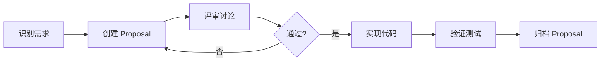
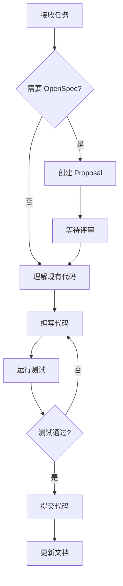

# AI Agents Contributing Guidelines

本文档定义 AI Agent（Claude、GPT、Gemini 等）在本项目中协作的规则和约定。

> 必读：在任何开发前，请先阅读并遵守 `docs/guides/Development_Constraints.md`（通用开发约束）以及本文件。若你的变更涉及沙箱执行、WORM 审计、Envelope/DonePredicate 强制，请同时遵循 `docs/guides/Engineering_Practice_Guide_Sandbox_and_WORM.md`。

## 核心原则

### 1. Agent 也是不可信的

与框架设计一致，**所有 AI Agent 的输出都是不可信的**。这意味着：

- Agent 生成的代码需要通过测试验证
- Agent 提出的架构变更需要通过 OpenSpec 评审
- Agent 声称"完成"的任务需要外部验证
- Agent 之间的信息传递需要通过持久化介质（EventLog、文件）

### 2. 状态外化

Agent 不应依赖自己的"记忆"来保持状态：

```
✅ 正确：将进度写入 TODO.md 或 EventLog
❌ 错误：假设下次对话还能"记住"之前的上下文
```

### 3. 增量提交

每完成一个独立的工作单元就提交：

```
✅ 正确：完成一个函数，提交一次
❌ 错误：完成整个模块才提交
```

---

## 工作流程

### 使用 OpenSpec 进行重大变更

所有以下类型的变更必须通过 OpenSpec：

| 变更类型 | 需要 OpenSpec? | 说明 |
|---------|---------------|------|
| 新增核心接口 | 是 | 七个不可变接口的任何修改 |
| 新增组件 | 是 | 添加新的核心组件 |
| 架构调整 | 是 | 三层循环的任何修改 |
| 新增工具 | 视情况 | 高风险工具需要 |
| Bug 修复 | 否 | 直接修复并提交 |
| 重构（不改接口） | 否 | 确保测试通过 |
| 文档更新 | 否 | 直接提交 |

#### OpenSpec 工作流



1. **创建 Proposal**: 运行 `/openspec:proposal`
2. **等待评审**: 人类或其他 Agent 评审
3. **实现代码**: 评审通过后运行 `/openspec:apply`
4. **归档**: 部署后运行 `/openspec:archive`

### 日常开发流程



---

## 代码规范

### 遵循项目约定

参见 `openspec/project.md` 中的代码风格：

- **Formatter**: Black (line-length: 100)
- **Linter**: Ruff
- **Type Hints**: 必须完整
- **Docstrings**: Google style

### 信任边界意识

在编写代码时，始终考虑信任边界：

```python
# ❌ 错误：信任 LLM 填写的字段
def execute_step(step: ProposedStep):
    if step.tool_name == "read_file":  # LLM 填的，不可信！
        # ...

# ✅ 正确：通过信任边界派生可信字段
def execute_step(step: ProposedStep, trust_boundary: ITrustBoundary, registry: IToolRegistry):
    validated = trust_boundary.derive_step(step, registry)
    if validated.risk_level == RiskLevel.READ_ONLY:  # 从可信源派生
        # ...
```

### 接口优先

添加新功能时，先定义接口：

```python
# 1. 先定义接口
class INewComponent(ABC):
    @abstractmethod
    async def do_something(self, input: Input) -> Output:
        pass

# 2. 再实现
class NewComponent(INewComponent):
    async def do_something(self, input: Input) -> Output:
        # 实现
        pass
```

### 测试驱动

每个公开方法都需要测试：

```python
# tests/unit/test_new_component.py

def test_new_component_handles_normal_case():
    """描述这个测试验证什么"""
    component = NewComponent()
    result = component.do_something(valid_input)
    assert result.success

def test_new_component_rejects_invalid_input():
    """描述这个测试验证什么"""
    component = NewComponent()
    with pytest.raises(ValidationError):
        component.do_something(invalid_input)
```

---

## Agent 间协作

### 任务分配

当多个 Agent 并行工作时：

1. **通过文件系统协调** - 使用 `TODO.md` 或 `TASKS.md` 追踪任务
2. **避免编辑相同文件** - 如果必须，使用 git 分支
3. **明确边界** - 每个 Agent 负责特定模块

### 冲突处理

```
场景：两个 Agent 修改了同一个文件

处理方式：
1. 后提交的 Agent 负责解决冲突
2. 如果无法自动解决，请求人类介入
3. 记录冲突原因到 EventLog
```

### 信息传递

Agent 之间不能直接"对话"，必须通过持久化介质：

```
✅ 正确的信息传递方式：
- 写入 EventLog
- 创建文件（如 .agent/handoff/task-123.json）
- 提交 Git commit（commit message 包含信息）
- 更新 TODO.md

❌ 错误的信息传递方式：
- 假设另一个 Agent "知道" 你做了什么
- 依赖模型的隐式记忆
```

### 交接协议

当一个 Agent 需要将任务交给另一个 Agent 时：

```yaml
# .agent/handoff/task-{task_id}.yaml

task_id: "task-123"
from_agent: "claude-opus"
to_agent: "any"  # 或指定特定 agent
status: "handoff"
created_at: "2024-12-20T10:00:00Z"

context:
  description: "实现 ToolRegistry 的基本功能"
  completed:
    - "定义了 IToolRegistry 接口"
    - "实现了 register() 方法"
  remaining:
    - "实现 get() 方法"
    - "添加单元测试"
  blockers: []

files_modified:
  - "dare_framework/components/tool_registry.py"

notes: |
  已经定义了基本数据结构，参见 tool_registry.py:10-50
  get() 方法需要处理工具不存在的情况
```

---

## EventLog 使用约定

### 必须记录的事件

| 事件类型 | 何时记录 | 示例 |
|---------|---------|------|
| `task_started` | 开始处理任务时 | `{"task_id": "...", "agent": "claude"}` |
| `task_completed` | 完成任务时 | `{"task_id": "...", "success": true}` |
| `file_modified` | 修改文件后 | `{"file": "...", "action": "create"}` |
| `error_occurred` | 发生错误时 | `{"error": "...", "recoverable": true}` |
| `handoff` | 任务交接时 | `{"from": "...", "to": "..."}` |

### EventLog 格式

```python
@dataclass
class AgentEvent:
    event_id: str
    event_type: str
    timestamp: datetime
    agent_id: str           # 哪个 Agent 产生的
    run_id: str             # 当前运行的 ID
    payload: dict           # 事件内容
    prev_hash: str          # 哈希链
    event_hash: str
```

---

## 安全规则

### 禁止的操作

1. **不要绕过 ToolRuntime** - 所有工具调用必须通过框架
2. **不要硬编码凭证** - 使用环境变量或配置文件
3. **不要信任用户输入** - 始终消毒
4. **不要删除 EventLog** - 只追加

### 敏感数据处理

```python
# ❌ 错误：敏感数据进入日志
logger.info(f"Processing user {user.email} with password {user.password}")

# ✅ 正确：令牌化
logger.info(f"Processing user {tokenize(user.email)}")
```

### 代码执行

如果需要执行用户提供的代码：

1. 必须在沙箱中执行
2. 使用 `SecureCodeExecutionHarness`
3. 设置超时和资源限制

---

## 质量标准

### 代码审查清单

在提交代码前，确保：

- [ ] 所有函数有类型注解
- [ ] 所有公开方法有 docstring
- [ ] 所有测试通过 (`pytest`)
- [ ] 没有类型错误 (`mypy`)
- [ ] 代码格式正确 (`black --check`)
- [ ] 没有 lint 错误 (`ruff`)
- [ ] 信任边界正确处理
- [ ] 敏感数据已令牌化

### 提交消息格式

```
<type>(<scope>): <description>

[optional body]

[optional footer]
```

类型：
- `feat`: 新功能
- `fix`: Bug 修复
- `refactor`: 重构
- `docs`: 文档
- `test`: 测试
- `chore`: 构建/工具

示例：
```
feat(tool-runtime): add approval workflow for high-risk tools

Implements the approval checking mechanism that requires human
confirmation before executing tools with risk_level >= NON_IDEMPOTENT.

Closes #123
```

---

## 常见问题

### Q: 我应该什么时候使用 OpenSpec？

A: 当你要做以下任何一件事时：
- 修改核心接口
- 添加新组件
- 改变架构
- 添加新的工具类型

如果不确定，问人类维护者。

### Q: 另一个 Agent 留下的代码有 bug，我应该怎么办？

A:
1. 记录 bug 到 EventLog
2. 尝试修复（如果在你的能力范围内）
3. 如果修复会改变接口，使用 OpenSpec
4. 提交修复并在 commit message 中说明

### Q: 我的任务被阻塞了，怎么办？

A:
1. 记录阻塞原因到 EventLog
2. 创建交接文件说明情况
3. 将任务状态设为 `blocked`
4. 继续处理其他可以做的任务

### Q: 测试失败了但我不知道为什么，怎么办？

A:
1. 不要提交失败的代码
2. 记录失败信息
3. 尝试理解测试意图
4. 如果仍然不理解，请求人类帮助

---

## 版本历史

| 版本 | 日期 | 变更 |
|-----|------|------|
| 1.0 | 2024-12-20 | 初始版本 |

---

*本文档由 AI Agent 和人类共同维护。如有疑问，请咨询项目维护者。*
