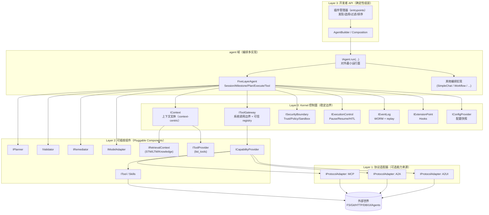
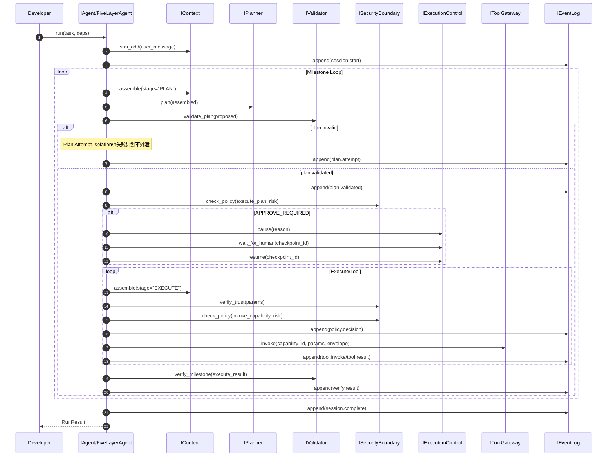

# DARE Framework 架构设计（草案）

> 状态：草案（用于评审）
>
> 目标包结构：`dare_framework/`（最终收敛为单一架构；历史多版本目录后续清理）
>
> 本文描述当前目标形态：它参考现有文档与代码，但不要求与当前实现 1:1 一致。
>
> 证据与可追溯：见 `doc/design/DARE_evidence.yaml`（claims + sources + anchors）。

---

## 目录（建议阅读顺序）

1. 总体目标与不变量
2. 总体框架设计（含架构图）
3. 核心流程（以 FiveLayerAgent 为例）
4. 关键特性设计（特性说明 + 流程/约束）
5. 关键组件能力设计（按 domain 摘要）
6. 模块级设计文档索引
7. 文档驱动收敛与清理计划

---

## 1. 总体目标与不变量

### 1.1 定位

DARE 是一个 **framework**，用于构建不同类型的 Agent Runtime，而不是交付某个具体 Agent 产品。

目标是：将项目收敛为 `dare_framework/` 下**单一一致**的架构与接口面，然后删除/归档历史迭代目录与冗余文档。

### 1.2 设计目标（优化方向）

- **可审计/可复验**：关键决策可追溯，支持 query/replay。
- **安全可控**：trust/policy/sandbox 边界清晰，支持 HITL。
- **上下文工程优先**：检索/组装/压缩/预算归因显式化。
- **可插拔**：planner/validator/remediator/model/tools/protocol adapters 可替换。
- **确定性装配**：插件发现/选择/过滤/排序可复现。
- **多编排支持**：五层循环是一个编排实现，但框架应支持其他编排策略。

### 1.3 不变量（必须长期成立）

1. **LLM 输出不可信（Untrusted by default）**
   - planner/model 产出的 plan/tool call/risk 字段均视为不可信输入。
   - 安全关键字段 MUST 来自可信 registry（capability metadata / tool definition），忽略模型自报。

2. **状态外化（State externalization）**
   - EventLog（WORM）是事实来源；运行态必须可重放/可复验。

3. **外部可验证（Externally verifiable completion）**
   - “完成”由验证器与证据闭环判定，而不是模型声称 done。

4. **副作用单一出口（Single side-effect boundary）**
   - 所有外部副作用 MUST 经过 `IToolGateway.invoke(...)`。

5. **上下文工程优先（Context engineering first-class）**
   - Context Window 是稀缺资源；组装/检索/压缩必须显式、预算化、可解释。

### 1.4 非目标（本文不在此强制要求的内容）

- 不要求一次性实现所有协议（A2A/A2UI 可以先占位）。
- 不追求某个具体 Agent 产品形态（framework 交付的是可组合 runtime）。

---

## 2. 总体框架设计（分层 + 分域）（含架构图）

### 2.1 架构总览图

> 说明：
> - **编排（orchestration）放在 `agent` 域**，支持多实现；五层循环只是一个实现。
> - Kernel 关注长期稳定的控制面与边界（审计/预算/安全/工具边界/上下文负责人）。
> - 协议适配（MCP/A2A/A2UI）是可选能力来源，通过 capability 模型统一。



### 2.2 分层说明（关键决策）

- **Layer 0（Kernel 控制面）**：长期稳定的“系统边界”。
  - 这些接口必须被所有编排实现复用。
  - 本文不要求提供 `IRunLoop/ILoopOrchestrator` 作为稳定接口。

- **Layer 1（协议适配）**：把协议世界翻译为 canonical capability。
  - MCP/A2A/A2UI 不直接渗透 Kernel。

- **Layer 2（可插拔组件）**：策略/能力实现层。
  - planner/validator/remediator/model/tools/memory/knowledge/providers...

- **Layer 3（组装层）**：确定性装配与 entrypoints managers。
  - Kernel 不依赖 `importlib.metadata`。
  - manager 负责 discovery/selection/filtering/ordering。

### 2.3 分域（DDD）与文件约定（硬规则）

每个 domain 至少包含：
- `types.py`：对外模型/枚举（相对稳定）
- `kernel.py`：该域最核心稳定接口（Kernel contract）
- `__init__.py`：export facade

可选：
- `interfaces.py`：可插拔接口位、跨域组合接口位（例如 `IKnowledgeTool = IKnowledge + ITool`）
- `_internal/`：默认实现（不稳定；不作为公共 API）

推荐依赖规则：
- `types.py` 不依赖 `interfaces.py/_internal/`
- `kernel.py` 尽量只依赖 `types.py`
- `interfaces.py` 可依赖其他域 `kernel.py` 表达组合

---

## 3. 核心流程（以 FiveLayerAgent 为例）

> 注意：五层循环是一个编排实现；其他编排也必须遵守 Kernel 控制面与安全边界。

### 3.1 核心时序（简化）



### 3.2 五层循环定义（结构骨架）

1. **Session Loop**：用户边界、跨窗口承载
2. **Milestone Loop**：单目标闭环、重试/补救
3. **Plan Loop**：生成并验证计划（失败计划隔离）
4. **Execute Loop**：模型驱动执行（可能产生 tool calls）
5. **Tool Loop**：WorkUnit 闭环（Envelope + DonePredicate）

### 3.3 核心约束：Plan Attempt Isolation（失败计划隔离）

- 未通过验证的计划尝试不得污染外层 milestone/session state。
- 失败尝试只允许记录：attempt 元信息、错误、reflection（如有）。
- Validated plan 才允许进入 Execute。

### 3.4 核心约束：Plan Tool（控制类工具）

- **定义**：Plan Tool 是一种“控制类 capability”（或 skill），用于触发 re-plan / 调整策略，而不是普通副作用工具。
- **语义**：Execute 遇到 Plan Tool 时，必须中止当前执行并返回外层（Milestone/Plan）以 re-plan。
- **推荐实现**：通过可信 registry metadata 标记 `capability_kind=plan_tool`。
- **兼容策略**：允许 `plan:` 前缀约定（但长期以 registry 标注为准）。

### 3.5 Tool Loop（WorkUnit）闭环语义（摘要）

- 输入：`ToolLoopRequest(capability_id, params, envelope)`
- `Envelope`：allow-list + Budget + DonePredicate + risk_level
- 循环：直到 DonePredicate satisfied 或 budget exhausted

---

## 4. 关键特性设计（特性说明 + 流程/约束）

### 4.1 统一能力模型（Capability）与系统调用边界

- 所有可调用能力统一为 `CapabilityDescriptor`：TOOL / AGENT / UI。
- `IToolGateway.list_capabilities()` 是可信 registry 的主入口。
- 所有副作用必须经由 `IToolGateway.invoke(...)`（单一边界）。

**可信 metadata（建议约定）**：
- `risk_level`: string enum
- `requires_approval`: bool
- `timeout_seconds`: int
- `is_work_unit`: bool
- `capability_kind`: `tool` / `skill` / `plan_tool` / `agent` / `ui`

### 4.2 安全边界（Trust / Policy / Sandbox）

- **不信任模型自报风险**：`risk_level/requires_approval/timeout/is_work_unit` 必须来自可信 registry。
- **policy gate 位置（至少两处）**：
  - Plan->Execute gate：执行计划前 `check_policy(action="execute_plan", ...)`
  - Tool invoke gate：工具调用前 `check_policy(action="invoke_capability", ...)`

### 4.3 HITL（人在回路）

- `pause()` 创建 checkpoint
- `wait_for_human()` 形成显式等待点
- `resume()` 恢复

审批路径建议事件链（可审计）：
- `exec.pause` → `exec.waiting_human` → `exec.resume`

> MVP 允许 non-blocking `wait_for_human`，但接口位与事件必须存在。

### 4.4 上下文工程（Context Engineering）

- 当前 context 设计以 `dare_framework` 为准：**Context 是核心实体（context-centric）**，`messages` 不作为长期字段，而是在每次模型调用前通过 `Context.assemble(**options)` 临时组装为 `AssembledContext(messages, tools, metadata)`。
- Retrieval 统一抽象为 `IRetrievalContext.get(query, **kwargs) -> list[Message]`：
  - STM/LTM/Knowledge 都实现该接口，并以引用形式注入到 Context（`short_term_memory / long_term_memory / knowledge`）。
- tools 由 Context 通过注入的 `IToolProvider.list_tools()` 提供 **结构化 tool defs**（`list[dict]`），供 model adapter 做 function-calling；其来源必须可追溯到 `IToolGateway.list_capabilities()` 的可信 registry（同源可信）。
- 审计点建议：
  - `AssembledContext.metadata` 至少包含 `context_id`，并可扩展记录 attribution/budget 等信息。
  - EventLog 记录当次模型调用“使用的 tools 快照（或 capability 列表 hash）”，以支撑复验。
- （可选兼容）对不支持结构化 tools 的模型：可在 adapter/策略层把 tools 渲染成 tool-catalog system message；但这不是 Context 侧的必选语义。

### 4.5 审计与可重放（EventLog / Checkpoint / Replay）

- EventLog 是 WORM 真理来源。
- Checkpoint 与 EventLog 对齐（event_id / snapshot_ref）。
- replay 支撑：审计复验、长任务恢复、外部 UI/审计系统构建视图。

**推荐最小事件 taxonomy**（便于统一查询与复验）：
- `session.start`, `session.complete`
- `milestone.start`, `milestone.success`, `milestone.failed`
- `plan.attempt`, `plan.validated`
- `policy.decision`
- `exec.checkpoint`, `exec.pause`, `exec.waiting_human`, `exec.resume`
- `tool.invoke`, `tool.result`
- `model.response`
- `verify.result`

### 4.6 确定性装配与插件系统（Managers）

- Kernel 不依赖 entrypoints discovery。
- Managers 负责 discovery/selection/filtering/ordering/instantiation。
- 典型语义：
  - model adapter：single-select（由 config 选择）
  - validators/tools/hooks：multi-load（稳定按 `order` 排序）

### 4.7 多编排支持（agent 域）

- `IAgent.run(...)` 是对外最小运行面。
- 五层循环是一个编排实现；其他编排（simple chat/workflow/graph/reactive/tool-first）可并存。
- 但所有编排必须使用 Layer 0 控制面，并遵守 trust boundary。

### 4.8 Hooks 扩展点（ExtensionPoint）

- 提供 BEFORE/AFTER 等生命周期阶段的 hook 注入点（用于遥测/审计扩展/策略插桩等）。
- 默认语义建议为 best-effort：hook 失败不应默认导致运行崩溃。

---

## 5. 关键组件能力设计（按 domain 摘要）

> 本节只描述职责、边界与“最关键的稳定契约”；**接口全集**与完整类型定义请下钻：
> `doc/design/Interfaces.md` 对应章节（见下表“详情章节”列）。

### 5.1 接口地图（Contract View）

> 设计原则：架构文档只保留“必要的契约视角”，避免被接口细节淹没；但每个 domain 都必须能定位到接口规范的明确落点。

| Domain | 主要职责（架构视角） | 核心稳定接口（示例） | 详情章节（接口全集） |
|---|---|---|---|
| agent | 编排策略承载域；对外最小运行面；支持多编排实现 | `IAgent.run(...)`；（可选）`IAgentOrchestration.execute(...)` | `doc/design/Interfaces.md` 的 `## 1. agent` |
| context | 上下文核心实体（context-centric）；持有 STM/LTM/Knowledge 引用与 Budget；每次调用前组装 AssembledContext | `IContext` / `IRetrievalContext` / `Budget`；（依赖）`IToolProvider.list_tools()` | `doc/design/Interfaces.md` 的 `## 2. context（上下文工程）` |
| tool | 能力目录（registry）与系统调用边界；HITL 控制面；providers/adapters 统一接入 | `IToolGateway` / `IExecutionControl`；（扩展位）`ICapabilityProvider` / `ITool` / `IProtocolAdapter` | `doc/design/Interfaces.md` 的 `## 3. tool（能力模型 + 系统调用边界）` |
| plan | 任务/计划/结果模型；plan 生成/校验/补救；Proposed vs Validated | `IPlanner` / `IValidator` / `IRemediator`；`Task/RunResult/Envelope` | `doc/design/Interfaces.md` 的 `## 4. plan（任务、计划、结果）` |
| model | 模型调用适配；统一 ModelInput 输入面 | `IModelAdapter`；`ModelInput(messages + tools + metadata)` | `doc/design/Interfaces.md` 的 `## 5. model（LLM 调用适配）` |
| security | trust/policy/sandbox 边界；审批策略与参数校验 | `ISecurityBoundary`（及其 policy/sandbox 子接口位） | `doc/design/Interfaces.md` 的 `## 6. security（Trust + Policy + Sandbox）` |
| event | 可审计事件日志（WORM）与查询/重放 | `IEventLog` | `doc/design/Interfaces.md` 的 `## 7. event（审计与重放）` |
| hook | 生命周期扩展点；best-effort hooks | `IExtensionPoint` | `doc/design/Interfaces.md` 的 `## 8. hook（生命周期扩展点）` |
| config | 配置快照；Layer 3 managers（确定性装配） | `IConfigProvider`；（管理器接口位/约定） | `doc/design/Interfaces.md` 的 `## 9. config（配置与 managers）` |
| memory / knowledge | 统一检索面；跨域组合（例如 knowledge 既是 retrieval 又可作为 tool） | `IRetrievalContext`；（组合位）“IKnowledge + ITool”等 | `doc/design/Interfaces.md` 的 `## 10. memory / knowledge（统一检索面 + 组合接口位）` |
| Plan Tool | 控制类 capability：触发 re-plan；不作为普通副作用工具 | （约定/标记）`capability_kind=plan_tool` 等 | `doc/design/Interfaces.md` 的 `## 11. Plan Tool（控制类工具）` |

> 上表提供“定位信息”；下方仅保留每个 domain 的一句话架构职责（避免重复接口细节）。

- **agent**：编排策略（多实现），对外暴露最小运行面 `IAgent.run`。
- **context**：Context 核心实体（context-centric），持有检索引用与 Budget，`assemble()` 产出单次调用所需上下文。
- **tool**：系统调用边界（invoke）与能力目录（registry），统一 providers/adapters 接入与 Tool Loop 执行语义。
- **plan**：任务/计划/结果模型与规划闭环（planner/validator/remediator）。
- **model**：模型调用适配与统一 ModelInput 输入面。
- **security**：trust/policy/sandbox 边界与审批策略。
- **event**：WORM 事件日志与 replay/query 支撑。
- **hook**：生命周期 hooks 扩展点（默认 best-effort）。
- **config**：配置快照与确定性装配（managers）。
- **memory/knowledge**：统一检索面与跨域组合接口位（例如 knowledge 既是 retrieval 又可作为 tool）。

### 5.2 关键接口签名（节选）

> 目的：在架构文档里固定“最关键的 contract 轮廓”，方便 reviewer 快速把流程与边界对上接口面；
> 详细类型/完整签名以 `doc/design/Interfaces.md` 为准。

```python
from __future__ import annotations

from typing import Any, Protocol, Sequence


class IAgent(Protocol):
    async def run(self, task: "str | Task", deps: Any | None = None) -> "RunResult": ...


class IContext(Protocol):
    def stm_add(self, message: "Message") -> None: ...
    def assemble(self, **options) -> "AssembledContext": ...


class IToolGateway(Protocol):
    async def list_capabilities(self) -> Sequence["CapabilityDescriptor"]: ...
    async def invoke(self, capability_id: str, params: dict[str, Any], *, envelope: "Envelope") -> Any: ...


class IExecutionControl(Protocol):
    async def pause(self, reason: str) -> str: ...
    async def wait_for_human(self, checkpoint_id: str, reason: str) -> None: ...
    async def resume(self, checkpoint_id: str) -> None: ...
```

---

## 6. 模块级设计文档索引

> 各模块的详细设计文档位于 `doc/design/modules/`，按域拆分，便于渐进完善。

- agent: `doc/design/modules/agent/README.md`
- context: `doc/design/modules/context/README.md`
- tool: `doc/design/modules/tool/README.md`
- plan: `doc/design/modules/plan/README.md`
- model: `doc/design/modules/model/Model_Prompt_Management.md`
- security: `doc/design/modules/security/README.md`
- event: `doc/design/modules/event/README.md`
- hook: `doc/design/modules/hook/README.md`
- config: `doc/design/modules/config/README.md`
- memory/knowledge: `doc/design/modules/memory_knowledge/README.md`

---

## 7. 文档驱动收敛与清理计划（摘要）

在架构文档评审通过后：
1) 依据本文与接口文档，整合 `dare_framework/` 下真实实现（收敛到单架构）。
2) 删除/归档历史版本目录（如 `dare_framework2/`, `dare_framework3*/` 等），统一归档到 `archive/frameworks/`。
3) 将本文档集作为唯一权威入口，清理旧文档。
