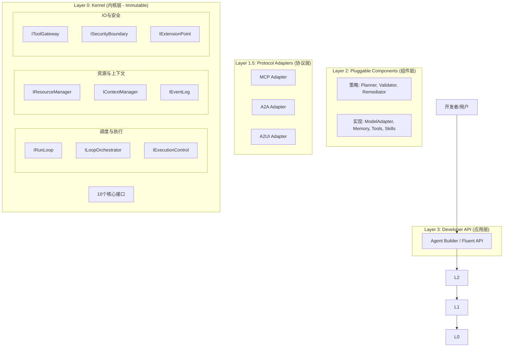

# DARE Framework 架构提案 v2.0：内核化与上下文工程

> **v2.0 核心变革**：
> 1.  **架构内核化**：采用类 OS 内核架构，区分核心基础设施（Kernel）与可插拔组件。
> 2.  **上下文工程优先**：将"上下文工程"作为第一性原理，显式管理注意力资源与信息流。
> 3.  **协议与实现分离**：明确 MCP/A2A/A2UI 为接入协议，非具体工具实现。
> 4.  **长任务原生支持**：引入资源管理与执行控制（中断/恢复）。

---

## 一、核心理念

主要基于两个隐喻构建 v2.0 架构：

1.  **Agent Framework as OS Kernel**
    *   **调度**：决定谁在运行（IRunLoop）。
    *   **内存**：决定什么进入有限的上下文窗口（IContextManager + IResourceManager）。
    *   **IO**：决定如何与世界交互（IToolGateway + Protocol Adapters）。
    *   **安全**：决定什么操作被允许（ISecurityBoundary）。

2.  **Context Engineering as Resource Management**
    *   上下文不是简单的字符串拼接，而是**稀缺资源的投资**。
    *   DARE v2 的核心职责是最大化每个 Token 的 ROI。

---

## 二、架构全景 (The 4-Layer Architecture)

---

## 三、Layer 0: Kernel (内核层)

这是框架的**不可替换基石**。这 9-10 个接口定义了 Agent 的本质。

### 3.1 调度与执行

#### `IRunLoop` (进程调度器)
- **职责**：驱动状态机流转，不关心具体业务逻辑。
- **状态**：Idle -> Planning -> Executing -> Validating -> Paused -> ...
- **核心方法**：`tick()`, `run()`, `transition()`

#### `ILoopOrchestrator` (编排控制器)
- **职责**：维护五层循环（Session/Milestone/Plan/Execute/Tool）的结构完整性。这部分逻辑是框架的"骨架"，不可随意替换，但具体的 Plan 策略可以是组件。
- **核心方法**：`run_session_loop()`, `run_milestone_loop()`, `run_tool_loop()`

#### `IExecutionControl` (中断控制器) **[NEW]**
- **职责**：处理长任务的中断、暂停、恢复、Checkpoint。
- **核心方法**：`pause()`, `resume(checkpoint_id)`, `create_checkpoint()`

### 3.2 资源与上下文 (上下文工程核心)

#### `IContextManager` (上下文工程主管) **[NEW]**
- **职责**：**决定什么信息进入 Context Window**。统一管理 Layer 1-4 的上下文工程。
- **核心方法**：
    - `assemble(stage)`: 组装当前阶段的 Prompt。
    - `compress()`: 压缩历史摘要。
    - `route()`: 多 Agent 间的上下文路由。

#### `IResourceManager` (MMU / 预算中心) **[NEW]**
- **职责**：管理稀缺资源（Token, Cost, Time, Context Length）。
- **核心方法**：`acquire(resource, amount)`, `get_budget()`, `check_limit()`

#### `IEventLog` (文件系统 / 真理来源)
- **职责**：WORM（Write-Once-Read-Many）的结构化日志。Agent 的"记忆"是重构出来的，只有 Log 是绝对真理。
- **核心方法**：`append(event)`, `query(filter)`, `replay(from)`

### 3.3 IO 与安全

#### `IToolGateway` (系统调用接口)
- **职责**：所有外部副作用（Side Effects）的唯一出口。
- **核心方法**：`invoke(tool, params)`, `register_tool()`

#### `ISecurityBoundary` (安全监控器)
- **职责**：合并原 TrustBoundary 和 PolicyEngine。负责 1. 验证 LLM 输出（Trust）；2. 检查权限策略（Policy）；3. 沙箱执行（Sandbox）。
- **核心方法**：`verify_trust(content)`, `check_policy(action)`, `execute_safe(action)`

#### `IExtensionPoint` (内核模块接口) **[NEW]**
- **职责**：系统级 Hooks，允许在不修改 Kernel 的情况下扩展能力。
- **核心方法**：`register_hook(phase, callback)`

---

## 四、Layer 1.5: Protocol Adapters (协议层)

明确区分**协议 (Protocol)** 与**实现 (Implementation)**。

*   **MCP Adapter**: 将 MCP 协议的 Tools 转换为 Kernel 可理解的 ITool。
*   **A2A Adapter**: 将 Agent-to-Agent 通信协议转换为 Kernel 的消息事件。
*   **A2UI Adapter**: 将 UI 渲染指令协议标准化。

> **设计决策**：协议层充当"驱动程序"，让 Kernel 支持与不同标准的外部世界通信。

---

## 五、Layer 2: Pluggable Components (组件层)

这是开发者最常扩展的一层，实现具体的策略和功能。

### 5.1 策略组件 (Strategies)
这里的组件实现了 Kernel 定义的抽象逻辑，但在 Kernel 中只保留接口引用。
*   **IPlanner**: 实现具体的规划算法（ReAct, Tree of Thoughts...）。
*   **IValidator**: 实现具体的验证逻辑（LLM 验证, 代码静态分析验证...）。
*   **IRemediator**: 实现具体的反思与错误修复逻辑。
*   **IContextStrategy**: 实现具体的上下文组装策略（Sliding Window, RAG-based...）。

### 5.2 功能组件 (Capabilities)
*   **Model Adapters**: Claude, OpenAI, DeepSeek...
*   **Memory Stores**: VectorDB, Redis, InMemory...
*   **Tool Kits**: FileSystem, Git, Shell...
*   **Skills**: 预定义的复杂任务模版 (Plan Tools)。

---

## 六、上下文工程在 v2 中的映射

DARE v2 将 Context Engineering 的四层模型直接映射到架构中：

| Context Engineering Layer | DARE v2 组件 | 职责 |
|:---:|:---:|:---|
| **L4: Orchestration** (调度) | `IContextManager` + `IExecutionControl` | 跨窗口的状态传递 (Summary)、多 Agent 上下文共享 |
| **L3: Assembly** (组装) | `IContextStrategy` + `IResourceManager` | 动态 System Prompt、Skill 注入、Token 预算分配 |
| **L2: Retrieval** (检索) | `IMemory` 组件 | RAG、长期记忆检索 |
| **L1: Indexing** (索引) | 外部工具 / MCP Servers | 代码库索引、知识图谱构建 |

---

## 七、数据流与五层循环 (Refined)

v2 保留 v1.3 的五层循环模型，但在 Kernel 中更加标准化。

1.  **Session Loop**: 用户交互层 -> (Input + SessionSummary) -> Output
2.  **Milestone Loop**: 任务拆解层 -> (Milestone + Reflections) -> Result
3.  **Plan Loop**: 规划层 -> (Context -> ValidatedPlan)
4.  **Execute Loop**: 执行层 -> (Plan -> Steps -> Result)
5.  **Tool Loop**: 原子操作层 -> (Tool + Envelope -> Evidence)

**改进点**：
*   **资源的显式传递**：Context 对象中携带 `ResourceManager` 句柄，每层循环都要检查预算。
*   **中断的显式支持**：每层循环的 `tick` 都检查 `ExecutionControl` 的状态。

---

## 八、总结

DARE v2.0 不仅仅是重构，而是**价值观的升级**：
1.  **更底层**：关注 OS 级别的调度与安全。
2.  **更受控**：通过上下文工程精确控制信息流。
3.  **更开放**：通过协议层拥抱 MCP 等生态标准。

----

┌─────────────────────────────────────────────────────────────────────────────────┐
│                     DARE v2 Core Layer（Agent Kernel）                          │
├─────────────────────────────────────────────────────────────────────────────────┤
│                                                                                 │
│  【必须有 - 没有就跑不起来】                                                      │
│  ┌─────────────────┐  ┌─────────────────┐  ┌─────────────────┐                 │
│  │   IRunLoop      │  │   IEventLog     │  │  IToolGateway   │                 │
│  │   (执行调度)    │  │   (WORM日志)    │  │  (执行入口)     │                 │
│  └─────────────────┘  └─────────────────┘  └─────────────────┘                 │
│                                                                                 │
│  【安全边界 - LLM 输出不可信】                                                   │
│  ┌─────────────────┐  ┌─────────────────┐                                      │
│  │ TrustBoundary   │  │  PolicyEngine   │   ← 可以考虑合并为 ISecurityBoundary │
│  │ (信任验证)      │  │  (HITL策略)     │                                      │
│  └─────────────────┘  └─────────────────┘                                      │
│                                                                                 │
│  【循环编排 - 五层循环的骨架】                                                    │
│  ┌─────────────────┐  ┌─────────────────┐  ┌─────────────────┐                 │
│  │ILoopOrchestrator│  │ ISkillRegistry  │  │ IContextManager │                 │
│  │ (循环协调)      │  │ (Skill管理)     │  │ (上下文工程)    │ ← 新增/重命名    │
│  └─────────────────┘  └─────────────────┘  └─────────────────┘                 │
│                                                                                 │
│  【资源与控制 - Claude 建议的有价值部分】                                        │
│  ┌─────────────────┐  ┌─────────────────┐  ┌─────────────────┐                 │
│  │IResourceManager │  │IExecutionControl│  │IExtensionPoint  │                 │
│  │(Token/成本预算) │  │(中断/Checkpoint)│  │  (扩展钩子)     │                 │
│  └─────────────────┘  └─────────────────┘  └─────────────────┘                 │
│                                                                                 │
│  ════════════════════════════════════════════════════════════════════════════  │
│                这 ~10 个接口 = Agent 的"内核"，不可替换，只能配置               │
└─────────────────────────────────────────────────────────────────────────────────┘

┌─────────────────────────────────────────────────────────────────────────────────┐
│                     DARE v2 Layer 1.5: Protocol Adapters                        │
├─────────────────────────────────────────────────────────────────────────────────┤
│  ┌─────────────────┐  ┌─────────────────┐  ┌─────────────────┐                 │
│  │   MCP Adapter   │  │   A2A Adapter   │  │   A2UI Adapter  │                 │
│  │  (工具接入)     │  │  (Agent通信)    │  │  (UI通信)       │                 │
│  └─────────────────┘  └─────────────────┘  └─────────────────┘                 │
└─────────────────────────────────────────────────────────────────────────────────┘

┌─────────────────────────────────────────────────────────────────────────────────┐
│                     DARE v2 Layer 2: Pluggable Components                       │
├─────────────────────────────────────────────────────────────────────────────────┤
│  ┌────────────────────────────────────────────────────────────────────────────┐ │
│  │ 策略实现（可替换）                                                          │ │
│  │ ├── Planners: LLMPlanner, ReActPlanner, TreeOfThoughtPlanner              │ │
│  │ ├── Validators: SchemaValidator, LLMValidator, CompositeValidator         │ │
│  │ ├── Remediators: LLMRemediator, RuleRemediator                            │ │
│  │ └── ContextAssemblers: SlidingWindow, RAG, Summary                        │ │
│  └────────────────────────────────────────────────────────────────────────────┘ │
│  ┌────────────────────────────────────────────────────────────────────────────┐ │
│  │ 具体实现                                                                    │ │
│  │ ├── ModelAdapters: Claude, OpenAI, Ollama                                 │ │
│  │ ├── Memory: InMemory, Vector, File                                        │ │
│  │ ├── Tools: ReadFile, WriteFile, RunCommand...                             │ │
│  │ └── Skills: FixTest, ImplementFeature, Refactor...                        │ │
│  └────────────────────────────────────────────────────────────────────────────┘ │
└─────────────────────────────────────────────────────────────────────────────────┘