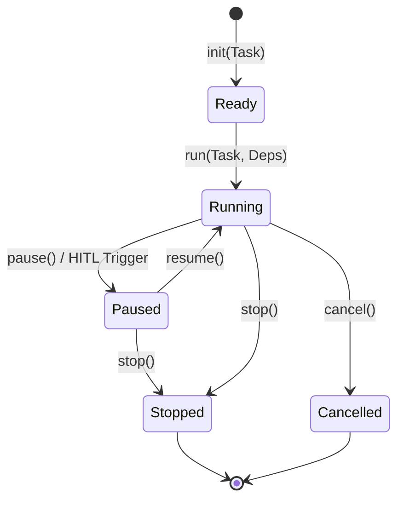
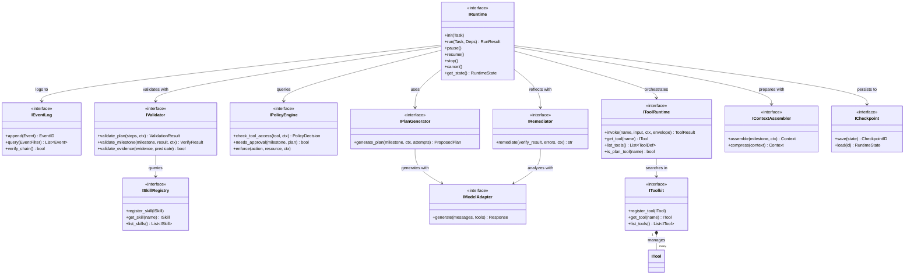
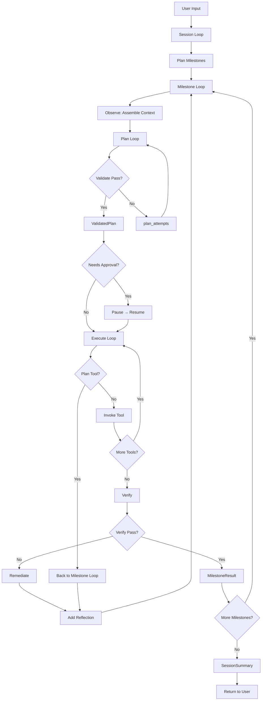

# DARE Framework 架构终稿评审 v1.3

> **v1.3 更新说明**：
> - 合并 v1.1 与 v1.2 的架构内容与术语
> - 保留五层循环完整设计，并补充三层循环概览伪码
> - 补齐生态借鉴接口（RunContext / IStreamedResponse）与融合总结
> - 统一 Plan/Execute/Tool 语义与 HITL、Remediate 的位置

---

## 目录

1. [架构全景](#一架构全景)
2. [五层循环模型](#二五层循环模型)
3. [核心接口定义](#三核心接口定义)
4. [数据结构定义](#四数据结构定义)
5. [执行流程详解](#五执行流程详解)
6. [组件实现清单](#六组件实现清单)
7. [使用示例](#七使用示例)
8. [设计决策记录](#八设计决策记录)

---

## 一、架构全景

### 1.1 三层架构分层

```
╔═══════════════════════════════════════════════════════════════════════════════════╗
║                           DARE Framework 架构全景                                  ║
╠═══════════════════════════════════════════════════════════════════════════════════╣
║                                                                                    ║
║  ┏━━━━━━━━━━━━━━━━━━━━━━━━━━━━━━━━━━━━━━━━━━━━━━━━━━━━━━━━━━━━━━━━━━━━━━━━━━━━━┓ ║
║  ┃ Layer 1: Core Infrastructure（框架核心）                                     ┃ ║
║  ┃                                                                              ┃ ║
║  ┃  执行引擎                                                                     ┃ ║
║  ┃  ┌─────────────┐  ┌─────────────┐  ┌─────────────┐  ┌─────────────┐        ┃ ║
║  ┃  │ IRuntime    │  │ IEventLog   │  │IToolRuntime │  │IPolicyEngine│        ┃ ║
║  ┃  │ (状态机化)  │  │ (WORM)      │  │ (Gateway)   │  │ (HITL触发)  │        ┃ ║
║  ┃  └─────────────┘  └─────────────┘  └─────────────┘  └─────────────┘        ┃ ║
║  ┃                                                                              ┃ ║
║  ┃  循环编排                                                                     ┃ ║
║  ┃  ┌─────────────┐  ┌─────────────┐  ┌─────────────┐  ┌─────────────┐        ┃ ║
║  ┃  │IPlanGenerator│  │IRemediator  │  │IValidator   │  │ISkillRegistry│       ┃ ║
║  ┃  │ (Plan生成)  │  │ (反思分析)  │  │ (统一验证)  │  │ (Skill管理) │        ┃ ║
║  ┃  └─────────────┘  └─────────────┘  └─────────────┘  └─────────────┘        ┃ ║
║  ┃                                                                              ┃ ║
║  ┃  上下文管理                                                                   ┃ ║
║  ┃  ┌─────────────┐  ┌─────────────┐                                           ┃ ║
║  ┃  │TrustBoundary│  │IContextAssem│                                           ┃ ║
║  ┃  │ (信任边界)  │  │ (上下文装配)│                                           ┃ ║
║  ┃  └─────────────┘  └─────────────┘                                           ┃ ║
║  ┗━━━━━━━━━━━━━━━━━━━━━━━━━━━━━━━━━━━━━━━━━━━━━━━━━━━━━━━━━━━━━━━━━━━━━━━━━━━━━┛ ║
║                                         │                                         ║
║                                         ▼                                         ║
║  ┏━━━━━━━━━━━━━━━━━━━━━━━━━━━━━━━━━━━━━━━━━━━━━━━━━━━━━━━━━━━━━━━━━━━━━━━━━━━━━┓ ║
║  ┃ Layer 2: Pluggable Components（可插拔组件）                                  ┃ ║
║  ┃                                                                              ┃ ║
║  ┃  ┌─────────────────────────────────────────────────────────────────────┐    ┃ ║
║  ┃  │ IModelAdapter                     IMemory                            │    ┃ ║
║  ┃  │ ├── ClaudeAdapter ✅              ├── InMemoryMemory ✅              │    ┃ ║
║  ┃  │ ├── OpenAIAdapter ✅              ├── VectorMemory ✅                │    ┃ ║
║  ┃  │ └── OllamaAdapter ✅              └── FileMemory ✅                  │    ┃ ║
║  ┃  └─────────────────────────────────────────────────────────────────────┘    ┃ ║
║  ┃                                                                              ┃ ║
║  ┃  ┌─────────────────────────────────────────────────────────────────────┐    ┃ ║
║  ┃  │ ITool / IToolkit                  IMCPClient                         │    ┃ ║
║  ┃  │ ├── (Execute Tools) ✅            ├── StdioMCPClient ✅              │    ┃ ║
║  ┃  │ └── (MCP Bridge)  ✅             └── SSEMCPClient ✅                │    ┃ ║
║  ┃  └─────────────────────────────────────────────────────────────────────┘    ┃ ║
║  ┃                                                                              ┃ ║
║  ┃  ┌─────────────────────────────────────────────────────────────────────┐    ┃ ║
║  ┃  │ ISkill (Plan Tools)               IHook                              │    ┃ ║
║  ┃  │ ├── FixFailingTest ✅            ├── LoggingHook ✅                 │    ┃ ║
║  ┃  │ ├── ImplementFeature ✅          └── MetricsHook ✅                 │    ┃ ║
║  ┃  │ └── RefactorModule ✅                                                │    ┃ ║
║  ┃  └─────────────────────────────────────────────────────────────────────┘    ┃ ║
║  ┗━━━━━━━━━━━━━━━━━━━━━━━━━━━━━━━━━━━━━━━━━━━━━━━━━━━━━━━━━━━━━━━━━━━━━━━━━━━━━┛ ║
║                                         │                                         ║
║                                         ▼                                         ║
║  ┏━━━━━━━━━━━━━━━━━━━━━━━━━━━━━━━━━━━━━━━━━━━━━━━━━━━━━━━━━━━━━━━━━━━━━━━━━━━━━┓ ║
║  ┃ Layer 3: Agent Composition（开发者组装）                                     ┃ ║
║  ┃                                                                              ┃ ║
║  ┃  AgentBuilder[DepsT, OutputT]                                                ┃ ║
║  ┃  ├── .with_model() / .with_tools() / .with_skills() / .with_mcp()            ┃ ║
║  ┃  └── .build() → Agent[DepsT, OutputT]                                        ┃ ║
║  ┗━━━━━━━━━━━━━━━━━━━━━━━━━━━━━━━━━━━━━━━━━━━━━━━━━━━━━━━━━━━━━━━━━━━━━━━━━━━━━┛ ║
╚═══════════════════════════════════════════════════════════════════════════════════╝
```

**补充说明（v1.3 扩展）**：
- Layer 2 的可插拔实现统一实现 `IComponent`（`order/init/register/close`），用于统一生命周期与注册协议。
- Layer 3 引入 `BaseComponentManager` + 各类 `XxxManager`（Validator/Memory/ModelAdapter/Tool/Skill/MCP/Hook/Config/Prompt），通过 entry points 发现 Layer 2 组件（默认始终启用），按 `order` 升序初始化并注册。
- 新增 `IConfigProvider` 与 `IPromptStore` 作为 Layer 2 组件接口，供运行时与组件初始化读取配置/Prompt。

### 1.2 核心设计原则

| 原则 | 说明 | 体现 |
|-----|------|------|
| **LLM 输出不可信** | 安全关键字段从 Registry 派生 | TrustBoundary, Validate 阶段 |
| **状态外化** | 所有状态存 EventLog，不依赖模型记忆 | IEventLog (WORM) |
| **外部验证** | "完成" 由外部验证器判定 | IValidator, DonePredicate |
| **增量执行** | 每步提交，留清晰交接物 | Checkpoint, Evidence |
| **可审计** | 每个决策有结构化记录 | EventLog + Hash Chain |
| **人在回路** | 高风险操作触发审批 | HITL Approve 检查点 |
| **信息隔离** | 失败的计划不污染外层上下文 | Plan Loop 临时变量 |

---

## 二、五层循环模型

### 2.1 完整循环架构图

```
╔═══════════════════════════════════════════════════════════════════════════════════╗
║                          五层循环架构（v1.3 完整版）                                ║
╠═══════════════════════════════════════════════════════════════════════════════════╣
║                                                                                    ║
║  ┏━━━━━━━━━━━━━━━━━━━━━━━━━━━━━━━━━━━━━━━━━━━━━━━━━━━━━━━━━━━━━━━━━━━━━━━━━━━━━┓ ║
║  ┃ L1: SESSION LOOP（跨对话持久化，用户交互边界）                                ┃ ║
║  ┃                                                                              ┃ ║
║  ┃   职责：任务初始化、Milestone 规划、断点恢复、上下文压缩                       ┃ ║
║  ┃   输入：user_input + previous_session_summary                                ┃ ║
║  ┃   输出：SessionSummary（压缩的历史）                                          ┃ ║
║  ┃   预算：无限（支持断点续跑）                                                   ┃ ║
║  ┃                                                                              ┃ ║
║  ┃   User Input #1 → Session #1 → SessionSummary #1 →                          ┃ ║
║  ┃   User Input #2 → Session #2 (读取 Summary #1) → SessionSummary #2 → ...    ┃ ║
║  ┗━━━━━━━━━━━━━━━━━━━━━━━━━━━━━━━━━━━━━━━━━━━━━━━━━━━━━━━━━━━━━━━━━━━━━━━━━━━━━┛ ║
║                                     │                                             ║
║                                     ▼                                             ║
║  ┏━━━━━━━━━━━━━━━━━━━━━━━━━━━━━━━━━━━━━━━━━━━━━━━━━━━━━━━━━━━━━━━━━━━━━━━━━━━━━┓ ║
║  ┃ L2: MILESTONE LOOP（完成单个 Milestone，无用户输入）                          ┃ ║
║  ┃                                                                              ┃ ║
║  ┃   职责：完成一个里程碑目标，处理 Verify 失败的重试                             ┃ ║
║  ┃   输入：milestone + previous_milestone_summaries                             ┃ ║
║  ┃   输出：MilestoneResult（无"失败"，只有 completeness）                        ┃ ║
║  ┃   预算：milestone_budget (10次尝试，600秒，100次工具调用)                     ┃ ║
║  ┃                                                                              ┃ ║
║  ┃   while not milestone_budget.exceeded():                                     ┃ ║
║  ┃                                                                              ┃ ║
║  ┃      ┌──────────┐                                                            ┃ ║
║  ┃      │ Observe  │ 装配上下文（milestone_ctx + reflections）                  ┃ ║
║  ┃      └────┬─────┘                                                            ┃ ║
║  ┃           ▼                                                                  ┃ ║
║  ┃      ┌──────────────────────┐                                                ┃ ║
║  ┃      │ L3: PLAN LOOP       │ 生成有效计划，隔离 Validate 失败                ┃ ║
║  ┃      │ (内层循环)           │ → ValidatedPlan                                ┃ ║
║  ┃      └────┬─────────────────┘                                                ┃ ║
║  ┃           ▼                                                                  ┃ ║
║  ┃      ┌──────────┐                                                            ┃ ║
║  ┃      │ Approve  │ HITL 检查点：PolicyEngine.needs_approval()?               ┃ ║
║  ┃      │ (HITL)   │ → pause() → 等待 resume()                                 ┃ ║
║  ┃      └────┬─────┘                                                            ┃ ║
║  ┃           ▼                                                                  ┃ ║
║  ┃      ┌──────────────────────┐                                                ┃ ║
║  ┃      │ L4: EXECUTE LOOP    │ LLM 驱动执行，遇到 Plan Tool 中止              ┃ ║
║  ┃      │ (LLM 对话循环)       │ → ExecuteResult                                ┃ ║
║  ┃      └────┬─────────────────┘                                                ┃ ║
║  ┃           ▼                                                                  ┃ ║
║  ┃      ┌──────────┐                                                            ┃ ║
║  ┃      │  Verify  │ 验收结果（IValidator）                                     ┃ ║
║  ┃      └────┬─────┘                                                            ┃ ║
║  ┃           │                                                                  ┃ ║
║  ┃           ├─▶ ✓ PASS → MilestoneResult (completeness=1.0)                   ┃ ║
║  ┃           │                                                                  ┃ ║
║  ┃           └─▶ ✗ FAIL → Remediate (分析失败原因，提取用户意图)                ┃ ║
║  ┃                          ↓                                                   ┃ ║
║  ┃                    添加 reflection 到 milestone_ctx                          ┃ ║
║  ┃                          ↓                                                   ┃ ║
║  ┃                    continue（回到 while 开始）                                ┃ ║
║  ┃                                                                              ┃ ║
║  ┃   终止原因：verify_pass | budget_exceeded | plan_generation_failed           ┃ ║
║  ┃   → MilestoneSummary（压缩）→ 传给下一个 Milestone                            ┃ ║
║  ┗━━━━━━━━━━━━━━━━━━━━━━━━━━━━━━━━━━━━━━━━━━━━━━━━━━━━━━━━━━━━━━━━━━━━━━━━━━━━━┛ ║
║                                     │                                             ║
║                           (WorkUnit Tool) ▼                                       ║
║  ┏━━━━━━━━━━━━━━━━━━━━━━━━━━━━━━━━━━━━━━━━━━━━━━━━━━━━━━━━━━━━━━━━━━━━━━━━━━━━━┓ ║
║  ┃ L5: TOOL LOOP（确保单个工具调用的目的达成）                                   ┃ ║
║  ┃                                                                              ┃ ║
║  ┃   职责：在 Envelope 限定范围内，确保 DonePredicate 满足                       ┃ ║
║  ┃   输入：tool_input + Envelope + DonePredicate                                ┃ ║
║  ┃   输出：ToolResult（成功）或抛出异常（失败）                                   ┃ ║
║  ┃   预算：envelope.budget (30次调用，180秒，3次停滞)                            ┃ ║
║  ┃                                                                              ┃ ║
║  ┃   while not tool_budget.exceeded():                                          ┃ ║
║  ┃      Gather → Act → Check (DonePredicate) → Update                           ┃ ║
║  ┃      ✓ 满足 → ToolResult                                                     ┃ ║
║  ┃      ✗ 未满足 → continue                                                     ┃ ║
║  ┗━━━━━━━━━━━━━━━━━━━━━━━━━━━━━━━━━━━━━━━━━━━━━━━━━━━━━━━━━━━━━━━━━━━━━━━━━━━━━┛ ║
╚═══════════════════════════════════════════════════════════════════════════════════╝
```

### 2.2 循环层级总结

| 循环 | 职责 | 输入 | 输出 | 失败类型 | 累积上下文 | 预算 |
|-----|------|------|------|---------|-----------|------|
| **L1: Session** | 跨对话持久化 | user_input + previous_session_summary | SessionSummary | 无（总能产出） | EventLog + Memory | 无限 |
| **L2: Milestone** | 完成里程碑 | milestone + previous_summaries | MilestoneResult | Verify 失败 | milestone_ctx.reflections | 10次 |
| **L3: Plan** | 生成有效计划 | milestone_ctx.reflections | ValidatedPlan | Validate 失败 | plan_attempts（临时） | 5次 |
| **L4: Execute** | LLM 驱动执行 | ValidatedPlan | ExecuteResult | 工具执行失败 | execution_messages | 50 iter |
| **L5: Tool** | 单步目的达成 | tool_input + Envelope | ToolResult | DonePredicate 未满足 | tool_loop_ctx | 30次 |

### 2.3 关键设计：信息流动与隔离

```
SessionSummary (压缩)
    ↓ 传递
Milestone Loop (读取 previous_summaries)
    ↓
milestone_ctx.reflections (持久，Verify 失败累积)
    ↓ 传递（只读）
Plan Loop (读取 reflections，生成 plan_attempts)
    ↓
plan_attempts (临时，Validate 失败累积)
    ↓ 成功后丢弃
ValidatedPlan (清洁输出)
    ↓ 传递
Approve (HITL 检查点)
    ↓ 通过
Execute Loop (LLM 对话)
    ↓
ExecuteResult (只记录成功的 tool_calls)
    ↓ 传递
Verify
    ↓ 失败
Remediate → 新的 reflection → milestone_ctx
    ↓
下次 Milestone 迭代
```

**好处**:
- ✅ Validate 失败的计划不污染 milestone_ctx
- ✅ 减少 context window 浪费
- ✅ 职责分离：Plan 专注生成计划，Execute 专注执行
- ✅ 可审计：所有 plan_attempts 记录在 EventLog

### 2.4 三层循环概览伪码（Session/Milestone/Tool，Plan/Execute 内嵌）

```python
async def session_loop(user_input: str, ctx: RunContext) -> SessionResult:
    milestones = await plan_milestones(user_input, ctx)
    summaries: list[MilestoneSummary] = []
    for milestone in milestones:
        milestone_result = await milestone_loop(milestone, summaries, ctx)
        summaries.append(await summarize_milestone(milestone_result, ctx))
    return await summarize_session(summaries, ctx)


async def milestone_loop(
    milestone: Milestone,
    previous_summaries: list[MilestoneSummary],
    ctx: RunContext,
) -> MilestoneResult:
    milestone_ctx = MilestoneContext(
        user_input=milestone.user_input,
        milestone_description=milestone.description,
    )
    milestone_budget = Budget(max_attempts=10, max_time_seconds=600, max_tool_calls=100)
    while not milestone_budget.exceeded():
        validated_plan = await plan_loop(milestone, milestone_ctx, ctx)
        if policy_engine.needs_approval(milestone, validated_plan):
            await pause()
            await wait_for_resume()

        execute_result = await execute_loop(validated_plan, milestone_ctx, ctx)
        if execute_result.encountered_plan_tool:
            milestone_ctx.add_reflection(
                f"Plan tool encountered: {execute_result.plan_tool_name}"
            )
            continue

        verify_result = await verify(milestone, execute_result, ctx)
        if verify_result.passed:
            return MilestoneResult(
                milestone_id=milestone.milestone_id,
                evidence=execute_result.evidence,
                completeness=verify_result.completeness,
                termination_reason="verify_pass",
            )

        reflection = await remediate(verify_result, milestone_ctx.tool_errors, ctx)
        milestone_ctx.add_reflection(reflection)

    return MilestoneResult(
        milestone_id=milestone.milestone_id,
        evidence=[],
        completeness=0.0,
        termination_reason="budget_exceeded",
    )


async def tool_loop(step: ValidatedStep, ctx: RunContext) -> ToolResult:
    envelope = step.envelope
    done_predicate = step.done_predicate
    while not envelope.budget.exceeded():
        action = await decide_action(step, ctx)
        result = await tool_runtime.invoke(action.tool, action.input, ctx)
        evidence = update_evidence(result)
        if done_predicate.is_satisfied(evidence):
            return ToolResult(success=True, evidence=collect_evidence())
    return ToolResult(success=False, error="budget_or_stagnation")
```

---

## 三、核心接口定义

### 3.1 Layer 1: Core Infrastructure (框架核心)

#### 3.1.1 IRuntime（执行引擎）

```python
from enum import Enum
from typing import Protocol, Generic, TypeVar

DepsT = TypeVar("DepsT")
OutputT = TypeVar("OutputT")

class RuntimeState(Enum):
    """运行时状态"""
    READY = "ready"          # 已初始化，准备运行
    RUNNING = "running"      # 正在执行
    PAUSED = "paused"        # 已暂停（HITL 或手动）
    STOPPED = "stopped"      # 已停止（正常结束）
    CANCELLED = "cancelled"  # 已取消（用户中断）

class IRuntime(Protocol, Generic[DepsT, OutputT]):
    """
    执行引擎接口：确定性状态机

    职责：
    - 编排五层循环
    - 管理状态转换（状态机）
    - 处理断点恢复
    """

    async def init(self, task: Task) -> None:
        """
        初始化任务环境
        状态转换：* → READY
        """
        ...

    async def run(self, task: Task, deps: DepsT) -> RunResult[OutputT]:
        """
        启动 Session Loop
        状态转换：READY → RUNNING
        """
        ...

    async def pause(self) -> None:
        """
        暂停执行（触发 Checkpoint）
        状态转换：RUNNING → PAUSED
        """
        ...

    async def resume(self) -> None:
        """
        恢复执行
        状态转换：PAUSED → RUNNING
        """
        ...

    async def stop(self) -> None:
        """
        停止执行（正常结束）
        状态转换：RUNNING/PAUSED → STOPPED
        """
        ...

    async def cancel(self) -> None:
        """
        取消执行（用户中断）
        状态转换：* → CANCELLED
        """
        ...

    def get_state(self) -> RuntimeState:
        """获取当前状态"""
        ...
```

**状态转换图**:


#### 3.1.2 IEventLog（事件日志）

```python
class IEventLog(Protocol):
    """
    事件日志接口：WORM（Write-Once-Read-Many）

    职责：
    - Append-only 审计日志
    - Hash Chain 防篡改
    - 事件查询与回放
    """

    async def append(self, event: Event) -> EventID:
        """
        追加事件（不可修改）
        返回：事件 ID
        """
        ...

    async def query(
        self,
        filter: EventFilter | None = None,
        offset: int = 0,
        limit: int = 100,
    ) -> list[Event]:
        """
        查询事件
        支持：时间范围、事件类型、Milestone ID 等过滤
        """
        ...

    async def verify_chain(self) -> bool:
        """
        验证 Hash Chain 完整性
        返回：True（未被篡改）/ False（检测到篡改）
        """
        ...

    async def get_checkpoint_events(self, checkpoint_id: str) -> list[Event]:
        """获取特定 Checkpoint 之后的所有事件"""
        ...
```

#### 3.1.3 IToolRuntime（工具执行总线）

```python
class IToolRuntime(Protocol):
    """
    工具执行总线（Gateway）

    职责：
    - 从 IToolkit 查找工具
    - 注入执行上下文
    - 执行门禁检查
    - 区分 Execute Tool 和 Plan Tool
    """

    async def invoke(
        self,
        name: str,
        input: dict,
        ctx: RunContext,
        envelope: Envelope | None = None,  # WorkUnit 专用
    ) -> ToolResult:
        """
        调用工具

        流程：
        1. 从 Toolkit 查找工具
        2. PolicyEngine 门禁检查
        3. 如果是 Atomic Tool → 直接调用
        4. 如果是 WorkUnit Tool → 进入 Tool Loop
        """
        ...

    def get_tool(self, name: str) -> ITool | None:
        """获取工具定义"""
        ...

    def list_tools(self) -> list[ToolDefinition]:
        """列出所有可用工具（供 LLM Plan 使用）"""
        ...

    def is_plan_tool(self, name: str) -> bool:
        """判断是否为 Plan Tool (Skill)"""
        ...
```

#### 3.1.4 IPolicyEngine（策略引擎）

```python
class PolicyDecision(Enum):
    ALLOW = "allow"
    DENY = "deny"
    APPROVE_REQUIRED = "approve_required"  # 需要 HITL

class IPolicyEngine(Protocol):
    """
    策略引擎接口

    职责：
    - 工具调用权限检查
    - 高风险操作识别
    - HITL 审批触发
    """

    def check_tool_access(
        self,
        tool: ITool,
        ctx: RunContext,
    ) -> PolicyDecision:
        """
        检查工具调用权限
        返回：ALLOW / DENY / APPROVE_REQUIRED
        """
        ...

    def needs_approval(
        self,
        milestone: Milestone,
        validated_plan: ValidatedPlan,
    ) -> bool:
        """
        判断是否需要 HITL 审批

        触发条件（示例）：
        - 存在 NON_IDEMPOTENT 或 DESTRUCTIVE 风险工具
        - 修改超过 N 个文件
        - 执行 git push / deploy 等操作
        """
        ...

    def enforce(
        self,
        action: str,
        resource: str,
        ctx: RunContext,
    ) -> None:
        """
        强制执行策略（失败抛出 PolicyDeniedError）
        """
        ...
```

#### 3.1.5 IPlanGenerator（计划生成器）

```python
class IPlanGenerator(Protocol):
    """
    计划生成器接口（Plan Loop 核心组件）

    职责：
    - 基于 milestone_ctx 生成计划
    - 处理 plan_attempts 反馈
    """

    async def generate_plan(
        self,
        milestone: Milestone,
        milestone_ctx: MilestoneContext,
        plan_attempts: list[dict],  # 之前失败的计划
        ctx: RunContext,
    ) -> ProposedPlan:
        """
        生成计划（策略描述 + 步骤列表）

        输入：
        - milestone_ctx.reflections: Verify 失败的反思
        - plan_attempts: Validate 失败的尝试

        输出：
        - ProposedPlan（未验证的计划）
        """
        ...
```

#### 3.1.6 IValidator（统一验证器）

```python
class IValidator(Protocol):
    """
    统一验证器接口

    职责：
    - 计划验证（Validate 阶段）
    - 里程碑验收（Verify 阶段）
    - 证据检查（Tool Loop）
    """

    async def validate_plan(
        self,
        proposed_steps: list[ProposedStep],
        ctx: RunContext,
    ) -> ValidationResult:
        """
        验证计划（Validate 阶段）

        检查项：
        1. 工具/技能存在性
        2. PolicyEngine.check_tool_access()
        3. 从 Registry 派生安全字段（不信任 LLM）
        4. 生成 Envelope + DonePredicate（WorkUnit）
        """
        ...

    async def validate_milestone(
        self,
        milestone: Milestone,
        execute_result: ExecuteResult,
        ctx: RunContext,
    ) -> VerifyResult:
        """
        验收里程碑（Verify 阶段）

        检查项：
        1. 所有 required_evidence 是否收集到
        2. 所有 invariant_conditions 是否满足
        3. 产物质量检查（tests_passing, lint_pass 等）
        """
        ...

    async def validate_evidence(
        self,
        evidence: list[Evidence],
        predicate: DonePredicate,
    ) -> bool:
        """
        检查证据是否满足 DonePredicate（Tool Loop）
        """
        ...
```

#### 3.1.7 IRemediator（反思生成器）

```python
class IRemediator(Protocol):
    """
    反思生成器接口（Remediate 阶段）

    职责：
    - 分析 Verify 失败原因
    - 提取用户中断的意图
    - 生成改进建议
    """

    async def remediate(
        self,
        verify_result: VerifyResult,
        tool_errors: list[ToolError],
        milestone_ctx: MilestoneContext,
        ctx: RunContext,
    ) -> str:
        """
        生成反思

        输入：
        - verify_result: Verify 失败的详细信息
        - tool_errors: 工具执行错误（含 user_interrupted）
        - milestone_ctx: 当前 Milestone 的累积上下文

        输出：
        - reflection（文本，会添加到 milestone_ctx.reflections）

        特殊处理：
        - 识别 user_interrupted 类型的 ToolError
        - 提取用户提供的 user_hint
        - 分析用户意图并体现在 reflection 中
        """
        ...
```

#### 3.1.8 ISkillRegistry（Skill 注册表）

```python
class ISkillRegistry(Protocol):
    """
    Skill 注册表接口

    职责：
    - 管理预定义的 WorkUnit 模板（Skill）
    - 提供 Skill 定义给 Validate 阶段
    """

    def register_skill(self, skill: ISkill) -> None:
        """注册 Skill"""
        ...

    def get_skill(self, name: str) -> ISkill | None:
        """获取 Skill 定义"""
        ...

    def list_skills(self) -> list[ISkill]:
        """列出所有 Skill"""
        ...
```

#### 3.1.9 IContextAssembler（上下文装配器）

```python
class IContextAssembler(Protocol):
    """
    上下文装配器接口

    职责：
    - 装配 Observe 阶段的上下文
    - 压缩历史信息
    """

    async def assemble(
        self,
        milestone: Milestone,
        milestone_ctx: MilestoneContext,
        ctx: RunContext,
    ) -> AssembledContext:
        """
        装配上下文（Observe 阶段）

        包含：
        - milestone.description
        - milestone_ctx.reflections（Verify 失败的反思）
        - previous_milestone_summaries
        - 相关的 Memory
        """
        ...

    async def compress(
        self,
        context: AssembledContext,
        max_tokens: int,
    ) -> AssembledContext:
        """
        压缩上下文（避免超出 context window）
        """
        ...
```

### 3.2 Layer 2: Pluggable Components (可插拔组件)

#### 3.2.1 IModelAdapter（模型适配器）

```python
class IModelAdapter(Protocol):
    """
    LLM 适配器接口

    职责：
    - 封装不同 LLM API
    - 统一消息格式
    - 支持工具调用（Tool Use）
    """

    async def generate(
        self,
        messages: list[Message],
        tools: list[ToolDefinition] | None = None,
        options: GenerateOptions | None = None,
    ) -> ModelResponse:
        """
        生成回复

        支持：
        - 普通对话
        - 工具调用（返回 tool_calls）
        - 流式输出
        """
        ...

    async def generate_structured(
        self,
        messages: list[Message],
        output_schema: type[BaseModel],
    ) -> BaseModel:
        """
        生成结构化输出（用于 Plan 生成）
        """
        ...
```

#### 3.2.2 IMemory（记忆管理）

```python
class IMemory(Protocol):
    """
    记忆管理接口

    职责：
    - 存储和检索历史信息
    - 支持语义搜索（可选）
    """

    async def store(
        self,
        key: str,
        value: str,
        metadata: dict | None = None,
    ) -> None:
        """存储记忆"""
        ...

    async def search(
        self,
        query: str,
        top_k: int = 5,
    ) -> list[MemoryItem]:
        """
        检索记忆
        支持：关键词搜索、语义搜索（如果是 VectorMemory）
        """
        ...

    async def get(self, key: str) -> str | None:
        """精确获取"""
        ...
```

#### 3.2.3 ITool（工具接口）

```python
class ToolType(Enum):
    ATOMIC = "atomic"        # 一次调用完成
    WORKUNIT = "workunit"    # 需要 Tool Loop

class RiskLevel(Enum):
    READ_ONLY = "read_only"              # 只读
    IDEMPOTENT_WRITE = "idempotent"      # 幂等写入
    NON_IDEMPOTENT = "non_idempotent"    # 非幂等（如 git push）
    DESTRUCTIVE = "destructive"          # 破坏性（如 rm -rf）

class ITool(Protocol):
    """
    工具接口（Execute Tool）

    职责：
    - 执行具体操作
    - 声明风险级别
    """

    @property
    def name(self) -> str:
        """工具名称"""
        ...

    @property
    def description(self) -> str:
        """工具描述"""
        ...

    @property
    def tool_type(self) -> ToolType:
        """工具类型：ATOMIC / WORKUNIT"""
        ...

    @property
    def risk_level(self) -> RiskLevel:
        """风险级别（从 ToolRegistry 派生，不信任 LLM）"""
        ...

    def get_input_schema(self) -> dict:
        """输入参数 Schema（JSON Schema）"""
        ...

    async def execute(
        self,
        input: dict,
        ctx: RunContext,
    ) -> ToolResult:
        """
        执行工具

        Atomic Tool: 直接执行并返回
        WorkUnit Tool: 不应该直接调用，应通过 Tool Loop
        """
        ...
```

#### 3.2.4 ISkill（Skill 接口，Plan Tool）

```python
class ISkill(Protocol):
    """
    Skill 接口（Plan Tool / WorkUnit 模板）

    职责：
    - 定义复杂子任务的执行边界
    - 提供 Envelope 和 DonePredicate
    """

    @property
    def name(self) -> str:
        """Skill 名称"""
        ...

    @property
    def description(self) -> str:
        """Skill 描述"""
        ...

    def get_envelope(self, input: dict) -> Envelope:
        """
        获取执行边界

        包含：
        - allowed_tools: 允许调用的工具列表
        - budget: 预算限制
        - risk_level: 从 allowed_tools 派生的最高风险级别
        """
        ...

    def get_done_predicate(self, input: dict) -> DonePredicate:
        """
        获取完成条件

        包含：
        - evidence_conditions: 必须收集的证据
        - invariant_conditions: 必须满足的不变量
        """
        ...

    def get_input_schema(self) -> dict:
        """输入参数 Schema"""
        ...
```

#### 3.2.5 IToolkit（工具注册表）

```python
class IToolkit(Protocol):
    """
    工具注册表接口

    职责：
    - 管理工具的注册与生命周期
    - 支持工具分组（可选）
    """

    def register_tool(self, tool: ITool) -> None:
        """注册工具"""
        ...

    def get_tool(self, name: str) -> ITool | None:
        """获取工具"""
        ...

    def list_tools(self) -> list[ITool]:
        """列出所有工具"""
        ...

    def activate_group(self, group_name: str) -> None:
        """激活工具组（可选功能）"""
        ...
```

#### 3.2.6 IMCPClient（MCP 客户端）

```python
class IMCPClient(Protocol):
    """
    MCP（Model Context Protocol）客户端接口

    职责：
    - 连接 MCP Server
    - 桥接 MCP Tools 到 DARE ITool
    """

    async def connect(self, server_config: MCPServerConfig) -> None:
        """连接到 MCP Server"""
        ...

    async def list_tools(self) -> list[MCPTool]:
        """列出 MCP Server 提供的工具"""
        ...

    async def call_tool(
        self,
        name: str,
        arguments: dict,
    ) -> dict:
        """调用 MCP Tool"""
        ...

    async def disconnect(self) -> None:
        """断开连接"""
        ...
```

#### 3.2.7 IHook（生命周期钩子）

```python
class IHook(Protocol):
    """
    生命周期钩子接口

    职责：
    - 在关键节点注入自定义逻辑
    - 日志、监控、追踪等
    """

    async def on_session_start(self, task: Task) -> None:
        """Session 开始时"""
        ...

    async def on_milestone_start(self, milestone: Milestone) -> None:
        """Milestone 开始时"""
        ...

    async def on_tool_call(
        self,
        tool_name: str,
        input: dict,
        result: ToolResult,
    ) -> None:
        """工具调用时"""
        ...

    async def on_session_end(self, result: RunResult) -> None:
        """Session 结束时"""
        ...
```

#### 3.2.8 ICheckpoint（状态持久化）

```python
class ICheckpoint(Protocol):
    """
    Checkpoint 接口

    职责：
    - 持久化运行时状态
    - 支持断点续跑
    """

    async def save(
        self,
        task_id: str,
        state: RuntimeState,
        milestone_id: str | None = None,
    ) -> CheckpointID:
        """保存 Checkpoint"""
        ...

    async def load(self, checkpoint_id: CheckpointID) -> RuntimeState:
        """加载 Checkpoint"""
        ...

    async def save_milestone_summary(
        self,
        milestone_id: str,
        summary: MilestoneSummary,
    ) -> None:
        """保存 Milestone 总结"""
        ...

    async def load_milestone_summary(
        self,
        milestone_id: str,
    ) -> MilestoneSummary:
        """加载 Milestone 总结"""
        ...

    async def is_completed(self, milestone_id: str) -> bool:
        """检查 Milestone 是否已完成（用于恢复时跳过）"""
        ...
```

### 3.3 辅助接口（生态借鉴）

#### 3.3.1 RunContext[DepsT]（泛型依赖注入上下文）

```python
@dataclass
class RunContext(Generic[DepsT]):
    """
    运行时上下文（依赖注入）
    借鉴自 Pydantic AI
    """

    deps: DepsT
    run_id: str
```

#### 3.3.2 IStreamedResponse[T]（流式响应抽象）

```python
class IStreamedResponse(Protocol, Generic[T]):
    """
    流式响应抽象
    允许逐步返回模型输出
    """

    async def __aiter__(self) -> AsyncIterator[T]:
        ...
```

---

## 四、数据结构定义

### 4.1 循环上下文

#### 4.1.1 SessionContext（Session 上下文）

```python
@dataclass
class SessionContext:
    """Session 级别的上下文"""

    user_input: str
    previous_session_summary: SessionSummary | None

    # 累积的 Milestone 总结（当前 Session 内部）
    milestone_summaries: list[MilestoneSummary] = field(default_factory=list)

    start_time: float = field(default_factory=time.time)
```

#### 4.1.2 MilestoneContext（Milestone 上下文）

```python
@dataclass
class MilestoneContext:
    """
    Milestone 的执行上下文
    每次 Milestone Loop 迭代都在累积更多信息
    """

    # 初始信息
    user_input: str
    milestone_description: str

    # 累积的反思（每次 Remediate 添加）
    reflections: list[str] = field(default_factory=list)

    # 累积的工具错误（包括 user_interrupted）
    tool_errors: list[ToolError] = field(default_factory=list)

    # 累积的证据
    evidence_collected: list[Evidence] = field(default_factory=list)

    # 已尝试的方案（避免重复尝试失败的方案）
    attempted_plans: list[str] = field(default_factory=list)

    def add_reflection(self, reflection: str) -> "MilestoneContext":
        """添加反思"""
        self.reflections.append(reflection)
        return self

    def add_error(self, error: ToolError) -> "MilestoneContext":
        """添加错误"""
        self.tool_errors.append(error)
        return self
```

### 4.2 计划与步骤

#### 4.2.1 ProposedPlan（未验证的计划）

```python
@dataclass
class ProposedPlan:
    """
    LLM 生成的计划（未验证）

    Plan 是"策略描述"，不是"完整步骤列表"
    Execute Loop 会基于这个策略动态决策
    """

    plan_description: str  # 策略文本
    proposed_steps: list[ProposedStep]  # 初始步骤列表
```

#### 4.2.2 ProposedStep（未验证的步骤）

```python
@dataclass
class ProposedStep:
    """LLM 提议的步骤（不可信）"""

    step_id: str
    tool_name: str       # LLM 生成（不可信）
    tool_input: dict     # LLM 生成（不可信）
    description: str
```

#### 4.2.3 ValidatedPlan（已验证的计划）

```python
@dataclass
class ValidatedPlan:
    """
    已通过 Validate 的计划

    Plan Loop 的输出
    """

    plan_description: str
    steps: list[ValidatedStep]

    metadata: dict = field(default_factory=dict)  # 包含 plan_attempts 统计
```

#### 4.2.4 ValidatedStep（已验证的步骤）

```python
@dataclass
class ValidatedStep:
    """
    已通过 Validate 的步骤

    关键：安全字段从 Registry 派生
    """

    step_id: str
    step_type: StepType  # ATOMIC / WORKUNIT（从 Registry 派生）

    # 从 Registry 派生的可信字段
    tool_name: str
    risk_level: RiskLevel

    # LLM 提供的字段（已验证格式）
    tool_input: dict
    description: str

    # WorkUnit 专用（从 SkillRegistry 派生）
    envelope: Envelope | None = None
    done_predicate: DonePredicate | None = None
```

### 4.3 执行边界与完成条件

#### 4.3.1 Envelope（执行边界）

```python
@dataclass
class Envelope:
    """
    WorkUnit 的执行边界

    由 Validate 阶段从 SkillRegistry 获取，传递给 Tool Loop
    """

    # 允许调用的工具列表（从 Skill 定义获取）
    allowed_tools: list[str]

    # 必须产出的证据（从 Skill 定义获取）
    required_evidence: list[EvidenceCondition]

    # 预算限制（从 Skill 定义获取）
    budget: EnvelopeBudget

    # 风险级别（从 allowed_tools 的最高风险派生）
    risk_level: RiskLevel


@dataclass
class EnvelopeBudget:
    """Envelope 的预算限制"""

    max_tool_calls: int = 30
    max_tokens: int = 50000
    max_wall_time_seconds: int = 180
    max_stagnant_iterations: int = 3  # 连续多少次迭代无进展
```

#### 4.3.2 DonePredicate（完成条件）

```python
@dataclass
class DonePredicate:
    """
    完成条件（三部分）

    Tool Loop 的结束判定
    """

    # Part 1: 证据条件
    evidence_conditions: list[EvidenceCondition]

    # Part 2: 不变量条件
    invariant_conditions: list[InvariantCondition]

    def is_satisfied(self, evidence: list[Evidence]) -> bool:
        """检查是否满足完成条件"""
        # 检查所有证据条件
        for condition in self.evidence_conditions:
            if not condition.check(evidence):
                return False

        # 检查所有不变量条件
        for invariant in self.invariant_conditions:
            if not invariant.check():
                return False

        return True


@dataclass
class EvidenceCondition:
    """证据条件"""

    condition_type: str  # "test_pass" | "file_modified" | "diff_applied"
    params: dict

    def check(self, evidence: list[Evidence]) -> bool:
        """检查证据是否满足条件"""
        ...


@dataclass
class InvariantCondition:
    """不变量条件（防半成品）"""

    condition_type: str  # "workspace_clean" | "lint_pass" | "compile_pass"

    def check(self) -> bool:
        """检查不变量是否满足"""
        ...
```

### 4.4 执行结果

#### 4.4.1 ExecuteResult（Execute Loop 结果）

```python
@dataclass
class ExecuteResult:
    """Execute Loop 的结果"""

    evidence: list[Evidence]

    # 只记录成功的工具调用
    successful_tool_calls: list[dict]

    # 执行轨迹（用于调试）
    execution_trace: list[dict]

    # Plan Tool 遇到标记
    encountered_plan_tool: bool = False
    plan_tool_name: str | None = None

    # 终止原因
    termination_reason: Literal[
        "llm_declares_done",       # LLM 声明完成
        "plan_tool_encountered",   # 遇到 Plan Tool，需要重新规划
        "budget_exceeded",         # 预算耗尽
        "max_iterations_reached",  # 达到最大迭代次数
    ] | None = None

    # LLM 的结论
    llm_conclusion: str | None = None
```

#### 4.4.2 VerifyResult（Verify 阶段结果）

```python
@dataclass
class VerifyResult:
    """Verify 阶段的结果"""

    passed: bool  # 是否通过验收

    # 质量评估
    completeness: float  # 0.0 - 1.0
    quality_metrics: QualityMetrics

    # 失败原因（如果未通过）
    failure_reason: str | None = None
    missing_evidence: list[str] = field(default_factory=list)
    violated_invariants: list[str] = field(default_factory=list)


@dataclass
class QualityMetrics:
    """质量指标"""

    tests_passing: int = 0
    tests_failing: int = 0
    lint_errors: int = 0
    files_modified: int = 0
    # ... 其他指标
```

#### 4.4.3 MilestoneResult（Milestone Loop 结果）

```python
@dataclass
class MilestoneResult:
    """
    Milestone 执行结果

    关键：无"失败"概念，只有完成度
    """

    milestone_id: str

    # 产物（无论质量如何，都有产物）
    deliverables: list[str]
    evidence: list[Evidence]

    # 质量评估
    quality_metrics: QualityMetrics
    completeness: float  # 0.0 - 1.0（Agent 自评）

    # 最后一次 Verify 的结果（供参考）
    last_verify_result: VerifyResult | None

    # 执行统计
    attempts: int
    tool_calls: int
    duration_seconds: float

    # 终止原因（不是"失败原因"）
    termination_reason: Literal[
        "verify_pass",            # Verify 通过，达到预期
        "budget_exceeded",        # 预算耗尽
        "stagnant",               # 停滞
        "plan_generation_failed"  # 无法生成有效计划
    ]

    # 错误（如果有）
    errors: list[ToolError] = field(default_factory=list)
```

### 4.5 总结与压缩

#### 4.5.1 MilestoneSummary（Milestone 总结）

```python
@dataclass
class MilestoneSummary:
    """
    单个 Milestone 的总结

    传递给下一个 Milestone（Session 内部）
    """

    milestone_id: str
    milestone_description: str

    # 产物
    deliverables: list[str]

    # 经验教训（简洁版）
    what_worked: str  # 1-2 句话
    what_failed: str  # 1-2 句话
    key_insight: str

    # 质量指标
    completeness: float  # 0.0 - 1.0
    termination_reason: str

    # 统计
    attempts: int
    duration_seconds: float
```

#### 4.5.2 SessionSummary（Session 总结）

```python
@dataclass
class SessionSummary:
    """
    Session 总结（压缩的上下文）

    传递给下一轮 Session，避免无限累积历史
    """

    session_id: str
    user_input: str

    # 执行结果（压缩）
    what_was_accomplished: str  # 1-2 句话
    key_deliverables: list[str]

    # 关键决策和经验
    important_decisions: list[str]
    lessons_learned: list[str]

    # 未完成的事项
    pending_tasks: list[str]

    # 统计
    milestone_count: int
    total_attempts: int
    duration_seconds: float
```

### 4.6 预算控制

#### 4.6.1 Budget（预算）

```python
@dataclass
class Budget:
    """
    预算限制
    避免无限循环
    """

    max_attempts: int = 10           # 最多尝试次数
    max_time_seconds: int = 600      # 最长执行时间
    max_tool_calls: int = 100        # 最多工具调用次数

    # 当前使用量
    current_attempts: int = 0
    current_tool_calls: int = 0
    start_time: float = field(default_factory=time.time)

    def exceeded(self) -> bool:
        """是否超出预算"""
        if self.current_attempts >= self.max_attempts:
            return True
        if time.time() - self.start_time >= self.max_time_seconds:
            return True
        if self.current_tool_calls >= self.max_tool_calls:
            return True
        return False

    def record_attempt(self):
        """记录一次尝试"""
        self.current_attempts += 1

    def record_tool_call(self):
        """记录一次工具调用"""
        self.current_tool_calls += 1
```

### 4.7 错误与异常

#### 4.7.1 ToolError（工具错误）

```python
@dataclass
class ToolError:
    """
    工具执行错误
    包括用户手动中断的情况
    """

    error_type: str  # "tool_failure" | "user_interrupted" | "timeout"
    tool_name: str
    message: str
    user_hint: str | None = None  # 用户中断时的提示词


class UserInterruptedError(Exception):
    """用户手动中断工具执行"""

    def __init__(self, message: str, user_message: str | None = None):
        super().__init__(message)
        self.user_message = user_message  # 用户提供的提示词
```

---

## 五、执行流程详解

### 5.1 完整执行流程伪代码

#### 5.1.1 Session Loop

```python
async def _session_loop(
    self,
    user_input: str,
    previous_session_summary: SessionSummary | None,
    ctx: RunContext[DepsT],
) -> SessionResult:
    """
    Session Loop：处理一轮用户交互
    """

    # === 初始化 ===
    session_ctx = SessionContext(
        user_input=user_input,
        previous_session_summary=previous_session_summary,
        milestone_summaries=[],
        start_time=time.time(),
    )

    await self.event_log.append(SessionStartedEvent(
        user_input=user_input,
        has_previous_context=previous_session_summary is not None,
    ))

    # === Plan Milestones: 拆解用户输入 ===
    milestones = await self._plan_milestones(
        user_input=user_input,
        previous_session_summary=previous_session_summary,
        ctx=ctx,
    )

    # === Execute Milestones: 顺序执行 ===
    for i, milestone in enumerate(milestones):
        # 状态检查
        if self.state in [RuntimeState.STOPPED, RuntimeState.CANCELLED]:
            break

        # 从 checkpoint 恢复时，跳过已完成的
        if await self.checkpoint.is_completed(milestone.milestone_id):
            summary = await self.checkpoint.load_milestone_summary(milestone.milestone_id)
            session_ctx.milestone_summaries.append(summary)
            continue

        # === Milestone Loop ===
        milestone_result = await self._milestone_loop(
            milestone=milestone,
            previous_milestone_summaries=session_ctx.milestone_summaries,
            ctx=ctx,
        )

        # === Summarize Milestone ===
        summary = await self._summarize_milestone(
            milestone=milestone,
            result=milestone_result,
            milestone_index=i,
            total_milestones=len(milestones),
            ctx=ctx,
        )

        # 累积到 Session Context
        session_ctx.milestone_summaries.append(summary)

        # 持久化
        await self.checkpoint.save_milestone_summary(milestone.milestone_id, summary)

    # === Summarize Session ===
    session_summary = await self._summarize_session(session_ctx, ctx)

    await self.checkpoint.save_session(session_summary)

    return SessionResult(session_summary=session_summary)
```

#### 5.1.2 Milestone Loop

```python
async def _milestone_loop(
    self,
    milestone: Milestone,
    previous_milestone_summaries: list[MilestoneSummary],
    ctx: RunContext[DepsT],
) -> MilestoneResult:
    """
    Milestone Loop：完成单个 Milestone

    架构：Plan Loop → Approve → Execute Loop → Verify → Remediate
    """

    # === 初始化 ===
    milestone_ctx = MilestoneContext(
        user_input=milestone.user_input,
        milestone_description=milestone.description,
    )

    milestone_budget = Budget(
        max_attempts=10,
        max_time_seconds=600,
        max_tool_calls=100,
    )

    # === Milestone Loop ===
    while not milestone_budget.exceeded():
        milestone_budget.record_attempt()

        # ┌─────────────────────────────────────────────────────────┐
        # │ Observe: 装配上下文                                      │
        # └─────────────────────────────────────────────────────────┘
        context = await self.context_assembler.assemble(
            milestone=milestone,
            milestone_ctx=milestone_ctx,
            ctx=ctx,
        )

        # ┌─────────────────────────────────────────────────────────┐
        # │ Plan Loop: 生成有效计划                                  │
        # └─────────────────────────────────────────────────────────┘
        try:
            validated_plan = await self._plan_loop(
                milestone=milestone,
                milestone_ctx=milestone_ctx,
                ctx=ctx,
            )
        except PlanGenerationFailedError as e:
            # Plan Loop 耗尽预算，无法生成有效计划
            return MilestoneResult(
                milestone_id=milestone.milestone_id,
                deliverables=[],
                evidence=[],
                quality_metrics=QualityMetrics(),
                completeness=0.0,
                termination_reason="plan_generation_failed",
                errors=[ToolError(
                    error_type="plan_failure",
                    tool_name="plan_loop",
                    message=str(e),
                )],
            )

        # ┌─────────────────────────────────────────────────────────┐
        # │ Approve (HITL 检查点)                                    │
        # └─────────────────────────────────────────────────────────┘
        if self.policy_engine.needs_approval(milestone, validated_plan):
            # 状态转换：Running → Paused
            await self.pause()

            # 等待外部 resume()
            await self._wait_for_resume()

        # ┌─────────────────────────────────────────────────────────┐
        # │ Execute Loop: LLM 驱动执行                               │
        # └─────────────────────────────────────────────────────────┘
        execute_result = await self._execute_loop(
            validated_plan=validated_plan,
            milestone_ctx=milestone_ctx,
            budget=milestone_budget,
            ctx=ctx,
        )

        # 检查是否遇到 Plan Tool
        if execute_result.encountered_plan_tool:
            # 记录到 milestone_ctx
            milestone_ctx.add_reflection(
                f"Encountered plan tool '{execute_result.plan_tool_name}' "
                f"during execution. This indicates the task requires re-planning."
            )
            # 继续 while 循环，重新进入 Plan Loop
            continue

        # ┌─────────────────────────────────────────────────────────┐
        # │ Verify: 验收结果                                         │
        # └─────────────────────────────────────────────────────────┘
        verify_result = await self.validator.validate_milestone(
            milestone, execute_result, ctx
        )

        if verify_result.passed:
            # ✓ 验收通过，退出循环
            return MilestoneResult(
                milestone_id=milestone.milestone_id,
                deliverables=execute_result.evidence,
                evidence=execute_result.evidence,
                quality_metrics=verify_result.quality_metrics,
                completeness=verify_result.completeness,
                last_verify_result=verify_result,
                attempts=milestone_budget.current_attempts,
                tool_calls=milestone_budget.current_tool_calls,
                duration_seconds=time.time() - milestone_budget.start_time,
                termination_reason="verify_pass",
            )

        else:
            # ✗ 验收失败
            # ┌─────────────────────────────────────────────────────┐
            # │ Remediate: 反思分析                                  │
            # └─────────────────────────────────────────────────────┘
            reflection = await self.remediator.remediate(
                verify_result=verify_result,
                tool_errors=milestone_ctx.tool_errors,
                milestone_ctx=milestone_ctx,
                ctx=ctx,
            )

            # 累积反思到 milestone_ctx
            milestone_ctx.add_reflection(reflection)

            await self.event_log.append(RemediateEvent(
                milestone_id=milestone.milestone_id,
                attempt=milestone_budget.current_attempts,
                failure_reason=verify_result.failure_reason,
                reflection=reflection,
            ))

            # 继续 while 循环

    # === 预算耗尽，循环结束 ===
    return MilestoneResult(
        milestone_id=milestone.milestone_id,
        deliverables=execute_result.evidence if execute_result else [],
        evidence=execute_result.evidence if execute_result else [],
        quality_metrics=verify_result.quality_metrics if verify_result else QualityMetrics(),
        completeness=verify_result.completeness if verify_result else 0.0,
        last_verify_result=verify_result if verify_result else None,
        attempts=milestone_budget.current_attempts,
        tool_calls=milestone_budget.current_tool_calls,
        duration_seconds=time.time() - milestone_budget.start_time,
        termination_reason="budget_exceeded",
    )
```

#### 5.1.3 Plan Loop

```python
async def _plan_loop(
    self,
    milestone: Milestone,
    milestone_ctx: MilestoneContext,
    ctx: RunContext[DepsT],
) -> ValidatedPlan:
    """
    Plan Loop：生成一个有效的计划（通过 Validate）

    职责：
    - 生成通过 Validate 的计划
    - 本地管理失败的计划尝试（plan_attempts）
    - 成功后丢弃所有 plan_attempts，只返回 ValidatedPlan
    """

    # === 初始化 Plan Loop 预算 ===
    plan_budget = Budget(
        max_attempts=5,
        max_time_seconds=120,
        max_tool_calls=0,  # Plan 阶段不调用工具
    )

    # === plan_attempts: 临时变量，记录失败的计划 ===
    plan_attempts: list[dict] = []

    # === Plan Loop ===
    while not plan_budget.exceeded():
        plan_budget.record_attempt()

        # ┌──────────────────────────────────────────────────────┐
        # │ Plan: LLM 生成计划                                    │
        # └──────────────────────────────────────────────────────┘
        proposed_plan = await self.plan_generator.generate_plan(
            milestone=milestone,
            milestone_ctx=milestone_ctx,
            plan_attempts=plan_attempts,  # 告诉 LLM 上次为什么失败
            ctx=ctx,
        )

        # ┌──────────────────────────────────────────────────────┐
        # │ Validate: 验证计划                                    │
        # └──────────────────────────────────────────────────────┘
        validation_result = await self.validator.validate_plan(
            proposed_plan.proposed_steps, ctx
        )

        if validation_result.is_valid:
            # ✓ 验证成功！
            return ValidatedPlan(
                plan_description=proposed_plan.plan_description,
                steps=validation_result.validated_steps,
                metadata={
                    "plan_attempts": plan_budget.current_attempts,
                    "discarded_attempts": len(plan_attempts),
                }
            )

        else:
            # ✗ 验证失败，记录到 plan_attempts（本地变量）
            plan_attempts.append({
                "attempt": plan_budget.current_attempts,
                "proposed_plan": proposed_plan,
                "validation_errors": validation_result.errors,
                "timestamp": time.time(),
            })

            await self.event_log.append(PlanValidationFailedEvent(
                milestone_id=milestone.milestone_id,
                attempt=plan_budget.current_attempts,
                errors=validation_result.errors,
            ))

            # 继续循环

    # === Plan Loop 预算耗尽 ===
    raise PlanGenerationFailedError(
        f"Failed to generate valid plan after {plan_budget.current_attempts} attempts."
    )
```

#### 5.1.4 Execute Loop

```python
async def _execute_loop(
    self,
    validated_plan: ValidatedPlan,
    milestone_ctx: MilestoneContext,
    budget: Budget,
    ctx: RunContext[DepsT],
) -> ExecuteResult:
    """
    Execute Loop: LLM 驱动的执行循环

    关键设计：
    - LLM 决定下一步调用什么工具
    - 区分 Execute Tool 和 Plan Tool
    - Execute Tool → 进入 Tool Loop 确保执行成功
    - Plan Tool (Skill) → 中止 Execute，回到 Milestone Loop 重新规划
    """

    execute_result = ExecuteResult(
        evidence=[],
        successful_tool_calls=[],
        execution_trace=[],
    )

    execution_messages = [
        {
            "role": "system",
            "content": self._build_execution_system_prompt(milestone_ctx),
        },
        {
            "role": "user",
            "content": f"""Execute this plan:

{validated_plan.plan_description}

Available tools: {self._format_tool_definitions()}

Execute step by step. After each tool call, assess and decide next action.
"""
        }
    ]

    max_iterations = 50

    for iteration in range(max_iterations):
        if budget.exceeded():
            execute_result.termination_reason = "budget_exceeded"
            break

        # ┌─────────────────────────────────────────────────┐
        # │ LLM 决定下一步                                   │
        # └─────────────────────────────────────────────────┘
        response = await self.model_adapter.generate(
            messages=execution_messages,
            tools=self.tool_runtime.list_tools(),
        )

        # LLM 没有工具调用 → 声明完成
        if not response.tool_calls:
            execute_result.termination_reason = "llm_declares_done"
            execute_result.llm_conclusion = response.content
            break

        # ┌─────────────────────────────────────────────────┐
        # │ 处理工具调用                                     │
        # └─────────────────────────────────────────────────┘
        tool_results = []

        for tool_call in response.tool_calls:
            # 检查是否为 Plan Tool
            if self.tool_runtime.is_plan_tool(tool_call.name):
                # ════════════════════════════════════════════
                # Plan Tool → 中止 Execute，回到 Milestone Loop
                # ════════════════════════════════════════════
                execute_result.encountered_plan_tool = True
                execute_result.plan_tool_name = tool_call.name
                execute_result.termination_reason = "plan_tool_encountered"
                return execute_result

            else:
                # ════════════════════════════════════════════
                # Execute Tool → 调用工具
                # ════════════════════════════════════════════
                try:
                    result = await self.tool_runtime.invoke(
                        name=tool_call.name,
                        input=tool_call.input,
                        ctx=ctx,
                    )

                    budget.record_tool_call()

                    # 只记录成功的
                    execute_result.successful_tool_calls.append({
                        "tool": tool_call.name,
                        "input": tool_call.input,
                        "output": result.output,
                    })

                    if result.evidence_ref:
                        execute_result.evidence.append(result.evidence_ref)

                    tool_results.append({
                        "tool_call_id": tool_call.id,
                        "role": "tool",
                        "content": result.output,
                    })

                except (UserInterruptedError, ToolExecutionError) as e:
                    # 工具失败，反馈给 LLM
                    error = ToolError(
                        error_type="tool_failure" if isinstance(e, ToolExecutionError) else "user_interrupted",
                        tool_name=tool_call.name,
                        message=str(e),
                        user_hint=e.user_message if isinstance(e, UserInterruptedError) else None,
                    )
                    milestone_ctx.add_error(error)

                    tool_results.append({
                        "tool_call_id": tool_call.id,
                        "role": "tool",
                        "content": f"ERROR: {str(e)}",
                    })

        # 反馈给 LLM
        execution_messages.append({
            "role": "assistant",
            "content": response.content,
            "tool_calls": response.tool_calls,
        })
        execution_messages.extend(tool_results)

    if iteration >= max_iterations - 1:
        execute_result.termination_reason = "max_iterations_reached"

    return execute_result
```

#### 5.1.5 Tool Loop (WorkUnit)

```python
async def _tool_loop(
    self,
    tool: ITool,
    tool_input: dict,
    envelope: Envelope,
    done_predicate: DonePredicate,
    budget: Budget,
    ctx: RunContext,
) -> ToolResult:
    """
    Tool Loop: 确保单个 WorkUnit 的目的达成

    循环直到 DonePredicate 满足或 Budget 耗尽
    """

    tool_loop_ctx = ToolLoopContext(
        tool_name=tool.name,
        tool_input=tool_input,
        evidence=[],
    )

    tool_budget = envelope.budget

    while not tool_budget.exceeded():
        tool_budget.record_attempt()

        # Gather: 收集信息
        context = await self._gather_for_tool_loop(tool_loop_ctx, ctx)

        # Act: 执行操作
        action_result = await tool.execute(tool_input, ctx)
        tool_budget.record_tool_call()

        # Check: 检查完成条件
        if done_predicate.is_satisfied(action_result.evidence):
            # ✓ 目的达成
            return ToolResult(
                success=True,
                output=action_result.output,
                evidence_ref=action_result.evidence_ref,
            )

        # Update: 更新状态
        tool_loop_ctx.add_evidence(action_result.evidence_ref)

        # 检查停滞
        if self._is_tool_loop_stagnant(tool_loop_ctx):
            break

    # Tool Loop 失败（未达成目的）
    raise ToolExecutionError(
        f"Tool Loop for {tool.name} failed: DonePredicate not satisfied "
        f"after {tool_budget.current_attempts} attempts"
    )
```

### 5.2 关键流程说明

#### 5.2.1 HITL Approve 触发流程

```
Plan Loop 成功 → ValidatedPlan
    ↓
PolicyEngine.needs_approval(milestone, validated_plan)?
    ↓
    ├─ Yes (高风险操作)
    │    ↓
    │  Runtime.pause()  (状态转换: Running → Paused)
    │    ↓
    │  Checkpoint.save()  (持久化当前状态)
    │    ↓
    │  通知用户 (UI / CLI 显示审批请求)
    │    ↓
    │  等待外部调用 Runtime.resume()
    │    ↓
    │  Runtime.resume()  (状态转换: Paused → Running)
    │    ↓
    │  继续执行 Execute Loop
    │
    └─ No (低风险操作)
         ↓
       直接进入 Execute Loop
```

**触发条件（示例）**:
- 存在 `NON_IDEMPOTENT` 或 `DESTRUCTIVE` 风险工具
- 修改超过 N 个文件
- 执行 `git push` / `deploy` 等操作
- 用户在配置中明确要求审批

#### 5.2.2 Plan Tool 遇到后的处理流程

```
Execute Loop 中
    ↓
LLM 决定调用工具 X
    ↓
ToolRuntime.is_plan_tool(X)?
    ↓
    ├─ Yes (X 是 Skill，如 FixFailingTest)
    │    ↓
    │  ExecuteResult.encountered_plan_tool = True
    │  ExecuteResult.plan_tool_name = X
    │  ExecuteResult.termination_reason = "plan_tool_encountered"
    │    ↓
    │  返回 ExecuteResult 到 Milestone Loop
    │    ↓
    │  Milestone Loop 检测到 encountered_plan_tool
    │    ↓
    │  添加 reflection 到 milestone_ctx:
    │    "Encountered plan tool 'X' during execution. Re-planning required."
    │    ↓
    │  继续 Milestone Loop (回到 while 开始)
    │    ↓
    │  重新进入 Plan Loop（读取新的 reflection）
    │
    └─ No (X 是 Execute Tool，如 read_file)
         ↓
       ToolRuntime.invoke(X)
         ↓
       返回结果给 LLM
```

**设计理由**:
- Skill 代表复杂子任务，需要独立的规划
- 在 Execute 过程中遇到 Skill，说明当前计划粒度不够细
- 中止 Execute，带着新的上下文（遇到了哪个 Skill）重新规划

#### 5.2.3 用户中断处理流程

```
Execute Loop 调用工具
    ↓
用户手动中断（Ctrl+C / UI 按钮）
    ↓
抛出 UserInterruptedError(message, user_message)
    ↓
Execute Loop 捕获异常
    ↓
创建 ToolError:
  error_type="user_interrupted"
  tool_name=...
  user_hint=user_message
    ↓
milestone_ctx.add_error(error)
    ↓
反馈给 LLM: "ERROR: User interrupted"
    ↓
Execute Loop 继续（不直接失败）
    ↓
Verify 阶段检查（可能失败）
    ↓
Remediate 阶段:
  检测到 user_interrupted 错误
  提取 user_hint
  分析用户意图
  生成 reflection（包含用户意图分析）
    ↓
milestone_ctx.add_reflection(reflection)
    ↓
下次 Plan Loop 读取 reflection
  → LLM 看到用户意图
  → 生成考虑用户反馈的新计划
```

**关键设计**:
- 用户中断不是"错误"，而是"反馈"
- Remediate 阶段提取用户意图
- Plan Loop 通过 reflections 读取用户意图
- 确保用户反馈影响后续规划

---

## 六、组件实现清单

### 6.1 Layer 1: Core Infrastructure (框架核心)

| 接口 | 默认实现 | 状态 | 说明 |
|-----|---------|------|------|
| `IRuntime` | `AgentRuntime` | ✅ 必须实现 | 五层循环编排 + 状态机 |
| `IEventLog` | `LocalEventLog` | ✅ 必须实现 | WORM 日志 + Hash Chain |
| `IToolRuntime` | `ToolRuntime` | ✅ 必须实现 | 工具执行总线 |
| `IPolicyEngine` | `PolicyEngine` | ✅ 必须实现 | 策略检查 + HITL 触发 |
| `IPlanGenerator` | `LLMPlanGenerator` | ✅ 必须实现 | 基于 LLM 的计划生成 |
| `IValidator` | `CompositeValidator` | ✅ 必须实现 | 统一验证器 |
| `IRemediator` | `LLMRemediator` | ✅ 必须实现 | 基于 LLM 的反思生成 |
| `ISkillRegistry` | `SkillRegistry` | ✅ 必须实现 | Skill 注册与管理 |
| `IContextAssembler` | `ContextAssembler` | ✅ 必须实现 | 上下文装配与压缩 |
| `TrustBoundary` | `TrustBoundaryValidator` | ✅ 必须实现 | 信任边界验证（逻辑组件） |

### 6.2 Layer 2: Pluggable Components (可插拔组件)

#### 6.2.1 模型适配器 (IModelAdapter)

| 实现 | 状态 | 支持模型 | 说明 |
|-----|------|---------|------|
| `ClaudeAdapter` | ✅ 内置 | claude-sonnet-4, claude-opus-4-5 | Anthropic API |
| `OpenAIAdapter` | ✅ 内置 | gpt-4o, gpt-4o-mini, o1 | OpenAI API |
| `OllamaAdapter` | ✅ 内置 | llama, mistral, qwen, etc. | 本地模型 |
| `AzureOpenAIAdapter` | 🔜 可选 | Azure 部署 of GPT | Azure 托管 |
| `BedrockAdapter` | 🔜 可选 | AWS 托管模型 | AWS Bedrock |

#### 6.2.2 记忆实现 (IMemory)

| 实现 | 状态 | 适用场景 | 特点 |
|-----|------|---------|------|
| `InMemoryMemory` | ✅ 内置 | 开发/测试 | 无持久化，快速 |
| `VectorMemory` | ✅ 内置 | 语义搜索 | 支持嵌入向量 |
| `FileMemory` | ✅ 内置 | 简单持久化 | JSON 文件存储 |
| `PostgresMemory` | 🔜 可选 | 生产环境 | 关系数据库 |
| `RedisMemory` | 🔜 可选 | 分布式场景 | 高性能缓存 |

#### 6.2.3 Execute Tools (ITool)

| 实现 | 状态 | 风险级别 | 说明 |
|-----|------|---------|------|
| `ReadFileTool` | ✅ 内置 | READ_ONLY | 读取文件内容 |
| `WriteFileTool` | ✅ 内置 | IDEMPOTENT_WRITE | 写入文件 |
| `SearchCodeTool` | ✅ 内置 | READ_ONLY | 代码搜索（grep/ripgrep） |
| `RunCommandTool` | ✅ 内置 | NON_IDEMPOTENT | 执行 shell 命令 |
| `RunTestsTool` | ✅ 内置 | READ_ONLY | 运行测试套件 |
| `ListDirectoryTool` | ✅ 内置 | READ_ONLY | 列出目录内容 |
| `ApplyPatchTool` | ✅ 内置 | IDEMPOTENT_WRITE | 应用代码补丁 |
| `GitCommitTool` | ✅ 内置 | NON_IDEMPOTENT | Git commit |
| `GitPushTool` | ✅ 内置 | DESTRUCTIVE | Git push (触发 HITL) |

#### 6.2.4 Plan Tools / Skills (ISkill)

| 实现 | 状态 | 说明 | allowed_tools |
|-----|------|------|--------------|
| `FixFailingTestSkill` | ✅ 内置 | 修复失败的测试 | read_file, write_file, run_tests, apply_patch |
| `ImplementFeatureSkill` | ✅ 内置 | 实现新功能 | read_file, write_file, run_tests, search_code |
| `RefactorModuleSkill` | ✅ 内置 | 重构模块 | read_file, write_file, run_tests, apply_patch |
| `DebugIssueSkill` | 🔜 可选 | 调试问题 | read_file, search_code, run_command |
| `OptimizePerformanceSkill` | 🔜 可选 | 性能优化 | read_file, write_file, run_tests, profiling_tool |

**Skill 示例定义**:
```python
class FixFailingTestSkill(ISkill):
    name = "fix_failing_test"
    description = "Fix a failing test by analyzing the error and modifying code"

    def get_envelope(self, input: dict) -> Envelope:
        return Envelope(
            allowed_tools=["read_file", "write_file", "apply_patch", "run_tests"],
            required_evidence=[
                EvidenceCondition(
                    condition_type="test_pass",
                    params={"suite": input["suite"]},
                )
            ],
            budget=EnvelopeBudget(
                max_tool_calls=30,
                max_wall_time_seconds=180,
                max_stagnant_iterations=3,
            ),
            risk_level=RiskLevel.IDEMPOTENT_WRITE,
        )

    def get_done_predicate(self, input: dict) -> DonePredicate:
        return DonePredicate(
            evidence_conditions=[
                EvidenceCondition(
                    condition_type="test_pass",
                    params={"suite": input["suite"]},
                )
            ],
            invariant_conditions=[
                InvariantCondition(condition_type="lint_pass"),
            ],
        )

    def get_input_schema(self) -> dict:
        return {
            "type": "object",
            "properties": {
                "suite": {"type": "string", "description": "Test suite name"},
            },
            "required": ["suite"],
        }
```

#### 6.2.5 MCP 客户端 (IMCPClient)

| 实现 | 状态 | 传输方式 | 说明 |
|-----|------|---------|------|
| `StdioMCPClient` | ✅ 内置 | stdio | 本地进程通信 |
| `SSEMCPClient` | ✅ 内置 | HTTP SSE | 远程服务器 |
| `WebSocketMCPClient` | 🔜 可选 | WebSocket | 双向实时通信 |

#### 6.2.6 钩子实现 (IHook)

| 实现 | 状态 | 作用 |
|-----|------|------|
| `LoggingHook` | ✅ 内置 | 记录执行日志 |
| `MetricsHook` | ✅ 内置 | 收集性能指标 |
| `TracingHook` | 🔜 可选 | OpenTelemetry 集成 |

#### 6.2.7 持久化实现 (ICheckpoint)

| 实现 | 状态 | 存储方式 | 说明 |
|-----|------|---------|------|
| `FileCheckpoint` | ✅ 内置 | 文件系统 | JSON 文件 |
| `PostgresCheckpoint` | 🔜 可选 | PostgreSQL | 生产环境 |
| `RedisCheckpoint` | 🔜 可选 | Redis | 分布式场景 |

---

## 七、使用示例

### 7.1 开箱即用（零配置）

```python
from dare_framework.builder import AgentBuilder

agent = AgentBuilder.quick_start(
    name="my-agent",
    model="claude-sonnet-4",
)

result = await agent.run(Task(description="读取 README.md 并总结"))
```

### 7.2 混合使用（选择性配置）

```python
from dare_framework.builder import AgentBuilder
from dare_framework.components.memory.in_memory import InMemoryMemory
from dare_framework.components.model_adapters.mock import MockModelAdapter
from skills import FixBugSkill
from tools import ReadFileTool, WriteFileTool

agent = (
    AgentBuilder("coding-agent")
    .with_model(MockModelAdapter())
    .with_tools(ReadFileTool(), WriteFileTool())
    .with_skills(FixBugSkill())
    .with_memory(InMemoryMemory())
    .build()
)

# 显式生命周期控制
await agent.runtime.init(task)
result = await agent.run(task)
```

### 7.3 完全自定义（高级用户）

```python
from dataclasses import dataclass
from dare_framework.builder import AgentBuilder
from dare_framework.core.context.models import RunContext
from pydantic import BaseModel


@dataclass
class MyDeps:
    workspace: Path
    db: Database


class MyOutput(BaseModel):
    files_modified: list[str]
    tests_passed: bool


agent: Agent[MyDeps, MyOutput] = (
    AgentBuilder("my-agent")
    .with_model(MyCustomAdapter())
    .with_tools(MyTool1(), MyTool2())
    .with_skills(MyCustomSkill())
    .with_memory(MyMemory())
    .with_hooks(MyHook())
    .with_policy_engine(MyPolicyEngine())
    .with_output_type(MyOutput)
    .build()
)

result = await agent.run(
    task=Task(description="..."),
    deps=MyDeps(workspace=Path("."), db=db),
)
# result.output: MyOutput（有类型！）
```

### 7.4 断点续跑示例

```python
# 首次运行
agent = AgentBuilder("long-task-agent").build()

try:
    result = await agent.run(task)
except KeyboardInterrupt:
    # 用户中断，状态已自动保存到 Checkpoint
    checkpoint_id = agent.runtime.last_checkpoint_id
    print(f"已保存 Checkpoint: {checkpoint_id}")

# 稍后恢复
agent = AgentBuilder("long-task-agent").build()
await agent.runtime.resume_from_checkpoint(checkpoint_id)
result = await agent.run(task)  # 从中断处继续
```

### 7.5 HITL 审批示例

```python
import asyncio

from dare_framework.builder import AgentBuilder
from dare_framework.core.plan.models import Task
from dare_framework.core.models.runtime_state import RuntimeState
from dare_framework.core.risk_level import RiskLevel
from dare_framework.core.tool.enums import PolicyDecision
from dare_framework.core.context.protocols import IPolicyEngine


class RiskBasedPolicy(IPolicyEngine):
    def __init__(self, approval_required_for: list[RiskLevel]) -> None:
        self._approval_required_for = approval_required_for

    def check_tool_access(self, tool, ctx):
        return PolicyDecision.ALLOW

    def needs_approval(self, milestone, validated_plan) -> bool:
        return any(
            step.risk_level in self._approval_required_for
            for step in validated_plan.steps
        )

    def enforce(self, action: str, resource: str, ctx) -> None:
        return None


# 配置策略：所有 NON_IDEMPOTENT 操作需要审批
policy = RiskBasedPolicy(
    approval_required_for=[
        RiskLevel.NON_IDEMPOTENT,
        RiskLevel.DESTRUCTIVE,
    ]
)

agent = (
    AgentBuilder("deployment-agent")
    .with_policy_engine(policy)
    .build()
)


# 运行（会在需要时暂停）
async def run_with_approval():
    task = Task(description="部署到生产环境")

    # 启动任务
    run_task = asyncio.create_task(agent.run(task))

    # 监听审批请求
    while not run_task.done():
        if agent.runtime.get_state() == RuntimeState.PAUSED:
            # 获取待审批的计划
            pending_plan = agent.runtime.get_pending_plan()

            # 显示给用户
            print(f"待审批操作:\n{pending_plan}")

            # 用户决策
            approval = input("是否批准？(y/n): ")

            if approval.lower() == "y":
                await agent.runtime.resume()
            else:
                await agent.runtime.cancel()
                break

        await asyncio.sleep(1)

    return await run_task


result = await run_with_approval()
```

---

## 八、设计决策记录

### 8.1 架构演进历史

| 版本 | 循环层级 | 关键改进 | 设计理由 |
|-----|---------|---------|---------|
| v1.0 | 3层 (Session → Milestone → Tool) | 基础循环架构 | 建立核心抽象 |
| v1.1 | 3层 + 接口定义 | 完整接口体系 + UML | 可扩展性 |
| Addendum | 5层 (+ Plan + Execute) | Plan Loop 隔离失败计划 | 信息隔离，减少污染 |
| v1.2 | 5层 + HITL + 完整接口 | 集成五层循环与接口细节 | 生产就绪 |
| **v1.3** | **5层 + 生态融合 + 术语统一** | **合并 v1.1/v1.2 内容** | **一致性与可读性** |

### 8.2 关键设计决策

#### 决策 1: 为什么引入 Plan Loop？

**问题**:
- Validate 失败的计划累积在 milestone_ctx 中
- 污染后续推理，浪费 context window
- 职责不清晰：Plan 和 Execute 混在一起

**解决**:
- Plan Loop 专注于"生成有效计划"
- Milestone Loop 专注于"执行计划并验证"
- 失败的计划不向外传播（plan_attempts 临时变量）
- 信息隔离，减少干扰

**权衡**:
- ✅ 信息隔离更好
- ✅ Context window 利用更高效
- ❌ 架构复杂度增加

#### 决策 2: 为什么 Plan 是"策略描述"而非"完整步骤列表"？

**理由**:
- LLM 无法在 Plan 阶段预见所有细节
- 执行过程中会遇到新情况（文件不存在、测试失败等）
- Execute Loop 需要动态调整

**设计**:
- Plan 提供"策略指导"（高层次）
- Execute Loop 是 LLM 对话循环，动态决策下一步
- 遇到 Plan Tool → 中止 Execute，重新规划（更细粒度）

#### 决策 3: 为什么 Milestone 无"失败"概念？

**理由**:
- Agent 总是会产出东西，只是质量/完整度不同
- "成功/失败"由用户判断，不是 Agent 自己判断
- 即使写错了，也是一个产物，用户可以基于这个产物给出反馈

**设计**:
- MilestoneResult 包含 completeness (0.0 - 1.0)
- 包含 quality_metrics（tests_passing, tests_failing 等）
- 包含 termination_reason（verify_pass / budget_exceeded / stagnant）
- 用户基于这些信息判断是否满意

#### 决策 4: HITL Approve 的位置为什么在 Plan Loop 和 Execute Loop 之间？

**理由**:
- Plan Loop 已验证计划的安全性（Validate）
- 但用户需要审批"实际要做什么"
- Approve 在 Execute 前，用户可以阻止高风险操作
- 状态机支持：pause() → 等待 resume()

**设计**:
```
Plan Loop → ValidatedPlan
    ↓
Approve (HITL Checkpoint)
    ↓
Execute Loop
```

#### 决策 5: 为什么区分 Execute Tool 和 Plan Tool？

**理由**:
- 有些任务太复杂，无法在 Execute Loop 中直接完成
- 例如"修复失败的测试"需要多轮迭代
- Plan Tool (Skill) 代表需要独立规划的子任务

**设计**:
- Execute Tool: 具体操作（read_file, write_file）
- Plan Tool (Skill): 复杂子任务（FixFailingTest, ImplementFeature）
- Execute Loop 遇到 Plan Tool → 中止，回到 Milestone Loop 重新规划

#### 决策 6: 为什么用户中断是"反馈"而非"错误"？

**理由**:
- 用户中断通常表达"不要这样做"
- 是对 Agent 行为的指导，不是系统错误
- 应该影响后续规划

**设计**:
- 捕获 UserInterruptedError
- 提取 user_hint（用户提供的提示词）
- Remediate 阶段分析用户意图
- 生成 reflection 包含用户意图
- Plan Loop 读取 reflection，生成考虑用户反馈的新计划

### 8.3 与其他框架的差异

| 设计 | DARE v1.3 | Pydantic AI | AgentScope | LangChain |
|-----|-----------|-------------|------------|-----------|
| **五层循环** | ✅ | ❌ | ❌ | ❌ |
| **信息隔离（Plan Loop）** | ✅ | ❌ | ❌ | ❌ |
| **HITL Approve** | ✅ | ❌ | ❌ | ❌ |
| **Execute Tool vs Plan Tool** | ✅ | ❌ | ❌ | ❌ |
| **TrustBoundary** | ✅ | ❌ | ❌ | ❌ |
| **EventLog Hash Chain** | ✅ | ❌ | ❌ | ❌ |
| **Milestone 无"失败"** | ✅ | ❌ | ❌ | ❌ |
| **用户中断意图提取** | ✅ | ❌ | ❌ | ❌ |
| **泛型依赖注入** | ✅ | ✅ | ❌ | ❌ |
| **状态机化 Runtime** | ✅ | ❌ | ✅ | ❌ |

### 8.4 生态借鉴与融合总结

#### 8.4.1 从 Pydantic AI 学习的设计

| 设计 | 采纳状态 | 影响 |
|-----|---------|------|
| `RunContext[DepsT]` | ✅ | 类型安全的依赖注入 |
| `Agent[DepsT, OutputT]` | ✅ | 结构化输出类型检查 |
| `IStreamedResponse[T]` | ✅ | 流式响应支持 |
| Toolset `filter()` / `prefix()` | ✅ | 工具集灵活管理 |

#### 8.4.2 从 AgentScope 学习的设计

| 设计 | 采纳状态 | 影响 |
|-----|---------|------|
| `StateModule` 嵌套状态 | ✅ | `ICheckpoint` 增强 |
| Toolkit 分组管理 | ✅ | `IToolkit.activate_group()` |
| `FormatterBase` | 🔜 | Prompt 格式化抽象 |

#### 8.4.3 DARE 独有设计（保持差异化）

| 设计 | 说明 | 其他框架没有 |
|-----|------|------------|
| `TrustBoundary` | LLM 输出不可信，安全字段从 Registry 派生 | ✅ |
| `IEventLog` + Hash Chain | Append-only 审计日志，防篡改 | ✅ |
| `IPolicyEngine` | 策略即代码，权限控制 | ✅ |
| `Plan Loop` + `Execute Loop` | 计划生成隔离 + LLM 驱动执行 | ✅ |
| `Envelope` + `DonePredicate` | WorkUnit 执行边界与完成条件 | ✅ |

---

## 附录

### A. UML 类图

#### A.1 核心接口关系图



#### A.2 数据流图



### B. 术语表

| 术语 | 定义 |
|-----|------|
| **Session** | 一轮用户交互，可包含多个 Milestone |
| **Milestone** | 阶段性目标，无"失败"概念，只有完成度 |
| **Plan** | 策略描述 + 初始步骤列表 |
| **ValidatedPlan** | 已通过 Validate 的计划 |
| **Execute Tool** | 具体操作工具（如 read_file） |
| **Plan Tool / Skill** | 复杂子任务（如 FixFailingTest） |
| **Envelope** | WorkUnit 执行边界（allowed_tools + budget） |
| **DonePredicate** | 完成条件（evidence + invariants） |
| **Remediate** | 反思分析，提取失败原因和用户意图 |
| **HITL** | Human-In-The-Loop，人在回路 |
| **WORM** | Write-Once-Read-Many，只写一次读多次 |

### C. 参考资料

1. **Anthropic Best Practices**: Long-Running Agents
2. **Pydantic AI**: 泛型依赖注入设计
3. **AgentScope**: 状态模块与工具分组
4. **Loop Model v2.2**: 五层循环理论

---

*文档状态：架构终稿评审 v1.3 (Production Ready)*
*最后更新：2025-12-23*
*版本控制：基于 v1.1 + v1.2 + Addendum 完整整合*
