# DARE Framework 设计文档

## 文档范围与约束

- **依据**：`dare_framework/` 与 `examples/05-dare-coding-agent-enhanced/` 源码分析。
- **输出**：Markdown，可导出 PDF；含架构说明、算法、设计原理、流程图/类图/时序图/状态图。

---

## Part 1. 整体描述（框架是什么）

### 1.1 一句话定位

DARE Framework 是一个**可插拔的 Agent 运行时引擎**：用 Builder 将模型（Model）、上下文（Context）、工具（Tool）、规划与验证（Plan）、知识与记忆（Knowledge/Memory）、扩展点（Hook/Observability/Event）等组件组装成可运行的 Agent；框架自带两种典型“模版 Agent”（ReAct 与五层编排 Dare）。

### 1.2 核心设计原则

- **分层边界清晰**：Builder（装配）/ Agent（编排）/ 域组件（能力）/ Kernel（边界接口）。
- **可插拔**：Planner/Validator/Remediator/Tool/Memory/Knowledge/Model/Hook/MCP 都以接口或 provider 形式注入。
- **可信/不可信分离**：LLM 输出的计划为 Proposed（不可信），Validator 基于注册表派生 Validated（可信字段如 risk_level）。
- **预算与治理**：Context.Budget 统一做 tokens/cost/tool_calls/time 的 usage & check；Tool Loop 进一步按 Envelope 限制。
- **失败隔离**（五层模版）：milestone 尝试使用 STM 快照 sandbox；失败回滚，反思（remediator）不污染主上下文。

### 1.3 层次化模块框图

```
┌───────────────────────────────────────────────────────────────────────────────────────┐
│  Layer 3: Builder 层                                                                   │
│  ┌──────────────────┐ ┌──────────────────┐ ┌──────────────────┐                        │
│  │ DareAgentBuilder │ │ ReactAgentBuilder│ │SimpleChatAgent   │                        │
│  │                  │ │                  │ │Builder           │                        │
│  └──────────────────┘ └──────────────────┘ └──────────────────┘                        │
└───────────────────────────────────────────────────────────────────────────────────────┘
                                         │
                                         ▼
┌───────────────────────────────────────────────────────────────────────────────────────┐
│  Layer 2: 编排层（模版 Agent 实现）                                                    │
│  ┌─────────────┐ ┌─────────────┐ ┌─────────────┐                                       │
│  │  DareAgent  │ │ ReactAgent  │ │SimpleChat   │                                       │
│  │ 五层编排    │ │ ReAct循环   │ │Agent        │                                       │
│  └─────────────┘ └─────────────┘ └─────────────┘                                       │
└───────────────────────────────────────────────────────────────────────────────────────┘
                                         │
                                         ▼
┌───────────────────────────────────────────────────────────────────────────────────────┐
│  Layer 1: 可插拔域组件（模块）                                                         │
│  ┌──────────┐ ┌──────────┐ ┌──────────┐ ┌──────────┐ ┌──────────┐ ┌──────────┐        │
│  │ Context  │ │  Model   │ │   Plan   │ │   Tool   │ │Knowledge │ │  Memory  │        │
│  └──────────┘ └──────────┘ └──────────┘ └──────────┘ └──────────┘ └──────────┘        │
│  ┌──────────┐ ┌──────────┐ ┌──────────┐ ┌──────────┐ ┌──────────┐ ┌──────────┐        │
│  │  Event   │ │   Hook   │ │  Config  │ │  Skill   │ │Compression│ │ Embedding│        │
│  └──────────┘ └──────────┘ └──────────┘ └──────────┘ └──────────┘ └──────────┘        │
│  ┌──────────┐ ┌──────────┐ ┌──────────────┐ ┌──────────┐ ┌──────────┐                  │
│  │   MCP    │ │   A2A    │ │ Observability│ │ Security │ │  Infra   │                  │
│  └──────────┘ └──────────┘ └──────────────┘ └──────────┘ └──────────┘                  │
└───────────────────────────────────────────────────────────────────────────────────────┘
                                         │
                                         ▼
┌───────────────────────────────────────────────────────────────────────────────────────┐
│  Layer 0: Kernel 边界（稳定接口）                                                     │
│  ┌──────────────────┐ ┌──────────────────┐ ┌──────────────────┐ ┌──────────────────┐   │
│  │ IToolGateway     │ │ IEventLog        │ │ IExecutionControl│ │ IConfigProvider  │   │
│  │ IToolManager     │ │                  │ │                  │ │                  │   │
│  └──────────────────┘ └──────────────────┘ └──────────────────┘ └──────────────────┘   │
│  ┌──────────────────┐ ┌──────────────────┐                                              │
│  │ITelemetryProvider│ │ISessionSummaryStore│                                            │
│  └──────────────────┘ └──────────────────┘                                              │
└───────────────────────────────────────────────────────────────────────────────────────┘
```

**Mermaid 框图：**

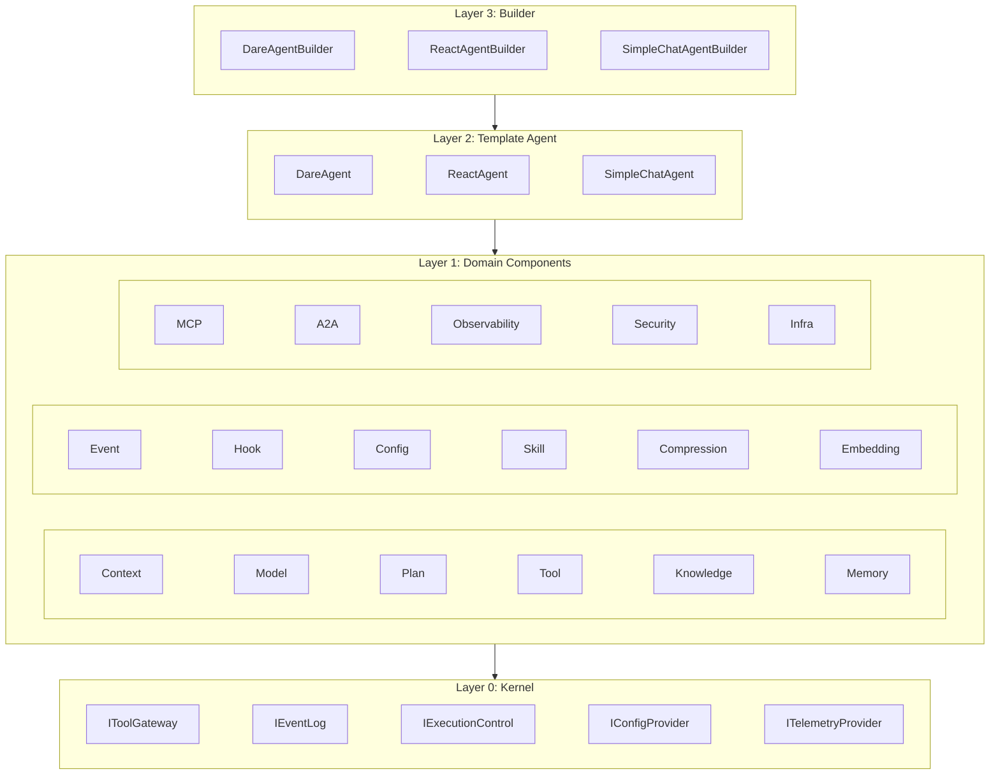
```mermaid
flowchart TB
  subgraph L3["Layer 3: Builder"]
    direction LR
    B1[DareAgentBuilder] ~~~ B2[ReactAgentBuilder] ~~~ B3[SimpleChatAgentBuilder]
  end

  subgraph L2["Layer 2: Template Agent"]
    direction LR
    A1[DareAgent] ~~~ A2[ReactAgent] ~~~ A3[SimpleChatAgent]
  end

  subgraph L1["Layer 1: Domain Components"]
    direction LR
    subgraph L1a[" "]
      direction LR
      M1[Context] ~~~ M2[Model] ~~~ M3[Plan] ~~~ M4[Tool] ~~~ M5[Knowledge] ~~~ M6[Memory]
    end
    subgraph L1b[" "]
      direction LR
      M7[Event] ~~~ M8[Hook] ~~~ M9[Config] ~~~ M10[Skill] ~~~ M11[Compression] ~~~ M12[Embedding]
    end
    subgraph L1c[" "]
      direction LR
      M13[MCP] ~~~ M14[A2A] ~~~ M15[Observability] ~~~ M16[Security] ~~~ M17[Infra]
    end
  end

  subgraph L0["Layer 0: Kernel"]
    direction LR
    K1["IToolGateway"] ~~~ K2[IEventLog] ~~~ K3[IExecutionControl] ~~~ K4[IConfigProvider] ~~~ K5[ITelemetryProvider]
  end

  L3 --> L2 --> L1 --> L0
```

---

## Part 2. 两种模版 Agent（React 与 Dare）

本部分描述模版编排层；域组件能力在 Part 3、Part 4 描述。

### 2.1 React 模版 Agent（`ReactAgent`）

#### 2.1.1 设计思想

- 适用：**无需显式规划与验证**、以“模型决定下一步工具调用”为主的交互任务。
- 目标：最短链路实现“模型↔工具”的循环，降低编排复杂度。

#### 2.1.2 设计方案（执行循环）

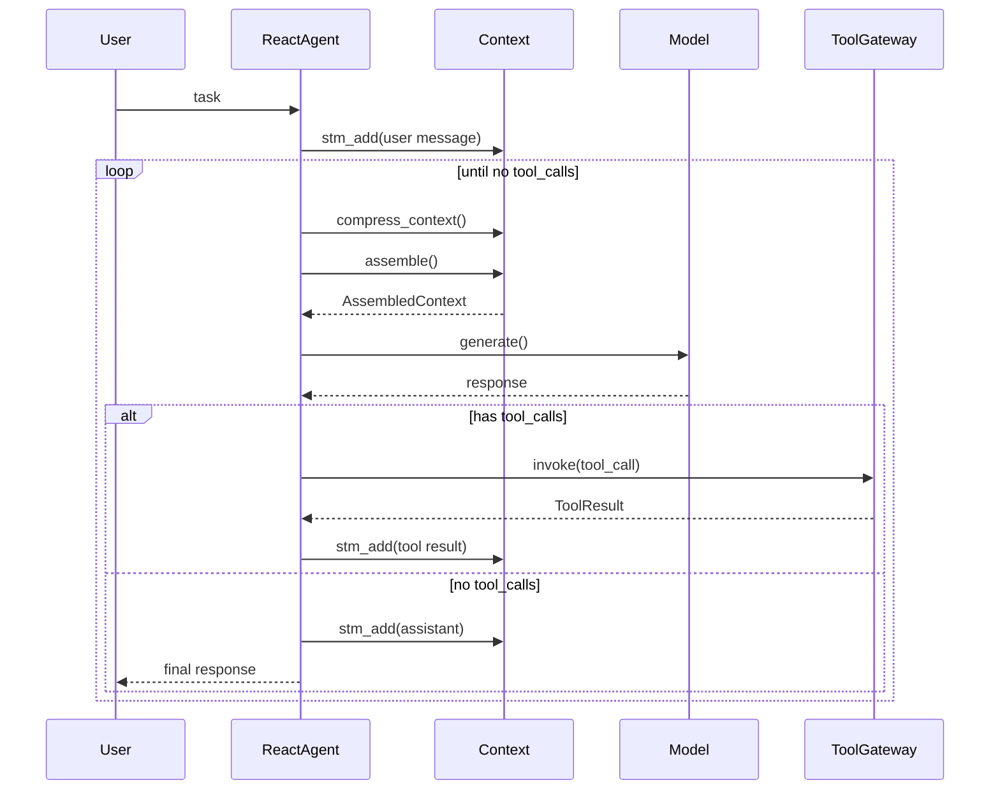
```mermaid
sequenceDiagram
  participant U as User
  participant A as ReactAgent
  participant C as Context
  participant M as Model
  participant TG as ToolGateway

  U->>A: task
  A->>C: stm_add(user message)
  loop until no tool_calls
    A->>C: compress_context()
    A->>C: assemble()
    C-->>A: AssembledContext
    A->>M: generate()
    M-->>A: response
    alt has tool_calls
      A->>TG: invoke(tool_call)
      TG-->>A: ToolResult
      A->>C: stm_add(tool result)
    else no tool_calls
      A->>C: stm_add(assistant)
      A-->>U: final response
    end
  end
```

#### 2.1.3 要点说明

| 项目 | 说明 |
|------|------|
| **输入** | 用户 task（str） |
| **输出** | str（最终模型回复）/（或由上层包装 RunResult） |
| **关键步骤** | assemble→generate→tool_calls→invoke→写回 STM→下一轮 |
| **上下游衔接** | 上游：ReactAgentBuilder 注入 model/context/tools；下游：IToolGateway.invoke、Context.assemble |
| **扩展点** | 自定义 tools、压缩策略、max_tool_rounds；替换 ModelAdapter |

### 2.2 Dare 模版 Agent（`DareAgent` 五层编排）

#### 2.2.1 设计思想

- 适用：需要**可审计、可验证、可重试**的复杂任务（例如“多里程碑交付”、“带证据验收”）。
- 核心：把“任务生命周期”拆成五层循环，使规划/执行/验证/修复各自可插拔。

#### 2.2.2 设计方案（五层循环）

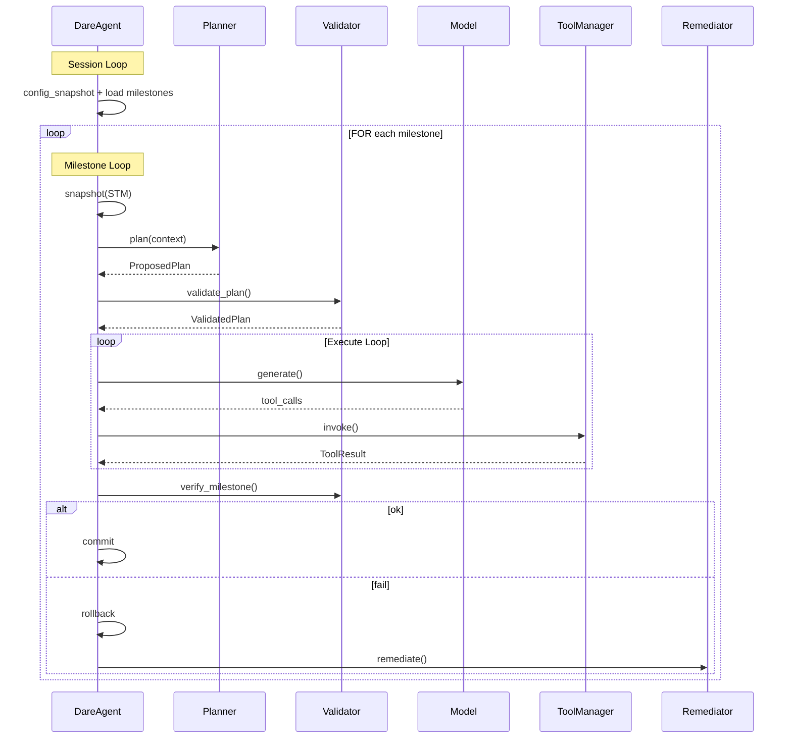
```mermaid
sequenceDiagram
  participant D as DareAgent
  participant P as Planner
  participant V as Validator
  participant M as Model
  participant T as ToolManager
  participant R as Remediator

  Note over D: Session Loop
  D->>D: config_snapshot + load milestones
  loop FOR each milestone
    Note over D: Milestone Loop
    D->>D: snapshot(STM)
    D->>P: plan(context)
    P-->>D: ProposedPlan
    D->>V: validate_plan()
    V-->>D: ValidatedPlan
    loop Execute Loop
      D->>M: generate()
      M-->>D: tool_calls
      D->>T: invoke()
      T-->>D: ToolResult
    end
    D->>V: verify_milestone()
    alt ok
      D->>D: commit
    else fail
      D->>D: rollback
      D->>R: remediate()
    end
  end
```

#### 2.2.3 要点说明

| 项目 | 说明 |
|------|------|
| **输入** | Task（可带 milestones；可带 previous_session_summary） |
| **输出** | RunResult（含 session_summary 可选持久化） |
| **关键步骤** | Session：配置快照+milestone 来源（task/planner.decompose/default）；Milestone：sandbox 隔离+计划重试+执行迭代+验证+修复反思 |
| **上下游衔接** | 上游：DareAgentBuilder 注入 planner/validator/remediator/tool_gateway/hooks/telemetry/event_log；下游：Context.assemble、Model.generate、Tool.invoke、Validator.verify |
| **扩展点** | 替换 planner/validator/remediator；实现 IPlanAttemptSandbox；增加 HookPhase 消费者；ExecutionControl 做 HITL |

### 2.3 两种模版对比

| 维度 | React 模版 | Dare 模版 |
|------|------------|-----------|
| **规划** | 无显式 Plan Loop | 有 Plan Loop（IPlanner + IValidator） |
| **验证/验收** | 通常靠模型自洽 | Verify Loop（IValidator.verify_milestone） |
| **失败隔离** | 仅上下文压缩 | sandbox 快照回滚，失败不污染 |
| **审计与观测** | 可选 | Hook + EventLog + Telemetry 更体系化 |
| **适用** | 轻量工具循环 | 复杂交付、多阶段、多证据 |

---

## Part 3. 在模版 Agent 上挂载外部支持（MCP/Skill/Knowledge/Model/Hook/Tool/Memory）

描述各能力如何挂载到模版 Agent；装配方式与 `examples/05-dare-coding-agent-enhanced/cli.py` 一致。

### 3.1 MCP（Model Context Protocol）挂载

#### 工作逻辑图

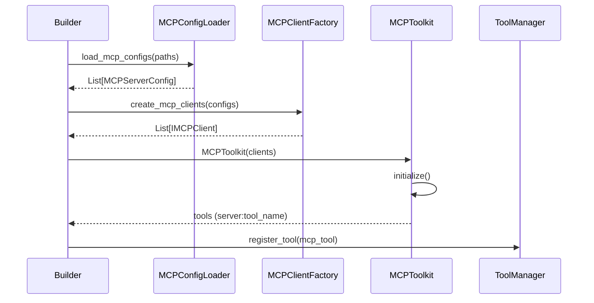
```mermaid
sequenceDiagram
  participant B as Builder
  participant L as MCPConfigLoader
  participant F as MCPClientFactory
  participant TK as MCPToolkit
  participant TM as ToolManager

  B->>L: load_mcp_configs(paths)
  L-->>B: List[MCPServerConfig]
  B->>F: create_mcp_clients(configs)
  F-->>B: List[IMCPClient]
  B->>TK: MCPToolkit(clients)
  TK->>TK: initialize()
  TK-->>B: tools (server:tool_name)
  B->>TM: register_tool(mcp_tool)
```

#### 要点说明

| 项目 | 说明 |
|------|------|
| **输入** | Config.mcp_paths（扫描目录）；Config.allowmcps（白名单） |
| **输出** | MCPToolkit（IToolProvider）供 Builder 合并进工具集合 |
| **关键步骤** | 支持 json/yaml/md（代码块抽取）；transport stdio/http；grpc 未实现会报错 |
| **上下游衔接** | 上游：Builder.build()；下游：ToolManager 注册 MCPTool（server:tool） |
| **扩展点** | 新 transport；自定义 IMCPClient；增强通知通道（当前 http 默认关闭 SSE） |

### 3.2 Skill 挂载（两种模式）

#### 工作逻辑图

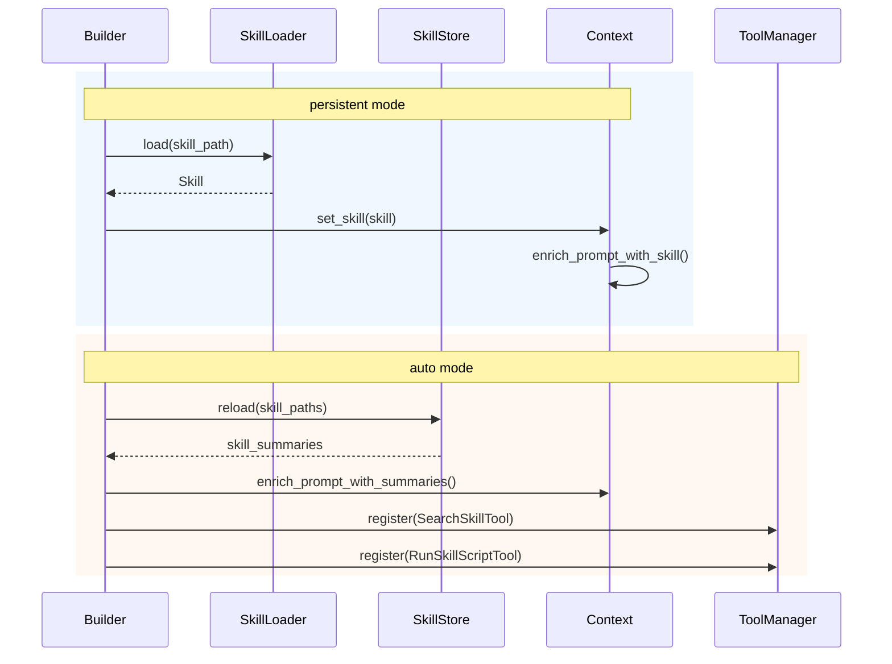
```mermaid
sequenceDiagram
  participant B as Builder
  participant SL as SkillLoader
  participant SS as SkillStore
  participant C as Context
  participant TM as ToolManager

  rect rgb(240, 248, 255)
  Note over B,C: persistent mode
  B->>SL: load(skill_path)
  SL-->>B: Skill
  B->>C: set_skill(skill)
  C->>C: enrich_prompt_with_skill()
  end

  rect rgb(255, 248, 240)
  Note over B,TM: auto mode
  B->>SS: reload(skill_paths)
  SS-->>B: skill_summaries
  B->>C: enrich_prompt_with_summaries()
  B->>TM: register(SearchSkillTool)
  B->>TM: register(RunSkillScriptTool)
  end
```

#### 要点说明

| 项目 | 说明 |
|------|------|
| **输入** | persistent：单 skill path；auto：skill_paths（目录） |
| **输出** | persistent：prompt 含完整 skill；auto：prompt 含摘要+工具按需加载 |
| **关键步骤** | SearchSkillTool 将完整 Skill 注入 Context；SkillScriptRunner 执行 scripts/ |
| **上下游衔接** | 上游：Builder；下游：Context.assemble、ToolManager.invoke |
| **扩展点** | ISkillLoader/ISkillSelector；脚本执行隔离策略 |

### 3.3 Knowledge 挂载（rawdata / vector）

#### 工作逻辑图

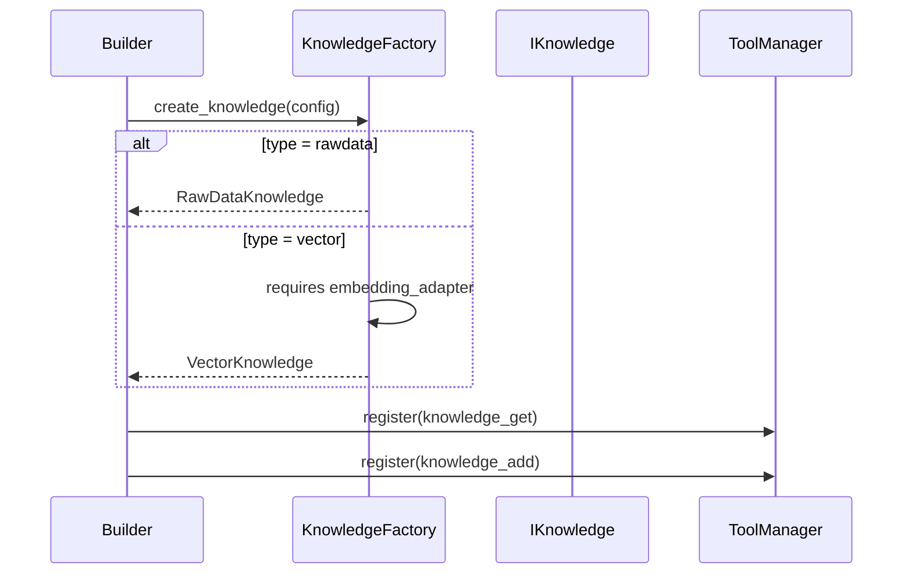
```mermaid
sequenceDiagram
  participant B as Builder
  participant KF as KnowledgeFactory
  participant K as IKnowledge
  participant TM as ToolManager

  B->>KF: create_knowledge(config)
  alt type = rawdata
    KF-->>B: RawDataKnowledge
  else type = vector
    KF->>KF: requires embedding_adapter
    KF-->>B: VectorKnowledge
  end
  B->>TM: register(knowledge_get)
  B->>TM: register(knowledge_add)
```

#### 要点说明

| 项目 | 说明 |
|------|------|
| **输入** | Config.knowledge；（vector 需 embedding_adapter） |
| **输出** | IKnowledge；并自动暴露 knowledge_get / knowledge_add 工具 |
| **关键步骤** | Builder._register_tools_with_manager() 在 knowledge 存在时注册工具 |
| **上下游衔接** | 上游：Builder.with_knowledge 或 config 驱动；下游：ToolManager.invoke、模型工具调用 |
| **扩展点** | 新 IKnowledge 实现；自定义 storage/vector_store |

### 3.4 Model 挂载（模型适配 + Prompt 叠加）

#### 工作逻辑图

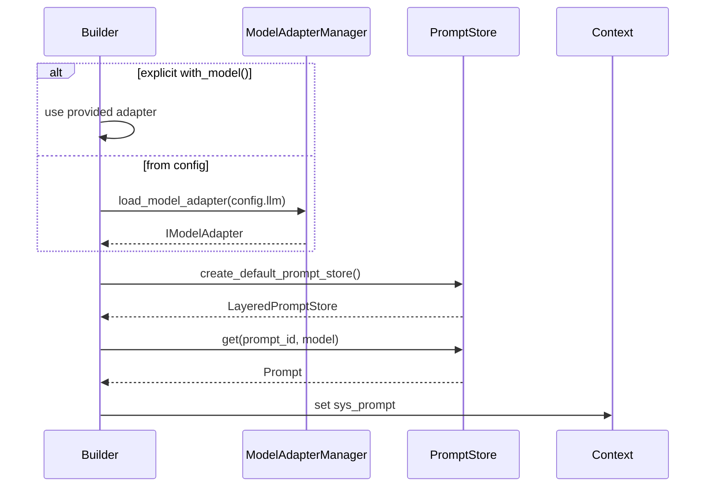
```mermaid
sequenceDiagram
  participant B as Builder
  participant MAM as ModelAdapterManager
  participant PS as PromptStore
  participant C as Context

  alt explicit with_model()
    B->>B: use provided adapter
  else from config
    B->>MAM: load_model_adapter(config.llm)
    MAM-->>B: IModelAdapter
  end
  B->>PS: create_default_prompt_store()
  PS-->>B: LayeredPromptStore
  B->>PS: get(prompt_id, model)
  PS-->>B: Prompt
  B->>C: set sys_prompt
```

#### 要点说明

| 项目 | 说明 |
|------|------|
| **输入** | Config.llm 或显式 with_model；prompt_store_path_pattern |
| **输出** | IModelAdapter；sys_prompt（Prompt） |
| **关键步骤** | prompt_id：override → config.default_prompt_id → base.system；LayeredPromptStore 叠加优先级 |
| **上下游衔接** | 上游：Builder；下游：Agent Execute Loop 调用 model.generate |
| **扩展点** | 新 ModelAdapter；新 PromptLoader；更复杂的 prompt 组合策略 |

### 3.5 Hook 挂载（生命周期扩展）

#### 工作逻辑图

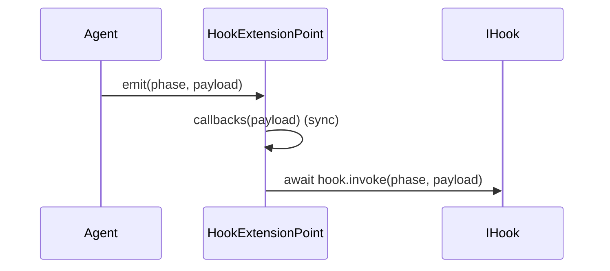
```mermaid
sequenceDiagram
  participant Agent
  participant EP as HookExtensionPoint
  participant H as IHook
  Agent->>EP: emit(phase, payload)
  EP->>EP: callbacks(payload) (sync)
  EP->>H: await hook.invoke(phase, payload)
```

#### 要点说明

| 项目 | 说明 |
|------|------|
| **输入** | HookPhase + payload（含 budget_stats/token_usage/duration 等） |
| **输出** | best-effort（不阻断执行） |
| **关键步骤** | callbacks 同步；IHook 异步；异常仅日志 |
| **上下游衔接** | 上游：DareAgent 执行期间发射；下游：ObservabilityHook、审计/审批 hook |
| **扩展点** | IHookManager（config-driven）；自定义阶段 payload 结构 |

### 3.6 Tool 挂载（注册表 + 内置工具 + 执行边界）

#### 工作逻辑图

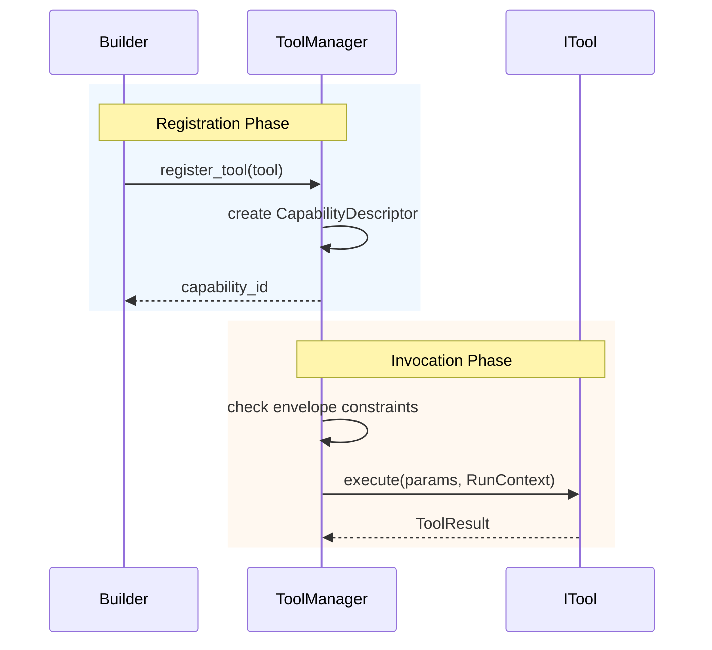
```mermaid
sequenceDiagram
  participant B as Builder
  participant TM as ToolManager
  participant T as ITool

  rect rgb(240, 248, 255)
  Note over B,TM: Registration Phase
  B->>TM: register_tool(tool)
  TM->>TM: create CapabilityDescriptor
  TM-->>B: capability_id
  end

  rect rgb(255, 248, 240)
  Note over TM,T: Invocation Phase
  TM->>TM: check envelope constraints
  TM->>T: execute(params, RunContext)
  T-->>TM: ToolResult
  end
```

#### 要点说明

| 项目 | 说明 |
|------|------|
| **输入** | ITool（native）、MCPTool、auto-skill tools |
| **输出** | list_tool_defs（给模型）、ToolResult（回写 STM） |
| **关键步骤** | 注册表为可信来源；envelope.allowed_capability_ids 控制调用边界；risk_level/approval 由 registry metadata 给出 |
| **上下游衔接** | 上游：Builder._resolved_tools；下游：Agent Tool Loop |
| **扩展点** | IExecutionControl 实现 HITL；新增 tool provider；增强 schema 校验 |

### 3.7 Memory 挂载（STM/LTM）

#### 工作逻辑图

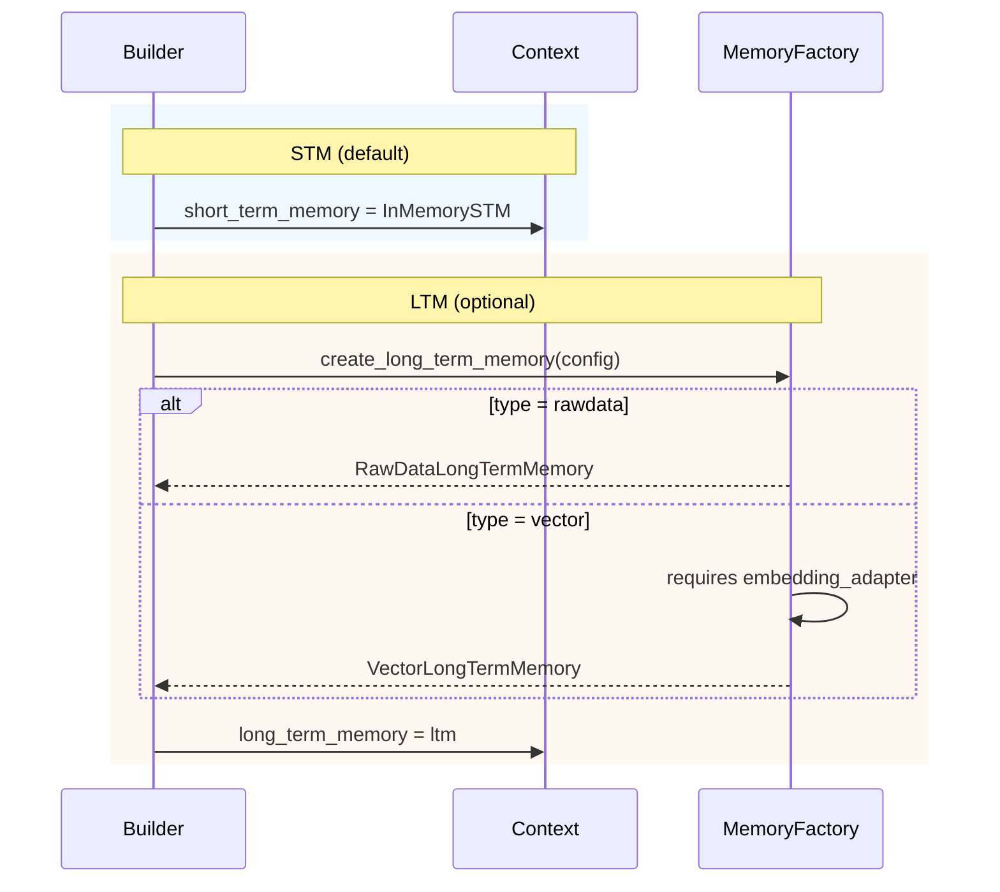
```mermaid
sequenceDiagram
  participant B as Builder
  participant C as Context
  participant MF as MemoryFactory

  rect rgb(240, 248, 255)
  Note over B,C: STM (default)
  B->>C: short_term_memory = InMemorySTM
  end

  rect rgb(255, 248, 240)
  Note over B,MF: LTM (optional)
  B->>MF: create_long_term_memory(config)
  alt type = rawdata
    MF-->>B: RawDataLongTermMemory
  else type = vector
    MF->>MF: requires embedding_adapter
    MF-->>B: VectorLongTermMemory
  end
  B->>C: long_term_memory = ltm
  end
```

#### 要点说明

| 项目 | 说明 |
|------|------|
| **输入** | Config.long_term_memory；（vector 需 embedding_adapter） |
| **输出** | ILongTermMemory；STM 作为会话消息容器 |
| **关键步骤** | STM 负责“对话历史”；LTM 负责“跨会话检索与持久化” |
| **上下游衔接** | 上游：Builder 注入；下游：Context 持有（默认 assemble 不自动检索） |
| **扩展点** | 自定义 LTM 检索/写回策略；不同存储后端 |

---

## Part 4. 各模块详细设计

每个模块按：**设计思想**、**设计方案**、**工作逻辑图**、**要点说明**、**扩展点** 组织。

### 4.1 infra（组件身份）

#### 设计思想

通过统一契约 IComponent（name + component_type）使 Config 与 Builder 能跨域对可插拔组件做启用/禁用判断与按组件类型的配置读取，避免各域自建一套标识与配置键。

#### 设计方案

- **IComponent**：Protocol，只读属性 name（str）、component_type（ComponentType）；用于配置查找与过滤。
- **ComponentType**：枚举。含 PLANNER、VALIDATOR、REMEDIATOR、MEMORY、MODEL_ADAPTER、TOOL、SKILL、MCP、HOOK、PROMPT、TELEMETRY 等，与 Config.components 的键对应。
- **Config.components**：按 ComponentType 索引；每项含 disabled（组件名列表）与 entries（可选细粒度配置）。Builder 在装配前通过 is_component_enabled(component) 判断是否启用，逻辑为：component_type 对应的 component_settings.disabled 不包含 component.name。

#### 工作逻辑图

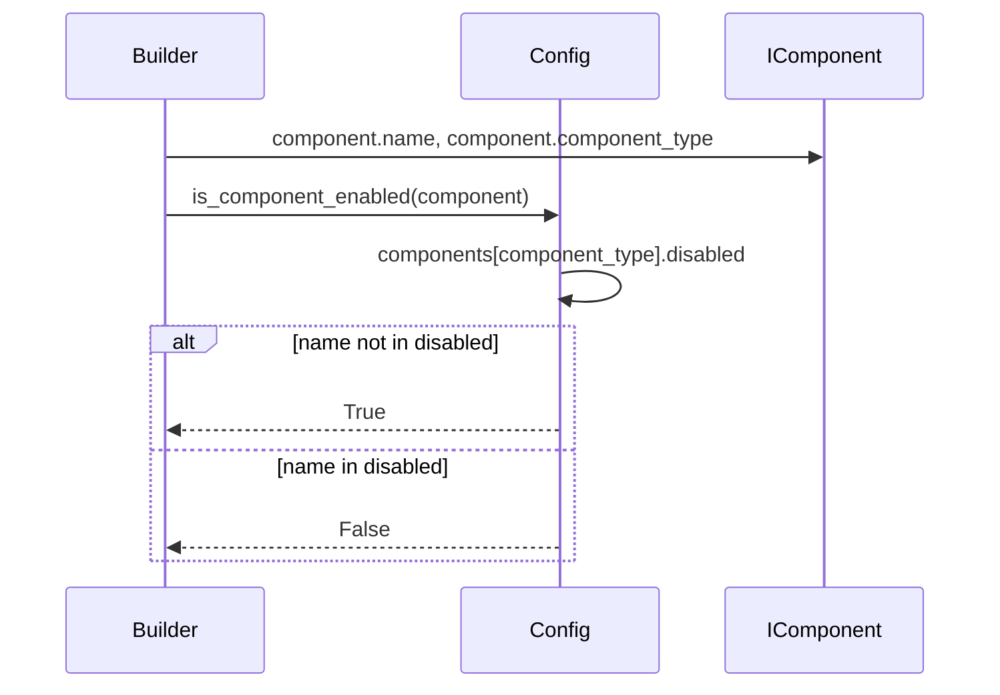
```mermaid
sequenceDiagram
  participant B as Builder
  participant C as Config
  participant Comp as IComponent

  B->>Comp: component.name, component.component_type
  B->>C: is_component_enabled(component)
  C->>C: components[component_type].disabled
  alt name not in disabled
    C-->>B: True
  else name in disabled
    C-->>B: False
  end
```

#### 要点说明

| 项目 | 说明 |
|------|------|
| **输入** | component.name、component.component_type；Config.components |
| **输出** | bool（是否启用） |
| **关键步骤** | 按 component_type 取配置，检查 disabled 列表 |
| **上下游** | 上游：各域组件实现 IComponent；下游：Builder 过滤、读取 per-component 配置 |
| **扩展点** | 扩展 ComponentType；更细粒度配置策略（如按 name 的 options） |

### 4.2 agent（编排域）

#### 设计思想

把“如何跑任务”抽象成编排（Agent 实现），而非把某个 Agent 等同于框架架构；三种实现共享 Context/Model/Tool 等域组件。

#### 设计方案

- `IAgent.run()` 为统一入口，支持 `str | Task`。
- `DareAgent.execute()` 内部自动模式选择：Full/ReAct/Simple。
- `SessionState/MilestoneState` 保存确定性的运行状态与证据。

#### 工作逻辑图

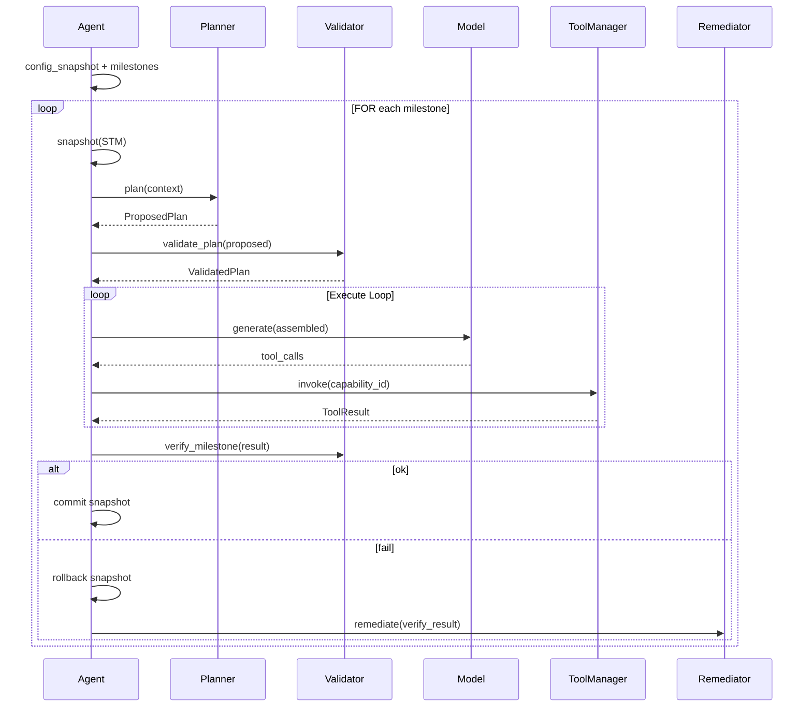
```mermaid
sequenceDiagram
  participant A as Agent
  participant P as Planner
  participant V as Validator
  participant M as Model
  participant TM as ToolManager
  participant R as Remediator

  A->>A: config_snapshot + milestones
  loop FOR each milestone
    A->>A: snapshot(STM)
    A->>P: plan(context)
    P-->>A: ProposedPlan
    A->>V: validate_plan(proposed)
    V-->>A: ValidatedPlan
    loop Execute Loop
      A->>M: generate(assembled)
      M-->>A: tool_calls
      A->>TM: invoke(capability_id)
      TM-->>A: ToolResult
    end
    A->>V: verify_milestone(result)
    alt ok
      A->>A: commit snapshot
    else fail
      A->>A: rollback snapshot
      A->>R: remediate(verify_result)
    end
  end
```

#### 要点说明

| 项目 | 说明 |
|------|------|
| **输入/输出** | 输入 Task/str；输出 RunResult + optional SessionSummary |
| **关键步骤** | sandbox 快照隔离；budget_check；hook/event/telemetry best-effort |
| **扩展点** | IAgentOrchestration、IPlanAttemptSandbox、ISessionSummaryStore、IStepExecutor |

### 4.3 plan（规划/校验/修复域）

#### 设计思想

规划来自模型是**不可信**的；可信字段必须由 Validator 从注册表（ToolManager/IToolGateway）派生，避免 LLM 注入风险。

#### 设计方案

- `DefaultPlanner` 生成“证据型” ProposedPlan（capability_id 为 evidence 类型或计划工具）。
- `RegistryPlanValidator` 校验能力存在性并派生 risk_level。
- `DefaultRemediator` 对 VerifyResult 做元认知反思，指导下一次尝试。

#### 工作逻辑图

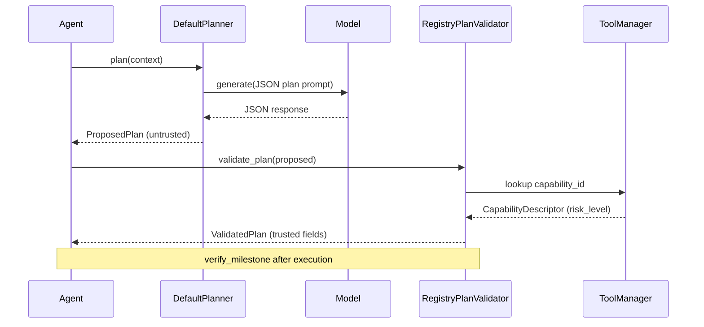
```mermaid
sequenceDiagram
  participant A as Agent
  participant P as DefaultPlanner
  participant M as Model
  participant V as RegistryPlanValidator
  participant TM as ToolManager

  A->>P: plan(context)
  P->>M: generate(JSON plan prompt)
  M-->>P: JSON response
  P-->>A: ProposedPlan (untrusted)
  A->>V: validate_plan(proposed)
  V->>TM: lookup capability_id
  TM-->>V: CapabilityDescriptor (risk_level)
  V-->>A: ValidatedPlan (trusted fields)
  Note over A,V: verify_milestone after execution
```

#### 要点说明

| 项目 | 说明 |
|------|------|
| **输入/输出** | Proposed→Validated；RunResult→VerifyResult；VerifyResult→reflection |
| **关键步骤** | capability_index（id/alias）解析；覆盖 planner 产出的安全字段 |
| **扩展点** | 自定义证据 schema；多 validator 组合；替换 remediator prompt |

### 4.4 context（上下文域）

#### 设计思想

Context 是“引用聚合器”（STM/LTM/Knowledge/Budget/Tools/Prompt），在每次模型调用前**按需 assemble**，避免把上下文耦死在 Agent 内。

#### 设计方案

- STM 默认 InMemorySTM，可替换。
- `listing_tools()` 优先走 ToolManager.list_tool_defs 输出模型可用 schema。
- Skill 在 persistent 模式 build 时合并；auto 模式运行时合并。

#### 工作逻辑图

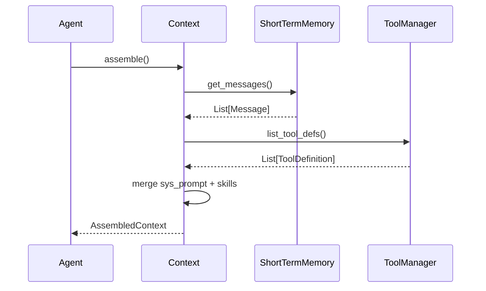
```mermaid
sequenceDiagram
  participant A as Agent
  participant C as Context
  participant STM as ShortTermMemory
  participant TM as ToolManager

  A->>C: assemble()
  C->>STM: get_messages()
  STM-->>C: List[Message]
  C->>TM: list_tool_defs()
  TM-->>C: List[ToolDefinition]
  C->>C: merge sys_prompt + skills
  C-->>A: AssembledContext
```

#### 要点说明

| 项目 | 说明 |
|------|------|
| **输入/输出** | 输入 STM/技能/工具；输出 AssembledContext |
| **关键步骤** | budget_check 在 Agent 中触发；compress 统一转发 compression.compress_context |
| **扩展点** | assemble 拼接 LTM/Knowledge 的策略（当前默认不自动检索） |

### 4.5 tool（工具域）

#### 设计思想

ToolManager 是“可信能力注册表 + 调用边界”，模型只能看到工具定义，真实执行必须经过 invoke 边界与 envelope 约束。

#### 设计方案

- `register_tool()` 生成 CapabilityDescriptor（含 risk_level、requires_approval、kind）。
- `invoke()` 对 allowed_capability_ids 做边界约束，执行 ITool.execute。
- MCPToolkit 将远程工具包装成 ITool，并纳入统一注册表。

#### 工作逻辑图

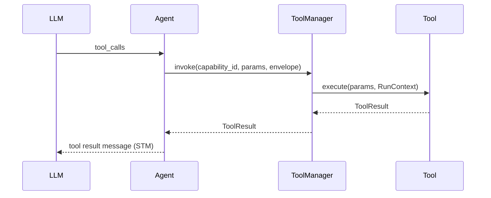
```mermaid
sequenceDiagram
  participant L as LLM
  participant A as Agent
  participant TM as ToolManager
  participant T as Tool
  L->>A: tool_calls
  A->>TM: invoke(capability_id, params, envelope)
  TM->>T: execute(params, RunContext)
  T-->>TM: ToolResult
  TM-->>A: ToolResult
  A-->>L: tool result message (STM)
```

#### 要点说明

| 项目 | 说明 |
|------|------|
| **输入/输出** | ToolDefinition 给模型；ToolResult 回写 STM |
| **关键步骤** | 风险元数据由 registry 提供；HITL 通过 IExecutionControl（框架预留） |
| **扩展点** | 新 ITool；新增 provider；新增执行控制策略 |

### 4.6 model（模型域）

#### 设计思想

将模型调用收敛到单一接口 `IModelAdapter.generate`；Prompt 由分层 PromptStore 提供，避免业务代码硬编码。

#### 设计方案

- **接口**：`IModelAdapter.generate(ModelInput, options)` 返回 `ModelResponse`（content、tool_calls、usage）。
- **实现**：OpenRouterModelAdapter、OpenAI 系 adapter；DefaultModelAdapterManager 根据 Config.llm 装配。
- **Prompt**：LayeredPromptStore 按 workspace / user / builtin 三层叠加；prompt_id 优先级为 override → config.default_prompt_id → base.system。
- **预算**：usage（tokens/cost）由调用方（Agent）写入 Context.Budget。

#### 工作逻辑图

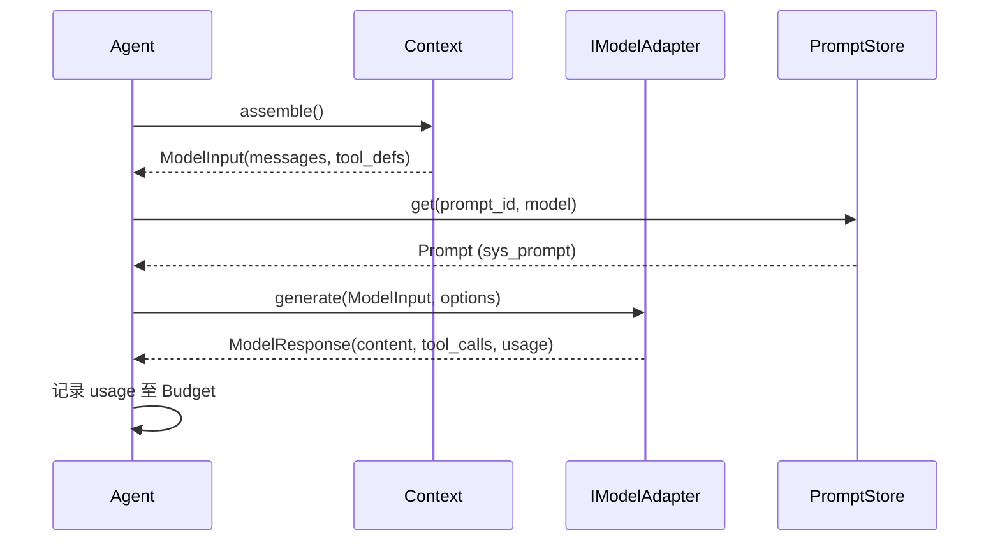
```mermaid
sequenceDiagram
  participant A as Agent
  participant C as Context
  participant M as IModelAdapter
  participant PS as PromptStore

  A->>C: assemble()
  C-->>A: ModelInput(messages, tool_defs)
  A->>PS: get(prompt_id, model)
  PS-->>A: Prompt (sys_prompt)
  A->>M: generate(ModelInput, options)
  M-->>A: ModelResponse(content, tool_calls, usage)
  A->>A: 记录 usage 至 Budget
```

#### 要点说明

| 项目 | 说明 |
|------|------|
| **输入** | ModelInput（messages、tools）、GenerateOptions；Prompt 由 Context/PromptStore 提供 |
| **输出** | ModelResponse（content、tool_calls、usage） |
| **关键步骤** | tool_defs 作为 tools 传入模型；usage 由 Agent 计入 Budget |
| **上下游** | 上游：Context.assemble、PromptStore.get；下游：Agent 处理 tool_calls、更新 STM |
| **扩展点** | 新 IModelAdapter；新 PromptLoader；prompt 版本与分层策略 |

### 4.7 config（配置域）

#### 设计思想

配置分层（user / workspace），以 JSON 为主；workspace 优先于 user，深合并避免运行目录歧义；缺失文件时自动创建空 JSON。

#### 设计方案

- **IConfigProvider**：`current()`、`reload()` 返回 `Config`。
- **FileConfigProvider**：从 `user_dir`（默认 home）与 `workspace_dir`（默认从 cwd 向上找含 .git 的根）加载同名文件（默认 `.dare/config.json`）；`_load_layer` 读 JSON，不存在则创建空 `{}`；`_merge_layers([user_layer, workspace_layer])` 深合并，workspace 覆盖 user；合并后补齐 `workspace_dir`、`user_dir` 字段。
- **Config**：不可变数据结构，承载 llm（LLMConfig）、mcp_paths、allowmcps、skill_mode、observability、components（按 ComponentType 的 disabled/entries）、long_term_memory、knowledge、proxy 等；`Config.from_dict` 从合并后的 dict 构造。
- **LLMConfig**：adapter、endpoint、api_key、model、proxy（ProxyConfig）、extra。
- **Component 配置**：`Config.components[component_type]` 含 disabled 列表与 entries，供 `is_component_enabled(component)` 等使用。

#### 工作逻辑图

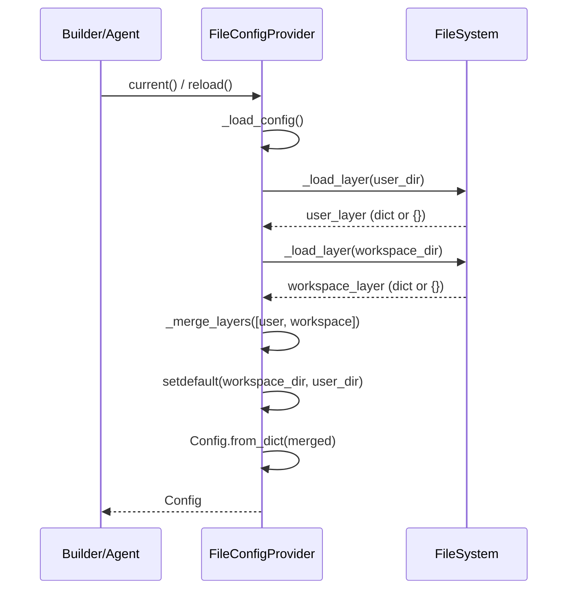
```mermaid
sequenceDiagram
  participant B as Builder/Agent
  participant FCP as FileConfigProvider
  participant FS as FileSystem

  B->>FCP: current() / reload()
  FCP->>FCP: _load_config()
  FCP->>FS: _load_layer(user_dir)
  FS-->>FCP: user_layer (dict or {})
  FCP->>FS: _load_layer(workspace_dir)
  FS-->>FCP: workspace_layer (dict or {})
  FCP->>FCP: _merge_layers([user, workspace])
  FCP->>FCP: setdefault(workspace_dir, user_dir)
  FCP->>FCP: Config.from_dict(merged)
  FCP-->>B: Config
```

#### 要点说明

| 项目 | 说明 |
|------|------|
| **输入** | user_dir、workspace_dir、filename；或显式传入的路径 |
| **输出** | Config（含 llm、mcp、skill_mode、components 等） |
| **关键步骤** | 深合并使 workspace 覆盖 user；自动创建空配置文件 |
| **上下游** | 上游：Builder 传入 IConfigProvider；下游：各域从 Config 读取 llm、mcp、skill_mode 等 |
| **扩展点** | 新 IConfigProvider（如远程/环境变量）；扩展 Config 字段与校验 |

### 4.8 memory（记忆域）

#### 设计思想

短期记忆（STM）作为当前会话消息容器；长期记忆（LTM）提供跨会话检索与持久化。STM 支持压缩以控制上下文长度；LTM 支持 rawdata（子串检索）与 vector（向量相似检索），vector 依赖 IEmbeddingAdapter。

#### 设计方案

- **IShortTermMemory**：继承 IRetrievalContext 与 IComponent；`add(Message)`、`get(query)`（STM 通常忽略 query 返回全部）、`clear()`、`compress(max_messages, **kwargs)` 返回移除条数。默认实现 InMemorySTM：列表存储，compress 时调用 compression 域或按 max_messages 截断。
- **ILongTermMemory**：`get(query, **kwargs)` 检索；`async persist(messages)` 持久化。实现：RawDataLongTermMemory（RawDataStorage，子串检索）；VectorLongTermMemory（VectorStore + IEmbeddingAdapter，相似检索）。
- **LongTermMemoryConfig**：type（"rawdata" | "vector"）、storage（"in_memory" | "sqlite" | "chromadb"，chromadb 仅 vector）、options。create_long_term_memory(config) 根据 type/storage 构造对应实现；vector 需注入 embedding_adapter。
- **与 Context 关系**：Context.short_term_memory 持有 STM；Context.long_term_memory 可选持有 LTM。assemble 时 STM.get() 提供消息列表；LTM 是否在 assemble 中自动检索由上层策略决定（当前默认不自动注入）。

#### 工作逻辑图

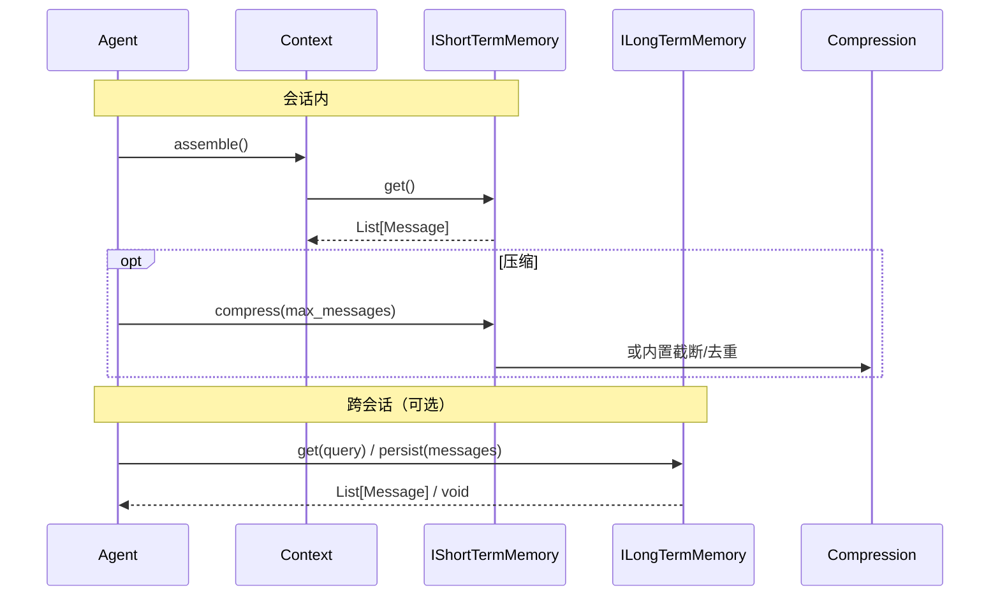
```mermaid
sequenceDiagram
  participant A as Agent
  participant C as Context
  participant STM as IShortTermMemory
  participant LTM as ILongTermMemory
  participant Comp as Compression

  Note over A,STM: 会话内
  A->>C: assemble()
  C->>STM: get()
  STM-->>C: List[Message]
  opt 压缩
    A->>STM: compress(max_messages)
    STM->>Comp: 或内置截断/去重
  end

  Note over A,LTM: 跨会话（可选）
  A->>LTM: get(query) / persist(messages)
  LTM-->>A: List[Message] / void
```

#### 要点说明

| 项目 | 说明 |
|------|------|
| **输入** | STM：Message 序列；LTM：Config.long_term_memory（type、storage、options）；vector 需 embedding_adapter |
| **输出** | STM：get() 返回消息列表；LTM：get() 返回检索结果，persist() 无返回值 |
| **关键步骤** | STM 负责对话历史与 compress；LTM 负责持久化与按 query 检索 |
| **上下游** | 上游：Builder 注入 STM/LTM；下游：Context.assemble 使用 STM.get() |
| **扩展点** | 自定义 STM/LTM 实现；新 storage/vector_store；compress 策略与 LTM 检索策略 |

### 4.9 knowledge（知识域）

#### 设计思想

知识以 IKnowledge（检索与可选写入）能力存在，通过 IRetrievalContext 与 Context 集成；同时以工具形式（knowledge_get、knowledge_add）暴露给模型，由模型决定何时检索或写入，工具为可信注册来源。

#### 设计方案

- **IKnowledge**：继承 IRetrievalContext；get(query, **kwargs) 返回检索结果；部分实现支持 add/写入（如 RawDataKnowledge、VectorKnowledge 的存储写入）。
- **实现**：RawDataKnowledge + RawDataStorage（in_memory / sqlite）；VectorKnowledge + VectorStore（in_memory / sqlite / chromadb），依赖 IEmbeddingAdapter。
- **Knowledge 工具**：Builder 在存在 IKnowledge 时通过 _register_tools_with_manager 注册 knowledge_get、knowledge_add（或仅 get）；工具内部调用 IKnowledge.get/add，参数与返回格式符合模型可用的 ToolDefinition。
- **配置**：Config.knowledge 指定 type、storage、options；create_knowledge(config) 工厂构造对应实现，vector 需注入 embedding_adapter。

#### 工作逻辑图

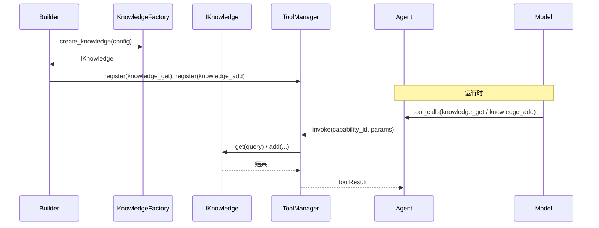
```mermaid
sequenceDiagram
  participant B as Builder
  participant KF as KnowledgeFactory
  participant K as IKnowledge
  participant TM as ToolManager
  participant A as Agent
  participant M as Model

  B->>KF: create_knowledge(config)
  KF-->>B: IKnowledge
  B->>TM: register(knowledge_get), register(knowledge_add)
  Note over A,M: 运行时
  M->>A: tool_calls(knowledge_get / knowledge_add)
  A->>TM: invoke(capability_id, params)
  TM->>K: get(query) / add(...)
  K-->>TM: 结果
  TM-->>A: ToolResult
```

#### 要点说明

| 项目 | 说明 |
|------|------|
| **输入** | Config.knowledge；vector 需 embedding_adapter；工具入参由模型传入 |
| **输出** | IKnowledge 实例；工具返回 ToolResult（内容为检索/写入结果） |
| **关键步骤** | Builder 统一注册知识工具；invoke 时转调 IKnowledge |
| **上下游** | 上游：Builder.with_knowledge 或 config；下游：ToolManager.invoke、模型工具调用 |
| **扩展点** | 新 IKnowledge 实现；自定义 storage/vector_store；工具参数 schema 扩展 |

### 4.10 skill（技能域）

#### 设计思想

技能提供“系统提示增强”与“可执行脚本”两种能力。persistent 模式在构建时将单技能全文写入 prompt；auto 模式在构建时仅将技能摘要写入 prompt，通过 SearchSkillTool 按需加载全文、通过 RunSkillScriptTool 执行 scripts/，避免将所有技能全文塞入单次 prompt。

#### 设计方案

- **Skill**：结构化技能描述（id、name、description、content、scripts 等），由 ISkillLoader 解析（如 FileSystemSkillLoader 从文件/目录加载）。
- **ISkillLoader**：load() 返回 list[Skill]。ISkillStore：list_skills()、get_skill(id)、select_for_task(task_description)。ISkillSelector：select(task_description, skills) 返回子集。
- **persistent_skill_mode**：Builder 用 initial_skill_path / with_skill 加载单技能，context.set_skill(skill)，enrich_prompt_with_skill 将完整 content 合并进 sys_prompt。
- **auto_skill_mode**：Builder 用 skill_paths 调用 SkillStore.reload()；enrich_prompt_with_skill_summaries 仅合并摘要；注册 SearchSkillTool（按 id/关键词加载完整 Skill 并注入 Context）与 RunSkillScriptTool（执行 skill.scripts/ 下脚本）；assemble 时将已加载的完整 skill 合并进 sys_prompt。
- **SkillScriptRunner**：统一执行脚本入口，可配置执行隔离与工作目录。

#### 工作逻辑图

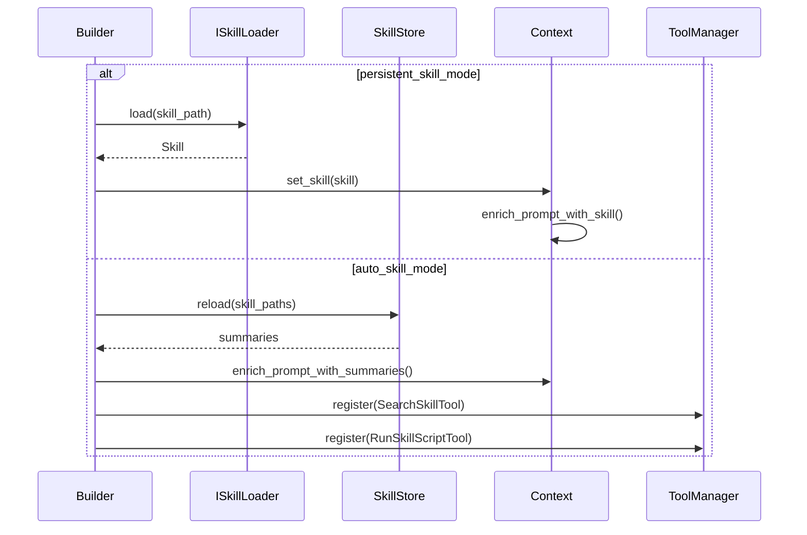
```mermaid
sequenceDiagram
  participant B as Builder
  participant SL as ISkillLoader
  participant SS as SkillStore
  participant C as Context
  participant TM as ToolManager

  alt persistent_skill_mode
    B->>SL: load(skill_path)
    SL-->>B: Skill
    B->>C: set_skill(skill)
    C->>C: enrich_prompt_with_skill()
  else auto_skill_mode
    B->>SS: reload(skill_paths)
    SS-->>B: summaries
    B->>C: enrich_prompt_with_summaries()
    B->>TM: register(SearchSkillTool)
    B->>TM: register(RunSkillScriptTool)
  end
```

#### 要点说明

| 项目 | 说明 |
|------|------|
| **输入** | persistent：单 skill path；auto：skill_paths（目录）；运行时：search_skill(id)、run_skill_script(skill_id, script, params) |
| **输出** | persistent：sys_prompt 含完整 skill；auto：sys_prompt 含摘要 + 工具按需加载全文 |
| **关键步骤** | SearchSkillTool 将完整 Skill 写入 Context；SkillScriptRunner 执行 scripts/ |
| **上下游** | 上游：Builder、Config.skill_mode；下游：Context.assemble、ToolManager.invoke |
| **扩展点** | ISkillLoader/ISkillStore/ISkillSelector 实现；脚本执行隔离与安全策略 |

### 4.11 compression（压缩域）

#### 设计思想

将上下文压缩策略集中在本域，避免各 Agent 自实现截断/去重/摘要导致行为不一致。提供同步轻量策略（不调 LLM）与异步语义摘要策略（调 LLM），由调用方按需选择。

#### 设计方案

- **compress_context(context, phase, max_messages, **options)**：同步、就地压缩 Context 的短期记忆。策略由 options['strategy'] 指定：`truncate`（仅保留最近 max_messages 条）；`dedup_then_truncate`（先按 (role, content) 去重再截断）；`summary_preview`（将较早历史折叠为一条 system 摘要消息 + 若干尾部原始消息，摘要为启发式无 LLM）。未传 max_messages 时不执行压缩。
- **compress_context_llm_summary(...)**：异步，调用 IModelAdapter 对历史消息做语义摘要，再写回 STM；用于高价值、可接受延迟与成本的场景。
- **依赖**：compress_context 仅依赖 Context 与可选 IContext；llm_summary 需注入 IModelAdapter。Agent 在需要时显式调用并传入 max_messages/strategy。

#### 工作逻辑图

```mermaid
sequenceDiagram
  participant A as Agent
  participant C as Context
  participant Comp as compression

  A->>C: 获取 STM
  A->>Comp: compress_context(context, max_messages, strategy)
  alt strategy = truncate
    Comp->>C: 截断至 max_messages
  else strategy = dedup_then_truncate
    Comp->>Comp: _dedup_messages()
    Comp->>C: 截断
  else strategy = summary_preview
    Comp->>Comp: _build_summary_preview()
    Comp->>C: 替换为摘要+尾部
  end
  Comp-->>A: void (就地修改)
```

#### 要点说明

| 项目 | 说明 |
|------|------|
| **输入** | IContext、max_messages、phase（预留）、options（strategy） |
| **输出** | 无；就地修改 Context 的 STM |
| **关键步骤** | 同步策略不调 LLM；llm_summary 异步调模型写回 |
| **上下游** | 上游：Agent 在 assemble 前或循环内调用；下游：Context.short_term_memory |
| **扩展点** | 新增 strategy；按 phase 差异化策略；与 Budget 联动 |

### 4.12 hook（Hook 域）

#### 设计思想

Hook 在编排关键生命周期节点被触发，以 best-effort 方式执行；异常仅记录日志，不阻断主流程。用于审计、观测、审批等横切能力，与 ObservabilityHook 等配合。

#### 设计方案

- **HookPhase**：枚举生命周期阶段。包括：BEFORE_RUN / AFTER_RUN；BEFORE_SESSION / AFTER_SESSION；BEFORE_MILESTONE / AFTER_MILESTONE；BEFORE_PLAN / AFTER_PLAN；BEFORE_EXECUTE / AFTER_EXECUTE；BEFORE_CONTEXT_ASSEMBLE / AFTER_CONTEXT_ASSEMBLE；BEFORE_MODEL / AFTER_MODEL；BEFORE_TOOL / AFTER_TOOL；BEFORE_VERIFY / AFTER_VERIFY。
- **IHook**：异步接口，invoke(phase, payload) 在对应阶段被调用；payload 可含 budget_stats、token_usage、duration、context 等。
- **HookExtensionPoint**：持有 callbacks（同步）与 hooks（IHook，异步）；emit(phase, payload) 先执行 callbacks(payload)，再 await hook.invoke(phase, payload)；异常捕获后仅打日志。
- **使用**：DareAgent 在 Session/Milestone/Plan/Execute/Tool/Verify 各阶段前后调用 extension_point.emit(phase, payload)；ObservabilityHook 监听 BEFORE/AFTER_* 生成 span/metric。

#### 工作逻辑图

```mermaid
sequenceDiagram
  participant Agent
  participant EP as HookExtensionPoint
  participant CB as callbacks
  participant H as IHook

  Agent->>EP: emit(phase, payload)
  EP->>CB: payload (sync)
  CB-->>EP: return
  EP->>H: await hook.invoke(phase, payload)
  H-->>EP: return
  EP-->>Agent: (best-effort, 异常不抛出)
```

#### 要点说明

| 项目 | 说明 |
|------|------|
| **输入** | HookPhase、payload（含 budget_stats、token_usage、duration 等） |
| **输出** | 无返回值；best-effort，不阻断执行 |
| **关键步骤** | callbacks 同步；IHook 异步；异常仅日志 |
| **上下游** | 上游：DareAgent 各阶段发射；下游：ObservabilityHook、审计/审批 hook |
| **扩展点** | IHookManager（配置驱动）；新增 HookPhase；自定义 payload 结构 |

### 4.13 event（事件域）

#### 设计思想

事件日志提供 WORM（写一次读多次）审计与重放基座；运行时将关键业务与系统事件追加到 IEventLog，支持按条件查询、从某 event_id 重放、以及链式完整性校验。

#### 设计方案

- **Event**：不可变记录，含 event_type、payload、event_id、timestamp、prev_hash、event_hash；用于链式哈希验证。
- **IEventLog**：异步接口。`append(event_type, payload)` 追加事件并返回 event_id；`query(filter, limit)` 按条件查询事件序列；`replay(from_event_id)` 从指定事件起重放，返回 RuntimeSnapshot；`verify_chain()` 校验哈希链完整性。
- **RuntimeSnapshot**：含 from_event_id 与 events 序列，供重放或分析使用。
- **与观测联动**：observability 域的 event_trace_bridge 可为事件追加 trace 信息，便于与分布式追踪关联。

#### 工作逻辑图

```mermaid
sequenceDiagram
  participant A as Agent/Control
  participant E as IEventLog
  participant Obs as event_trace_bridge

  A->>E: append(event_type, payload)
  E->>E: 计算 event_hash, 写入
  E-->>A: event_id
  opt 观测
    E->>Obs: 追加 trace 信息
  end

  A->>E: query(filter, limit)
  E-->>A: Sequence[Event]
  A->>E: replay(from_event_id)
  E-->>A: RuntimeSnapshot
  A->>E: verify_chain()
  E-->>A: bool
```

#### 要点说明

| 项目 | 说明 |
|------|------|
| **输入** | append：event_type、payload；query：filter、limit；replay：from_event_id |
| **输出** | append 返回 event_id；query 返回 Event 序列；replay 返回 RuntimeSnapshot；verify_chain 返回 bool |
| **关键步骤** | 追加时维护 prev_hash/event_hash；重放与校验基于链结构 |
| **上下游** | 上游：Agent、控制面写入；下游：审计、重放、观测桥接 |
| **扩展点** | 持久化实现（如数据库）；事件 schema 与版本；与 EventBus 集成 |

### 4.14 embedding（嵌入域）

#### 设计思想

将文本向量化抽象为 IEmbeddingAdapter，供 VectorKnowledge、VectorLongTermMemory 等复用，并可替换为不同厂商或自建向量模型，与业务逻辑解耦。

#### 设计方案

- **IEmbeddingAdapter**：`async embed(text, options)` 返回 EmbeddingResult（向量与元数据）；`async embed_batch(texts, options)` 返回 list[EmbeddingResult]，用于批量编码。
- **EmbeddingOptions / EmbeddingResult**：类型定义在 embedding.types，包含模型、维度等元数据。
- **实现**：OpenAIEmbeddingAdapter（基于 LangChain 或直接调用 OpenAI embedding API），供默认 VectorKnowledge/VectorLTM 使用。
- **使用方**：创建 VectorKnowledge 或 VectorLongTermMemory 时注入 IEmbeddingAdapter；检索时先对 query 做 embed，再与存储中的向量做相似度检索。

#### 工作逻辑图

```mermaid
sequenceDiagram
  participant K as VectorKnowledge/LTM
  participant E as IEmbeddingAdapter

  K->>E: embed_batch(texts) 或 embed(query)
  E-->>K: EmbeddingResult(s) 或 list
  K->>K: 与 vector_store 相似检索/写入
```

#### 要点说明

| 项目 | 说明 |
|------|------|
| **输入** | text 或 texts；可选 EmbeddingOptions |
| **输出** | EmbeddingResult（向量 + 元数据）或 list[EmbeddingResult] |
| **关键步骤** | 异步接口；批量接口用于建索引，单条用于 query |
| **上下游** | 上游：Builder 注入；下游：VectorKnowledge、VectorLongTermMemory |
| **扩展点** | 新 IEmbeddingAdapter（其他厂商/自建）；维度与模型配置统一 |

### 4.15 mcp（MCP 域）

#### 设计思想

MCP（Model Context Protocol）提供远程工具扩展能力：将外部 MCP 服务暴露的工具以 IToolProvider 形式纳入框架，工具在 ToolManager 中统一注册为“server:tool_name”，与本地工具同一调用边界与 envelope 约束。

#### 设计方案

- **MCPConfigLoader**：扫描指定目录（Config.mcp_paths），支持 .json、.yaml/.yml、.md（从代码块抽取 JSON/YAML）；每文件可定义单或多个 MCP 服务器；返回 list[MCPServerConfig]。白名单由 Config.allowmcps 控制。
- **MCPClientFactory**：根据 MCPServerConfig 创建 IMCPClient；transport 支持 stdio、http；grpc 未实现会报错。create_mcp_clients(configs, connect=True) 建立连接。
- **MCPToolkit**：实现 IToolProvider；initialize() 后暴露 tools，每个工具名为 "server:tool" 形式；Builder 将 MCPToolkit 提供的工具合并进 _resolved_tools 并注册到 ToolManager。
- **MCPTool**：包装远程工具为 ITool，invoke 时通过 IMCPClient 调用远程；ToolResult 回写与本地工具一致。

#### 工作逻辑图

```mermaid
sequenceDiagram
  participant B as Builder
  participant L as MCPConfigLoader
  participant F as MCPClientFactory
  participant TK as MCPToolkit
  participant TM as ToolManager

  B->>L: load(paths)
  L-->>B: List[MCPServerConfig]
  B->>F: create_mcp_clients(configs)
  F-->>B: List[IMCPClient]
  B->>TK: MCPToolkit(clients)
  TK->>TK: initialize()
  TK-->>B: tools (server:tool_name)
  B->>TM: register_tool(mcp_tool) x N
```

#### 要点说明

| 项目 | 说明 |
|------|------|
| **输入** | Config.mcp_paths、Config.allowmcps；配置文件格式 json/yaml/md |
| **输出** | MCPToolkit（IToolProvider）；工具名 server:tool，纳入 ToolManager |
| **关键步骤** | 支持 stdio/http transport；grpc 未实现；http 默认关闭 SSE 通知通道 |
| **上下游** | 上游：Builder.build()；下游：ToolManager 注册与 invoke |
| **扩展点** | 新 transport；自定义 IMCPClient；增强通知通道 |

### 4.16 a2a（Agent-to-Agent 域）

#### 设计思想

A2A 将 Agent 以标准协议暴露为可被发现、可调用的服务：通过 AgentCard 做能力发现，通过 JSON-RPC 提交任务、发送消息、获取结果与取消；消息与 artifact 支持文本、文件（inline base64 或 URI）等 Part 类型，与 a2acn.com 规范对齐。

#### 设计方案

- **类型**：AgentCardDict（name、description、provider、url、version、capabilities、auth、skills、defaultInputModes、defaultOutputModes）；AgentSkillDict；MessageDict、PartDict（TextPartDict、FilePartInlineDict、FilePartUriDict、DataPartDict）；Task、Artifact 等 JSON 可序列化类型。
- **服务端**：create_a2a_app 构造应用；handlers 提供 tasks（提交/列表）、send（发送消息）、get（获取结果）、cancel 等端点；AgentCard 通过约定路径或发现接口暴露；transport 层处理 HTTP/JSON-RPC。
- **客户端**：discover_agent_card(url) 获取 AgentCard；A2AClient 封装任务提交、消息发送、结果轮询与取消；支持 artifact 文本/文件（inline/uri）的组装与解析。
- **与 Agent 集成**：服务端将入站任务/消息转交 IAgent.run()，将 RunResult 转为 A2A 协议响应与 artifact。

#### 工作逻辑图

```mermaid
sequenceDiagram
  participant C as A2AClient
  participant S as A2A Server
  participant A as IAgent

  C->>S: GET AgentCard
  S-->>C: AgentCardDict
  C->>S: POST tasks (Task)
  S->>A: run(task)
  A-->>S: RunResult
  S-->>C: task_id / status
  C->>S: GET result / send message
  S-->>C: MessageDict / Artifact
```

#### 要点说明

| 项目 | 说明 |
|------|------|
| **输入** | 服务端：Task、Message；客户端：AgentCard url、Task、Message |
| **输出** | 服务端：RunResult 转 A2A 响应；客户端：AgentCard、结果、Message/Artifact |
| **关键步骤** | AgentCard 发现；JSON-RPC 任务与消息；artifact 文本/文件 |
| **上下游** | 上游：IAgent；下游：外部 A2A 客户端/服务端 |
| **扩展点** | 新 transport；扩展 Part 类型；认证与授权 |

### 4.17 observability（观测域）

#### 设计思想

观测由 Hook 驱动：Agent 在生命周期各阶段发射 HookPhase，ObservabilityHook 作为 IHook 实现监听 BEFORE/AFTER_* 阶段，在统一位置创建 span、记录 metric/event，避免在业务代码中散落埋点；与 event 域 event_trace_bridge 配合可把 trace 信息写入事件链。

#### 设计方案

- **ITelemetryProvider**：Kernel 接口。提供 start_span(name, kind, attributes) 上下文管理器、record_metric(name, value, attributes)、record_event(name, attributes)、shutdown()。实现：OTelTelemetryProvider（OTLP 或 Console 导出）、NoOpTelemetryProvider。
- **ISpan**：set_attribute、add_event、set_status、end；由 start_span 返回。
- **ObservabilityHook**：实现 IHook；在 BEFORE_RUN/AFTER_RUN、BEFORE_SESSION/AFTER_SESSION、BEFORE_MILESTONE/AFTER_MILESTONE、BEFORE_PLAN/AFTER_PLAN、BEFORE_EXECUTE/AFTER_EXECUTE、BEFORE_MODEL/AFTER_MODEL、BEFORE_TOOL/AFTER_TOOL 等阶段根据 payload 创建子 span、记录耗时与 token 等指标。
- **配置**：Config.observability 指定 provider、endpoint 等；Builder 注入 ITelemetryProvider 与 ObservabilityHook。

#### 工作逻辑图

```mermaid
sequenceDiagram
  participant Agent
  participant EP as HookExtensionPoint
  participant OH as ObservabilityHook
  participant TP as ITelemetryProvider

  Agent->>EP: emit(BEFORE_*, payload)
  EP->>OH: invoke(phase, payload)
  OH->>TP: start_span(name)
  TP-->>OH: ISpan
  OH->>OH: 记录 attributes
  Agent->>EP: emit(AFTER_*, payload)
  EP->>OH: invoke(phase, payload)
  OH->>TP: record_metric / span.end()
```

#### 要点说明

| 项目 | 说明 |
|------|------|
| **输入** | HookPhase + payload（含 duration、token_usage 等）；Config.observability |
| **输出** | 无；span/metric/event 写入 TelemetryProvider |
| **关键步骤** | Hook 驱动；BEFORE 开 span，AFTER 结束并打点 |
| **上下游** | 上游：DareAgent 发射 Hook；下游：OTLP/Console/NoOp |
| **扩展点** | 新 ITelemetryProvider；更多 metric 与 attribute；与 event_trace_bridge 深度联动 |

### 4.18 security（安全域）

#### 设计思想

能力风险等级、审批要求等安全相关字段必须来自可信注册表与策略层（如 ToolManager 的 CapabilityDescriptor），而非 LLM 输出；安全域提供统一的类型与分类（RiskLevel、PolicyDecision、TrustedInput、SandboxSpec），供 Plan 校验、Tool 执行边界与后续策略扩展使用。

#### 设计方案

- **RiskLevel**：枚举。READ_ONLY、IDEMPOTENT_WRITE、COMPENSATABLE、NON_IDEMPOTENT_EFFECT，用于描述能力副作用等级。
- **PolicyDecision**：ALLOW、DENY、APPROVE_REQUIRED，表示策略评估结果。
- **TrustedInput**：不可变结构，含 params、risk_level、metadata；表示由不可信入参与可信注册表派生后的可信输入。
- **SandboxSpec**：占位结构，mode（如 "stub"）、details，供后续沙箱/隔离实现使用。
- **与 Plan/Tool 的关系**：RegistryPlanValidator 校验 ProposedPlan 时从 ToolManager 查找 capability_id，用注册表中的 metadata（risk_level、requires_approval）覆盖或填充 ValidatedPlan 的可信字段；ToolManager.invoke 的 envelope 可携带 allowed_capability_ids、审批状态等，与上述类型配合。

#### 工作逻辑图

```mermaid
sequenceDiagram
  participant V as RegistryPlanValidator
  participant TM as ToolManager
  participant P as ProposedPlan
  participant VP as ValidatedPlan

  V->>P: 读取 capability_id
  V->>TM: get_descriptor(capability_id)
  TM-->>V: risk_level, requires_approval
  V->>V: 覆盖/填充可信字段
  V-->>VP: ValidatedPlan (trusted)
```

#### 要点说明

| 项目 | 说明 |
|------|------|
| **输入** | ProposedPlan（不可信）；ToolManager 注册表 metadata |
| **输出** | ValidatedPlan 中可信字段（risk_level 等）；TrustedInput/SandboxSpec 供执行层使用 |
| **关键步骤** | 安全字段仅从注册表与策略派生；不采纳 LLM 产出的风险/审批字段 |
| **上下游** | 上游：ToolManager 注册时写入 metadata；下游：RegistryPlanValidator、IExecutionControl（HITL） |
| **扩展点** | 具体策略引擎；Sandbox 实现；更细粒度 PolicyDecision 与审计 |

---

## 附录 A：示例 05 装配说明

`examples/05-dare-coding-agent-enhanced/cli.py` 中的装配关系：

- **Model**：OpenRouterModelAdapter
- **Tools**：ReadFileTool、WriteFileTool、SearchCodeTool、RunCommandTool
- **Planner/Validator/Remediator**：DefaultPlanner、FileExistsValidator、DefaultRemediator
- **Knowledge**：RawDataKnowledge（自动注册 knowledge_get / knowledge_add 工具）
- **Config**：FileConfigProvider（加载 MCP、skill_mode 等）

---

## 附录 B：PDF 导出

- **GitHub Actions**：推送 `docs/DARE_FRAMEWORK_DESIGN.md` 到 `main`/`master`/`detailed_doc` 或在 Actions 页手动触发 workflow「Build design doc PDF」；流水线会使用 pandoc-mermaid 将 Mermaid 代码块渲染为图片后生成 PDF，完成后在对应 run 的 Artifacts 中下载 `DARE_FRAMEWORK_DESIGN-pdf`。
- **Typora**：打开本 MD 后导出 PDF（可正确渲染 Mermaid）。
- **Pandoc 本地**：安装 `mmdc`（mermaid-cli）与 `pandoc-mermaid-filter` 后执行 `pandoc docs/DARE_FRAMEWORK_DESIGN.md -o out.pdf --pdf-engine=xelatex -V CJKmainfont="Noto Serif CJK SC" --filter pandoc-mermaid`，可得到含 Mermaid 图的 PDF。

