# 框架设计文档

> 基于 `dare_framework/` 与 `examples/05-dare-coding-agent-enhanced/` 源码分析，可稍参考 DARE_FRAMEWORK_PPT_SOURCE.md。供导出 PDF 使用。

---

## 1. 框架整体架构

### 1.1 定位

本框架是一个**可插拔的 Agent 运行时引擎**：通过 Builder 组装 Context、Model、Plan、Tool、Knowledge、Memory 等域组件，产出多种编排策略的 Agent（如 DareAgent 五层编排、ReactAgent、SimpleChatAgent）。DareAgent 仅是其中一种**模板 Agent 实现**，不代表整个架构。

### 1.2 四层组件结构

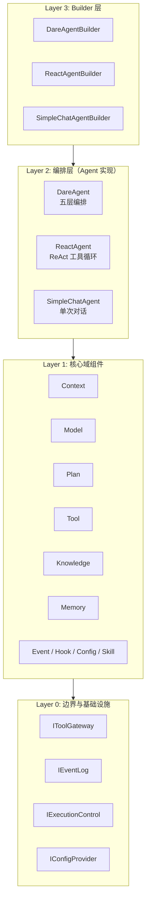

| 层级 | 职责 | 源码依据 |
|------|------|----------|
| **L3 Builder** | 链式配置，注入域组件，产出 Agent 实例 | agent/_internal/builder.py |
| **L2 编排** | 实现 IAgent.run()，决定执行流程（五层/ReAct/简单） | agent/_internal/five_layer.py, react_agent.py, simple_chat.py |
| **L1 域组件** | Context、Model、Plan、Tool、Knowledge、Memory 等可插拔实现 | 各 domain/_internal/ |
| **L0 边界** | 工具调用、事件、HITL、配置等系统契约 | tool/kernel, event/kernel, config/kernel |

### 1.3 数据流总览

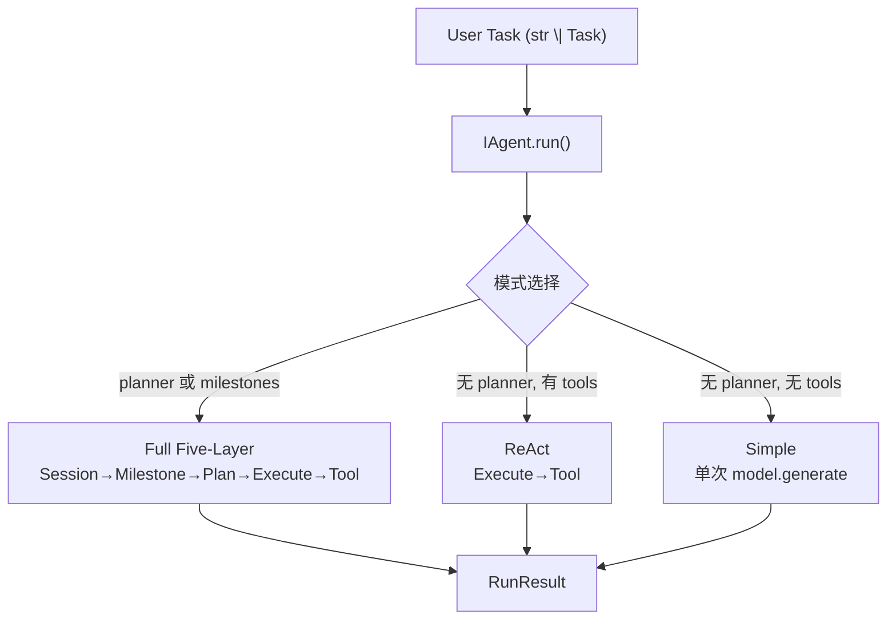

---

## 2. 架构详细说明

### 2.1 框架 vs Agent 实现

| 概念 | 说明 | 代表 |
|------|------|------|
| **框架** | 域接口（IContext、IModelAdapter、IPlanner、IToolGateway 等）、Builder、可插拔组件 | dare_framework/ 各 domain |
| **Agent 实现** | 具体编排策略，实现 IAgent.run() | DareAgent、ReactAgent、SimpleChatAgent |

DareAgent 使用框架提供的 Context、Plan、Tool、Model 等，实现五层循环；ReactAgent 仅用 Execute+Tool；SimpleChatAgent 仅用 Model。三者共享同一套域组件接口。

### 2.2 域组件依赖关系

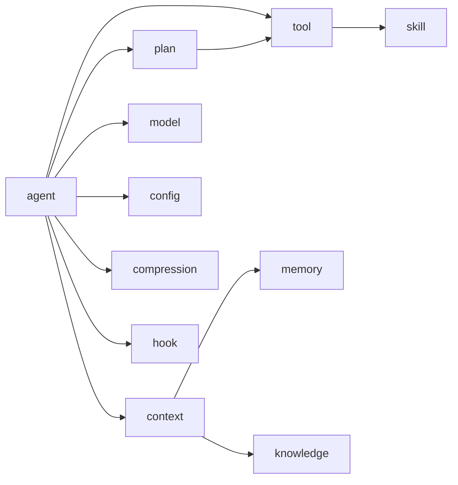

---

## 3. 模块说明

### 3.1 Agent 域

| 组件 | 路径 | 职责 |
|------|------|------|
| IAgent | agent/kernel.py | 运行时入口 `run(task) -> RunResult` |
| IAgentOrchestration | agent/interfaces.py | 可插拔编排策略 `execute(task) -> RunResult` |
| BaseAgent | agent/base_agent.py | 抽象基类，skill 挂载、_execute 抽象 |
| DareAgent | agent/_internal/five_layer.py | 五层编排实现（Session→Milestone→Plan→Execute→Tool） |
| ReactAgent | agent/_internal/react_agent.py | ReAct 工具循环实现 |
| SimpleChatAgent | agent/_internal/simple_chat.py | 单次对话实现 |
| DareAgentBuilder / ReactAgentBuilder / SimpleChatAgentBuilder | agent/_internal/builder.py | 分别产出上述三种 Agent |

### 3.2 Plan 域

| 组件 | 路径 | 职责 |
|------|------|------|
| Task / Milestone | plan/types.py | 任务与子目标结构 |
| ProposedPlan / ValidatedPlan | plan/types.py | 非可信规划与可信规划 |
| IPlanner / IValidator / IRemediator | plan/interfaces.py | 规划、校验、修复接口 |
| DefaultPlanner | plan/_internal/default_planner.py | LLM 证据型规划 |
| RegistryPlanValidator | plan/_internal/registry_validator.py | 基于能力注册表校验 |
| CompositeValidator | plan/_internal/composite_validator.py | 多校验器组合 |
| DefaultRemediator | plan/_internal/default_remediator.py | LLM 反思与调整 |
| IPlanAttemptSandbox / DefaultPlanAttemptSandbox | plan/interfaces, agent/_internal/sandbox.py | STM 快照/回滚 |

### 3.3 Context 域

| 组件 | 路径 | 职责 |
|------|------|------|
| IContext / IRetrievalContext | context/kernel.py | 上下文与检索契约 |
| Context | context/_internal/context.py | 默认实现：STM、Budget、assemble、listing_tools |
| AssembledContext / Message / Budget | context/types.py | 组装结果、消息、预算 |

### 3.4 Tool 域

| 组件 | 路径 | 职责 |
|------|------|------|
| IToolGateway / IToolManager | tool/kernel.py | 能力注册表、invoke 边界 |
| IExecutionControl | tool/kernel.py | HITL 控制 |
| ITool / IToolProvider | tool/interfaces.py | 工具与提供者 |
| ToolManager | tool/_internal/managers/tool_manager.py | 注册与调用实现 |
| CapabilityDescriptor / ToolResult | tool/types.py | 能力描述、执行结果 |

### 3.5 Model 域

| 组件 | 路径 | 职责 |
|------|------|------|
| IModelAdapter | model/kernel.py | 模型适配 `generate(model_input) -> ModelResponse` |
| ModelInput / ModelResponse | model/types.py | 输入输出结构 |

### 3.6 其他域（简要）

| 域 | 职责 |
|------|------|
| Config | Config、IConfigProvider、FileConfigProvider |
| Memory | IShortTermMemory、ILongTermMemory、InMemorySTM、RawDataLTM、VectorLTM |
| Knowledge | IKnowledge、RawDataKnowledge、VectorKnowledge、knowledge_get/add 工具 |
| Skill | persistent_skill_mode / auto_skill_mode、SearchSkillTool、SkillScriptRunner |
| Hook | HookPhase、HookExtensionPoint |
| Compression | compress_context、compress_context_llm_summary |
| MCP | MCPToolkit、load_mcp_toolkit、stdio/http transport |
| A2A | AgentCard、JSON-RPC tasks/send、Message 适配 |
| Observability | ITelemetryProvider、ObservabilityHook |

---

## 4. 设计原理

### 4.1 可插拔与分层

- **L3 Builder**：开发者通过链式 API 注入组件，不关心内部组装顺序。
- **L2 编排**：Agent 实现只依赖域接口（IContext、IModelAdapter、IPlanner 等），可替换。
- **L1 域组件**：各域独立实现接口，如替换 IPlanner、IValidator 不影响其他域。
- **L0 边界**：IToolGateway、IEventLog 等划定系统边界，便于审计与扩展。

### 4.2 可信与不可信分离

- ProposedPlan / ProposedStep 来自 LLM，不可信。
- ValidatedPlan / ValidatedStep 由 IValidator 基于能力注册表派生 risk_level 等，作为可信来源。
- RegistryPlanValidator 从 IToolGateway 获取能力列表，校验 capability_id 并覆盖安全字段。

### 4.3 状态隔离

- IPlanAttemptSandbox 对 STM 做快照/回滚/提交。
- 每次 milestone 尝试前快照，验证失败或遇到 plan tool 时回滚，保证失败不污染上下文。

---

## 5. 算法说明

### 5.1 上下文压缩（compression/core.py）

- **truncate**：保留最近 max_messages 条。
- **dedup_then_truncate**：先按 (role, content) 去重，再截断。
- **summary_preview**：较早消息折叠为一条 system 启发式摘要，保留最近若干条。
- **compress_context_llm_summary**：异步调用模型做语义摘要压缩。

### 5.2 计划校验（RegistryPlanValidator）

1. 从 IToolGateway 构建 capability_index（id/alias 映射）。
2. 遍历 plan.steps：capability_id 以 `plan:` 开头则直接通过；否则从注册表解析 capability，取 risk_level，构造 ValidatedStep。
3. 未知 capability 加入 errors，返回 ValidatedPlan(success=False)。

### 5.3 验证（FileExistsValidator 示例）

1. 从 plan.steps 的 params.expected_files 收集期望文件，若无则用构造时 expected_files。
2. 遍历期望文件，检查 workspace 内是否存在。
3. 缺失则 VerifyResult(success=False)；全存在则 VerifyResult(success=True)。

---

## 6. 流程图

### 6.1 Builder 构建流程

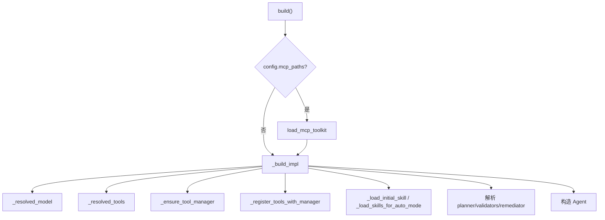

### 6.2 DareAgent 五层编排（一种编排策略）

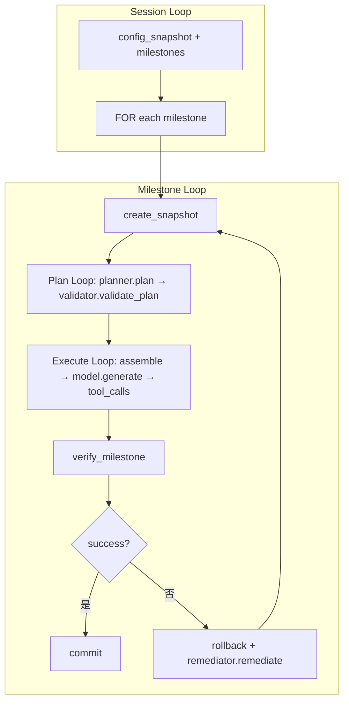

### 6.3 Execute Loop（通用）

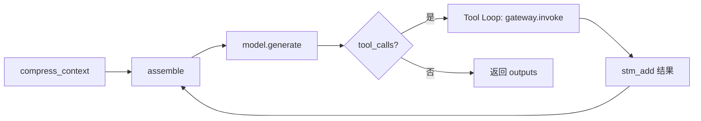

---

## 7. 类图

### 7.1 框架核心接口与编排实现

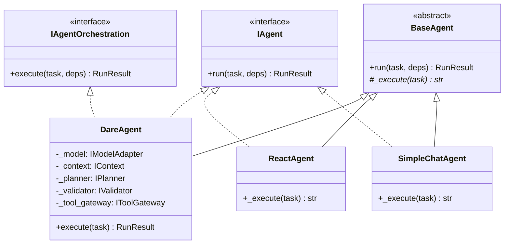

### 7.2 Plan 域接口与实现

### 7.3 Context 与 Tool 域

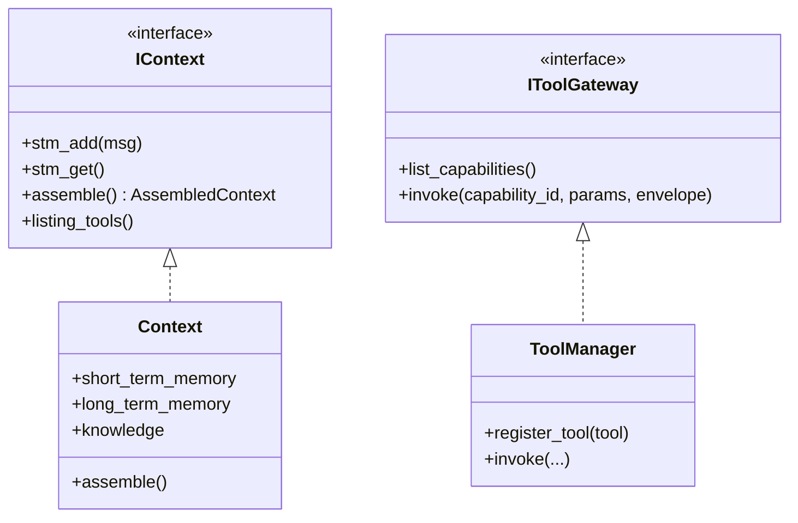

---

## 8. 时序图

### 8.1 Agent.run() 通用时序

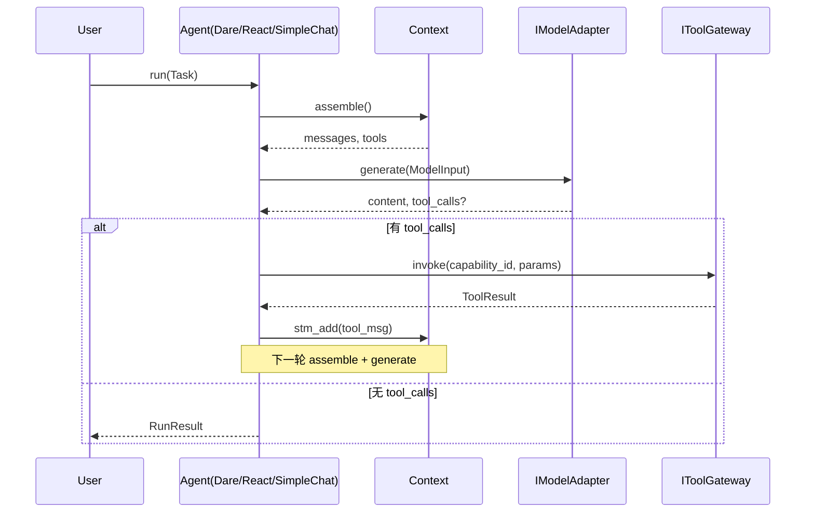

### 8.2 DareAgent 五层模式（Session→Milestone→Plan→Execute）

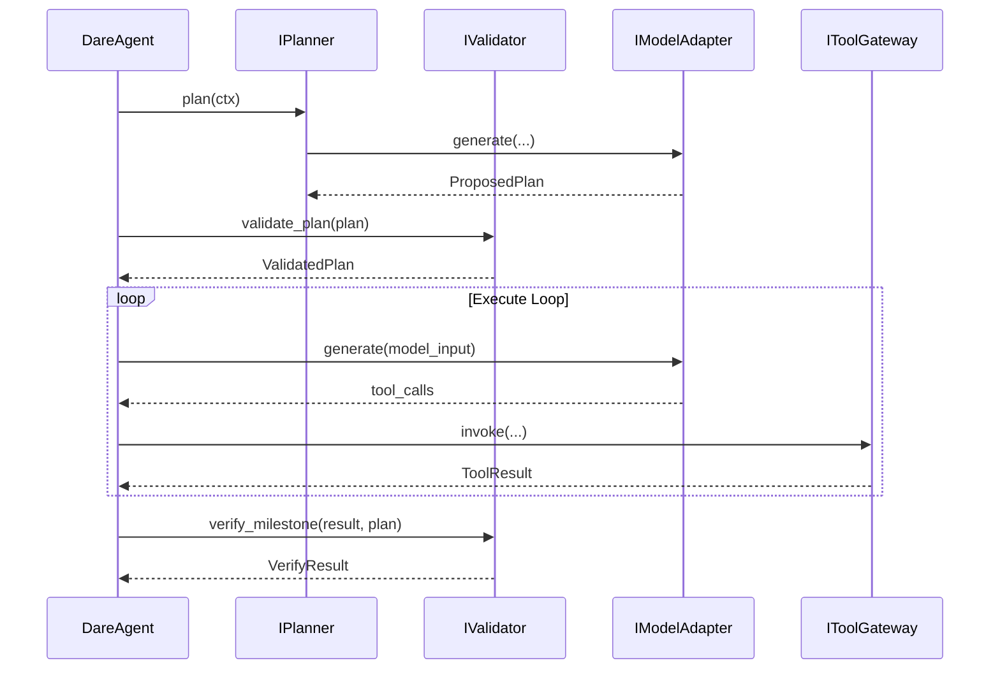

---

## 9. 状态图

### 9.1 Milestone 尝试状态

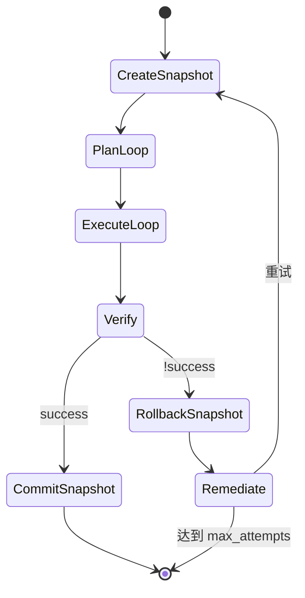

### 9.2 CLI 会话状态（示例 05）

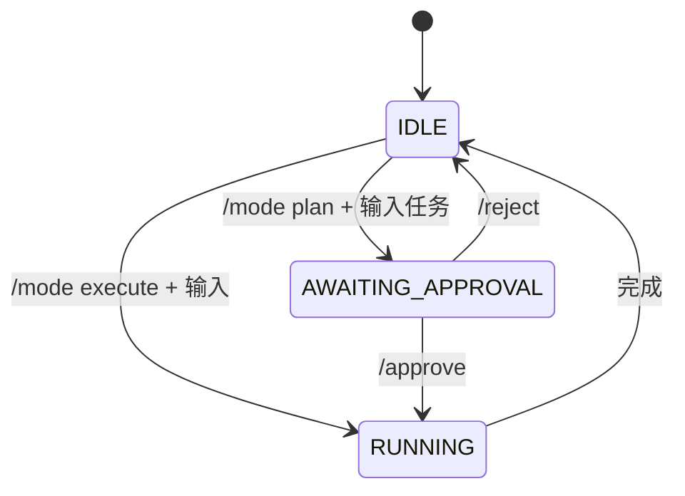

---

## 10. 示例：05-dare-coding-agent-enhanced

### 10.1 用途

示例展示**如何使用框架**组装一个编码 Agent：通过 DareAgentBuilder 注入 Model、Knowledge、Tools、Planner、Validator、Remediator、EventLog 等，产出 DareAgent 实例。

### 10.2 组件组装

| 组件 | 实现 |
|------|------|
| Model | OpenRouterModelAdapter |
| Tools | ReadFileTool, WriteFileTool, SearchCodeTool, RunCommandTool |
| Planner | DefaultPlanner |
| Validator | FileExistsValidator |
| Remediator | DefaultRemediator |
| Knowledge | RawDataKnowledge + InMemoryRawDataStorage |

### 10.3 FileExistsValidator 行为

- validate_plan：接受 ProposedPlan，转为 ValidatedPlan。
- verify_milestone：从 plan.steps 的 params.expected_files 提取期望文件，检查 workspace 内文件存在性。

---

## 11. PDF 导出说明

- **Typora**：打开后导出 PDF（支持 Mermaid）。
- **Pandoc**：`pandoc DARE_FRAMEWORK_DESIGN.md -o out.pdf --pdf-engine=xelatex -V CJKmainfont="SimSun"`。
- **VS Code + Markdown PDF**：右键导出 PDF。
- Mermaid 需支持 Mermaid 的渲染器；否则可先用 mermaid-cli 将图表渲染为图片再嵌入。

---

*基于 dare_framework 与 examples/05-dare-coding-agent-enhanced 源码分析。*
