# DARE Framework 设计文档（按 4-Part 结构）

> **范围与约束**
>
> - **仅基于源码分析**：`dare_framework/` 与 `examples/05-dare-coding-agent-enhanced/`
> - **不引用项目其他文档作为事实依据**（避免误导）
> - `DARE_FRAMEWORK_PPT_SOURCE.md` 仅作为**组织结构与表达方式**的轻量参考（内容仍以源码为准）
> - 目标输出：**Markdown 可导出 PDF**，包含架构说明、算法、设计原理、流程图/类图/时序图/状态图

---

## Part 1. 整体描述（框架是什么）

### 1.1 一句话定位

DARE Framework 是一个**可插拔的 Agent 运行时引擎**：用 Builder 将模型（Model）、上下文（Context）、工具（Tool）、规划与验证（Plan）、知识与记忆（Knowledge/Memory）、扩展点（Hook/Observability/Event）等组件组装成可运行的 Agent；框架自带两种典型“模版 Agent”（ReAct 与五层编排 Dare）。

### 1.2 核心设计原则（从源码归纳）

- **分层边界清晰**：Builder（装配）/ Agent（编排）/ 域组件（能力）/ Kernel（边界接口）。
- **可插拔**：Planner/Validator/Remediator/Tool/Memory/Knowledge/Model/Hook/MCP 都以接口或 provider 形式注入。
- **可信/不可信分离**：LLM 输出的计划为 Proposed（不可信），Validator 基于注册表派生 Validated（可信字段如 risk_level）。
- **预算与治理**：Context.Budget 统一做 tokens/cost/tool_calls/time 的 usage & check；Tool Loop 进一步按 Envelope 限制。
- **失败隔离**（五层模版）：milestone 尝试使用 STM 快照 sandbox；失败回滚，反思（remediator）不污染主上下文。

### 1.3 层次化模块框图（必须起手）

```
┌───────────────────────────────────────────────────────────────────────────────────────┐
│  Layer 3: Builder 层                                                                   │
│  ┌──────────────────┐ ┌──────────────────┐ ┌──────────────────┐                        │
│  │ DareAgentBuilder │ │ ReactAgentBuilder│ │SimpleChatAgent   │                        │
│  │                  │ │                  │ │Builder           │                        │
│  └──────────────────┘ └──────────────────┘ └──────────────────┘                        │
└───────────────────────────────────────────────────────────────────────────────────────┘
                                         │
                                         ▼
┌───────────────────────────────────────────────────────────────────────────────────────┐
│  Layer 2: 编排层（模版 Agent 实现）                                                    │
│  ┌─────────────┐ ┌─────────────┐ ┌─────────────┐                                       │
│  │  DareAgent  │ │ ReactAgent  │ │SimpleChat   │                                       │
│  │ 五层编排    │ │ ReAct循环   │ │Agent        │                                       │
│  └─────────────┘ └─────────────┘ └─────────────┘                                       │
└───────────────────────────────────────────────────────────────────────────────────────┘
                                         │
                                         ▼
┌───────────────────────────────────────────────────────────────────────────────────────┐
│  Layer 1: 可插拔域组件（模块）                                                         │
│  ┌──────────┐ ┌──────────┐ ┌──────────┐ ┌──────────┐ ┌──────────┐ ┌──────────┐        │
│  │ Context  │ │  Model   │ │   Plan   │ │   Tool   │ │Knowledge │ │  Memory  │        │
│  └──────────┘ └──────────┘ └──────────┘ └──────────┘ └──────────┘ └──────────┘        │
│  ┌──────────┐ ┌──────────┐ ┌──────────┐ ┌──────────┐ ┌──────────┐ ┌──────────┐        │
│  │  Event   │ │   Hook   │ │  Config  │ │  Skill   │ │Compression│ │ Embedding│        │
│  └──────────┘ └──────────┘ └──────────┘ └──────────┘ └──────────┘ └──────────┘        │
│  ┌──────────┐ ┌──────────┐ ┌──────────────┐ ┌──────────┐ ┌──────────┐                  │
│  │   MCP    │ │   A2A    │ │ Observability│ │ Security │ │  Infra   │                  │
│  └──────────┘ └──────────┘ └──────────────┘ └──────────┘ └──────────┘                  │
└───────────────────────────────────────────────────────────────────────────────────────┘
                                         │
                                         ▼
┌───────────────────────────────────────────────────────────────────────────────────────┐
│  Layer 0: Kernel 边界（稳定接口）                                                     │
│  ┌──────────────────┐ ┌──────────────────┐ ┌──────────────────┐ ┌──────────────────┐   │
│  │ IToolGateway     │ │ IEventLog        │ │ IExecutionControl│ │ IConfigProvider  │   │
│  │ IToolManager     │ │                  │ │                  │ │                  │   │
│  └──────────────────┘ └──────────────────┘ └──────────────────┘ └──────────────────┘   │
│  ┌──────────────────┐ ┌──────────────────┐                                              │
│  │ITelemetryProvider│ │ISessionSummaryStore│                                            │
│  └──────────────────┘ └──────────────────┘                                              │
└───────────────────────────────────────────────────────────────────────────────────────┘
```

**Mermaid 版本（便于渲染到 PDF）：**

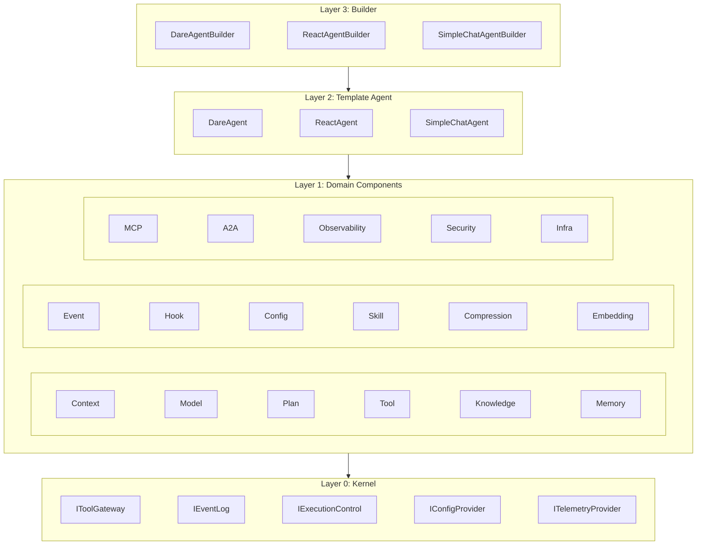

---

## Part 2. 两种模版 Agent（React 与 Dare）

> 本 Part 只讲“模版编排”，不把它等同于框架整体架构。框架的模块能力在 Part 3/4 讲。

### 2.1 React 模版 Agent（`ReactAgent`）

#### 2.1.1 设计思想

- 适用：**无需显式规划与验证**、以“模型决定下一步工具调用”为主的交互任务。
- 目标：最短链路实现“模型↔工具”的循环，降低编排复杂度。

#### 2.1.2 设计方案（执行循环）

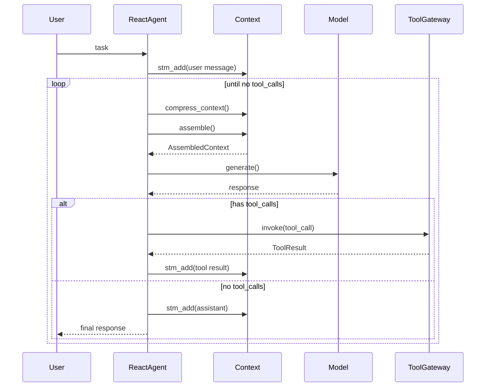

#### 2.1.3 要点说明

| 项目 | 说明 |
|------|------|
| **输入** | 用户 task（str） |
| **输出** | str（最终模型回复）/（或由上层包装 RunResult） |
| **关键步骤** | assemble→generate→tool_calls→invoke→写回 STM→下一轮 |
| **上下游衔接** | 上游：ReactAgentBuilder 注入 model/context/tools；下游：IToolGateway.invoke、Context.assemble |
| **扩展点** | 自定义 tools、压缩策略、max_tool_rounds；替换 ModelAdapter |

### 2.2 Dare 模版 Agent（`DareAgent` 五层编排）

#### 2.2.1 设计思想

- 适用：需要**可审计、可验证、可重试**的复杂任务（例如“多里程碑交付”、“带证据验收”）。
- 核心：把“任务生命周期”拆成五层循环，使规划/执行/验证/修复各自可插拔。

#### 2.2.2 设计方案（五层循环）

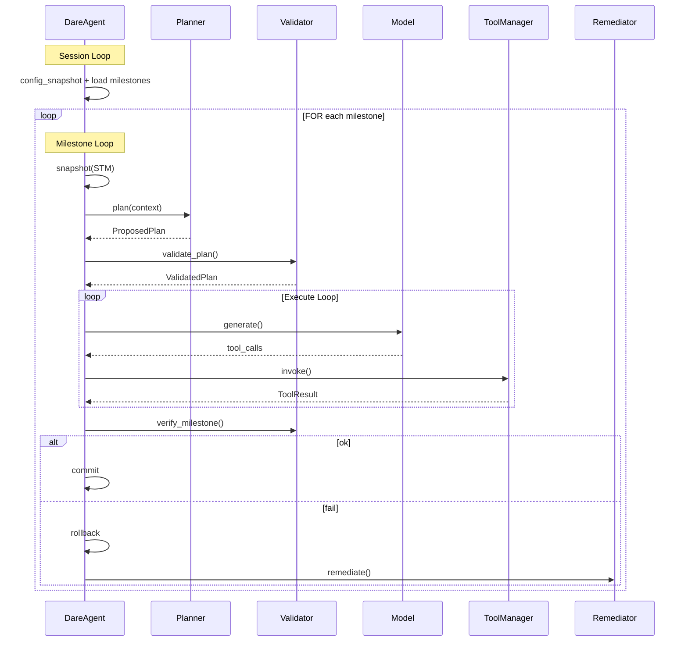

#### 2.2.3 要点说明

| 项目 | 说明 |
|------|------|
| **输入** | Task（可带 milestones；可带 previous_session_summary） |
| **输出** | RunResult（含 session_summary 可选持久化） |
| **关键步骤** | Session：配置快照+milestone 来源（task/planner.decompose/default）；Milestone：sandbox 隔离+计划重试+执行迭代+验证+修复反思 |
| **上下游衔接** | 上游：DareAgentBuilder 注入 planner/validator/remediator/tool_gateway/hooks/telemetry/event_log；下游：Context.assemble、Model.generate、Tool.invoke、Validator.verify |
| **扩展点** | 替换 planner/validator/remediator；实现 IPlanAttemptSandbox；增加 HookPhase 消费者；ExecutionControl 做 HITL |

### 2.3 两种模版对比（何时用哪个）

| 维度 | React 模版 | Dare 模版 |
|------|------------|-----------|
| **规划** | 无显式 Plan Loop | 有 Plan Loop（IPlanner + IValidator） |
| **验证/验收** | 通常靠模型自洽 | Verify Loop（IValidator.verify_milestone） |
| **失败隔离** | 仅上下文压缩 | sandbox 快照回滚，失败不污染 |
| **审计与观测** | 可选 | Hook + EventLog + Telemetry 更体系化 |
| **适用** | 轻量工具循环 | 复杂交付、多阶段、多证据 |

---

## Part 3. 在模版 Agent 上挂载外部支持（MCP/Skill/Knowledge/Model/Hook/Tool/Memory）

> 本 Part 讲“如何挂载能力”，让模版 Agent 变成可用的业务 Agent。示例主要参考 `examples/05-dare-coding-agent-enhanced/cli.py` 的组装方式。

### 3.1 MCP（Model Context Protocol）挂载

#### 工作逻辑图

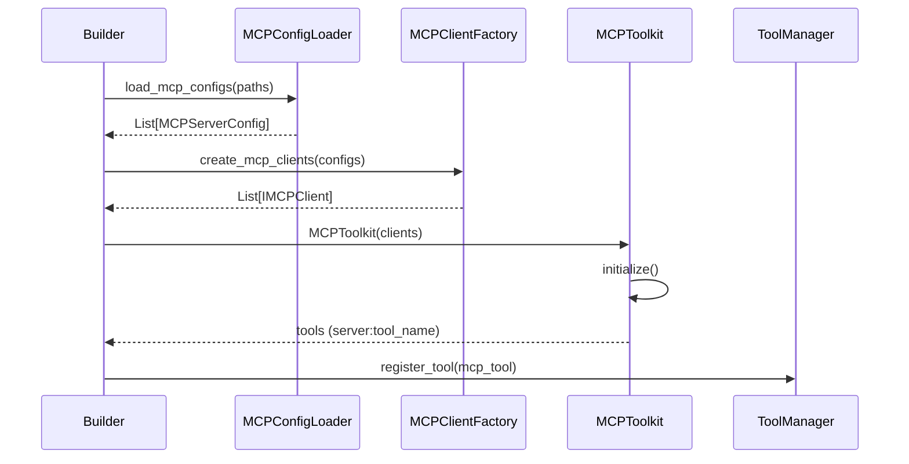

#### 要点说明

| 项目 | 说明 |
|------|------|
| **输入** | Config.mcp_paths（扫描目录）；Config.allowmcps（白名单） |
| **输出** | MCPToolkit（IToolProvider）供 Builder 合并进工具集合 |
| **关键步骤** | 支持 json/yaml/md（代码块抽取）；transport stdio/http；grpc 未实现会报错 |
| **上下游衔接** | 上游：Builder.build()；下游：ToolManager 注册 MCPTool（server:tool） |
| **扩展点** | 新 transport；自定义 IMCPClient；增强通知通道（当前 http 默认关闭 SSE） |

### 3.2 Skill 挂载（两种模式）

#### 工作逻辑图（persistent vs auto）

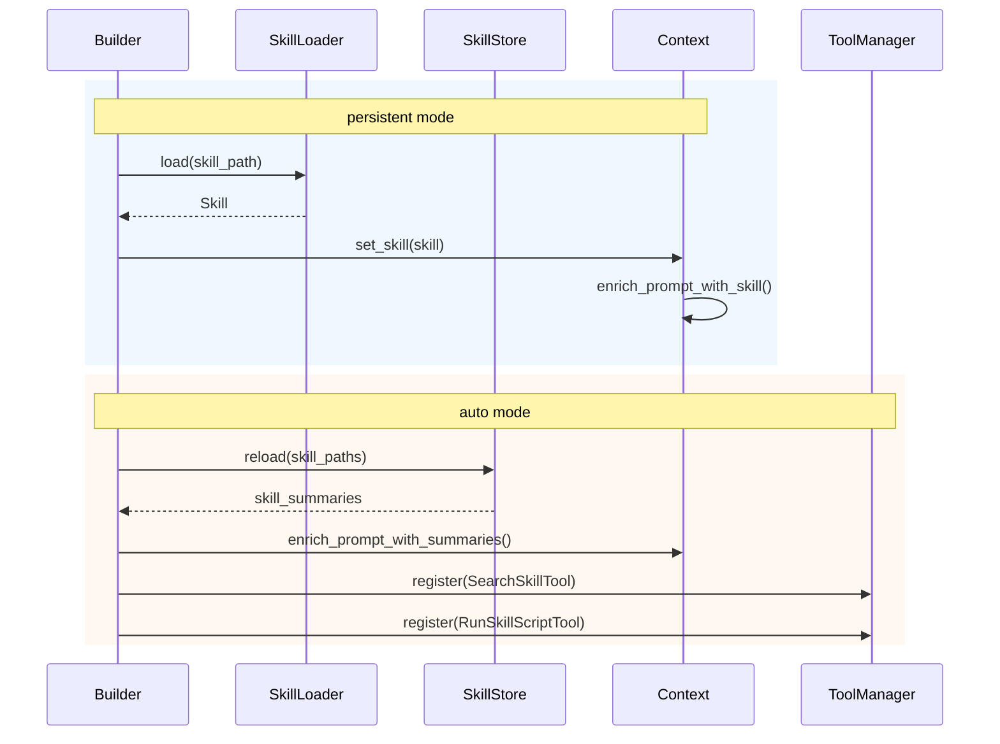

#### 要点说明

| 项目 | 说明 |
|------|------|
| **输入** | persistent：单 skill path；auto：skill_paths（目录） |
| **输出** | persistent：prompt 含完整 skill；auto：prompt 含摘要+工具按需加载 |
| **关键步骤** | SearchSkillTool 将完整 Skill 注入 Context；SkillScriptRunner 执行 scripts/ |
| **上下游衔接** | 上游：Builder；下游：Context.assemble、ToolManager.invoke |
| **扩展点** | ISkillLoader/ISkillSelector；脚本执行隔离策略 |

### 3.3 Knowledge 挂载（rawdata / vector）

#### 工作逻辑图

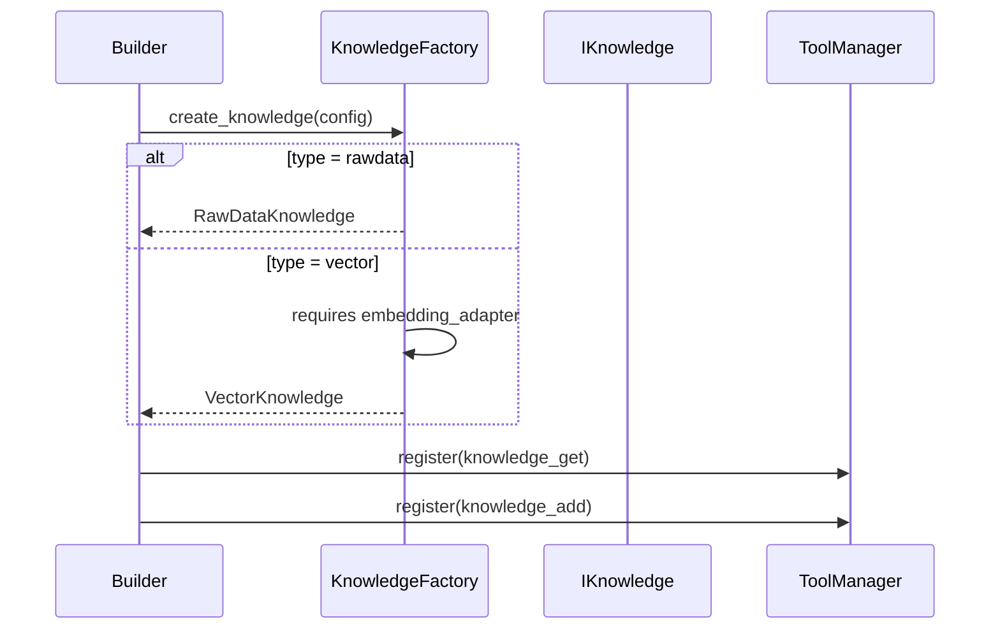

#### 要点说明

| 项目 | 说明 |
|------|------|
| **输入** | Config.knowledge；（vector 需 embedding_adapter） |
| **输出** | IKnowledge；并自动暴露 knowledge_get / knowledge_add 工具 |
| **关键步骤** | Builder._register_tools_with_manager() 在 knowledge 存在时注册工具 |
| **上下游衔接** | 上游：Builder.with_knowledge 或 config 驱动；下游：ToolManager.invoke、模型工具调用 |
| **扩展点** | 新 IKnowledge 实现；自定义 storage/vector_store |

### 3.4 Model 挂载（模型适配 + Prompt 叠加）

#### 工作逻辑图

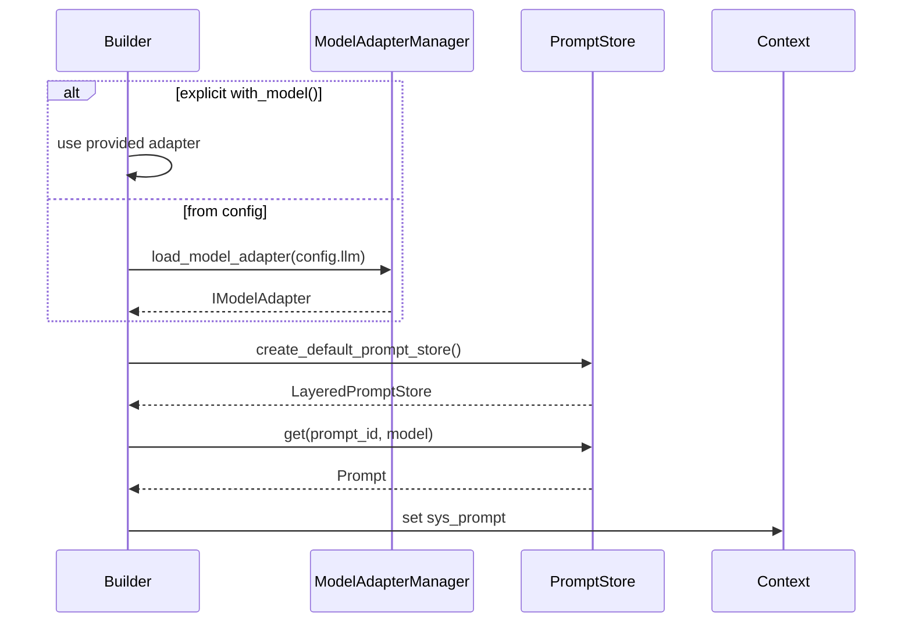

#### 要点说明

| 项目 | 说明 |
|------|------|
| **输入** | Config.llm 或显式 with_model；prompt_store_path_pattern |
| **输出** | IModelAdapter；sys_prompt（Prompt） |
| **关键步骤** | prompt_id：override → config.default_prompt_id → base.system；LayeredPromptStore 叠加优先级 |
| **上下游衔接** | 上游：Builder；下游：Agent Execute Loop 调用 model.generate |
| **扩展点** | 新 ModelAdapter；新 PromptLoader；更复杂的 prompt 组合策略 |

### 3.5 Hook 挂载（生命周期扩展）

#### 工作逻辑图

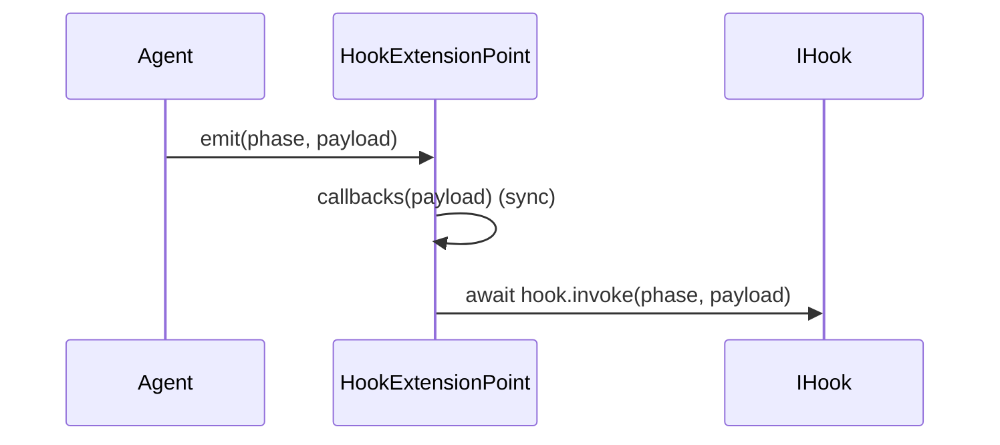

#### 要点说明

| 项目 | 说明 |
|------|------|
| **输入** | HookPhase + payload（含 budget_stats/token_usage/duration 等） |
| **输出** | best-effort（不阻断执行） |
| **关键步骤** | callbacks 同步；IHook 异步；异常仅日志 |
| **上下游衔接** | 上游：DareAgent 执行期间发射；下游：ObservabilityHook、审计/审批 hook |
| **扩展点** | IHookManager（config-driven）；自定义阶段 payload 结构 |

### 3.6 Tool 挂载（注册表 + 内置工具 + 执行边界）

#### 工作逻辑图（ToolManager 注册与调用）

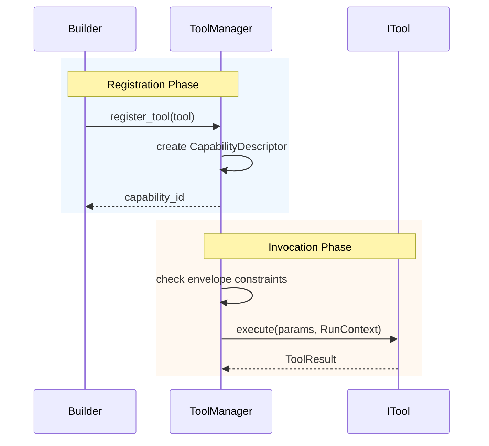

#### 要点说明

| 项目 | 说明 |
|------|------|
| **输入** | ITool（native）、MCPTool、auto-skill tools |
| **输出** | list_tool_defs（给模型）、ToolResult（回写 STM） |
| **关键步骤** | 注册表为可信来源；envelope.allowed_capability_ids 控制调用边界；risk_level/approval 由 registry metadata 给出 |
| **上下游衔接** | 上游：Builder._resolved_tools；下游：Agent Tool Loop |
| **扩展点** | IExecutionControl 实现 HITL；新增 tool provider；增强 schema 校验 |

### 3.7 Memory 挂载（STM/LTM）

#### 工作逻辑图

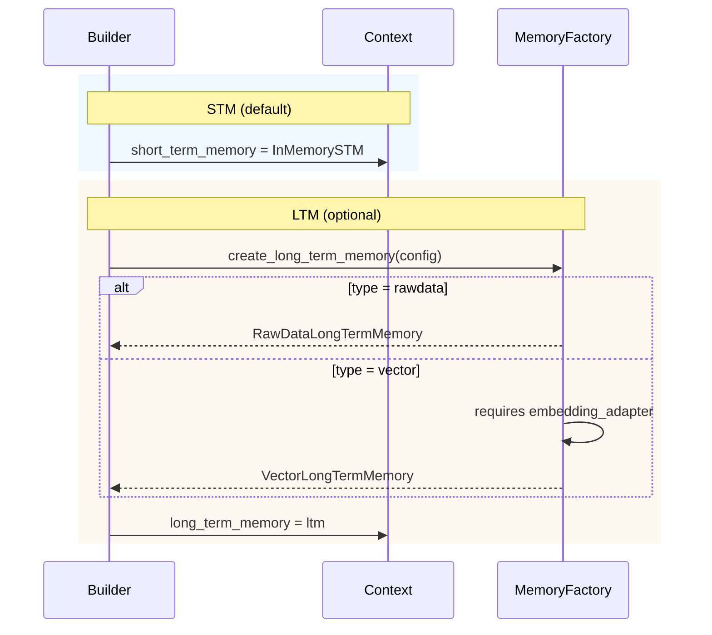

#### 要点说明

| 项目 | 说明 |
|------|------|
| **输入** | Config.long_term_memory；（vector 需 embedding_adapter） |
| **输出** | ILongTermMemory；STM 作为会话消息容器 |
| **关键步骤** | STM 负责“对话历史”；LTM 负责“跨会话检索与持久化” |
| **上下游衔接** | 上游：Builder 注入；下游：Context 持有（默认 assemble 不自动检索） |
| **扩展点** | 自定义 LTM 检索/写回策略；不同存储后端 |

---

## Part 4. 每个模块的详细设计（思想/方案/流程图）

> 本 Part 对应“模块级设计说明”。每个模块固定模板：**设计思想** → **设计方案** → **工作逻辑图** → **要点说明** → **扩展点**。

### 4.1 infra（组件身份）

#### 设计思想

用统一的 `IComponent`（name + component_type）让 Config/Builder 能跨域对组件进行 enable/disable 与 per-component 配置。

#### 设计方案

- `ComponentType` 枚举定义“组件类别”。
- `Config.components[component_type]` 中维护 disabled 与 entries，提供过滤能力。

#### 工作逻辑图

```
Config.is_component_enabled(component)
  └─► component_settings(component.component_type).disabled 不包含 component.name
```

#### 要点说明

| 项目 | 说明 |
|------|------|
| **输入** | component.name、component.component_type |
| **输出** | bool（enabled/disabled） |
| **上下游** | 上游：各域组件实现 IComponent；下游：Builder 过滤/读取配置 |
| **扩展点** | 扩展 ComponentType；增加更细粒度配置策略 |

### 4.2 agent（编排域）

#### 设计思想

把“如何跑任务”抽象成编排（Agent 实现），而非把某个 Agent 等同于框架架构；三种实现共享 Context/Model/Tool 等域组件。

#### 设计方案

- `IAgent.run()` 为统一入口，支持 `str | Task`。
- `DareAgent.execute()` 内部自动模式选择：Full/ReAct/Simple。
- `SessionState/MilestoneState` 保存确定性的运行状态与证据。

#### 工作逻辑图（五层模版）

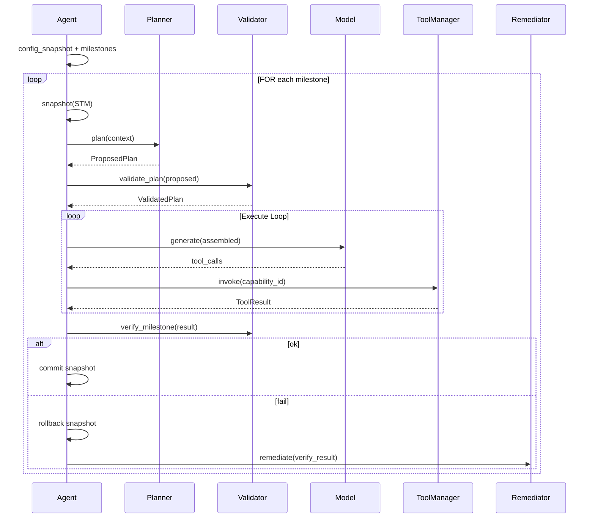

#### 要点说明

| 项目 | 说明 |
|------|------|
| **输入/输出** | 输入 Task/str；输出 RunResult + optional SessionSummary |
| **关键步骤** | sandbox 快照隔离；budget_check；hook/event/telemetry best-effort |
| **扩展点** | IAgentOrchestration、IPlanAttemptSandbox、ISessionSummaryStore、IStepExecutor |

### 4.3 plan（规划/校验/修复域）

#### 设计思想

规划来自模型是**不可信**的；可信字段必须由 Validator 从注册表（ToolManager/IToolGateway）派生，避免 LLM 注入风险。

#### 设计方案

- `DefaultPlanner` 生成“证据型” ProposedPlan（capability_id 为 evidence 类型或计划工具）。
- `RegistryPlanValidator` 校验能力存在性并派生 risk_level。
- `DefaultRemediator` 对 VerifyResult 做元认知反思，指导下一次尝试。

#### 工作逻辑图

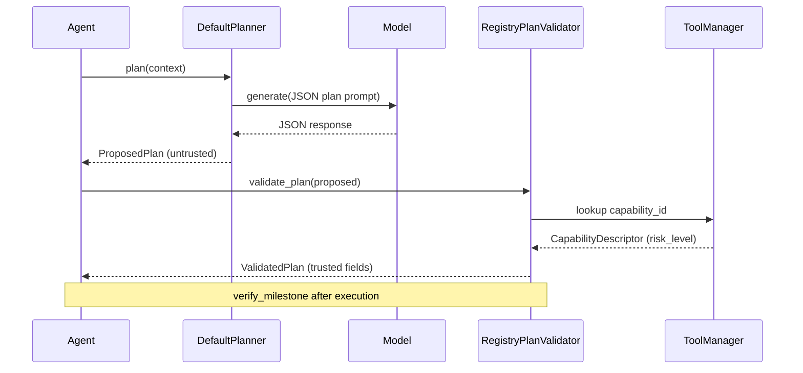

#### 要点说明

| 项目 | 说明 |
|------|------|
| **输入/输出** | Proposed→Validated；RunResult→VerifyResult；VerifyResult→reflection |
| **关键步骤** | capability_index（id/alias）解析；覆盖 planner 产出的安全字段 |
| **扩展点** | 自定义证据 schema；多 validator 组合；替换 remediator prompt |

### 4.4 context（上下文域）

#### 设计思想

Context 是“引用聚合器”（STM/LTM/Knowledge/Budget/Tools/Prompt），在每次模型调用前**按需 assemble**，避免把上下文耦死在 Agent 内。

#### 设计方案

- STM 默认 InMemorySTM，可替换。
- `listing_tools()` 优先走 ToolManager.list_tool_defs 输出模型可用 schema。
- Skill 在 persistent 模式 build 时合并；auto 模式运行时合并。

#### 工作逻辑图

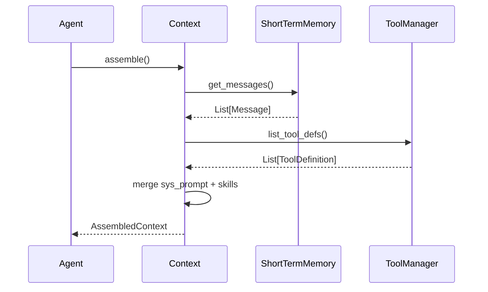

#### 要点说明

| 项目 | 说明 |
|------|------|
| **输入/输出** | 输入 STM/技能/工具；输出 AssembledContext |
| **关键步骤** | budget_check 在 Agent 中触发；compress 统一转发 compression.compress_context |
| **扩展点** | assemble 拼接 LTM/Knowledge 的策略（当前默认不自动检索） |

### 4.5 tool（工具域）

#### 设计思想

ToolManager 是“可信能力注册表 + 调用边界”，模型只能看到工具定义，真实执行必须经过 invoke 边界与 envelope 约束。

#### 设计方案

- `register_tool()` 生成 CapabilityDescriptor（含 risk_level、requires_approval、kind）。
- `invoke()` 对 allowed_capability_ids 做边界约束，执行 ITool.execute。
- MCPToolkit 将远程工具包装成 ITool，并纳入统一注册表。

#### 工作逻辑图

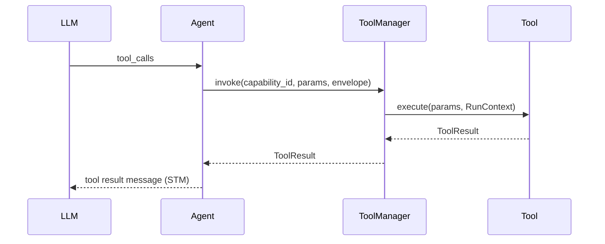

#### 要点说明

| 项目 | 说明 |
|------|------|
| **输入/输出** | ToolDefinition 给模型；ToolResult 回写 STM |
| **关键步骤** | 风险元数据由 registry 提供；HITL 通过 IExecutionControl（框架预留） |
| **扩展点** | 新 ITool；新增 provider；新增执行控制策略 |

### 4.6 model（模型域）

#### 设计思想

把“模型调用”收敛到 IModelAdapter.generate；Prompt 采用 layered store，避免业务代码硬编码 prompt。

#### 设计方案

- OpenRouter/OpenAI 两种 adapter；DefaultModelAdapterManager 基于 Config.llm 装配。
- PromptStore 叠加 workspace/user/builtin。

#### 工作逻辑图

```
Context.assemble() -> ModelInput(messages, tools)
IModelAdapter.generate(ModelInput) -> ModelResponse(content, tool_calls, usage)
```

#### 要点说明

| 项目 | 说明 |
|------|------|
| **输入/输出** | 输入 ModelInput + options；输出 ModelResponse |
| **关键步骤** | tool_defs 作为 tools 输入模型；usage 计入预算（由 Agent 记录） |
| **扩展点** | 新 adapter；prompt 版本管理 |

### 4.7 config（配置域）

#### 设计思想

配置分层（user/workspace），且以 JSON 为主，减少“运行目录不一致”带来的歧义；默认自动创建空配置文件。

#### 设计方案

- `FileConfigProvider`：user_layer 与 workspace_layer 深合并；补齐 workspace_dir/user_dir。
- `Config`：承载 llm、mcp、allowlists、skill_mode、observability 等。

#### 工作逻辑图

```
_load_layer(user) + _load_layer(workspace) -> _deep_merge -> Config.from_dict
```

### 4.8 memory（记忆域）

#### 设计思想

STM = 会话历史容器；LTM = 跨会话检索/持久化。vector LTM 依赖 embedding。

#### 设计方案

- InMemorySTM 列表存储+compress。
- RawDataLongTermMemory：substring 检索（无 embedding）。
- VectorLongTermMemory：embedding + vector_store 相似检索。

### 4.9 knowledge（知识域）

#### 设计思想

知识以 IRetrievalContext 的方式注入 Context；并通过工具暴露给模型，让模型自己决定何时调用。

#### 设计方案

- RawDataKnowledge / VectorKnowledge 双实现。
- Builder 自动注册 knowledge_get/add 工具（可信工具）。

### 4.10 skill（技能域）

#### 设计思想

技能用于“系统提示增强 + 可运行脚本”；auto 模式避免把全部技能全文塞进 prompt。

#### 设计方案

- SkillStore + SearchSkillTool：按需加载全文。
- SkillScriptRunner：统一脚本执行入口。

### 4.11 compression（压缩域）

#### 设计思想

压缩策略集中管理，避免各 Agent 实现自写截断逻辑导致不可控差异；提供无 LLM 与 LLM 两种压缩层级。

#### 设计方案

- truncate/dedup/summary_preview（同步轻量）
- llm_summary（异步语义摘要）

### 4.12 hook（Hook 域）

#### 设计思想

Hook 是 best-effort，默认不允许 hook 失败阻断执行；用于审计/观测/审批等横切能力。

#### 设计方案

- HookExtensionPoint 分发 callbacks + hooks（异步）。
- HookPhase 定义生命周期阶段。

### 4.13 event（事件域）

#### 设计思想

事件日志是 WORM 审计与重放的基座；运行时将关键事件写入 IEventLog。

#### 设计方案

- IEventLog.append/query/replay/verify_chain
- observability.event_trace_bridge 可为事件追加 trace 信息

### 4.14 embedding（嵌入域）

#### 设计思想

Embedding 独立为接口，以便 VectorKnowledge/VectorLTM 共享，并替换为不同厂商/自建向量模型。

#### 设计方案

- OpenAIEmbeddingAdapter（LangChain）

### 4.15 mcp（MCP 域）

#### 设计思想

MCP 提供“远程工具扩展”能力，以 tool provider 形式被 Builder 合并，保持 ToolManager 统一注册表语义。

#### 设计方案

- MCPConfigLoader 扫描配置文件；MCPClientFactory 创建 transport；MCPToolkit 包装成 IToolProvider。

### 4.16 a2a（Agent-to-Agent 域）

#### 设计思想

A2A 将 Agent 以标准协议暴露为服务：AgentCard 做发现，JSON-RPC 做任务提交与获取结果，artifact 支持文本/文件。

#### 设计方案

- server: create_a2a_app + handlers(tasks/send/get/cancel)
- client: discover_agent_card + A2AClient

### 4.17 observability（观测域）

#### 设计思想

用 Hook 驱动观测：Agent 发射 HookPhase，ObservabilityHook 在统一位置生成 span/metric，避免业务代码散落埋点。

#### 设计方案

- OTelTelemetryProvider（OTLP/Console）；NoOpTelemetryProvider
- ObservabilityHook 监听 BEFORE/AFTER_* 生命周期

### 4.18 security（安全域）

#### 设计思想

风险等级与审批等信息应来自可信注册表与策略层，而非模型输出；安全域提供 taxonomy 与占位结构供后续扩展。

#### 设计方案

- RiskLevel/PolicyDecision/TrustedInput/SandboxSpec 类型
- RegistryPlanValidator + ToolManager metadata 作为 risk_level 派生来源

---

## 附：示例 05（如何用 Dare 模版组装一个 coding agent）

`examples/05-dare-coding-agent-enhanced/cli.py` 展示了完整装配链路：

- 注入 **Model**：OpenRouterModelAdapter
- 注入 **Tools**：ReadFileTool/WriteFileTool/SearchCodeTool/RunCommandTool
- 注入 **Planner/Validator/Remediator**：DefaultPlanner + FileExistsValidator + DefaultRemediator
- 注入 **Knowledge**：RawDataKnowledge（并自动暴露 knowledge_get/add 工具）
- 注入 **Config**：FileConfigProvider（自动加载 MCP/skill_mode 等）

---

## PDF 导出建议

- **Typora**：渲染 Mermaid 更省事，导出 PDF 直接可用
- **Pandoc + XeLaTeX**：适合自动化流水线：`pandoc docs/DARE_FRAMEWORK_DESIGN.md -o out.pdf --pdf-engine=xelatex -V CJKmainfont=\"SimSun\"`

