# 框架设计文档

> 基于 `dare_framework/` 与 `examples/05-dare-coding-agent-enhanced/` 源码分析，可稍参考 DARE_FRAMEWORK_PPT_SOURCE.md。供导出 PDF 使用。

---

## 1. 框架整体架构

### 1.1 定位

本框架是一个**可插拔的 Agent 运行时引擎**：通过 Builder 组装 Context、Model、Plan、Tool、Knowledge、Memory 等域组件，产出多种编排策略的 Agent（如 DareAgent 五层编排、ReactAgent、SimpleChatAgent）。DareAgent 仅是其中一种**模板 Agent 实现**，不代表整个架构。

### 1.2 四层组件结构

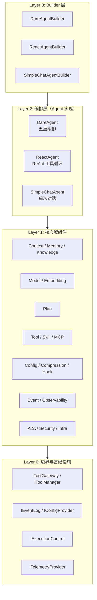

| 层级 | 职责 | 源码依据 |
|------|------|----------|
| **L3 Builder** | 链式配置，注入域组件，产出 Agent 实例 | agent/_internal/builder.py |
| **L2 编排** | 实现 IAgent.run()，决定执行流程（五层/ReAct/简单） | agent/_internal/five_layer.py, react_agent.py, simple_chat.py |
| **L1 域组件** | Context、Model、Plan、Tool、Knowledge、Memory 等可插拔实现 | 各 domain/_internal/ |
| **L0 边界** | 工具调用、事件、HITL、配置等系统契约 | tool/kernel, event/kernel, config/kernel |

### 1.3 数据流总览

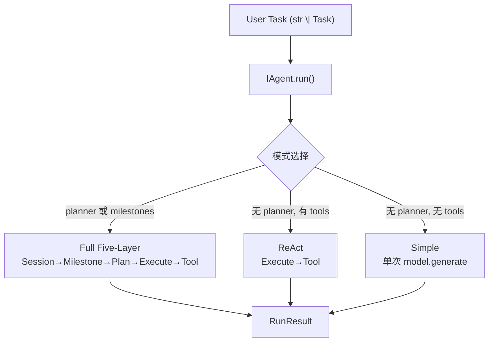

---

## 2. 架构详细说明

### 2.1 框架 vs Agent 实现

| 概念 | 说明 | 代表 |
|------|------|------|
| **框架** | 域接口（IContext、IModelAdapter、IPlanner、IToolGateway 等）、Builder、可插拔组件 | dare_framework/ 各 domain |
| **Agent 实现** | 具体编排策略，实现 IAgent.run() | DareAgent、ReactAgent、SimpleChatAgent |

DareAgent 使用框架提供的 Context、Plan、Tool、Model 等，实现五层循环；ReactAgent 仅用 Execute+Tool；SimpleChatAgent 仅用 Model。三者共享同一套域组件接口。

### 2.2 域组件依赖关系

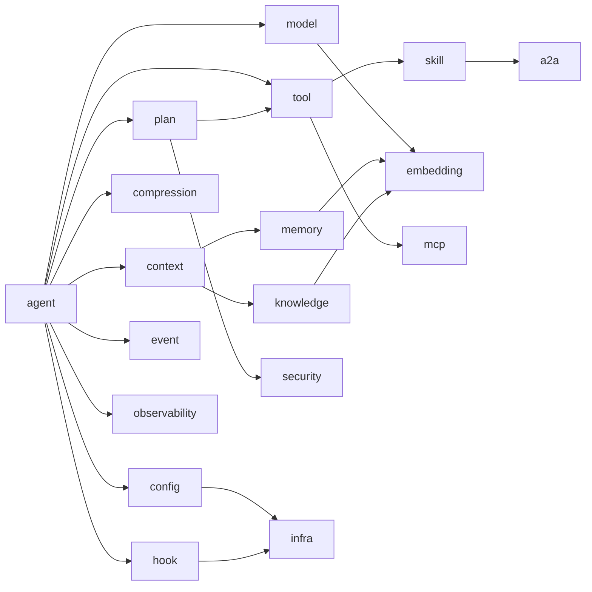

---

## 3. 模块说明（完整版）

### 3.1 infra（基础设施）

跨域组件身份契约，供配置与编排代码统一识别可插拔组件。

| 组件 | 路径 | 职责 |
|------|------|------|
| ComponentType | infra/component.py | 枚举：PLANNER、VALIDATOR、REMEDIATOR、MEMORY、MODEL_ADAPTER、TOOL、SKILL、MCP、HOOK、PROMPT、TELEMETRY |
| IComponent | infra/component.py | 协议：name、component_type，用于 config.is_component_enabled() 等 |

### 3.2 agent（Agent 域）

| 组件 | 路径 | 职责 |
|------|------|------|
| **接口** | | |
| IAgent | agent/kernel.py | 运行时入口 `run(task: str \| Task, deps) -> RunResult` |
| IAgentOrchestration | agent/interfaces.py | 可插拔编排策略 `execute(task, deps) -> RunResult` |
| ISessionSummaryStore | agent/types.py | 会话摘要持久化 `save(SessionSummary)` |
| **基类与实现** | | |
| BaseAgent | agent/base_agent.py | 抽象基类，提供 set_skill/clear_skill/current_skill、run 委托 _execute |
| DareAgent | agent/_internal/five_layer.py | 五层编排：Session→Milestone→Plan→Execute→Tool；支持 ReAct/Simple 降级 |
| ReactAgent | agent/_internal/react_agent.py | ReAct 工具循环：assemble→model.generate→tool_calls→gateway.invoke |
| SimpleChatAgent | agent/_internal/simple_chat.py | 单次对话：assemble→model.generate，无工具循环 |
| **Builder** | | |
| DareAgentBuilder / ReactAgentBuilder / SimpleChatAgentBuilder | agent/_internal/builder.py | 链式配置 with_model/add_tools/with_planner 等，产出对应 Agent |
| **内部** | | |
| SessionState / MilestoneState / SessionContext | agent/_internal/orchestration.py | 会话与里程碑状态；current_milestone_state、attempts、reflections、evidence_collected |
| DefaultPlanAttemptSandbox | agent/_internal/sandbox.py | IPlanAttemptSandbox：create_snapshot/rollback/commit，STM 快照隔离 |
| session_summary_store | agent/_internal/session_summary_store.py | ISessionSummaryStore 默认实现 |
| step_executor | agent/_internal/step_executor.py | IStepExecutor，step_driven 模式 |

### 3.3 plan（Plan 域）

| 组件 | 路径 | 职责 |
|------|------|------|
| **类型** | | |
| Task | plan/types.py | description、task_id、milestones、previous_session_summary；to_milestones() |
| Milestone | plan/types.py | milestone_id、description、success_criteria |
| ProposedPlan / ProposedStep | plan/types.py | 非可信规划（来自 LLM） |
| ValidatedPlan / ValidatedStep | plan/types.py | 可信规划，含 risk_level（来自注册表） |
| VerifyResult / Evidence | plan/types.py | 验证结果；Evidence 含 evidence_id、evidence_type、source、data |
| DecompositionResult / RunResult / Envelope / ToolLoopRequest | plan/types.py | 任务分解结果；运行结果；工具调用边界 |
| **接口** | | |
| IPlanner | plan/interfaces.py | plan(ctx)→ProposedPlan；decompose(task, ctx)→DecompositionResult |
| IValidator | plan/interfaces.py | validate_plan(plan, ctx)→ValidatedPlan；verify_milestone(result, ctx, plan)→VerifyResult |
| IRemediator | plan/interfaces.py | remediate(verify_result, ctx)→str（反思文本） |
| IPlanAttemptSandbox | plan/interfaces.py | create_snapshot/rollback/commit |
| IStepExecutor / IEvidenceCollector | plan/interfaces.py | 单步执行；证据收集 |
| **实现** | | |
| DefaultPlanner | plan/_internal/default_planner.py | LLM 证据型规划，DEFAULT_PLAN_SYSTEM_PROMPT，_parse_response/_fallback_plan |
| RegistryPlanValidator | plan/_internal/registry_validator.py | 基于 IToolGateway 能力列表校验 capability_id，派生 risk_level |
| CompositeValidator | plan/_internal/composite_validator.py | 多校验器顺序执行，失败即返回 |
| DefaultRemediator | plan/_internal/default_remediator.py | LLM 反思，DEFAULT_REFLECT_SYSTEM_PROMPT，_fallback_reflection |

### 3.4 context（Context 域）

| 组件 | 路径 | 职责 |
|------|------|------|
| **接口** | | |
| IContext | context/kernel.py | id、short_term_memory、long_term_memory、knowledge、budget、config；stm_add/stm_get/stm_clear；budget_use/budget_check/budget_remaining；listing_tools；assemble；compress；config_update |
| IRetrievalContext | context/kernel.py | get(query, **kwargs)→list[Message]，STM/LTM/Knowledge 统一检索 |
| **实现** | | |
| Context | context/_internal/context.py | 默认实现；_tool_provider、_sys_prompt、_current_skill、_loaded_full_skills；assemble 合并 sys_prompt 与 skill |
| **类型** | | |
| Message | context/types.py | role、content、name、metadata |
| Budget | context/types.py | max_tokens/max_cost/max_time_seconds/max_tool_calls；used_* |
| AssembledContext | context/types.py | messages、sys_prompt、tools、metadata |

### 3.5 tool（Tool 域）

| 组件 | 路径 | 职责 |
|------|------|------|
| **接口** | | |
| IToolGateway | tool/kernel.py | list_capabilities()；invoke(capability_id, params, envelope) |
| IToolManager | tool/kernel.py | 继承 IToolGateway；load_tools、register_tool、list_tool_defs、invoke |
| IExecutionControl | tool/kernel.py | poll、poll_or_raise、pause、resume、checkpoint、wait_for_human |
| ITool | tool/interfaces.py | name、description、input_schema、output_schema、risk_level、requires_approval、capability_kind、execute |
| IToolProvider | tool/interfaces.py | list_tools()→list[ITool] |
| IMCPClient | tool/interfaces.py | connect、disconnect、list_tools、call_tool |
| **实现** | | |
| ToolManager | tool/_internal/managers/tool_manager.py | 注册表 _registry；register_tool、invoke、list_tool_defs；支持 IToolProvider |
| MCPToolkit | tool/_internal/toolkits/mcp_toolkit.py | IToolProvider，包装 MCP 客户端，工具名 server:tool |
| DefaultExecutionControl / FileExecutionControl | tool/_internal/control/ | IExecutionControl 实现 |
| NativeToolProvider / NoOpMCPClient | tool/_internal/providers/, adapters/ | 工具提供者；空 MCP 客户端 |
| **内置工具** | tool/_internal/tools/ | ReadFileTool、WriteFileTool、SearchCodeTool、RunCommandTool、EditLineTool、EchoTool、NoopTool、NoOpSkill |
| **类型** | | |
| CapabilityDescriptor | tool/types.py | id、name、description、input_schema、metadata（risk_level、requires_approval） |
| ToolResult | tool/types.py | success、output、error、evidence |
| RunContext | tool/types.py | deps、run_id、task_id、milestone_id、metadata、config |
| CapabilityKind / RiskLevelName | tool/types.py | TOOL、SKILL、PLAN_TOOL；read_only、idempotent_write 等 |
| **工具** | tool/_internal/utils/ | file_utils（resolve_workspace_roots）、ids（generate_id）、run_context_state |

### 3.6 model（Model 域）

| 组件 | 路径 | 职责 |
|------|------|------|
| **接口** | | |
| IModelAdapter | model/kernel.py | generate(model_input, options)→ModelResponse |
| IModelAdapterManager | model/interfaces.py | load_model_adapter(config)→IModelAdapter |
| IPromptStore | model/interfaces.py | get(prompt_id, model, version)→Prompt |
| **实现** | | |
| OpenRouterModelAdapter | model/_internal/openrouter_adapter.py | OpenAI Async SDK，支持 OpenRouter |
| OpenAIModelAdapter | model/_internal/openai_adapter.py | LangChain ChatOpenAI，自定义 endpoint |
| DefaultModelAdapterManager | model/_internal/default_model_adapter_manager.py | 基于 Config.llm 解析 |
| LayeredPromptStore | model/_internal/layered_prompt_store.py | 叠加 FileSystem+User+Builtin Prompt |
| BuiltInPromptLoader / FileSystemPromptLoader | model/_internal/ | 内置与文件系统 Prompt 加载 |
| **工厂** | model/factories.py | create_default_model_adapter_manager、create_default_prompt_store |
| **类型** | | |
| ModelInput | model/types.py | messages、tools、metadata |
| ModelResponse | model/types.py | content、tool_calls、usage |
| Prompt | model/types.py | prompt_id、role、content、supported_models、order |

### 3.7 config（Config 域）

| 组件 | 路径 | 职责 |
|------|------|------|
| **接口** | | |
| IConfigProvider | config/kernel.py | current()、reload()→Config |
| **实现** | | |
| FileConfigProvider | config/_internal/file_config_provider.py | 从 user_dir、workspace_dir 读取 .dare/config.json，分层合并 |
| **工厂** | config/factory.py | build_config_provider(workspace_dir, user_dir) |
| **类型** | | |
| Config | config/types.py | llm、mcp_paths、allowtools、allowmcps、knowledge、long_term_memory、workspace_dir、user_dir、prompt_store_path_pattern、default_prompt_id、skill_mode、initial_skill_path、skill_paths、observability、a2a；component_settings、is_component_enabled |
| LLMConfig / ProxyConfig | config/types.py | adapter、endpoint、api_key、model、proxy |
| ComponentConfig / ObservabilityConfig | config/types.py | disabled、entries；enabled、exporter、otlp_endpoint、sampling_ratio |

### 3.8 memory（Memory 域）

| 组件 | 路径 | 职责 |
|------|------|------|
| **接口** | | |
| IShortTermMemory | memory/kernel.py | 继承 IRetrievalContext；add、get、clear、compress |
| ILongTermMemory | memory/kernel.py | 继承 IRetrievalContext；get、persist |
| **实现** | | |
| InMemorySTM | memory/_internal/in_memory_stm.py | 列表存储，compress 保留最近 N 条 |
| RawDataLongTermMemory | memory/_internal/rawdata_ltm.py | 基于 IRawDataStore，substring 检索 |
| VectorLongTermMemory | memory/_internal/vector_ltm.py | 基于 IEmbeddingAdapter + IVectorStore，向量检索 |
| **工厂** | memory/factory.py | create_long_term_memory(config, embedding_adapter)，支持 rawdata/vector、in_memory/sqlite/chromadb |

### 3.9 knowledge（Knowledge 域）

| 组件 | 路径 | 职责 |
|------|------|------|
| **接口** | | |
| IKnowledge | knowledge/kernel.py | 继承 IRetrievalContext；get、add |
| **实现** | | |
| RawDataKnowledge | knowledge/_internal/rawdata_knowledge/ | 基于 IRawDataStore，substring 检索；storage 可选 InMemoryRawDataStorage、SQLiteRawDataStorage |
| VectorKnowledge | knowledge/_internal/vector_knowledge/ | 基于 IEmbeddingAdapter + IVectorStore；InMemoryVectorStore、SQLiteVectorStore、ChromaDBVectorStore |
| KnowledgeGetTool / KnowledgeAddTool | knowledge/_internal/knowledge_tools.py | 框架自动注册为 knowledge_get、knowledge_add |
| **工厂** | knowledge/factory.py | create_knowledge(config, embedding_adapter) |

### 3.10 skill（Skill 域）

| 组件 | 路径 | 职责 |
|------|------|------|
| **类型** | | |
| Skill | skill/types.py | id、name、description、content、scripts；to_context_section、get_script_path |
| **接口** | | |
| ISkillLoader | skill/interfaces.py | load()→list[Skill] |
| ISkillSelector | skill/interfaces.py | select(task_description, skills)→list[Skill] |
| **实现** | | |
| FileSystemSkillLoader | skill/_internal/filesystem_skill_loader.py | 扫描 SKILL.md，解析 YAML frontmatter + body，scripts/ 目录 |
| KeywordSkillSelector | skill/_internal/keyword_skill_selector.py | 按关键字筛选技能 |
| SkillStore | skill/_internal/skill_store.py | 加载、索引、select_for_task |
| SearchSkillTool | skill/_internal/search_skill_tool.py | 根据 skill_id 将完整 Skill 注入 Context |
| SkillScriptRunner | skill/_internal/skill_script_runner.py | run_skill_script(skill_id, script_name, args) |
| prompt_enricher | skill/_internal/prompt_enricher.py | enrich_prompt_with_skill、enrich_prompt_with_skill_summaries |

### 3.11 compression（Compression 域）

| 组件 | 路径 | 职责 |
|------|------|------|
| compress_context | compression/core.py | 同步轻量压缩：truncate、dedup_then_truncate、summary_preview；_dedup_messages、_build_summary_preview |
| compress_context_llm_summary | compression/core.py | 异步 LLM 语义摘要压缩；保留 keep_tail 条，将更早消息摘要为一条 system 消息 |

### 3.12 hook（Hook 域）

| 组件 | 路径 | 职责 |
|------|------|------|
| **接口** | | |
| IHook | hook/kernel.py | invoke(phase, *args, **kwargs)，best-effort |
| IExtensionPoint | hook/kernel.py | register_hook(phase, hook)、emit(phase, payload) |
| IHookManager | hook/interfaces.py | load_hooks(config)→list[IHook] |
| **实现** | | |
| HookExtensionPoint | hook/_internal/hook_extension_point.py | 分发到 callbacks 与 hooks；异常仅日志 |
| **类型** | | |
| HookPhase | hook/types.py | BEFORE/AFTER_RUN、SESSION、MILESTONE、PLAN、EXECUTE、CONTEXT_ASSEMBLE、MODEL、TOOL、VERIFY |

### 3.13 event（Event 域）

| 组件 | 路径 | 职责 |
|------|------|------|
| IEventLog | event/kernel.py | append(event_type, payload)→event_id；query、replay、verify_chain |
| Event | event/types.py | event_type、payload、event_id、timestamp、prev_hash、event_hash |
| RuntimeSnapshot | event/types.py | from_event_id、events |

### 3.14 embedding（Embedding 域）

| 组件 | 路径 | 职责 |
|------|------|------|
| **接口** | | |
| IEmbeddingAdapter | embedding/interfaces.py | embed(text, options)→EmbeddingResult；embed_batch(texts, options)→list[EmbeddingResult] |
| **实现** | | |
| OpenAIEmbeddingAdapter | embedding/_internal/openai_embedding.py | LangChain OpenAIEmbeddings，支持 OpenAI/Azure/自定义 endpoint |
| **类型** | | |
| EmbeddingResult | embedding/types.py | vector、metadata |
| EmbeddingOptions | embedding/types.py | model、metadata |

### 3.15 mcp（MCP 域）

| 组件 | 路径 | 职责 |
|------|------|------|
| MCPConfigLoader | mcp/loader.py | 扫描 JSON/YAML/MD 配置，load()→list[MCPServerConfig] |
| load_mcp_configs | mcp/loader.py | 封装 MCPConfigLoader，路径解析、workspace_dir 相对路径 |
| MCPClientFactory | mcp/factory.py | create(config)→IMCPClient；stdio→StdioTransport，http→HTTPTransport；grpc 未实现 |
| create_mcp_clients | mcp/factory.py | 批量创建并可选 connect |
| MCPClient | mcp/client.py | 包装 ITransport，connect、list_tools、call_tool |
| StdioTransport / HTTPTransport | mcp/transports/ | stdio 子进程；http POST |
| MCPServerConfig / TransportType | mcp/types.py | name、transport、command、url、timeout_seconds |

### 3.16 a2a（A2A 域）

| 组件 | 路径 | 职责 |
|------|------|------|
| **类型** | a2a/types.py | AgentCardDict、AgentSkillDict、MessageDict、PartDict、TaskStateDict、ArtifactDict、TextPartDict、FilePartInlineDict、FilePartUriDict |
| build_agent_card | a2a/server/agent_card.py | 从 Config.a2a + Skill 构建 AgentCard |
| create_a2a_app | a2a/server/transport.py | GET /.well-known/agent.json→AgentCard；POST JSON-RPC |
| handle_tasks_send / handle_tasks_get / handle_tasks_cancel | a2a/server/handlers.py | tasks/send 调用 agent.run(Task)，RunResult→Artifact；tasks/get、tasks/cancel |
| message_parts_to_user_input / run_result_to_artifact_dict | a2a/server/message_adapter.py | A2A Message↔Task/RunResult 适配 |
| A2AClient / discover_agent_card | a2a/client/ | 发现与调用远程 Agent |

### 3.17 observability（Observability 域）

| 组件 | 路径 | 职责 |
|------|------|------|
| **接口** | | |
| ITelemetryProvider | observability/kernel.py | start_span、record_metric、record_event、shutdown |
| ISpan | observability/kernel.py | set_attribute、add_event、set_status、end |
| **实现** | | |
| OTelTelemetryProvider | observability/_internal/otel_provider.py | OpenTelemetry，OTLP/Console exporter；GenAIAttributes、DAREAttributes |
| NoOpTelemetryProvider | observability/_internal/otel_provider.py | 空实现 |
| ObservabilityHook | observability/_internal/tracing_hook.py | IHook，监听 HookPhase，记录 span/metric |
| make_trace_aware | observability/_internal/event_trace_bridge.py | EventLog 自动附带 trace_id |
| MetricsCollector | observability/_internal/metrics_collector.py | 采集 budget、error 等 |

### 3.18 security（Security 域）

| 组件 | 路径 | 职责 |
|------|------|------|
| RiskLevel | security/types.py | READ_ONLY、IDEMPOTENT_WRITE、COMPENSATABLE、NON_IDEMPOTENT_EFFECT |
| PolicyDecision | security/types.py | ALLOW、DENY、APPROVE_REQUIRED |
| TrustedInput / SandboxSpec | security/types.py | 可信输入与沙箱规格占位 |

### 3.19 模块总览

| 域 | 主要职责 | 关键接口/实现 |
|------|----------|---------------|
| **infra** | 组件身份（ComponentType、IComponent） | 跨域配置与启用/禁用 |
| **agent** | 编排与 Builder | IAgent、IAgentOrchestration、DareAgent、ReactAgent、SimpleChatAgent、*Builder |
| **plan** | 规划、校验、修复 | IPlanner、IValidator、IRemediator、DefaultPlanner、RegistryPlanValidator、DefaultRemediator |
| **context** | 上下文组装 | IContext、Context、assemble、STM/LTM/Knowledge |
| **tool** | 工具注册与调用 | IToolGateway、IToolManager、ToolManager、MCPToolkit、IExecutionControl |
| **model** | 模型适配与 Prompt | IModelAdapter、OpenRouter/OpenAI 适配器、LayeredPromptStore |
| **config** | 配置提供 | IConfigProvider、FileConfigProvider、Config |
| **memory** | 短期/长期记忆 | IShortTermMemory、ILongTermMemory、InMemorySTM、RawData/Vector LTM |
| **knowledge** | 知识检索 | IKnowledge、RawData/Vector Knowledge、knowledge_get/add |
| **skill** | 技能加载与注入 | Skill、FileSystemSkillLoader、SkillStore、SearchSkillTool、SkillScriptRunner |
| **compression** | 上下文压缩 | compress_context、compress_context_llm_summary |
| **hook** | 生命周期扩展 | IHook、HookExtensionPoint、HookPhase |
| **event** | 事件审计 | IEventLog、Event、RuntimeSnapshot |
| **embedding** | 向量嵌入 | IEmbeddingAdapter、OpenAIEmbeddingAdapter |
| **mcp** | MCP 协议 | MCPConfigLoader、MCPClient、Stdio/HTTP transport |
| **a2a** | Agent-to-Agent 协议 | AgentCard、tasks/send、Message/Artifact 适配 |
| **observability** | 遥测与追踪 | ITelemetryProvider、OTelTelemetryProvider、ObservabilityHook |
| **security** | 风险与策略 | RiskLevel、PolicyDecision |

---

## 4. 设计原理

### 4.1 可插拔与分层

- **L3 Builder**：开发者通过链式 API 注入组件，不关心内部组装顺序。
- **L2 编排**：Agent 实现只依赖域接口（IContext、IModelAdapter、IPlanner 等），可替换。
- **L1 域组件**：各域独立实现接口，如替换 IPlanner、IValidator 不影响其他域。
- **L0 边界**：IToolGateway、IEventLog 等划定系统边界，便于审计与扩展。

### 4.2 可信与不可信分离

- ProposedPlan / ProposedStep 来自 LLM，不可信。
- ValidatedPlan / ValidatedStep 由 IValidator 基于能力注册表派生 risk_level 等，作为可信来源。
- RegistryPlanValidator 从 IToolGateway 获取能力列表，校验 capability_id 并覆盖安全字段。

### 4.3 状态隔离

- IPlanAttemptSandbox 对 STM 做快照/回滚/提交。
- 每次 milestone 尝试前快照，验证失败或遇到 plan tool 时回滚，保证失败不污染上下文。

---

## 5. 算法说明

### 5.1 上下文压缩（compression/core.py）

- **truncate**：保留最近 max_messages 条。
- **dedup_then_truncate**：先按 (role, content) 去重，再截断。
- **summary_preview**：较早消息折叠为一条 system 启发式摘要，保留最近若干条。
- **compress_context_llm_summary**：异步调用模型做语义摘要压缩。

### 5.2 计划校验（RegistryPlanValidator）

1. 从 IToolGateway 构建 capability_index（id/alias 映射）。
2. 遍历 plan.steps：capability_id 以 `plan:` 开头则直接通过；否则从注册表解析 capability，取 risk_level，构造 ValidatedStep。
3. 未知 capability 加入 errors，返回 ValidatedPlan(success=False)。

### 5.3 验证（FileExistsValidator 示例）

1. 从 plan.steps 的 params.expected_files 收集期望文件，若无则用构造时 expected_files。
2. 遍历期望文件，检查 workspace 内是否存在。
3. 缺失则 VerifyResult(success=False)；全存在则 VerifyResult(success=True)。

---

## 6. 流程图

### 6.1 Builder 构建流程

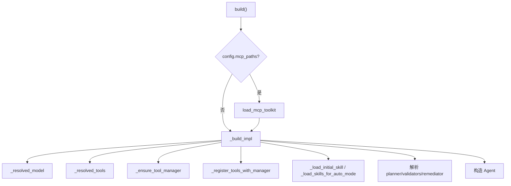

### 6.2 DareAgent 五层编排（一种编排策略）

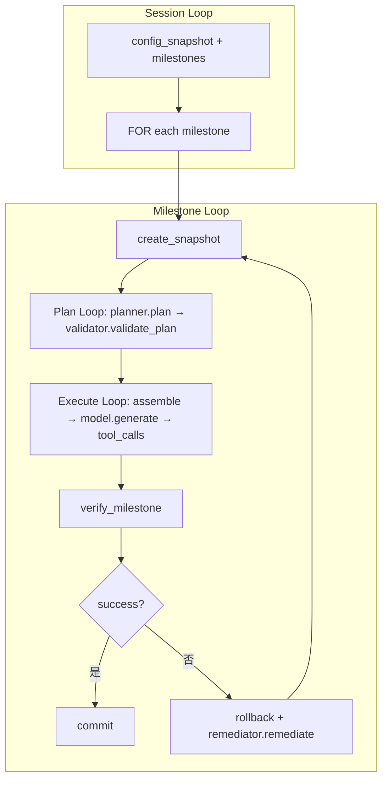

### 6.3 Execute Loop（通用）

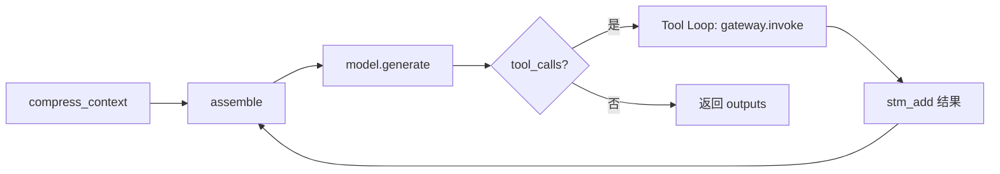

---

## 7. 类图

### 7.1 框架核心接口与编排实现

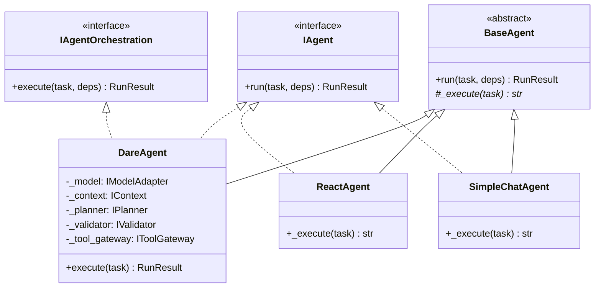

### 7.2 Plan 域接口与实现

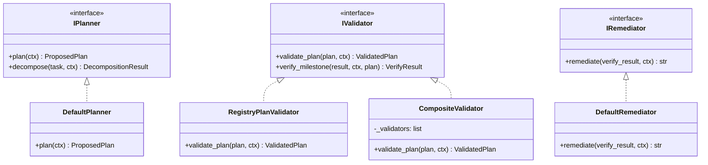

### 7.3 Context 与 Tool 域

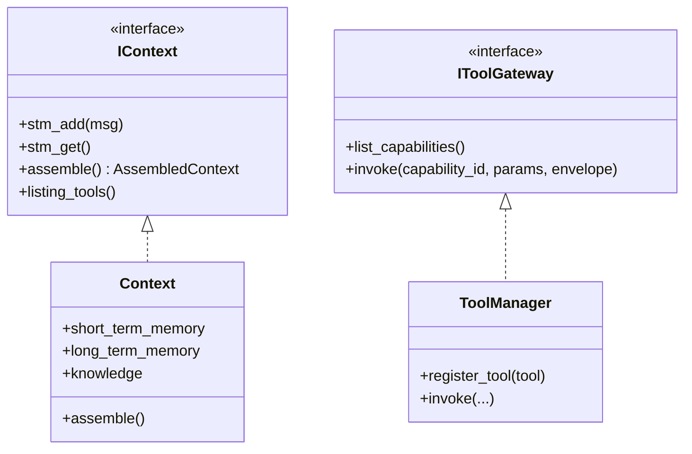

---

## 8. 时序图

### 8.1 Agent.run() 通用时序

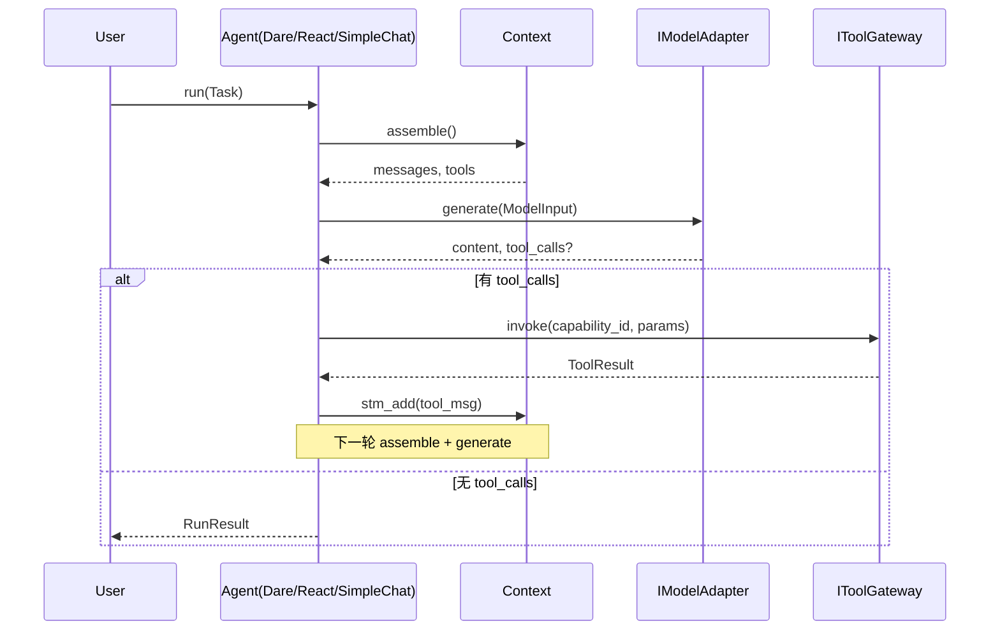

### 8.2 DareAgent 五层模式（Session→Milestone→Plan→Execute）

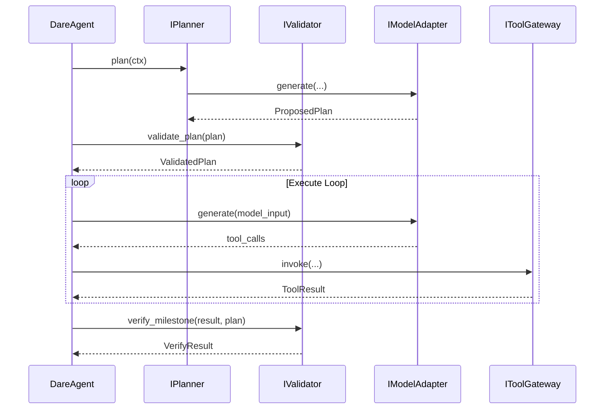

---

## 9. 状态图

### 9.1 Milestone 尝试状态

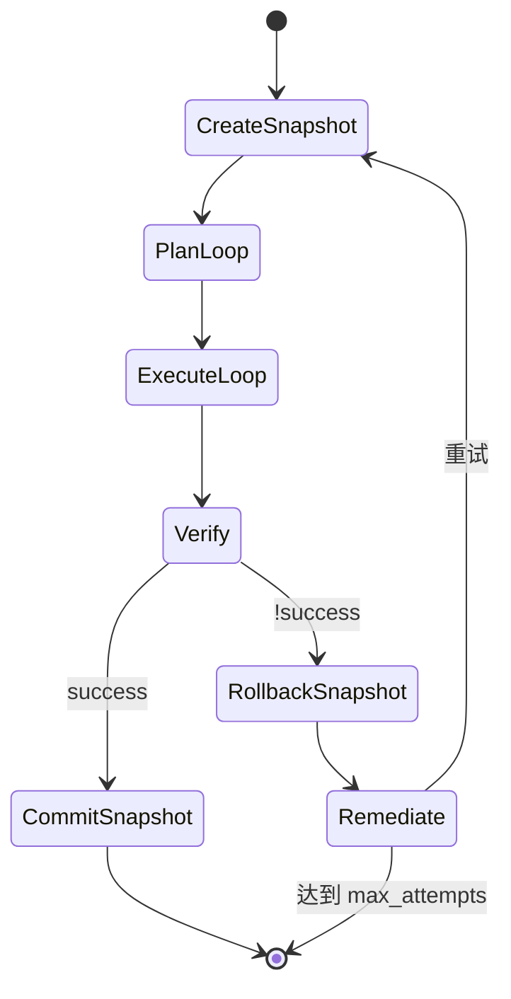

### 9.2 CLI 会话状态（示例 05）

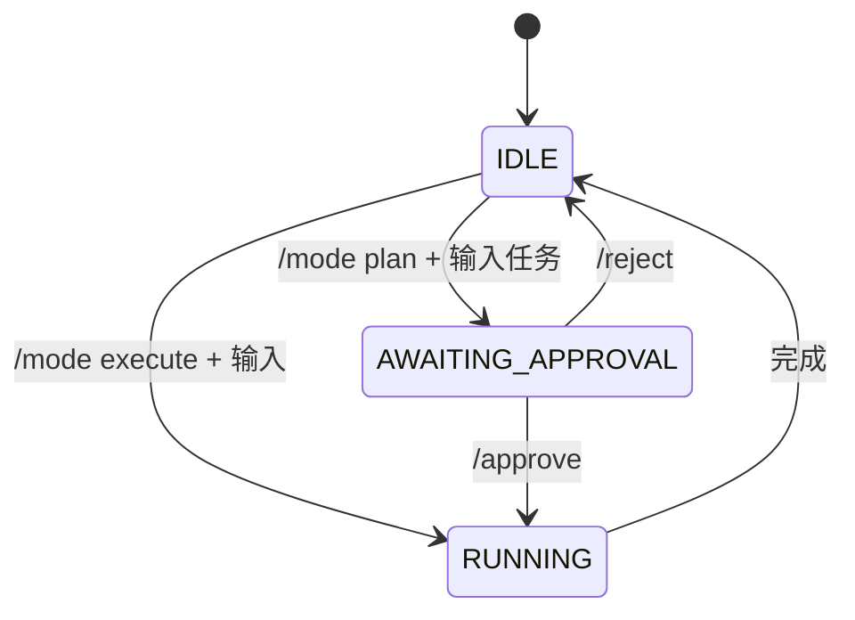

---

## 10. 示例：05-dare-coding-agent-enhanced

### 10.1 用途

示例展示**如何使用框架**组装一个编码 Agent：通过 DareAgentBuilder 注入 Model、Knowledge、Tools、Planner、Validator、Remediator、EventLog 等，产出 DareAgent 实例。

### 10.2 组件组装

| 组件 | 实现 |
|------|------|
| Model | OpenRouterModelAdapter |
| Tools | ReadFileTool, WriteFileTool, SearchCodeTool, RunCommandTool |
| Planner | DefaultPlanner |
| Validator | FileExistsValidator |
| Remediator | DefaultRemediator |
| Knowledge | RawDataKnowledge + InMemoryRawDataStorage |

### 10.3 FileExistsValidator 行为

- validate_plan：接受 ProposedPlan，转为 ValidatedPlan。
- verify_milestone：从 plan.steps 的 params.expected_files 提取期望文件，检查 workspace 内文件存在性。

---

## 11. PDF 导出说明

- **Typora**：打开后导出 PDF（支持 Mermaid）。
- **Pandoc**：`pandoc DARE_FRAMEWORK_DESIGN.md -o out.pdf --pdf-engine=xelatex -V CJKmainfont="SimSun"`。
- **VS Code + Markdown PDF**：右键导出 PDF。
- Mermaid 需支持 Mermaid 的渲染器；否则可先用 mermaid-cli 将图表渲染为图片再嵌入。

---

*基于 dare_framework 与 examples/05-dare-coding-agent-enhanced 源码分析。*
