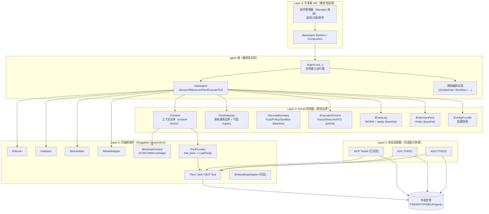
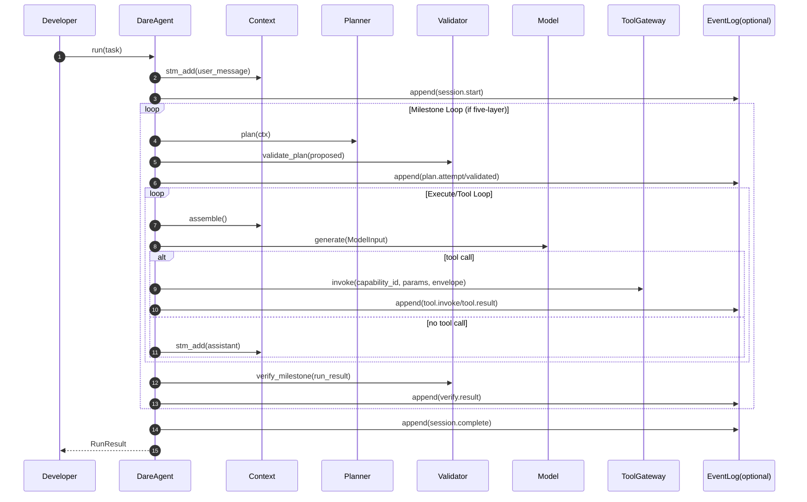

# DARE Framework 架构设计（现状版）

> 状态：full review 对齐版（以 `dare_framework/` 当前实现为主，持续回写 TODO）
>
> 目标包结构：`dare_framework/`（单一架构面；历史目录逐步归档）
>
> 本文定位：总体设计目标、实现策略、架构分层、业务/数据流程、模块能力概览。
>
> 证据与可追溯：`docs/design/DARE_evidence.yaml`。

---

## 目录（建议阅读顺序）

1. 总体目标与不变量
2. 总体框架设计（含架构图）
3. 核心流程（以 DareAgent 为例）
4. 关键特性设计（特性说明 + 约束/现状）
5. 关键组件能力设计（按 domain 摘要）
6. 模块级设计文档索引
7. 文档驱动收敛与清理计划（摘要）

---

## 1. 总体目标与不变量

### 1.1 定位

DARE 是一个 **framework**，用于构建不同类型的 Agent Runtime，而不是交付某个具体 Agent 产品。

目标是：将项目收敛为 `dare_framework/` 下**单一一致**的架构与接口面，然后删除/归档历史迭代目录与冗余文档。

### 1.2 设计目标（优化方向）

- **可审计/可复验**：关键决策可追溯，支持 query/replay。
- **安全可控**：trust/policy/sandbox 边界清晰，支持 HITL。
- **上下文工程优先**：检索/组装/压缩/预算归因显式化。
- **可插拔**：planner/validator/remediator/model/tools 等可替换。
- **确定性装配**：插件发现/选择/过滤/排序可复现。
- **多编排支持**：五层循环是一个实现，但框架应支持其他编排策略。

> 现状说明：以上目标在文档层已明确，但部分能力仍停留在接口或局部实现（详见各模块文档与 TODO）。

### 1.3 不变量（必须长期成立）

1. **LLM 输出不可信（Untrusted by default）**
   - planner/model 产出的 plan/tool call/risk 字段均视为不可信输入。
   - 安全关键字段 MUST 来自可信 registry（capability metadata / tool definition），忽略模型自报。
   - **现状**：`RegistryPlanValidator` 已实现“从 registry 推导风险元数据”；`DareAgent` 已在 plan/tool 边界接入 `ISecurityBoundary`（默认实现为 canonical permissive baseline）。

2. **状态外化（State externalization）**
   - EventLog（WORM）是事实来源；运行态必须可重放/可复验。
   - **现状**：`IEventLog` 接口与默认 SQLite + hash-chain 实现已提供；DareAgent 支持可选注入写事件，跨系统 WORM 治理仍待完善（TODO）。

3. **外部可验证（Externally verifiable completion）**
   - “完成”由验证器与证据闭环判定，而不是模型声称 done。
   - **现状**：`IValidator.verify_milestone(...)` 已定义；DareAgent 调用该接口，但缺少强制性证据闭环（TODO）。

4. **副作用单一出口（Single side-effect boundary）**
   - 所有外部副作用 MUST 经过 `IToolGateway.invoke(...)`。
   - **现状**：DareAgent 的工具调用均经过 ToolGateway；工具内部仍需遵守 workspace 限制与风险约束。

5. **上下文工程优先（Context engineering first-class）**
   - Context Window 是稀缺资源；组装/检索/压缩必须显式、预算化、可解释。
   - **现状**：Context-centric 结构已落地；检索融合、预算归因与压缩策略仍需补充（TODO）。

### 1.4 现实差距（必须正视的已知问题）

- **安全边界基础闭环已落地**：`ISecurityBoundary` 已接入 plan/tool 主路径；生产策略与 HITL 审批桥接仍待完善（TODO）。
- **计划驱动执行基线已落地**：`DareAgent` 支持 `execution_mode="step_driven"` 由 `ValidatedPlan.steps` 顺序执行；默认仍为 `model_driven`，并需继续补齐复杂场景覆盖（TODO）。
- **Hooks 语义待完善**：DareAgent 已接入基础 Hook 触发点，但 payload 规范与扩展策略仍需补充（TODO）。
- **EventLog 基线实现已落地**：默认 SQLite + hash-chain/replay/verify 已提供；跨系统 WORM 与 taxonomy 标准化仍待完善（TODO）。
- **检索融合基线已落地**：默认 `Context.assemble()` 已接入 STM/LTM/Knowledge 融合与预算降级；检索重排与高级压缩策略仍待完善（TODO）。

### 1.5 Gap / TODO Tracker（便于后续分工）

| 模块 | 关键差距 | 影响 | 参考文档 | Owner | 状态 |
|---|---|---|---|---|---|
| security | 生产策略引擎与 HITL 审批桥接未完成（基础 gate 已接入） | 高 | `docs/design/modules/security/README.md` | TODO | 进行中 |
| plan | step-driven 执行基线已落地；需补齐跨场景验证与默认实现下沉策略 | 中 | `docs/design/modules/plan/README.md` | TODO | 进行中 |
| hook | Hook payload schema 与扩展策略待完善 | 中 | `docs/design/modules/hook/README.md` | TODO | 进行中 |
| event | 默认实现已落地；跨系统 WORM 与 taxonomy 标准化待完善 | 中 | `docs/design/modules/event/README.md` | TODO | 进行中 |
| context | 默认融合已落地；检索重排与高级压缩策略待完善 | 中 | `docs/design/modules/context/README.md` | TODO | 进行中 |

---

## 2. 总体框架设计（分层 + 分域）（含架构图）

### 2.1 架构总览图

> 说明：
> - **编排（orchestration）放在 `agent` 域**，支持多实现；五层循环只是一个实现。
> - Kernel 关注长期稳定的控制面与边界（审计/预算/安全/工具边界/上下文负责人）。
> - 协议适配（目前仅 MCP toolkit 初步落地）为可选能力来源；A2A/A2UI 为设计占位（TODO）。



### 2.2 分层说明（关键决策）

- **Layer 0（Kernel 控制面）**：长期稳定的“系统边界”。
  - 这些接口必须被所有编排实现复用。
  - 当前 security/event/hook 均有可用基线实现；生产策略、事件 taxonomy、hook payload 规范等仍在完善。

- **Layer 1（协议适配）**：把协议世界翻译为 canonical capability。
  - 目前仅 MCPToolkit 在 `tool` 域落地；A2A/A2UI 处于设计文档阶段（TODO）。

- **Layer 2（可插拔组件）**：策略/能力实现层。
  - planner/validator/remediator/model/tools/memory/knowledge/embedding 等。
  - 可插拔组件通过 Config + Manager 体系进行选择与组合。

- **Layer 3（组装层）**：确定性装配与 builder 入口。
  - Builder 决定组件注入优先级（显式注入 > Manager 解析 > 默认实现）。

### 2.3 分域（DDD）与文件约定（硬规则）

每个 domain 至少包含：
- `types.py`：对外模型/枚举（相对稳定）
- `kernel.py`：该域最核心稳定接口（Kernel contract）
- `__init__.py`：export facade

可选：
- `interfaces.py`：可插拔接口位、跨域组合接口位
- `_internal/`：默认实现（不稳定；不作为公共 API）

推荐依赖规则：
- `types.py` 不依赖 `interfaces.py/_internal/`
- `kernel.py` 尽量只依赖 `types.py`
- `interfaces.py` 可依赖其他域 `kernel.py` 表达组合

> 现状说明：大部分 domain 已遵循约定，但仍存在接口空壳或实现缺失（见各模块 TODO）。

---

## 3. 核心流程（以 DareAgent 为例）

> DareAgent 是当前主实现，支持三种模式：Simple / ReAct / Five-Layer。

### 3.1 核心时序（简化）



> 注：Security baseline 已接入；HITL 审批桥接与 Hooks payload 规范仍在完善（见 TODO）。

### 3.2 五层循环定义（结构骨架）

1. **Session Loop**：用户边界、跨窗口承载
2. **Milestone Loop**：单目标闭环、重试/补救
3. **Plan Loop**：生成并验证计划（失败计划隔离为目标语义）
4. **Execute Loop**：执行模式可切换（默认模型驱动；可选 step-driven）
5. **Tool Loop**：WorkUnit 闭环（Envelope + DonePredicate）

> 现状说明：Plan Loop 与 step-driven Execute Loop 均已接入；默认模式仍是 model-driven，step-driven 场景覆盖仍在扩展。若 step-driven 同时启用 planner，必须配置 validator（构造期 fail-fast）。

### 3.3 核心约束：Plan Attempt Isolation（失败计划隔离）

- 未通过验证的计划尝试不得污染外层 milestone/session state。
- 失败尝试只允许记录：attempt 元信息、错误、reflection（如有）。
- Validated plan 才允许进入 Execute。

> 现状说明：DareAgent 已接入 `DefaultPlanAttemptSandbox`，在 milestone attempt 中执行 STM snapshot/rollback/commit；当前为 STM 范围隔离基线，更严格的跨上下文隔离语义仍待扩展（TODO）。

### 3.4 核心约束：Plan Tool（控制类工具）

- **定义**：Plan Tool 是一种“控制类 capability”，用于触发 re-plan/调整策略。
- **语义**：Execute 遇到 Plan Tool 时，必须中止当前执行并返回外层以 re-plan。
- **现状**：DareAgent 支持 `capability_kind=plan_tool` 与 `plan:` 前缀。

### 3.5 Tool Loop（WorkUnit）闭环语义（摘要）

- 输入：`ToolLoopRequest(capability_id, params, envelope)`
- `Envelope`：allow-list + Budget + DonePredicate + risk_level
- 循环：直到 DonePredicate satisfied 或 budget exhausted

### 3.6 业务/数据流程（聚焦当前实现）

- **业务流程**：用户任务 → Agent 选择模式 →（可选）计划生成与验证 → 执行与工具调用 → 验证与返回结果。
- **数据流**：
  - `Task/Milestone` → 写入 STM（用户消息）
  - `Context.assemble()` → `AssembledContext(messages + tools + metadata)`
  - `ModelInput(messages + tools + metadata)` → `ModelResponse`（含 tool_calls）
  - `ToolResult` → 追加到 STM（tool message）并记录 evidence

---

## 4. 关键特性设计（特性说明 + 流程/约束）

### 4.1 统一能力模型（Capability）与系统调用边界

- 所有可调用能力统一为 `CapabilityDescriptor`：TOOL / SKILL / AGENT / UI。
- `IToolGateway.list_capabilities()` 是可信 registry 的主入口。
- 所有副作用必须经由 `IToolGateway.invoke(...)`（单一边界）。

**可信 metadata（现有字段）**：
- `risk_level`
- `requires_approval`
- `timeout_seconds`
- `is_work_unit`
- `capability_kind`

> 现状说明：ToolManager 已实现 registry + tool defs 导出；`DareAgent` 已在 plan/tool 入口内建 policy gate。

### 4.2 安全边界（Trust / Policy / Sandbox）

- **不信任模型自报风险**：risk_level/requires_approval/timeout/is_work_unit MUST 来自 registry。
- **policy gate 位置（目标设计）**：
  - Plan->Execute gate
  - Tool invoke gate

> 现状说明：`ISecurityBoundary` 已在 `DareAgent` 接入（`verify_trust` + `check_policy` + `execute_safe`）；`APPROVE_REQUIRED` 的审批桥接与生产策略仍待补齐。

### 4.3 HITL（人在回路）

- `pause()` 创建 checkpoint
- `wait_for_human()` 形成显式等待点
- `resume()` 恢复

> 现状说明：`IExecutionControl` 已定义；DareAgent 已具备 tool approval wait/resume 事件链，plan 入口的 `APPROVE_REQUIRED` 仍以 fail-fast 为主，待统一为完整审批桥接语义（TODO）。

#### 审批语义决策表（Plan/Tool）

| 入口 | 当前行为（As-Is） | 目标行为（To-Be） | 迁移策略 |
|---|---|---|---|
| Plan -> Execute (`check_policy(action=\"execute_plan\")`) | `ALLOW` 放行；`DENY` 失败；`APPROVE_REQUIRED` 当前 fail-fast 返回错误 | 与 Tool 入口统一为显式审批桥接（pause/wait/resume） | 在不破坏现有测试语义前提下，引入审批等待与恢复事件链，并补回归测试 |
| Tool invoke (`check_policy(action=\"invoke_tool\")`) | `ALLOW` 执行；`DENY` 拒绝；`APPROVE_REQUIRED` 结合 `ToolApprovalManager` 进入 waiting/resume 流程 | 保持为统一基线并沉淀事件 taxonomy | 对齐 plan 入口后统一审计字段与错误语义 |

> 追踪矩阵入口：`docs/design/Design_Reconstructability_Traceability_Matrix.md`

### 4.4 上下文工程（Context Engineering）

- Context 是核心实体（context-centric），`assemble()` 在请求时组装 messages/tools/metadata。
- STM/LTM/Knowledge 统一为 `IRetrievalContext`，挂载于 Context。
- tools 通过 ToolProvider/ToolManager 生成结构化 tool defs 供模型调用。

> 现状说明：默认 `Context.assemble()` 已融合 STM/LTM/Knowledge，并在预算受限时执行降级；分级压缩与重排策略仍在规划中（TODO）。

### 4.5 审计与可重放（EventLog / Checkpoint / Replay）

- EventLog 是 WORM 真理来源。
- Checkpoint 与 EventLog 对齐（event_id / snapshot_ref）。

> 现状说明：`IEventLog` 已提供默认 SQLite + hash-chain 实现；DareAgent 可选写入，跨系统事件 taxonomy 与治理策略仍待完善。

### 4.6 确定性装配与插件系统（Managers）

- Kernel 不依赖 entrypoints discovery。
- Managers 负责 discovery/selection/filtering/ordering/instantiation。
- Builder 采用显式注入优先：显式组件 > Manager 解析 > 默认实现。

> 现状说明：Agent builders 已实现上述优先级；组件 enable/disable 由 Config 决定。

### 4.7 多编排支持（agent 域）

- `IAgent.run(...)` 是对外最小运行面。
- Framework 提供 `SimpleChatAgent` / `ReactAgent` / `DareAgent` 三种编排实现；`DareAgent` 聚焦 five-layer。
- 允许替换编排策略（`IAgentOrchestration`）。

### 4.8 Hooks 扩展点（ExtensionPoint）

- 提供 BEFORE/AFTER 等生命周期 hook 注入点（用于遥测/审计扩展/策略插桩等）。
- 默认语义建议为 best-effort：hook 失败不应默认导致运行崩溃。

> 现状说明：Hook 接口与组合器已存在，DareAgent 已接入基础 Hook 触发点；payload schema 仍待统一（TODO）。

### 4.9 可观测性（Observability）

- 通过 `IHook/IExtensionPoint` 与 `IEventLog` 提供扩展点，TelemetryProvider 生成 traces / metrics / logs。
- Span 调用链覆盖 run/session/milestone/plan/execute/model/tool/context 关键阶段。
- 关键指标覆盖上下文长度、token 消耗、工具执行次数与耗时、预算使用等。
- `Config.observability` 控制 exporter、采样与去敏策略；OpenTelemetry SDK 为可选依赖。

> 现状说明：Observability 已落地基础实现（TelemetryProvider + OTel/InMemory），日志语义与 GenAI semconv 仍需完善（TODO）。

---

## 5. 关键组件能力设计（按 domain 摘要）

> 本节只描述职责、边界与“最关键的稳定契约”；**详细能力/限制/扩展点请下钻模块文档**。

| Domain | 主要职责（架构视角） | 现状落点（示例） | 模块文档 |
|---|---|---|---|
| agent | 编排策略承载域；对外最小运行面；支持多编排实现 | `dare_framework/agent/dare_agent.py` | `docs/design/modules/agent/README.md` |
| context | 上下文核心实体（context-centric）；持有 STM/LTM/Knowledge 引用与 Budget；assemble 组装上下文 | `dare_framework/context/context.py` | `docs/design/modules/context/README.md` |
| tool | 能力目录（registry）与系统调用边界；Tool Loop 语义 | `dare_framework/tool/tool_manager.py` | `docs/design/modules/tool/README.md` |
| plan | 任务/计划/结果模型；plan 生成/校验/补救 | `dare_framework/plan/_internal/*.py` | `docs/design/modules/plan/README.md` |
| model | 模型调用适配；Prompt/ModelInput 规范化 | `dare_framework/model/*` | `docs/design/modules/model/README.md` |
| security | trust/policy/sandbox 边界 | `dare_framework/security/*` | `docs/design/modules/security/README.md` |
| event | 可审计事件日志（WORM）与查询/重放 | `dare_framework/event/*` | `docs/design/modules/event/README.md` |
| hook | 生命周期扩展点；best-effort hooks | `dare_framework/hook/*` | `docs/design/modules/hook/README.md` |
| observability | 运行时可观测（traces/metrics/logs） | `dare_framework/observability/*` | `docs/design/modules/observability/README.md` |
| config | 配置快照与确定性装配 | `dare_framework/config/*` | `docs/design/modules/config/README.md` |
| memory/knowledge | 统一检索面与跨域组合接口位 | `dare_framework/memory/*`, `dare_framework/knowledge/*` | `docs/design/modules/memory_knowledge/README.md` |
| skill | Skill 解析与脚本执行能力 | `dare_framework/skill/*` | `docs/design/modules/skill/README.md` |
| embedding | Embedding 接口与适配器 | `dare_framework/embedding/*` | `docs/design/modules/embedding/README.md` |
| transport | Client ↔ Agent 交互协议 | `dare_framework/transport/*` | `docs/design/modules/transport/transport_mvp.md` |

### 5.2 关键接口签名（节选）

> 仅保留必要轮廓，完整接口细节以 `docs/design/Interfaces.md` 为准。

```python
class IAgent(Protocol):
    async def run(self, task: "str | Task", deps: Any | None = None) -> "RunResult": ...

class IContext(Protocol):
    def stm_add(self, message: "Message") -> None: ...
    def assemble(self, **options) -> "AssembledContext": ...

class IToolGateway(Protocol):
    async def list_capabilities(self) -> Sequence["CapabilityDescriptor"]: ...
    async def invoke(self, capability_id: str, params: dict[str, Any], *, envelope: "Envelope") -> Any: ...
```

---

## 6. 模块级设计文档索引

> 各模块的详细设计文档位于 `docs/design/modules/`，按域拆分，便于渐进完善。

- agent: `docs/design/modules/agent/README.md`
- context: `docs/design/modules/context/README.md`
- tool: `docs/design/modules/tool/README.md`
- plan: `docs/design/modules/plan/README.md`
- model（总体）：`docs/design/modules/model/README.md`
- model（Prompt）：`docs/design/modules/model/Model_Prompt_Management.md`
- security: `docs/design/modules/security/README.md`
- event: `docs/design/modules/event/README.md`
- hook: `docs/design/modules/hook/README.md`
- observability: `docs/design/modules/observability/README.md`
- config: `docs/design/modules/config/README.md`
- memory/knowledge: `docs/design/modules/memory_knowledge/README.md`
- skill: `docs/design/modules/skill/README.md`
- embedding: `docs/design/modules/embedding/README.md`
- transport（设计中）：`docs/design/modules/transport/transport_mvp.md`

---

## 7. 文档驱动收敛与清理计划（摘要）

在架构文档评审通过后：
1) 依据本文与模块文档，修订 `dare_framework/` 实现中的缺口（安全/审计/计划驱动等）。
2) 删除/归档历史版本目录（如 `dare_framework2/`, `dare_framework3*/` 等）。
3) 将本文档集作为唯一权威入口，清理旧文档与重复设计稿。
4) 执行“可重建性治理”基线：
   - 追踪矩阵：`docs/design/Design_Reconstructability_Traceability_Matrix.md`
   - 重建 SOP：`docs/guides/Design_Reconstruction_SOP.md`
