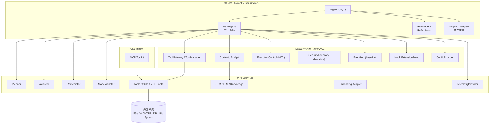
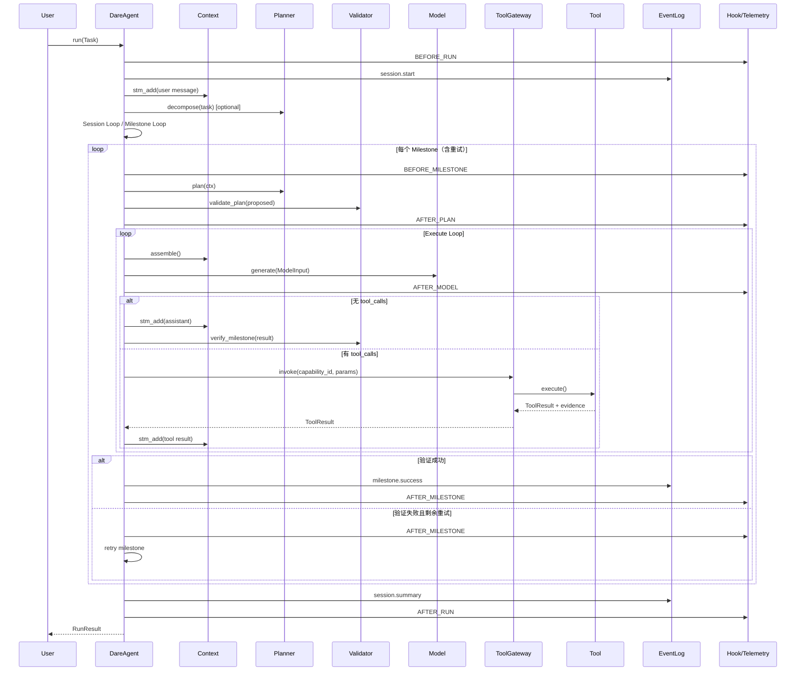
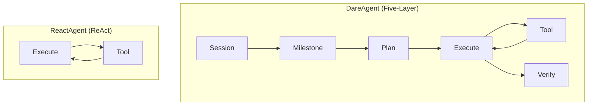
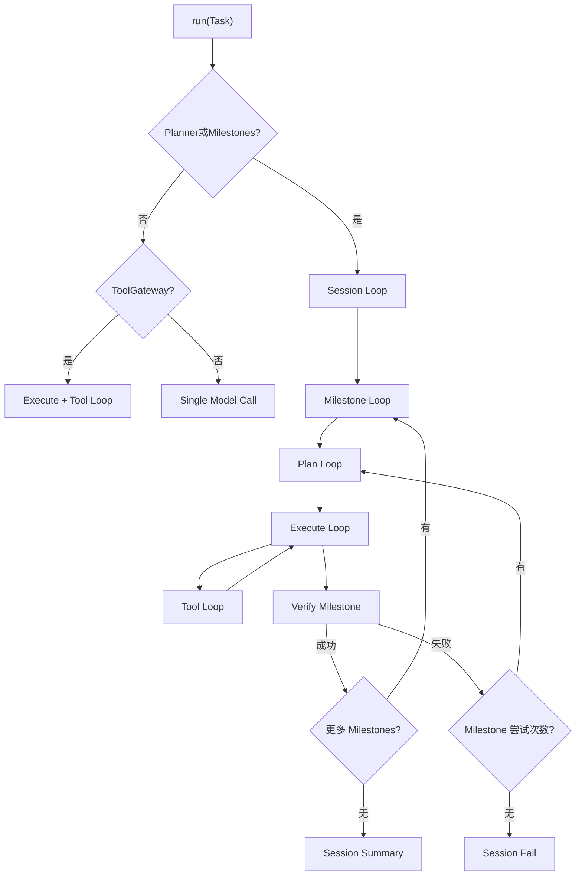
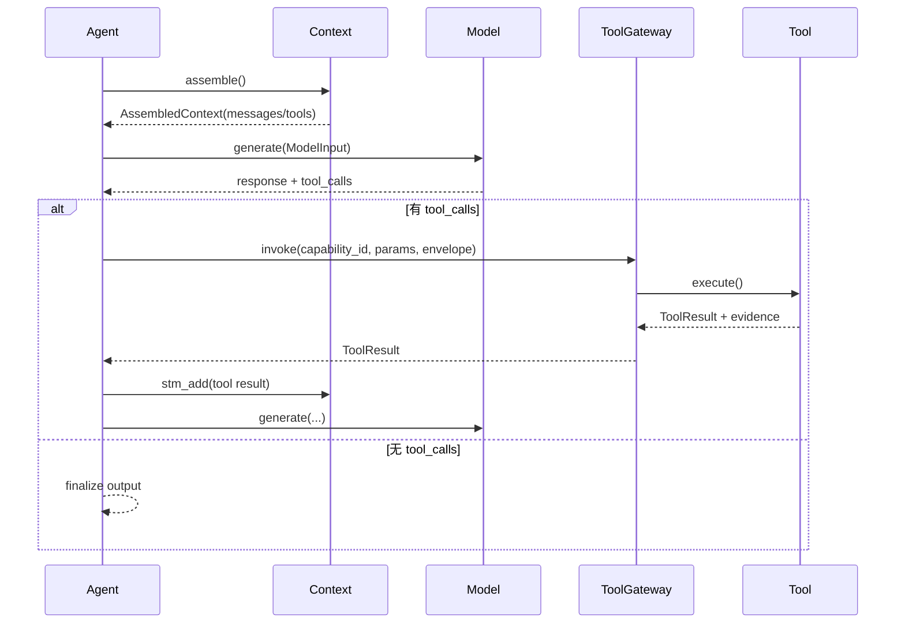
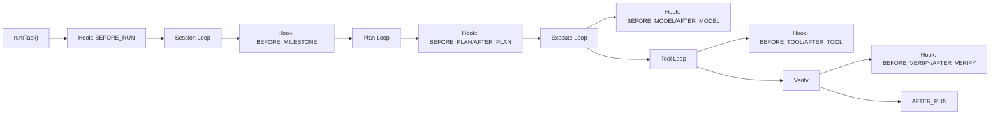

# DARE Framework 正式设计文档（基于现有实现）

> 版本: 1.0  
> 日期: 2026-02-27  
> 范围: `dare_framework/` 现有实现 + `docs/design/` 现状设计对齐文档  
> 状态: full review 对齐版（与代码对齐，保留未闭环 TODO 说明）

---

## 0. 文档说明

### 0.1 目标
- 以“实现现状”为基准，形成一份可交付的正式设计说明书。
- 覆盖架构设计、模板设计、核心流程、扩展点、模块详设与样例。
- 明确哪些能力已实现、哪些仍为接口或规划。

### 0.2 非目标
- 不引入新能力或架构变更（仅对现状进行系统化描述）。
- 不替代 `docs/design/Architecture.md` 与 `docs/design/Interfaces.md` 的权威定义。

### 0.3 术语约定
- **Agent**: 运行时编排实体（`DareAgent`/`ReactAgent`/`SimpleChatAgent`）。
- **Context-centric**: 上下文以 `Context` 为核心，调用前临时组装。
- **Tool Gateway**: 外部副作用唯一出口（`IToolGateway.invoke`）。
- **Planner/Validator/Remediator**: 计划生成/验证/修复三段式。

---

## 1. 整体架构设计

### 1.1 设计目标与不变量（实现一致）
- **LLM 输出默认不可信**：风险等级与审批策略必须来自可信注册表，而非模型自报。
- **上下文工程优先**：Context 统一承载 STM/LTM/Knowledge、预算与工具快照。
- **副作用单一出口**：所有外部调用必须经过 `IToolGateway.invoke`。
- **可插拔与可审计**：组件可替换，运行过程可记录（EventLog/Telemetry）。

### 1.2 分层与分域
DARE 以“稳定边界 + 可插拔策略 + 编排实现”的方式组织：

- **Kernel 控制面（稳定边界）**：Context / ToolGateway / ExecutionControl / EventLog / Hook / Config  
- **Pluggable 组件层**：Planner / Validator / Remediator / ModelAdapter / ToolProvider / Memory / Knowledge / Embedding  
- **协议适配层**：MCP Toolkit（已实现）  
- **编排层**：DareAgent（五层循环）/ ReactAgent / SimpleChatAgent  
- **组装层**：Builder + Manager（确定性装配）

### 1.3 架构图（现状对齐）



### 1.4 运行模式（自动选择）
- **Simple Mode**：无 planner、无 tool_gateway → 单次模型生成。
- **ReAct Mode**：无 planner、有 tool_gateway → Execute + Tool Loop。
- **Five-Layer Mode**：有 planner 或 Task 带 milestones → Session → Milestone → Plan → Execute → Tool。

---

## 2. 编排层模板 Agent 设计（Template Agents）

编排层内置两类“模板 Agent”，作为默认的可复用编排实现：`DareAgent` 与 `ReactAgent`。模板设计所需的 Prompt/Skill/Tool 模板已下沉至模块文档（见 `docs/design/modules/model/Model_Prompt_Management.md`、`docs/design/modules/skill/README.md`、`docs/design/modules/tool/README.md`）。

### 2.1 DareAgent（五层循环模板）
- **定位**：完整编排模板，提供 Session → Milestone → Plan → Execute → Tool 的闭环。
- **关键组件**：Planner/Validator/Remediator、ToolGateway、Context、EventLog/Hook/Telemetry。
- **典型能力**：计划生成与验证、证据收集、里程碑重试、审计追溯。
- **适用场景**：复杂任务、多阶段交付、审计要求高的工作流。

#### 2.1.1 DareAgent 端到端时序图



### 2.2 ReactAgent（ReAct 工具循环模板）
- **定位**：轻量执行模板，使用模型工具调用 + 观察循环完成任务。
- **关键组件**：ModelAdapter、Context、ToolProvider（无需 Planner/Validator）。
- **典型能力**：快速工具调用、多轮问答、低成本执行。
- **适用场景**：简单任务、交互式工具调用、无需严格验证的场景。

### 2.3 模板 Agent 对比

| 维度 | DareAgent | ReactAgent |
|---|---|---|
| 编排层级 | 五层循环（Session/Milestone/Plan/Execute/Tool） | Execute + Tool Loop |
| 计划能力 | 支持 Planner/Validator/Remediator | 不支持 |
| 验证闭环 | 支持里程碑验证与证据收集 | 不支持（依赖模型输出） |
| 工具调用 | 统一 ToolGateway 边界 + Envelope | 直接通过 ToolProvider |
| 审计与观测 | EventLog + Hook + Telemetry | 可选（较少钩子位） |
| 复杂度/成本 | 更高 | 更低 |
| 适用任务 | 多阶段、可审计、可复验 | 轻量、快速、交互式 |

### 2.4 模板工作流对比图



---

## 3. 核心流程

### 3.1 运行模式选择
- **有 planner 或 Task.milestones** → Five-Layer 模式  
- **无 planner 有 tools** → ReAct 模式  
- **无 planner 无 tools** → Simple 模式  

### 3.2 五层循环主路径
**主要阶段**：
1. **Session Loop**：任务初始化、配置快照、里程碑拆分  
2. **Milestone Loop**：尝试次数 + 计划/执行/验证  
3. **Plan Loop**：Planner 生成 ProposedPlan，Validator 产出 ValidatedPlan  
4. **Execute Loop**：模型驱动执行（可触发工具调用）  
5. **Tool Loop**：单工具调用边界（Envelope/DonePredicate）  

**核心流程图**：



### 3.3 Execute + Tool 工作逻辑图



### 3.4 关键机制与约束（现状）
- **上下文压缩**：`compress_context` 在 plan/execute/react/simple 各阶段调用（当前为轻量策略）。
- **预算控制**：`Budget` 统一记录 tokens/tool_calls/time；超过上限即异常终止。
- **计划工具触发**：tool name 以 `plan:` 前缀或 registry 标记 `capability_kind=plan_tool` → 触发 re-plan。
- **证据闭环**：ToolResult.evidence 写入 MilestoneState；Validator 可基于证据验证（尚未完全闭环）。

---

## 4. 外部可扩展点（在核心流程中的位置）

### 4.1 扩展点总览

| 流程位置 | 扩展点 | 接口/类型 | 说明 |
|---|---|---|---|
| **组装阶段** | Builder/Manager | `DareAgentBuilder` + `I*Manager` | 组件注入优先级：显式注入 > Manager 解析 > 默认 |
| **上下文组装** | 自定义 Context/检索 | `IContext` / `IRetrievalContext` | 定义检索融合、压缩策略、工具快照 |
| **计划阶段** | Planner/Validator/Remediator | `IPlanner`/`IValidator`/`IRemediator` | 证据型计划、可信元数据派生 |
| **执行阶段** | ModelAdapter | `IModelAdapter` | 多模型适配、工具调用格式兼容 |
| **工具调用** | Tool / ToolProvider / Gateway | `ITool` / `IToolProvider` / `IToolGateway` | 能力注册、权限控制、外部副作用 |
| **验证阶段** | Validator | `IValidator.verify_milestone` | 以证据判定完成 |
| **生命周期** | Hooks | `IHook` / `HookPhase` | BEFORE/AFTER_* 插入观测或策略 |
| **审计与观测** | EventLog / Telemetry | `IEventLog` / `ITelemetryProvider` | 审计链与 traces/metrics |
| **安全与审批** | SecurityBoundary (baseline) | `ISecurityBoundary` | Trust/Policy/Sandbox 闭环 |

### 4.2 扩展点位置示意



---

## 5. 各核心模块详细设计

详细设计索引见 `docs/design/modules/README.md`。

### 5.1 agent
详细设计：`docs/design/modules/agent/README.md`。
- **职责**：运行入口与编排策略（Simple/React/Five-layer）。
- **关键类型**：`Task` / `Milestone` / `RunResult` / `SessionState`。
- **核心接口**：`IAgent`、`IAgentOrchestration`（`dare_framework/agent/kernel.py`, `interfaces.py`）。
- **默认实现**：`DareAgent`、`ReactAgent`、`SimpleChatAgent`（`dare_framework/agent/dare_agent.py`, `react_agent.py`, `simple_chat.py`）。
- **文档结构**：每个 agent 一份详细设计 + 单一 TODO 清单。
  参考：`docs/design/modules/agent/DareAgent_Detailed.md`, `docs/design/modules/agent/ReactAgent_Detailed.md`, `docs/design/modules/agent/SimpleChatAgent_Detailed.md`, `docs/design/modules/agent/TODO.md`。
- **扩展点**：自定义编排策略、执行控制（HITL）、Hook/Telemetry。
- **现状限制**：step-driven 执行基线已落地但覆盖仍需扩展；Hook payload schema 仍在收敛；SecurityBoundary 已接入主流程。

### 5.2 context
详细设计：`docs/design/modules/context/README.md`。
- **职责**：上下文核心实体，负责 STM/LTM/Knowledge 组织与组装。
- **关键类型**：`Message` / `Budget` / `AssembledContext`。
- **核心接口**：`IContext` / `IRetrievalContext`。
- **默认实现**：`Context`（`dare_framework/context/context.py`）。
- **扩展点**：自定义检索融合、压缩策略、工具快照/审计。
- **现状限制**：默认 assemble 已融合 STM/LTM/Knowledge 基线；高级重排与分级压缩策略仍待扩展。

### 5.3 plan
详细设计：`docs/design/modules/plan/README.md`。
- **职责**：计划生成、验证与修复；提供验证结果与证据模型。
- **关键类型**：`ProposedPlan` / `ValidatedPlan` / `Envelope` / `DonePredicate`。
- **核心接口**：`IPlanner` / `IValidator` / `IRemediator`。
- **默认实现**：`DefaultPlanner` / `RegistryPlanValidator` / `DefaultRemediator`。
- **扩展点**：自定义证据策略、步骤执行器、计划沙箱。
- **现状限制**：step-driven 执行基线已落地；证据闭环仍在收敛。

### 5.4 tool
详细设计：`docs/design/modules/tool/README.md`。
- **职责**：能力注册、描述与调用边界；工具调用唯一出口。
- **关键类型**：`CapabilityDescriptor` / `ToolResult` / `Envelope`。
- **核心接口**：`ITool` / `IToolProvider` / `IToolGateway` / `IToolManager`。
- **默认实现**：`ToolManager` + 内置工具集（`dare_framework/tool/_internal`）。
- **扩展点**：新增 Tool/Provider；MCP 适配；运行上下文工厂。
- **现状限制**：policy gate 基线已接入；plan/tool 审批语义仍需进一步统一与增强。

### 5.5 mcp
详细设计：`docs/design/modules/mcp/README.md`。
- **职责**：MCP 客户端接入与配置加载，将 MCP tools 暴露为 `IToolProvider` 供 ToolManager 使用。
- **关键类型**：`MCPServerConfig` / `MCPConfigFile` / `IMCPClient`。
- **默认实现**：`MCPClient` / `MCPConfigLoader` / `MCPClientFactory` / `MCPToolProvider`（defaults）。
- **扩展点**：自定义 transport/client/provider 以及 MCP 配置加载方式。
- **现状限制**：风险/审批信息依赖 server 侧提供，策略未在 MCP 层强制。

### 5.6 model
详细设计：`docs/design/modules/model/README.md`（Prompt 管理详见 `docs/design/modules/model/Model_Prompt_Management.md`）。
- **职责**：统一模型调用入口 + Prompt 管理。
- **关键类型**：`ModelInput` / `ModelResponse` / `Prompt`。
- **核心接口**：`IModelAdapter` / `IModelAdapterManager` / `IPromptStore`。
- **默认实现**：OpenAI/OpenRouter/Anthropic 适配器 + LayeredPromptStore。
- **扩展点**：多模型路由、流式输出、Prompt Loader。
- **现状限制**：无流式输出与多阶段 prompt pack。

### 5.7 skill
详细设计：`docs/design/modules/skill/README.md`。
- **职责**：解析 SKILL.md、管理技能目录、脚本执行。
- **关键类型**：`Skill` / `ISkillLoader` / `ISkillStore`。
- **默认实现**：FileSystemSkillLoader + SkillStore + KeywordSelector。
- **扩展点**：远端技能源、智能匹配策略、技能注入策略。
- **现状限制**：默认注入策略需 Builder/Context 配合；权限审计需完善。

### 5.8 memory / knowledge
详细设计：`docs/design/modules/memory_knowledge/README.md`。
- **职责**：提供 STM/LTM/Knowledge 的检索实现。
- **关键类型**：`IShortTermMemory` / `ILongTermMemory` / `IKnowledge`。
- **默认实现**：`InMemorySTM`；LTM/Knowledge 通过工厂支持 rawdata/vector 默认实现。
- **扩展点**：RAG/GraphRAG、向量库接入、策略排序。

### 5.9 embedding
详细设计：`docs/design/modules/embedding/README.md`。
- **职责**：文本向量化适配。
- **关键类型**：`IEmbeddingAdapter` / `EmbeddingResult`。
- **默认实现**：OpenAI Embedding Adapter（LangChain）。
- **扩展点**：本地模型或其他云服务。

### 5.10 config
详细设计：`docs/design/modules/config/README.md`。
- **职责**：统一配置加载与合并（workspace + user）。
- **关键类型**：`Config` / `LLMConfig` / `ComponentConfig`。
- **默认实现**：`FileConfigProvider`（`.dare/config.json`）。
- **扩展点**：多格式配置、热更新、allowlist enforcement。

### 5.11 observability
详细设计：`docs/design/modules/observability/README.md`。
- **职责**：OpenTelemetry traces/metrics/logs。
- **关键类型**：`ITelemetryProvider` / `ISpan` / `TelemetryConfig`。
- **默认实现**：`OTelTelemetryProvider` + `ObservabilityHook`。
- **扩展点**：自定义 exporter、采样/脱敏策略。

### 5.12 hook
详细设计：`docs/design/modules/hook/README.md`。
- **职责**：生命周期扩展点（最佳努力执行）。
- **关键类型**：`IHook` / `HookPhase` / `IExtensionPoint`。
- **默认实现**：`HookExtensionPoint` + `CompositeExtensionPoint`。
- **现状限制**：Hook payload schema 仍在收敛，字段规范需统一。

### 5.13 event
详细设计：`docs/design/modules/event/README.md`。
- **职责**：WORM Event Log，审计与重放。
- **关键类型**：`Event` / `RuntimeSnapshot`。
- **现状**：默认 SQLite + hash-chain 实现已提供，跨系统治理策略仍待完善。

### 5.14 security
详细设计：`docs/design/modules/security/README.md`。
- **职责**：Trust/Policy/Sandbox 统一边界。
- **关键类型**：`RiskLevel` / `PolicyDecision` / `TrustedInput`。
- **现状**：接口与默认实现已接入主流程，生产策略与审批桥接仍待完善。

### 5.15 transport（设计占位）
详细设计：`docs/design/modules/transport/Transport_Domain_Design.md`。
- **职责**：通道与消息处理管线（Netty 风格 Pipeline）。
- **现状**：`docs/design/modules/transport/Transport_Domain_Design.md` 为设计稿，尚未实现。

---

## 6. 样例介绍说明

### 6.1 基础构建示例（五层模式）

```python
from dare_framework.agent.base_agent import BaseAgent
from dare_framework.config import FileConfigProvider

# 加载配置（可选）
config_provider = FileConfigProvider()
config = config_provider.current()

# 构建五层 Agent
builder = BaseAgent.five_layer_agent_builder("demo").with_config(config)
agent = await builder.build()

result = await agent.run("给我写一份模块设计总结")
print(result.output)
```

### 6.2 Prompt 模板示例（.dare/_prompts.json）

```json
{
  "prompts": [
    {
      "prompt_id": "base.system",
      "role": "system",
      "content": "You are a reliable engineering assistant.",
      "supported_models": ["*"],
      "order": 0
    }
  ]
}
```

### 6.3 Skill 示例

```text
my_skill/
├── SKILL.md
└── scripts/
    └── run_lint.sh
```

### 6.4 示例工程引用
- `examples/05-dare-coding-agent-enhanced/` 提供包含 Skill + MCP + Knowledge 的综合示例。
- 该示例展示了 `skill_mode`、本地 MCP 工具加载与 prompt 管理的组合路径。
