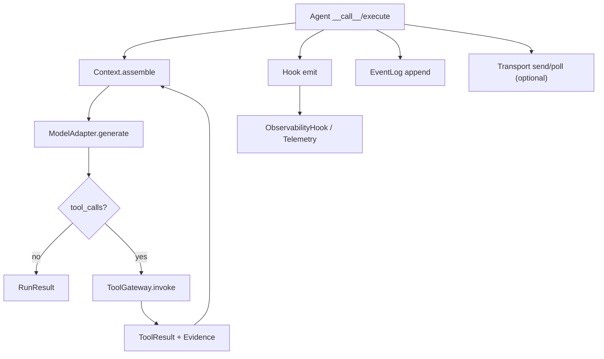

# DARE Framework 接口设计（Synced）

> 状态：已与当前代码同步（2026-02-25）
>
> 本文是跨模块接口总表，来源于 `dare_framework/*/{kernel,interfaces,types}.py`。
> 详细流程设计请看 `docs/design/modules/*/README.md`。

---

## 0. 分域目录约定

每个 domain 推荐结构：

```text
dare_framework/<domain>/
  types.py
  kernel.py
  interfaces.py   # 可选：可插拔接口或组合接口
  __init__.py
  _internal/      # 默认实现（非稳定）
```

约束：
- `types.py` 不依赖 `_internal/`。
- `kernel.py` 定义稳定契约（Kernel contracts）。
- `interfaces.py` 放策略位、组合接口、manager 接口。
- `_internal/` 实现不作为稳定 API 承诺。

---

## 1. 跨模块核心字段契约

### 1.1 上下文契约（context/types.py）

- `Message`
  - `role: str`
  - `content: str`
  - `name: str | None`
  - `metadata: dict[str, Any]`
- `Budget`
  - limits: `max_tokens/max_cost/max_time_seconds/max_tool_calls`
  - usage: `used_tokens/used_cost/used_time_seconds/used_tool_calls`
- `AssembledContext`
  - `messages: list[Message]`
  - `sys_prompt: Prompt | None`
  - `tools: list[CapabilityDescriptor]`
  - `metadata: dict[str, Any]`

### 1.2 计划与运行结果契约（plan/types.py）

- `Task`: `description/task_id/milestones/metadata/previous_session_summary`
- `Milestone`: `milestone_id/description/user_input/success_criteria`
- `ProposedPlan` vs `ValidatedPlan`
- `Envelope`: `allowed_capability_ids/budget/done_predicate/risk_level`
- `RunResult`: `success/output/output_text/errors/metadata/session_id/session_summary`

### 1.3 能力与调用结果契约（tool/types.py）

- `CapabilityDescriptor`
  - `id/type/name/description/input_schema/output_schema/metadata`
- `CapabilityMetadata`
  - `risk_level/requires_approval/timeout_seconds/is_work_unit/capability_kind`
- `RunContext`
  - `deps/metadata/run_id/task_id/milestone_id/config`
- `ToolResult`
  - `success/output/error/evidence`

### 1.4 传输契约（transport/types.py）

- `TransportEnvelope`
  - `id/reply_to/kind/payload/meta/stream_id/seq`
- `EnvelopeKind`
  - `MESSAGE/ACTION/CONTROL`

---

## 2. agent

### 2.1 Kernel（agent/kernel.py）

```python
class IAgent(ABC):
    async def __call__(
        self,
        message: str | Task,
        deps: Any | None = None,
        *,
        transport: AgentChannel | None = None,
    ) -> RunResult: ...

    async def start(self) -> None: ...
    async def stop(self) -> None: ...
    def interrupt(self) -> None: ...
    def pause(self) -> dict[str, Any]: ...
    def retry(self) -> dict[str, Any]: ...
    def reverse(self) -> dict[str, Any]: ...
    def get_status(self) -> AgentStatus: ...
```

### 2.2 Pluggable（agent/interfaces.py）

```python
class IAgentOrchestration(ABC):
    async def execute(
        self,
        task: str | Task,
        *,
        transport: AgentChannel | None = None,
    ) -> RunResult: ...
```

### 2.3 关键说明

- 统一入口是 `__call__`，而非历史文档中的 `run(...)`。
- `Task` 与 `str` 并存：支持 simple/react/five-layer 统一调用面。

---

## 3. context

### 3.1 Kernel（context/kernel.py）

```python
class IRetrievalContext(ABC):
    def get(self, query: str = "", **kwargs: Any) -> list[Message]: ...

class IContext(ABC):
    @property
    def id(self) -> str: ...
    @property
    def budget(self) -> Budget: ...
    @property
    def short_term_memory(self) -> IRetrievalContext: ...
    @property
    def long_term_memory(self) -> IRetrievalContext: ...
    @property
    def knowledge(self) -> IRetrievalContext: ...
    @property
    def config(self) -> Config: ...
    @property
    def sys_prompt(self) -> Prompt: ...
    @property
    def sys_skill(self) -> Skill | None: ...

    def stm_add(self, message: Message) -> None: ...
    def stm_get(self) -> list[Message]: ...
    def stm_clear(self) -> list[Message]: ...

    def budget_use(self, resource: str, amount: float) -> None: ...
    def budget_check(self) -> None: ...
    def budget_remaining(self, resource: str) -> float: ...

    @property
    def tool_gateway(self) -> IToolGateway | None: ...
    def set_tool_gateway(self, tool_gateway: IToolGateway | None) -> None: ...

    def list_tools(self) -> list[CapabilityDescriptor]: ...
    def assemble(self) -> AssembledContext: ...
    def compress(self, **options: Any) -> None: ...
```

---

## 4. tool

### 4.1 Kernel（tool/kernel.py）

```python
class IToolProvider(ABC):
    def list_tools(self) -> list[ITool]: ...

class ITool(IComponent, ABC):
    @property
    def name(self) -> str: ...
    @property
    def description(self) -> str: ...
    @property
    def input_schema(self) -> dict[str, Any]: ...
    @property
    def output_schema(self) -> dict[str, Any] | None: ...
    @property
    def tool_type(self) -> ToolType: ...
    @property
    def risk_level(self) -> RiskLevelName: ...
    @property
    def requires_approval(self) -> bool: ...
    @property
    def timeout_seconds(self) -> int: ...
    @property
    def is_work_unit(self) -> bool: ...
    @property
    def capability_kind(self) -> CapabilityKind: ...

    async def execute(self, *, run_context: RunContext[Any], **params: Any) -> ToolResult[Any]: ...

class IToolGateway(ABC):
    def list_capabilities(self) -> list[CapabilityDescriptor]: ...
    async def invoke(
        self,
        capability_id: str,
        *,
        envelope: Envelope,
        context: Context | None = None,
        **params: Any,
    ) -> ToolResult: ...

class IToolManager(ABC):
    def load_tools(self, *, config: Config | None = None) -> list[ITool]: ...
    def register_tool(self, tool: ITool, *, namespace: str | None = None, version: str | None = None) -> CapabilityDescriptor: ...
    def get_tool(self, capability_id: str) -> ITool: ...
    def unregister_tool(self, capability_id: str) -> bool: ...
    def change_capability_status(self, capability_id: str, enabled: bool) -> None: ...
    def register_provider(self, provider: IToolProvider) -> None: ...
    def unregister_provider(self, provider: IToolProvider) -> bool: ...
    async def refresh(self) -> list[CapabilityDescriptor]: ...
    def list_capabilities(self, *, include_disabled: bool = False) -> list[CapabilityDescriptor]: ...
    def get_capability(self, capability_id: str, *, include_disabled: bool = False) -> CapabilityDescriptor | None: ...
```

### 4.2 Pluggable（tool/interfaces.py）

```python
class IExecutionControl(ABC):
    def poll(self) -> ExecutionSignal: ...
    def poll_or_raise(self) -> None: ...
    async def pause(self, reason: str) -> str: ...
    async def resume(self, checkpoint_id: str) -> None: ...
    async def checkpoint(self, label: str, payload: dict[str, Any]) -> str: ...
    async def wait_for_human(self, checkpoint_id: str, reason: str) -> None: ...
```

---

## 5. plan

### 5.1 Kernel（plan/kernel.py）

- 当前 `plan/kernel.py` 为轻量占位；稳定策略接口在 `plan/interfaces.py`。

### 5.2 Pluggable（plan/interfaces.py）

```python
class IPlanner(IComponent, ABC):
    async def plan(self, ctx: IContext) -> ProposedPlan: ...
    async def decompose(self, task: Task, ctx: IContext) -> DecompositionResult: ...

class IValidator(IComponent, ABC):
    async def validate_plan(self, plan: ProposedPlan, ctx: IContext) -> ValidatedPlan: ...
    async def verify_milestone(self, result: RunResult, ctx: IContext, *, plan: ValidatedPlan | None = None) -> VerifyResult: ...

class IRemediator(IComponent, ABC):
    async def remediate(self, verify_result: VerifyResult, ctx: IContext) -> str: ...

class IPlanAttemptSandbox(ABC):
    def create_snapshot(self, ctx: IContext) -> str: ...
    def rollback(self, ctx: IContext, snapshot_id: str) -> None: ...
    def commit(self, snapshot_id: str) -> None: ...

class IStepExecutor(ABC):
    async def execute_step(self, step: ValidatedStep, ctx: IContext, previous_results: list[StepResult]) -> StepResult: ...

class IEvidenceCollector(ABC):
    def collect(self, source: str, data: dict, evidence_type: str) -> Evidence: ...
```

---

## 6. model

### 6.1 Kernel（model/kernel.py）

```python
class IModelAdapter(IComponent, ABC):
    @property
    def name(self) -> str: ...
    @property
    def model(self) -> str: ...
    async def generate(
        self,
        model_input: ModelInput,
        *,
        options: GenerateOptions | None = None,
    ) -> ModelResponse: ...
```

### 6.2 Pluggable（model/interfaces.py）

```python
class IModelAdapterManager(ABC):
    def load_model_adapter(self, *, config: Config | None = None) -> IModelAdapter | None: ...

class IPromptLoader(ABC):
    def load(self) -> list[Prompt]: ...

class IPromptStore(ABC):
    def get(self, prompt_id: str, *, model: str | None = None, version: str | None = None) -> Prompt: ...
```

---

## 7. security

### 7.1 Kernel（security/kernel.py）

```python
class ISecurityBoundary(Protocol):
    async def verify_trust(self, *, input: dict[str, Any], context: dict[str, Any]) -> TrustedInput: ...
    async def check_policy(self, *, action: str, resource: str, context: dict[str, Any]) -> PolicyDecision: ...
    async def execute_safe(self, *, action: str, fn: Callable[[], Any], sandbox: SandboxSpec) -> Any: ...
```

### 7.2 类型（security/types.py）

- `RiskLevel`: `READ_ONLY/IDEMPOTENT_WRITE/COMPENSATABLE/NON_IDEMPOTENT_EFFECT`
- `PolicyDecision`: `ALLOW/DENY/APPROVE_REQUIRED`
- `TrustedInput`: `params/risk_level/metadata`
- `SandboxSpec`: `mode/details`

---

## 8. event

### 8.1 Kernel（event/kernel.py）

```python
class IEventLog(Protocol):
    async def append(self, event_type: str, payload: dict[str, Any]) -> str: ...
    async def query(self, *, filter: dict[str, Any] | None = None, limit: int = 100) -> Sequence[Event]: ...
    async def replay(self, *, from_event_id: str) -> RuntimeSnapshot: ...
    async def verify_chain(self) -> bool: ...
```

### 8.2 类型（event/types.py）

- `Event`: `event_type/payload/event_id/timestamp/prev_hash/event_hash`
- `RuntimeSnapshot`: `from_event_id/events`

---

## 9. hook

### 9.1 Kernel（hook/kernel.py）

```python
class IHook(IComponent, Protocol):
    async def invoke(self, phase: HookPhase, *args: Any, **kwargs: Any) -> HookResult | dict[str, Any] | None: ...

class IExtensionPoint(Protocol):
    def register_hook(self, phase: HookPhase, hook: HookFn) -> None: ...
    async def emit(self, phase: HookPhase, payload: dict[str, Any]) -> HookResult: ...
```

### 9.2 Pluggable（hook/interfaces.py）

```python
class IHookManager(Protocol):
    def load_hooks(self, *, config: Config | None = None) -> list[IHook]: ...
```

### 9.3 类型（hook/types.py）

- `HookPhase`: 生命周期 phase 枚举（`BEFORE_*` / `AFTER_*`）
- `HookDecision`: `ALLOW/BLOCK/ASK`
- `HookEnvelope`: `hook_version/phase/invocation_id/context_id/timestamp_ms/payload`
- `HookResult`: `decision/patch/message`

---

## 10. config

### 10.1 Kernel（config/kernel.py）

```python
class IConfigProvider(Protocol):
    def current(self) -> Config: ...
    def reload(self) -> Config: ...
```

### 10.2 类型（config/types.py）

核心：
- `Config`
- `LLMConfig`
- `ProxyConfig`
- `ComponentConfig`
- `HooksConfig`
- `ObservabilityConfig`
- `RedactionConfig`

关键操作：
- `component_settings(...)`
- `is_component_enabled(...)`
- `component_config(...)`
- `filter_enabled(...)`

---

## 11. memory / knowledge

### 11.1 memory（memory/kernel.py）

```python
class IShortTermMemory(IComponent, IRetrievalContext, ABC):
    def add(self, message: Message) -> None: ...
    def clear(self) -> None: ...
    def compress(self, max_messages: int | None = None, **kwargs) -> int: ...

class ILongTermMemory(IComponent, IRetrievalContext, ABC):
    async def persist(self, messages: list[Message]) -> None: ...
```

### 11.2 knowledge（knowledge/kernel.py + interfaces.py）

```python
class IKnowledge(IRetrievalContext, ABC):
    def get(self, query: str, **kwargs: Any) -> list[Message]: ...
    def add(self, content: str, **kwargs: Any) -> None: ...

class IKnowledgeTool(IKnowledge, ITool, ABC):
    ...
```

### 11.3 配置类型

- `LongTermMemoryConfig`
- `KnowledgeConfig`

---

## 12. skill

### 12.1 Kernel（skill/kernel.py）

```python
class ISkill(IComponent, ABC):
    @property
    def name(self) -> str: ...
    @property
    def description(self) -> str: ...

class ISkillTool(ITool, ABC):
    ...
```

### 12.2 Pluggable（skill/interfaces.py）

```python
class ISkillLoader(ABC):
    def load(self) -> list[Skill]: ...

class ISkillStore(ABC):
    def list_skills(self) -> list[Skill]: ...
    def get_skill(self, skill_id: str) -> Skill | None: ...
    def select_for_task(self, query: str, limit: int = 5) -> list[Skill]: ...
```

### 12.3 类型（skill/types.py）

- `Skill`
  - `id/name/description/content/skill_dir/scripts`
  - `to_context_section()`
  - `get_script_path(script_name)`

---

## 13. mcp

### 13.1 Kernel（mcp/kernel.py）

```python
class IMCPClient(Protocol):
    @property
    def name(self) -> str: ...
    @property
    def transport(self) -> str: ...

    async def connect(self) -> None: ...
    async def disconnect(self) -> None: ...
    async def list_tools(self) -> list[ITool]: ...
    async def call_tool(self, tool_name: str, arguments: dict[str, Any], context: RunContext[Any]) -> ToolResult: ...
```

### 13.2 类型（mcp/types.py）

- `TransportType`: `STDIO/HTTP/GRPC`
- `MCPServerConfig`
  - `name/transport/command/env/url/headers/endpoint/tls/timeout_seconds/enabled/cwd`
- `MCPConfigFile`: `source_path/servers`

---

## 14. embedding

### 14.1 Pluggable（embedding/interfaces.py）

```python
class IEmbeddingAdapter(Protocol):
    async def embed(self, text: str, *, options: EmbeddingOptions | None = None) -> EmbeddingResult: ...
    async def embed_batch(self, texts: list[str], *, options: EmbeddingOptions | None = None) -> list[EmbeddingResult]: ...
```

### 14.2 类型（embedding/types.py）

- `EmbeddingOptions`: `model/metadata`
- `EmbeddingResult`: `vector/metadata`

---

## 15. observability

### 15.1 Kernel（observability/kernel.py）

```python
class ITelemetryProvider(Protocol):
    @property
    def name(self) -> str: ...
    @contextmanager
    def start_span(self, name: str, *, kind: str = "internal", attributes: dict[str, Any] | None = None) -> Any: ...
    def record_metric(self, name: str, value: float, *, attributes: dict[str, Any] | None = None) -> None: ...
    def record_event(self, name: str, attributes: dict[str, Any] | None = None) -> None: ...
    def shutdown(self) -> None: ...

class ISpan(Protocol):
    def set_attribute(self, key: str, value: Any) -> None: ...
    def add_event(self, name: str, attributes: dict[str, Any] | None = None) -> None: ...
    def set_status(self, status: str, description: str | None = None) -> None: ...
    def end(self) -> None: ...
```

### 15.2 类型（observability/types.py）

- `TelemetryConfig`
- `RunMetrics`
- `SpanKind`, `SpanStatus`, `GenAIOperation`
- `TokenUsage`, `SpanContext`

---

## 16. transport

### 16.1 Kernel（transport/kernel.py）

```python
class ClientChannel(Protocol):
    def attach_agent_envelope_sender(self, sender: Sender) -> None: ...
    def agent_envelope_receiver(self) -> Receiver: ...

class AgentChannel(Protocol):
    async def start(self) -> None: ...
    async def stop(self) -> None: ...
    async def poll(self) -> TransportEnvelope | list[TransportEnvelope]: ...
    async def send(self, msg: TransportEnvelope) -> None: ...

    def add_action_handler_dispatcher(self, dispatcher: ActionHandlerDispatcher) -> None: ...
    def add_agent_control_handler(self, handler: AgentControlHandler) -> None: ...

    def get_action_handler_dispatcher(self) -> ActionHandlerDispatcher | None: ...
    def get_agent_control_handler(self) -> AgentControlHandler | None: ...

    @staticmethod
    def build(client_channel: ClientChannel, *, max_inbox: int = 100, max_outbox: int = 100, action_timeout_seconds: float = 30.0) -> AgentChannel: ...
```

### 16.2 interaction 子域（transport/interaction/*）

- `ActionHandlerDispatcher`
  - ACTION envelope 校验、路由、统一 result/error 结构化返回。
- `AgentControlHandler`
  - `interrupt/pause/retry/reverse` 到 agent lifecycle 的映射。
- payload builders
  - success/error/approval_pending/approval_resolved。

---

## 17. 跨模块调用主链（摘要）



---

## 18. 已同步差异说明（相对旧草案）

- `agent` 统一入口改为 `IAgent.__call__`（不再以 `run(...)` 作为最小契约）。
- `context` 工具接口为 `list_tools()`（非 `listing_tools()`）。
- `tool` 的 `IToolGateway.list_capabilities()` 为同步方法，`invoke(...)` 为异步。
- `plan/kernel.py` 当前为空壳，策略接口位于 `plan/interfaces.py`。
- 新增 `transport`、`observability`、`mcp`、`embedding`、`skill` 的完整契约节。

