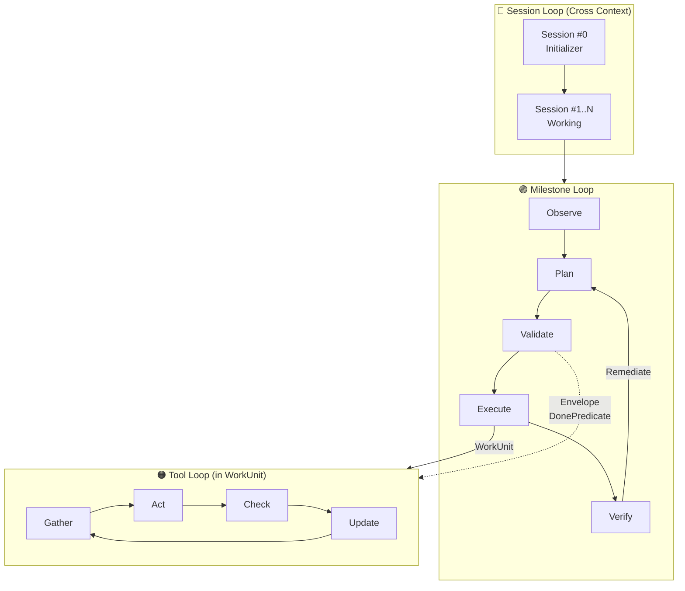

# 文生图提示词：Agent Framework 三层循环架构图

---

## 提示词 1：整体架构图（技术风格）

```
Create a technical architecture diagram for an AI Agent Framework with three nested loops:

OVERALL STRUCTURE:
- The diagram shows three concentric layers, like Russian nesting dolls
- Use a clean, modern tech diagram style with dark background (#1a1a2e) and neon accent colors
- Each layer should be a distinct rounded rectangle with different border colors

LAYER 1 (OUTERMOST) - SESSION LOOP:
- Color: Cyan/Teal border (#00d9ff)
- Label: "SESSION LOOP (Cross Context Window)"
- Contains: Two boxes "Session #0 Initializer" and "Session #1..N Working" connected by arrow
- Small icons: document, git branch, progress bar

LAYER 2 (MIDDLE) - MILESTONE LOOP:
- Color: Purple/Magenta border (#ff00ff)
- Label: "MILESTONE LOOP (Single Milestone)"
- Contains: Flow of 5 connected boxes: Observe → Plan → Validate → Execute → Verify
- "Validate" box has a shield icon (security gate)
- Arrow from Verify back to Plan labeled "Remediate"

LAYER 3 (INNERMOST) - TOOL LOOP:
- Color: Orange/Yellow border (#ffaa00)
- Label: "TOOL LOOP (Inside WorkUnit)"
- Contains: Circular flow of 4 boxes: Gather → Act → Check → Update
- Small lock icon on "Act" box representing ToolRuntime Gate
- Dashed exit arrow labeled "DonePredicate Satisfied"

ADDITIONAL ELEMENTS:
- On the right side, show a vertical legend explaining:
  - Envelope (allowed_tools + budget)
  - DonePredicate (evidence + invariant)
  - StepType (Atomic vs WorkUnit)
- Use connecting lines to show which concepts apply to which layer

STYLE:
- Flat design, no 3D effects
- Monospace font for labels
- Subtle glow effects on borders
- Grid background pattern
- 16:9 aspect ratio
- High contrast, readable text
```

---

## 提示词 2：简化版流程图（白板风格）

```
Create a clean whiteboard-style flowchart for an AI Agent execution model:

THREE HORIZONTAL SWIM LANES:
- Top lane (light blue): "Session Loop" - shows timeline with Session #0, #1, #2, #N
- Middle lane (light purple): "Milestone Loop" - shows Plan → Validate → Execute → Verify cycle
- Bottom lane (light orange): "Tool Loop" - shows Gather → Act → Check → Update cycle

KEY VISUAL ELEMENTS:
1. Session #0 labeled "Initializer" with document icons (TaskPlan, ProgressLog)
2. Validate box has a prominent GATE symbol (like a security checkpoint)
3. Execute box splits into two paths:
   - "Atomic Step" (single arrow, direct)
   - "WorkUnit Step" (arrow goes down to Tool Loop)
4. Tool Loop has a circular arrow showing iteration
5. Exit conditions shown as decision diamonds:
   - "DonePredicate?" with Yes/No paths
   - "Budget/Stagnant?" with Yes→Fail path

ANNOTATIONS:
- Small callout boxes explaining:
  - "Validate = 制定契约" (Define Contract)
  - "ToolRuntime = 执行契约" (Execute Contract)
  - "DonePredicate = Evidence + Invariant + Budget"

STYLE:
- Hand-drawn sketch aesthetic
- Pastel colors
- Rounded corners on all boxes
- Simple icons (no complex graphics)
- White background
- Black text, readable fonts
- Arrows with slight curves, not perfectly straight
```

---

## 提示词 3：3D层叠视图（现代感）

```
Create a 3D isometric diagram showing three stacked platform layers for an AI Agent Framework:

BOTTOM PLATFORM (Foundation):
- Label: "Session Loop"
- Color: Deep blue (#1e3a5f)
- Shows: Timeline blocks representing sessions, with git and document icons
- Floating labels: "TaskPlan", "ProgressLog", "EventLog"

MIDDLE PLATFORM (Core):
- Label: "Milestone Loop"  
- Color: Purple (#4a1e5f)
- Elevated above bottom platform with visible supports
- Shows: Pentagon shape with 5 nodes: Observe, Plan, Validate, Execute, Verify
- Validate node has a glowing shield effect
- Circular arrow connecting all nodes

TOP PLATFORM (Inner):
- Label: "Tool Loop"
- Color: Orange/Gold (#5f4a1e)
- Smallest platform, floating above middle
- Shows: 4 connected cubes in a square: Gather, Act, Check, Update
- Rotating arrow symbol in center
- Connected to "Execute" on middle platform by a glowing beam

SIDE ELEMENTS:
- Floating info cards on the right:
  - "Envelope" card with list icon
  - "DonePredicate" card with checkmark icon
  - "Budget" card with timer icon

STYLE:
- Clean isometric 3D
- Subtle shadows and depth
- Glowing edges on active elements
- Dark gradient background (#0a0a1a to #1a1a2e)
- Minimal, modern aesthetic
- Tech/startup feel
- 4K resolution quality
```

---

## 提示词 4：对比图（我们 vs Anthropic）

```
Create a split-screen comparison diagram:

LEFT SIDE - "Anthropic Approach":
- Title: "Claude Code / Agent SDK"
- Simple loop diagram: gather → act → verify → repeat
- Color: Anthropic orange (#d97706)
- Key features listed below:
  - ✓ Two-Part Solution
  - ✓ Progress File
  - ✓ Skills
  - ✗ Validate Gate
  - ✗ Evidence Chain

RIGHT SIDE - "Our Framework":
- Title: "Production-Ready Agent"
- Three nested loops diagram
- Color: Blue/Purple gradient
- Key features listed below:
  - ✓ Session Loop (borrowed)
  - ✓ Milestone Loop + Validate
  - ✓ Tool Loop + Envelope
  - ✓ DonePredicate
  - ✓ Evidence Chain + Audit

CENTER DIVIDER:
- Vertical line with "+" symbol
- Text: "Combined = Best of Both Worlds"

BOTTOM:
- Merged result showing complete framework
- Tagline: "既能长跑，又敢上线" (Can run long, dare to go live)

STYLE:
- Clean comparison layout
- Checkmarks in green, X marks in red
- Professional presentation style
- White background
- Clear typography
```

---

## 提示词 5：数据流图（工程风格）

```
Create a data flow diagram showing how data moves through the Agent Framework:

MAIN FLOW (left to right):
Task → Session #0 → [TaskPlan, ProgressLog] → Session #N → Milestone Loop → Result

MILESTONE LOOP DETAIL (expanded box):
┌─────────────────────────────────────────────────────┐
│ Observe ──→ Plan ──→ Validate ──→ Execute ──→ Verify │
│    ↓         ↓          ↓           ↓          ↓     │
│ Context   Plan     ValidatedSteps  Results   Report  │
│           (untrusted) + Envelope   + Evidence        │
└─────────────────────────────────────────────────────┘

DATA ARTIFACTS (shown as database cylinders):
- TaskPlan (blue)
- ProgressLog (green)
- EventLog (orange)
- Evidence Store (purple)

KEY TRANSFORMATIONS (shown as hexagons):
- "Trust Boundary Derivation" between Plan and Validate
- "DonePredicate Check" inside Execute
- "Deterministic Verification" at Verify

ANNOTATIONS:
- Red dashed box around "Plan" labeled "LLM Output (Untrusted)"
- Green solid box around "ValidatedSteps" labeled "System Derived (Trusted)"

STYLE:
- UML/technical diagram style
- Boxes for processes
- Cylinders for data stores
- Hexagons for transformations
- Arrows with labels
- Light gray background
- Black and colored elements
```

---

## 使用建议

| 工具 | 推荐提示词 | 说明 |
|------|-----------|------|
| Midjourney | 提示词 3 | 3D效果好 |
| DALL-E 3 | 提示词 1 或 2 | 技术图和白板风格都行 |
| Stable Diffusion | 提示词 1 | 需要配合 ControlNet |
| Mermaid/Draw.io | 提示词 5 | 用于生成精确的数据流图 |
| Figma + AI | 提示词 4 | 对比图需要精确布局 |

---

## 额外建议：用 Mermaid 生成精确版本

如果需要精确的技术图，可以用 Mermaid：



这个 Mermaid 代码可以直接在支持 Mermaid 的工具中渲染成图。
