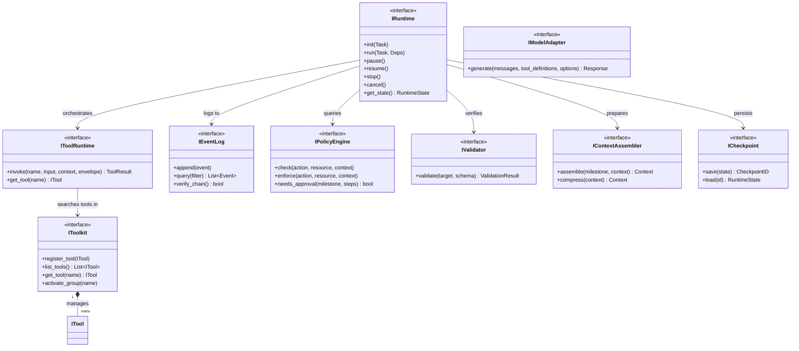
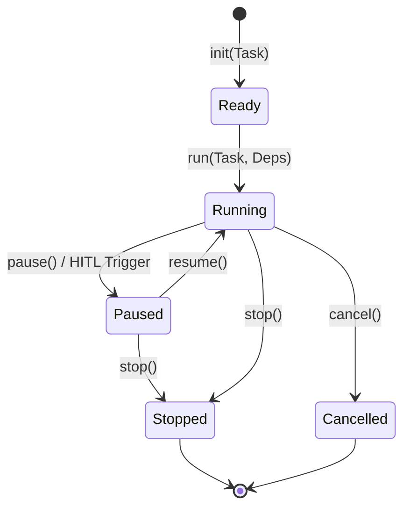
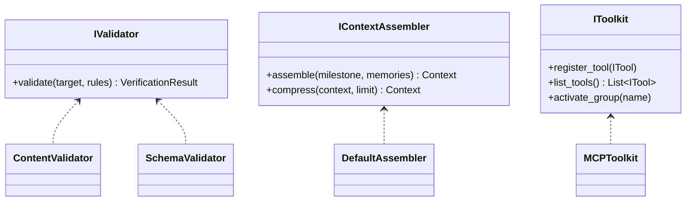

# DARE（Deterministic Agent Runtime Engine） Framework 架构终稿评审 v1.1

> 综合 AgentScope 和 Pydantic AI 的分析，确定最终接口架构设计。
> v1.1 更新：基于 v1 全量内容，新增 IRuntime 状态机接口、扩展示例 UML 类图、优化状态迁移逻辑、统一 IValidator 验证体系；并合并补充说明，引入 Plan Loop / Remediate、细化 Envelope 与 DonePredicate、补充 MilestoneContext / ToolError。

---

## 一、最终架构总览

### 1.1 架构分层全景

```
╔═══════════════════════════════════════════════════════════════════════════════════╗
║                           DARE Framework 架构全景                                  ║
╠═══════════════════════════════════════════════════════════════════════════════════╣
║                                                                                    ║
║  ┏━━━━━━━━━━━━━━━━━━━━━━━━━━━━━━━━━━━━━━━━━━━━━━━━━━━━━━━━━━━━━━━━━━━━━━━━━━━━━┓ ║
║  ┃ Layer 1: Core Infrastructure（框架核心，通常不替换）                         ┃ ║
║  ┃                                                                              ┃ ║
║  ┃  ┌─────────────┐  ┌─────────────┐  ┌─────────────┐  ┌─────────────┐        ┃ ║
║  ┃  │ IRuntime    │  │ IEventLog   │  │IToolRuntime │  │IPolicyEngine│        ┃ ║
║  ┃  │ 执行引擎    │  │ 事件日志    │  │ 工具总线    │  │ 策略引擎    │        ┃ ║
║  ┃  │ (状态机化)  │  │ (WORM)      │  │ (Parent)    │  │ (Approval)  │        ┃ ║
║  ┃  └─────────────┘  └─────────────┘  └─────────────┘  └─────────────┘        ┃ ║
║  ┃                                                                              ┃ ║
║  ┃  ┌─────────────┐  ┌─────────────┐  ┌─────────────┐                          ┃ ║
║  ┃  │TrustBoundary│  │IContextAssem│  │ IValidator  │                          ┃ ║
║  ┃  │ 信任边界    │  │ 上下文装配  │  │ (统一验证)  │                          ┃ ║
║  ┃  └─────────────┘  └─────────────┘  └─────────────┘                          ┃ ║
║  ┗━━━━━━━━━━━━━━━━━━━━━━━━━━━━━━━━━━━━━━━━━━━━━━━━━━━━━━━━━━━━━━━━━━━━━━━━━━━━━┛ ║
║                                         │                                         ║
║                                         ▼                                         ║
║  ┏━━━━━━━━━━━━━━━━━━━━━━━━━━━━━━━━━━━━━━━━━━━━━━━━━━━━━━━━━━━━━━━━━━━━━━━━━━━━━┓ ║
║  ┃ Layer 2: Pluggable Components（可插拔，框架提供默认实现）                    ┃ ║
║  ┃                                                                              ┃ ║
║  ┃  ┌─────────────────────────────────────────────────────────────────────┐    ┃ ║
║  ┃  │ IModelAdapter                     IMemory                            │    ┃ ║
║  ┃  │ ├── ClaudeAdapter ✅              ├── InMemoryMemory ✅              │    ┃ ║
║  ┃  │ ├── OpenAIAdapter ✅              ├── VectorMemory ✅                │    ┃ ║
║  ┃  │ └── OllamaAdapter ✅              └── FileMemory ✅                  │    ┃ ║
║  ┃  └─────────────────────────────────────────────────────────────────────┘    ┃ ║
║  ┃                                                                              ┃ ║
║  ┃  ┌─────────────────────────────────────────────────────────────────────┐    ┃ ║
║  ┃  │ ITool / IToolkit                  IMCPClient                         │    ┃ ║
║  ┃  │ ├── (Atomic Tools) ✅             ├── StdioMCPClient ✅              │    ┃ ║
║  ┃  │ └── (MCP Bridge)  ✅             └── SSEMCPClient ✅                │    ┃ ║
║  ┃  └─────────────────────────────────────────────────────────────────────┘    ┃ ║
║  ┃                                                                              ┃ ║
║  ┃  ┌─────────────────────────────────────────────────────────────────────┐    ┃ ║
║  ┃  │ ISkill                            IHook                              │    ┃ ║
║  ┃  │ └── (开发者定义)                ├── LoggingHook ✅                 │    ┃ ║
║  ┃  │                                   └── MetricsHook ✅                 │    ┃ ║
║  ┃  └─────────────────────────────────────────────────────────────────────┘    ┃ ║
║  ┗━━━━━━━━━━━━━━━━━━━━━━━━━━━━━━━━━━━━━━━━━━━━━━━━━━━━━━━━━━━━━━━━━━━━━━━━━━━━━┛ ║
║                                         │                                         ║
║                                         ▼                                         ║
║  ┏━━━━━━━━━━━━━━━━━━━━━━━━━━━━━━━━━━━━━━━━━━━━━━━━━━━━━━━━━━━━━━━━━━━━━━━━━━━━━┓ ║
║  ┃ Layer 3: Agent Composition（开发者组装）                                     ┃ ║
║  ┃                                                                              ┃ ║
║  ┃  AgentBuilder[DepsT, OutputT]                                                ┃ ║
║  ┃  ├── .with_model() / .with_tools() / .with_mcp()                             ┃ ║
║  ┃  └── .build() → Agent[DepsT, OutputT]                                        ┃ ║
║  ┗━━━━━━━━━━━━━━━━━━━━━━━━━━━━━━━━━━━━━━━━━━━━━━━━━━━━━━━━━━━━━━━━━━━━━━━━━━━━━┛ ║
╚═══════════════════════════════════════════════════════════════════════════════════╝
```

### 1.2 核心关系 UML (Core Interface Hub)



---

## 二、关键设计与接口详情

### 2.1 IRuntime：作为确定性状态机

DARE 的核心是将 Agent 执行建模为一个**确定性有限状态机（DFSM）**。这种设计确保了任务的可挂起性、可恢复性和可审计性。

#### 2.1.1 状态转换图 (Runtime State Transitions)


#### 2.1.2 状态机行为说明
- **Ready**: 任务已加载，资源已准备。
- **Running**: Milestone Loop 正在进行。
- **Paused**: 状态已持久化到 `ICheckpoint`，等待外部人工（HITL）或事件唤醒。
- **Stopped**: 任务正常完成或显式回收资源。

### 2.2 Layer 1: Core Infrastructure (核心基础设施)

| 接口 | 职责 | 关键方法 | 默认实现 |
|-----|------|---------|---------|
| `IRuntime` | 执行引擎，编排四层循环（Plan Loop 内层）及状态控制 | `run()`, `pause()`, `resume()`, `stop()`, `init()` | `AgentRuntime` |
| `IEventLog` | 事件日志，append-only (WORM) | `append()`, `query()`, `verify_chain()` | `LocalEventLog` |
| `IToolRuntime` | **工具执行入口**，处理调用上下文与安全门禁 | `invoke()`, `get_tool()` | `ToolRuntime` |
| `IPolicyEngine` | 策略检查与执行（含 HITL 审批触发） | `check()`, `enforce()`, `needs_approval()` | `PolicyEngine` |
| `TrustBoundary` | 信任边界验证（逻辑组件） | `validate_step()`, `derive_safe_fields()` | 框架内置 |
| `IContextAssembler` | 上下文装配与压缩 | `assemble()`, `compress()` | `ContextAssembler` |
| `IValidator` | 统一验证器（含原 Verifier 功能） | `validate()` | 多个内置验证器 |

#### 2.2.1 辅助核心接口详情


### 2.3 Layer 2: Pluggable Components (可插拔组件)

| 接口 | 职责 | 内置实现 | 可扩展 |
|-----|------|---------|--------|
| `IModelAdapter` | LLM 适配 | `ClaudeAdapter`, `OpenAIAdapter`, `OllamaAdapter` | ✅ |
| `IMemory` | 记忆管理 | `InMemoryMemory`, `VectorMemory`, `FileMemory` | ✅ |
| `ITool` | 单个工具定义 | `ReadFileTool`, `WriteFileTool`, `SearchCodeTool`, `RunCommandTool`, `RunTestsTool` | ✅ |
| `IToolkit` | **工具注册与生命周期管理** (Registry) | `MCPToolkit`, `LocalToolkit` | ✅ |
| `IMCPClient` | MCP 客户端 | `StdioMCPClient`, `SSEMCPClient` | ✅ |
| `ISkill` | 复合技能 | （开发者定义） | ✅ |
| `IHook` | 生命周期钩子 | `LoggingHook`, `MetricsHook` | ✅ |
| `ICheckpoint` | 状态持久化 | `FileCheckpoint` | ✅ |

### 2.4 新增辅助接口 (Learning from Ecosystem)

| 接口 | 来源 | 职责 |
|-----|------|------|
| `RunContext[DepsT]` | Pydantic AI | 泛型依赖注入上下文 |
| `IStreamedResponse[T]` | Pydantic AI | 流式响应抽象 |

### 2.5 核心数据结构（概览）

| 数据结构 | 职责 | 所属循环 |
|---------|------|---------|
| `Task` | 任务定义 | Session Loop |
| `Milestone` | 里程碑定义 | Milestone Loop |
| `MilestoneContext` | 里程碑迭代上下文（反思/错误/证据） | Milestone Loop |
| `ValidatedPlan` | 通过 Validate 的计划（可执行步骤集合） | Plan Loop |
| `ValidatedStep` | 验证后的步骤 | Plan Loop |
| `Envelope` | WorkUnit 执行边界 | Tool Loop |
| `DonePredicate` | 完成条件 | Tool Loop |
| `ToolError` | 工具错误与用户中断 | Milestone Loop |
| `Budget` | 预算限制（Plan/Milestone/Tool） | 多层循环 |

### 2.6 Step 类型：Atomic vs WorkUnit

- **Atomic Step**：单次工具调用，工具返回即结束，无 Tool Loop。
- **WorkUnit Step**：需要多次迭代，进入 Tool Loop；以 DonePredicate 为结束条件。
- **谁决定**：Plan 阶段选择具体 tool → Atomic；选择 skill/复合任务 → WorkUnit。

### 2.7 Plan Loop（计划生成内循环）

Plan Loop 是 Milestone Loop 的内层循环，专注生成通过 Validate 的计划：

```
while not plan_budget.exceeded():
    Observe → Plan → Validate
      ✓ 通过 → return ValidatedPlan
      ✗ 失败 → 记录 plan_attempts（本地变量）并继续
```

关键特性：
- **plan_attempts 仅本地存储**，Plan Loop 成功后丢弃
- **不写入 milestone_ctx**，避免错误计划污染外层上下文
- 只向 Milestone Loop 返回 `ValidatedPlan`
- `ValidatedPlan` 由一组 `ValidatedStep` 组成（每个 step 携带 Envelope/DonePredicate）

### 2.8 Envelope / DonePredicate（执行边界与完成条件）

**Envelope（由 Validate 生成）**：
- `allowed_tools`：可调用工具白名单
- `required_evidence`：必须产出的证据
- `budget`：max_tool_calls / max_tokens / max_wall_time / max_stagnant_iterations
- `risk_level`：由 allowed_tools 推导（READ_ONLY / IDEMPOTENT_WRITE / DESTRUCTIVE）

**DonePredicate**：
- Evidence Conditions：必须收集到的证据
- Invariant Conditions：不变量（lint/compile/clean 等）
- Stagnation Detection：连续 K 次无进展 → Fail

### 2.9 Remediate（反思）与 MilestoneContext

**触发条件**：Verify 失败  
**输入**：failure_reason + tool_errors（含 user_interrupted）  
**输出**：Reflection（反思总结）→ 累积到 `milestone_ctx.reflections`，指导下次 Plan Loop

```python
@dataclass
class MilestoneContext:
    user_input: str
    milestone_description: str
    reflections: list[str] = field(default_factory=list)
    tool_errors: list["ToolError"] = field(default_factory=list)
    evidence_collected: list[str] = field(default_factory=list)
    attempted_plans: list[str] = field(default_factory=list)

@dataclass
class ToolError:
    error_type: str  # "tool_failure" | "user_interrupted" | "timeout"
    tool_name: str
    message: str
    user_hint: str | None = None
```

---

## 三、四层循环与接口映射（Plan Loop 为 Milestone 内层）

### 3.1 循环模型与接口映射

```
╔═══════════════════════════════════════════════════════════════════════════════════╗
║                              四层循环接口映射                                      ║
╠═══════════════════════════════════════════════════════════════════════════════════╣
║                                                                                    ║
║  ┏━━━━━━━━━━━━━━━━━━━━━━━━━━━━━━━━━━━━━━━━━━━━━━━━━━━━━━━━━━━━━━━━━━━━━━━━━━━━━┓ ║
║  ┃ SESSION LOOP（跨 Context Window）                                            ┃ ║
║  ┃                                                                              ┃ ║
║  ┃  使用的接口：                                                                ┃ ║
║  ┃  ├── IRuntime.run()           启动执行                                       ┃ ║
║  ┃  ├── IRuntime.resume()        断点续跑                                       ┃ ║
║  ┃  ├── ICheckpoint.save/load()  状态持久化                                     ┃ ║
║  ┃  ├── IEventLog.append()       记录 session 事件                              ┃ ║
║  ┃  └── IMemory.store/search()   跨 session 记忆                                ┃ ║
║  ┃                                                                              ┃ ║
║  ┃  产物：TaskPlan, ProgressLog, EventLog, Git Commit                          ┃ ║
║  ┃                                                                              ┃ ║
║  ┗━━━━━━━━━━━━━━━━━━━━━━━━━━━━━━━━━━━━━━━━━━━━━━━━━━━━━━━━━━━━━━━━━━━━━━━━━━━━━┛ ║
║                                         │                                         ║
║                              每个 Milestone ↓                                      ║
║                                                                                    ║
║  ┏━━━━━━━━━━━━━━━━━━━━━━━━━━━━━━━━━━━━━━━━━━━━━━━━━━━━━━━━━━━━━━━━━━━━━━━━━━━━━┓ ║
║  ┃ MILESTONE LOOP（外层：Approve → Execute → Verify → Remediate）               ┃ ║
║  ┃                                                                              ┃ ║
║  ┃  ┌───────────────────────────────────────────────────────────────────────┐  ┃ ║
║  ┃  │ PLAN LOOP（内层：Observe → Plan → Validate）                           │  ┃ ║
║  ┃  └───────────────────────────────────────────────────────────────────────┘  ┃ ║
║  ┃                 │ ValidatedPlan                                               ┃ ║
║  ┃                 ▼                                                             ┃ ║
║  ┃           Approve → Execute → Verify                                          ┃ ║
║  ┃                              │                                                ┃ ║
║  ┃                    PASS → Exit                                                ┃ ║
║  ┃                    FAIL → Remediate → 回到 Plan Loop                           ┃ ║
║  ┃                                                                              ┃ ║
║  ┃  产物：ValidatedPlan, Evidence, VerifyReport, Reflections                     ┃ ║
║  ┗━━━━━━━━━━━━━━━━━━━━━━━━━━━━━━━━━━━━━━━━━━━━━━━━━━━━━━━━━━━━━━━━━━━━━━━━━━━━━┛ ║
║                                         │                                         ║
║                        只有 WorkUnit Step ↓ 进入                                   ║
║                                                                                    ║
║  ┏━━━━━━━━━━━━━━━━━━━━━━━━━━━━━━━━━━━━━━━━━━━━━━━━━━━━━━━━━━━━━━━━━━━━━━━━━━━━━┓ ║
║  ┃ TOOL LOOP（Gather → Act → Check → Update）                                   ┃ ║
║  ┃                                                                              ┃ ║
║  ┃  边界：Envelope（allowed_tools, budget, required_evidence）                  ┃ ║
║  ┃  结束：DonePredicate 满足 OR Budget 耗尽 OR 停滞检测                         ┃ ║
║  ┃                                                                              ┃ ║
║  ┃      ┌────────┐   ┌───────┐   ┌───────┐   ┌────────┐                        ┃ ║
║  ┃      │ Gather │──▶│  Act  │──▶│ Check │──▶│ Update │──┐                     ┃ ║
║  ┃      └────┬───┘   └───┬───┘   └───┬───┘   └────┬───┘  │                     ┃ ║
║  ┃           │           │           │            │       │                     ┃ ║
║  ┃           ▼           ▼           ▼            ▼       │                     ┃ ║
║  ┃      IContext    IModel      IToolRuntime  IEventLog   │                     ┃ ║
║  ┃      Assembler   Adapter     ·invoke()     ·append()   │                     ┃ ║
║  ┃      IMemory     (工具选择)   (门禁检查)    (证据收集)  │                     ┃ ║
║  ┃           ▲                                            │                     ┃ ║
║  ┃           └────────────────────────────────────────────┘                     ┃ ║
║  ┃                                                                              ┃ ║
║  ┃  产物：ToolResults, 局部证据                                                 ┃ ║
║  ┃                                                                              ┃ ║
║  ┗━━━━━━━━━━━━━━━━━━━━━━━━━━━━━━━━━━━━━━━━━━━━━━━━━━━━━━━━━━━━━━━━━━━━━━━━━━━━━┛ ║
╚═══════════════════════════════════════════════════════════════════════════════════╝
```

### 3.2 循环与接口映射逻辑

1.  **Session Loop（跨 Context Window）**：负责任务初始化、断点恢复 (`resume`) 和最终交付。
2.  **Milestone Loop（外层闭环）**：Approve → Execute → Verify → Remediate。Verify 失败后产生反思并回到 Plan Loop。
3.  **Plan Loop（内层闭环）**：Observe → Plan → Validate，直到生成 `ValidatedPlan` 或预算耗尽；失败记录在 plan_attempts（本地变量）。
4.  **Tool Loop（WorkUnit 内部循环）**：在 `Envelope` 限定的范围内快速迭代，DonePredicate 判定完成。

### 3.3 阶段与接口映射关系

| 循环 | 阶段 | 使用的接口 | 作用 |
|-----|------|-----------|------|
| **Session** | 初始化/恢复 | `IRuntime.init()`, `ICheckpoint.load()` | 状态准备 |
| | 持久化 | `ICheckpoint.save()`, `IEventLog.append()` | 审计与恢复 |
| **Plan** | Observe | `IContextAssembler`, `IMemory` | 注入上下文 |
| | Plan | `IModelAdapter.generate()` | 生成计划 |
| | Validate | `TrustBoundary`, `IPolicyEngine.check()` | 安全过滤 + 生成 Envelope |
| **Milestone** | Approve | `PolicyEngine` (HITL Trigger) | 人在回路 |
| | Execute | `IToolRuntime.invoke()` | 受控执行 |
| | Verify | `IValidator.validate()` | 验收确定性 |
| | Remediate | LLM | 反思并更新 `milestone_ctx` |
| **Tool** | Gather/Act/Check/Update | `IToolRuntime`, `IEventLog` | 证据收集与迭代 |

---

## 四、内置组件列表

### 4.1 模型适配器 (IModelAdapter)

| 实现 | 状态 | 支持模型 | 说明 |
|-----|------|---------|------|
| `ClaudeAdapter` | ✅ 内置 | claude-sonnet-4, claude-opus-4-5 | Anthropic API |
| `OpenAIAdapter` | ✅ 内置 | gpt-4o, gpt-4o-mini | OpenAI API |
| `OllamaAdapter` | ✅ 内置 | llama, mistral, etc. | 本地模型 |
| `AzureOpenAIAdapter` | 🔜 可选 | Azure 部署 of GPT | Azure 托管 |
| `BedrockAdapter` | 🔜 可选 | AWS 托管模型 | AWS Bedrock |

### 4.2 记忆实现 (IMemory)

| 实现 | 状态 | 适用场景 | 特点 |
|-----|------|---------|------|
| `InMemoryMemory` | ✅ 内置 | 开发/测试 | 无持久化，快速 |
| `VectorMemory` | ✅ 内置 | 语义搜索 | 支持嵌入向量 |
| `FileMemory` | ✅ 内置 | 简单持久化 | JSON 文件存储 |
| `PostgresMemory` | 🔜 可选 | 生产环境 | 关系数据库 |
| `RedisMemory` | 🔜 可选 | 分布式场景 | 高性能缓存 |

### 4.3 工具实现 (ITool)

| 实现 | 状态 | 风险级别 | 说明 |
|-----|------|---------|------|
| `ReadFileTool` | ✅ 内置 | READ_ONLY | 读取文件内容 |
| `WriteFileTool` | ✅ 内置 | IDEMPOTENT_WRITE | 写入文件 |
| `SearchCodeTool` | ✅ 内置 | READ_ONLY | 代码搜索（grep/ripgrep） |
| `RunCommandTool` | ✅ 内置 | NON_IDEMPOTENT | 执行 shell 命令 |
| `RunTestsTool` | ✅ 内置 | READ_ONLY | 运行测试套件 |
| `ListDirectoryTool` | ✅ 内置 | READ_ONLY | 列出目录内容 |

### 4.4 MCP 客户端 (IMCPClient)

| 实现 | 状态 | 传输方式 | 说明 |
|-----|------|---------|------|
| `StdioMCPClient` | ✅ 内置 | stdio | 本地进程通信 |
| `SSEMCPClient` | ✅ 内置 | HTTP SSE | 远程服务器 |
| `WebSocketMCPClient` | 🔜 可选 | WebSocket | 双向实时通信 |

### 4.5 钩子实现 (IHook)

| 实现 | 状态 | 作用 |
|-----|------|------|
| `LoggingHook` | ✅ 内置 | 记录执行日志 |
| `MetricsHook` | ✅ 内置 | 收集性能指标 |
| `TracingHook` | 🔜 可选 | OpenTelemetry 集成 |

### 4.6 核心基础设施默认实现

| 接口 | 默认实现 | 说明 |
|-----|---------|------|
| `IRuntime` | `AgentRuntime` | 四层循环编排（Plan Loop 内层） |
| `IEventLog` | `LocalEventLog` | 本地 append-only 日志 |
| `IToolRuntime` | `ToolRuntime` | 工具门禁 |
| `IPolicyEngine` | `PolicyEngine` | 策略检查 |
| `IContextAssembler` | `ContextAssembler` | 上下文装配 |
| `ICheckpoint` | `FileCheckpoint` | 文件系统持久化 |

---

## 五、状态机实现伪代码

### 5.1 三层循环伪代码（Session/Milestone/Tool，Plan Loop 内嵌）

```python
async def session_loop(task: Task, ctx: RunContext) -> RunResult:
    milestones = await load_or_plan_milestones(task, ctx)
    for milestone in milestones:
        result = await milestone_loop(milestone, ctx)
        await checkpoint.save(task.task_id, milestone.id)
        if not result.success and milestone.is_critical:
            return RunResult(success=False, error=result.error)
    return RunResult(success=True, output=build_output(ctx))


async def milestone_loop(milestone: Milestone, ctx: RunContext) -> MilestoneResult:
    milestone_ctx = MilestoneContext(
        user_input=milestone.user_input,
        milestone_description=milestone.description,
    )
    milestone_budget = Budget(max_attempts=10, max_time_seconds=600, max_tool_calls=100)
    while not milestone_budget.exceeded():
        # Plan Loop（内层）：Observe → Plan → Validate → ValidatedPlan
        validated_plan = await plan_loop(milestone, milestone_ctx, ctx)

        if policy_engine.needs_approval(milestone, validated_plan.steps):
            await pause()
            await wait_for_resume()

        execute_result = await execute_with_error_handling(
            validated_steps=validated_plan.steps,
            milestone_ctx=milestone_ctx,
            ctx=ctx,
        )

        verify_result = await verify(milestone, execute_result, ctx)
        if verify_result.passed:
            return MilestoneResult(success=True, evidence=execute_result.evidence)

        reflection = await remediate(
            verify_result=verify_result,
            tool_errors=milestone_ctx.tool_errors,
            ctx=ctx,
        )
        milestone_ctx.add_reflection(reflection)

    return MilestoneResult(
        success=False,
        reflections=milestone_ctx.reflections,
        error="budget_exceeded",
    )


async def tool_loop(step: ValidatedStep, ctx: RunContext) -> ToolResult:
    envelope = step.envelope
    done_predicate = step.done_predicate
    while not envelope.budget.exceeded():
        gathered = await gather_context(ctx)
        action = await decide_action(step, gathered)
        result = await tool_runtime.invoke(action.tool, action.input, ctx)
        update_evidence(result)
        if done_predicate.is_satisfied():
            return ToolResult(success=True, evidence=collect_evidence())
    return ToolResult(success=False, error="budget_or_stagnation")
```

### 5.2 核心执行引擎实现

```python
class AgentRuntime(IRuntime, Generic[DepsT, OutputT]):
    """
    确定性执行引擎：利用状态机编排 Session/Milestone/Plan/Tool 四层循环。
    """

    def __init__(self, ...):
        self.state = RuntimeState.READY # 初始状态
        # ... 注入 IEventLog, IToolRuntime (Gateway), IPolicyEngine 等

    async def init(self, task: Task):
        """初始化任务环境"""
        self.state = RuntimeState.READY
        await self.event_log.append(TaskInitEvent(task))

    async def run(self, task: Task, deps: DepsT) -> RunResult[OutputT]:
        """
        Session Loop 入口：控制从 Ready 到 Running 的变迁
        """
        if self.state != RuntimeState.READY:
            raise StateError(f"Invalid state for run: {self.state}")
        
        # 状态变迁：Ready -> Running
        self.state = RuntimeState.RUNNING
        ctx = RunContext(deps=deps, run_id=generate_id())

        try:
            return await self._session_loop(task, ctx)
        finally:
            # 最终回收：Running -> Stopped
            if self.state == RuntimeState.RUNNING:
                await self.stop()

    async def _session_loop(self, task: Task, ctx: RunContext) -> RunResult:
        """Session Loop：跨 Context Window 的持久化执行"""
        
        # 1. 恢复或生成里程碑
        milestones = await self._load_or_plan_milestones(task, ctx)

        for milestone in milestones:
            # 状态检查：处理外部中断
            if self.state == RuntimeState.PAUSED:
                await self._wait_for_resume() # 阻塞直至外部调用 resume()
            
            if self.state in [RuntimeState.STOPPED, RuntimeState.CANCELLED]:
                break

            # 2. 进入 Milestone Loop
            result = await self._milestone_loop(milestone, ctx)

            # 3. 状态持久化 (WORM EventLog + Checkpoint)
            await self.checkpoint.save(task.task_id, milestone.id)

            if not result.success and milestone.is_critical:
                return RunResult(success=False, error=result.error)

        return RunResult(success=True, output=self._build_output(ctx))

    async def _milestone_loop(self, milestone: Milestone, ctx: RunContext) -> MilestoneResult:
        """Milestone Loop：外层闭环（Execute → Verify → Remediate）"""

        milestone_ctx = MilestoneContext(
            user_input=milestone.user_input,
            milestone_description=milestone.description,
        )
        milestone_budget = Budget(max_attempts=10, max_time_seconds=600, max_tool_calls=100)

        while not milestone_budget.exceeded():
            milestone_budget.record_attempt()

            # Plan Loop（内层）：Observe → Plan → Validate
            validated_plan = await self._plan_loop(milestone, milestone_ctx, ctx)

            # Approve (HITL：状态驱动变迁)
            if self.policy_engine.needs_approval(milestone, validated_plan.steps):
                # 自动变迁：Running -> Paused
                await self.pause()
                # 这里的阻塞会通过外部 resume() 信号解除
                await self._wait_for_resume()

            # Execute（带错误收集）
            execute_result = await self._execute_with_error_handling(
                validated_steps=validated_plan.steps,
                milestone_ctx=milestone_ctx,
                ctx=ctx,
            )

            # Verify
            verify_result = await self._verify_milestone(milestone, execute_result, ctx)
            if verify_result.passed:
                return MilestoneResult(success=True, evidence=execute_result.evidence)

            # Remediate
            reflection = await self._remediate(
                verify_result=verify_result,
                tool_errors=milestone_ctx.tool_errors,
                ctx=ctx,
            )
            milestone_ctx.add_reflection(reflection)

        return MilestoneResult(
            success=False,
            reflections=milestone_ctx.reflections,
            error="Milestone budget exceeded",
        )

    async def _plan_loop(
        self,
        milestone: Milestone,
        milestone_ctx: MilestoneContext,
        ctx: RunContext,
    ) -> ValidatedPlan:
        """Plan Loop：生成通过 Validate 的计划"""

        plan_budget = Budget(max_attempts=5, max_time_seconds=120)
        plan_attempts: list[str] = []

        while not plan_budget.exceeded():
            # Observe
            context = await self.context_assembler.assemble(milestone, ctx, milestone_ctx)

            # Plan
            tool_definitions = self.tool_runtime.get_all_definitions()
            proposed_steps = await self.model_adapter.generate(context, tool_definitions)

            # Validate
            validated_plan = await self._validate_steps(proposed_steps, ctx)
            if validated_plan.is_valid:
                return validated_plan

            plan_attempts.append(validated_plan.failure_reason)

        raise PlanGenerationFailedError(plan_attempts)

    async def pause(self):
        """Running -> Paused"""
        self.state = RuntimeState.PAUSED
        await self.checkpoint.save() # 强制持久化

    async def resume(self):
        """Paused -> Running"""
        if self.state == RuntimeState.PAUSED:
            self.state = RuntimeState.RUNNING
            # 触发 _wait_for_resume 的信号量解除阻塞

    async def stop(self):
        """Running/Paused -> Stopped"""
        self.state = RuntimeState.STOPPED
        await self.cleanup()

    async def cancel(self):
        """Any -> Cancelled"""
        self.state = RuntimeState.CANCELLED
        await self.event_log.append(UserCancelEvent())
```

### 5.3 工具执行总线实现 (IToolRuntime vs IToolkit)

```python
class ToolRuntime(IToolRuntime):
    """
    工具执行总线 (Gateway)：负责从 Toolkit 查找工具并注入执行上下文。
    """
    def __init__(self, toolkit: IToolkit, policy: IPolicyEngine):
        self.toolkit = toolkit
        self.policy = policy

    async def invoke(self, name: str, input: dict, ctx: RunContext) -> ToolResult:
        # 1. 从 Toolkit 查找工具 (Toolkit 负责注册与生命周期管理)
        tool = self.toolkit.get_tool(name)
        if not tool:
            return ToolResult.error(f"Tool {name} not found")

        # 2. 安全与策略检查
        if not self.policy.check_tool_access(tool, ctx):
            return ToolResult.error("Access Denied")

        # 3. 执行工具并管理上下文
        async with ctx.span(f"tool:{name}"):
            return await tool.run(input, ctx)

    def get_all_definitions(self) -> List[ToolDef]:
        # 委托给 Toolkit 获取工具池
        return self.toolkit.list_tools()
```

---

## 六、学习融合总结

### 6.1 从 Pydantic AI 学习的设计

| 设计 | 采纳状态 | 影响 |
|-----|---------|------|
| `RunContext[DepsT]` 泛型上下文 | ✅ 采纳 | 类型安全的依赖注入 |
| `Agent[DepsT, OutputT]` 泛型 Agent | ✅ 采纳 | 结构化输出类型检查 |
| `IStreamedResponse[T]` | ✅ 采纳 | 流式响应支持 |
| Toolset `filter()`, `prefix()` | ✅ 采纳 | 工具集灵活管理 |

### 6.2 从 AgentScope 学习的设计

| 设计 | 采纳状态 | 影响 |
|-----|---------|------|
| `StateModule` 嵌套状态 | ✅ 采纳 | `ICheckpoint` 增强 |
| Toolkit 分组管理 | ✅ 采纳 | `IToolkit.activate_group()` |
| `FormatterBase` | 🔜 后续 | Prompt 格式化 |

### 6.3 DARE 独有设计（保持差异化）

| 设计 | 说明 | 其他框架没有 |
|-----|------|------------|
| `TrustBoundary` | LLM 输出不可信，安全字段从 Registry 派生 | ✅ |
| `IEventLog` + Hash Chain | Append-only 审计日志，防篡改 | ✅ |
| `RiskLevel` | 工具风险分级（READ_ONLY → COMPENSATABLE） | ✅ |
| `IPolicyEngine` | 策略即代码，权限控制 | ✅ |
| `Plan Loop` + `Remediate` | 计划生成隔离 + Verify 失败反思 | ✅ |
| `Envelope` + `DonePredicate` | WorkUnit 执行边界和完成条件 | ✅ |
| 五个可验证闭环 | 每个安全机制都可证明 | ✅ |

---

## 七、使用示例

### 7.1 开箱即用（零配置）

```python
from dare_framework import AgentBuilder

agent = AgentBuilder.quick_start(
    name="my-agent",
    model="claude-sonnet",
)

result = await agent.run(Task(description="读取 README.md 并总结"))
```

### 7.2 混合使用（选择性配置）

```python
from dare_framework import AgentBuilder
from dare_framework.models import ClaudeAdapter
from dare_framework.tools import ReadFileTool, WriteFileTool
from dare_framework.memory import VectorMemory

agent = (
    AgentBuilder("coding-agent")
    .with_model(ClaudeAdapter())
    .with_tools(ReadFileTool(), WriteFileTool())
    .with_memory(VectorMemory())
    .build()
)

# 显式生命周期控制
await agent.runtime.init(task)
result = await agent.run(task)
```

### 7.3 完全自定义（高级用户）

```python
from dataclasses import dataclass
from dare_framework import AgentBuilder, RunContext

@dataclass
class MyDeps:
    workspace: Path
    db: Database

class MyOutput(BaseModel):
    files_modified: list[str]
    tests_passed: bool

agent: Agent[MyDeps, MyOutput] = (
    AgentBuilder("my-agent")
    .with_model(MyCustomAdapter())
    .with_tools(MyTool1(), MyTool2())
    .with_memory(MyMemory())
    .with_hooks(MyHook())
    .with_output_type(MyOutput)
    .build()
)

result = await agent.run(
    task=Task(description="..."),
    deps=MyDeps(workspace=Path("."), db=db),
)
# result.output: MyOutput（有类型！）
```

---

*文档状态：架构终稿评审 v1.1（已合并补充说明）*
