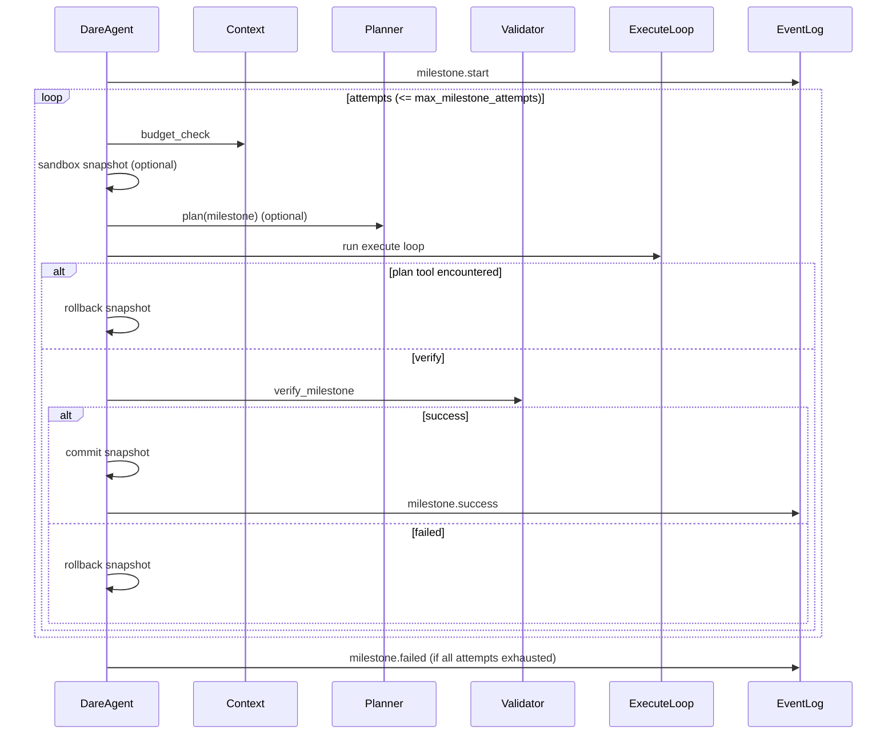
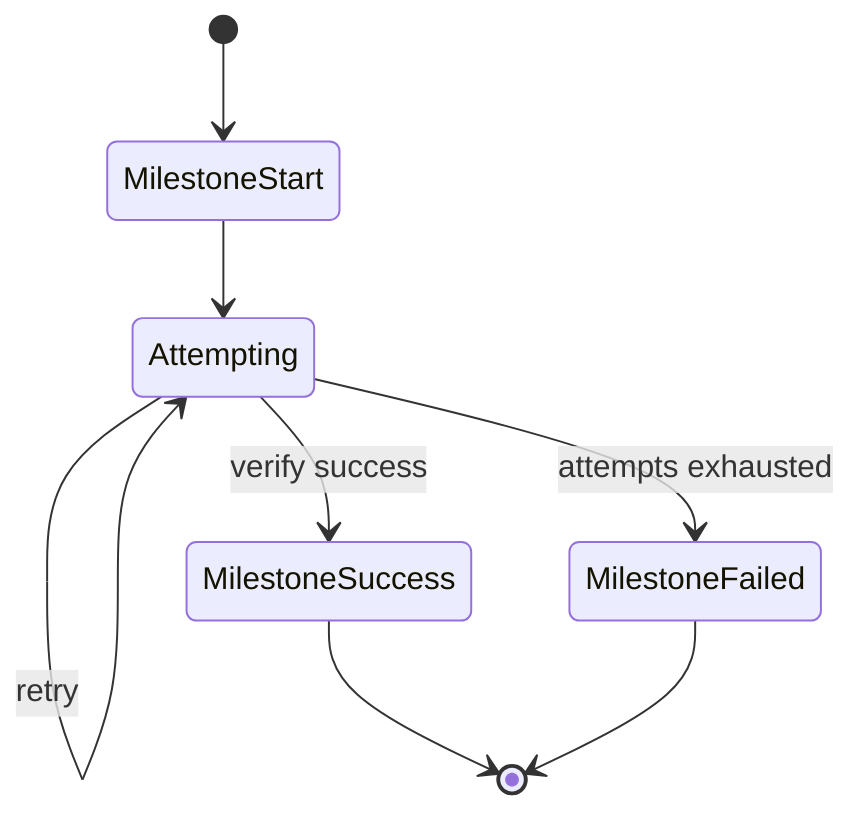

# Agent Design: DareAgent Milestone

> Scope: DareAgent Milestone lifecycle and state (`dare_framework/agent/_internal/orchestration.py`, `dare_framework/agent/dare_agent.py`).

## 1. 核心状态结构

- `MilestoneState`
  - `milestone`：原始 `Milestone`（`plan/types.py`）。
  - `attempts`：字段预留（当前实现未显式递增，attempt 次数由 loop 变量统计）。
  - `reflections`：补救/反思记录（remediator 或 plan tool 触发）。
  - `attempted_plans`：计划验证失败记录（`validate_plan` 的错误快照）。
  - `evidence_collected`：工具执行产出的证据列表（来自 `ToolResult.evidence`）。
- `MilestoneResult`
  - `success` / `outputs` / `errors` / `verify_result`

## 2. 生命周期与关键流程

1. 触发 `BEFORE_MILESTONE` Hook，写入 `milestone.start` 事件。
2. 每个 milestone 最多尝试 `max_milestone_attempts` 次：
   - 预算检查（`Context.budget_check()`）。
   - 若配置了 `IPlanAttemptSandbox`，先创建 STM snapshot。
   - 运行 Plan Loop（若无 planner 则返回 None，仍继续执行）。
   - 运行 Execute Loop（模型 → 工具 → 写回 STM）。
   - 若遇到 plan tool：记录 reflection、回滚 snapshot、进入下一次尝试。
   - 调用 `verify_milestone(...)` 验证：
     - 成功：提交 snapshot、记录 `milestone.success`、触发 `AFTER_MILESTONE`，返回成功结果。
     - 失败：回滚 snapshot；如存在 `remediator` 则生成 reflection 并记录。
3. 达到最大尝试次数仍失败：记录 `milestone.failed`、触发 `AFTER_MILESTONE`，返回失败结果。

### 2.1 Milestone 时序图（简化）

### 2.2 Milestone 状态机（概念）

## 3. 状态隔离与证据

- `DefaultPlanAttemptSandbox` 负责 STM snapshot/rollback/commit（失败回滚，成功提交）。
- `MilestoneState.reflections` 不随 snapshot 回滚（用于保留失败原因与补救线索）。
- `ToolResult.evidence` 会收集到 `MilestoneState.evidence_collected`，供验证与审计。

## 4. Hook / Event 约定

- Hooks：`BEFORE_MILESTONE` / `AFTER_MILESTONE` / `BEFORE_VERIFY` / `AFTER_VERIFY`
- Events：`milestone.start` / `milestone.success` / `milestone.failed`

## 5. 现状限制

- `ValidatedPlan.steps` 尚未驱动执行（执行仍由模型主导）。
- Milestone 间的上下文隔离仅靠 STM snapshot，尚未结合 EventLog 重放策略。
