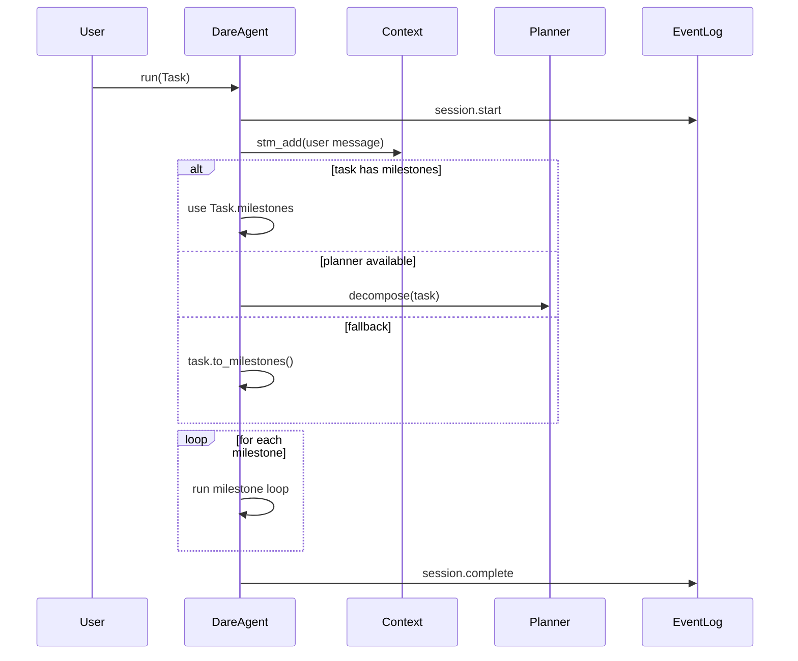
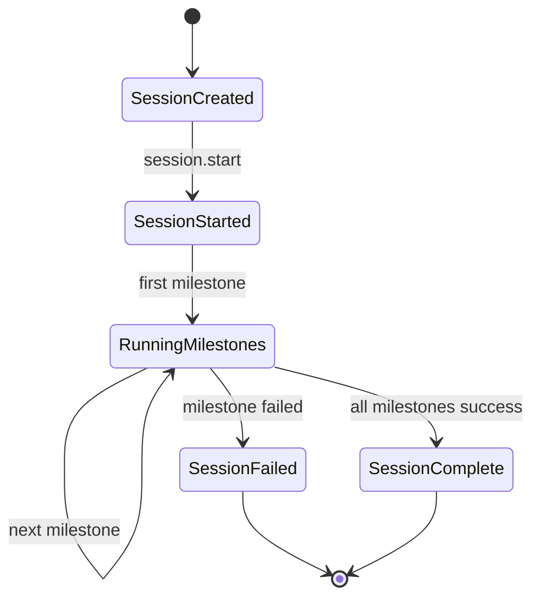

# Agent Design: DareAgent Session

> Scope: DareAgent Session lifecycle and state (`dare_framework/agent/_internal/orchestration.py`, `dare_framework/agent/dare_agent.py`).

## 1. 核心状态结构

- `SessionState`
  - `task_id`：来自 `Task.task_id`（若缺失则在 `run(...)` 时生成）。
  - `run_id`：单次运行的 session id（uuid4 hex）。
  - `milestone_states`：按顺序保存 `MilestoneState` 列表。
  - `current_milestone_idx`：当前 milestone 索引。
  - `session_context`：占位（`SessionContext`，目前未在 DareAgent 中填充，TODO）。

- `SessionContext`（占位）
  - `session_id` / `task_id` / `config` / `config_hash`
  - `previous_session_summary` / `milestone_summaries`
  - `started_at`

## 2. 生命周期与关键流程

1. `run_task(...)` 进入后创建 `SessionState`，发出 `BEFORE_RUN` Hook。
2. 写入 `session.start` 事件并触发 `BEFORE_SESSION` Hook。
3. 将用户输入写入 STM（`Context.stm_add`）。
4. 获取 milestones：
   - 若 `Task.milestones` 非空 → 直接使用；
   - 否则若 `planner` 存在 → `planner.decompose(...)`；
   - 否则 → `task.to_milestones()` 生成单 milestone。
5. 初始化 `MilestoneState` 列表并逐个执行 milestone loop（每个 milestone 前做预算检查与可选的执行控制 `poll_or_raise`）。
6. 任一 milestone 失败即终止 session，记录 `session.complete`（success=false）。
7. 触发 `AFTER_SESSION` Hook；RunResult 取最后一个 milestone 的输出作为最终输出。

### 2.1 Session 时序图（简化）

### 2.2 Session 状态流转（概念）

## 3. Hook / Event 约定

- Hooks：`BEFORE_SESSION` / `AFTER_SESSION`
- Events：`session.start` / `session.milestones_*` / `session.complete`

## 4. 现状限制

- `SessionContext` 仅为预留结构，尚未与 config snapshot / summary 闭环。
- Session 级别的恢复 / replay 未闭环到 EventLog（TODO）。

## 5. 依赖关系

- **Plan**：可选 `planner.decompose(...)`。
- **Context**：STM 写入与后续 assemble。
- **EventLog / Hook**：记录生命周期与观测。
- **ExecutionControl**：在 milestone 进入前做 `poll_or_raise`。
