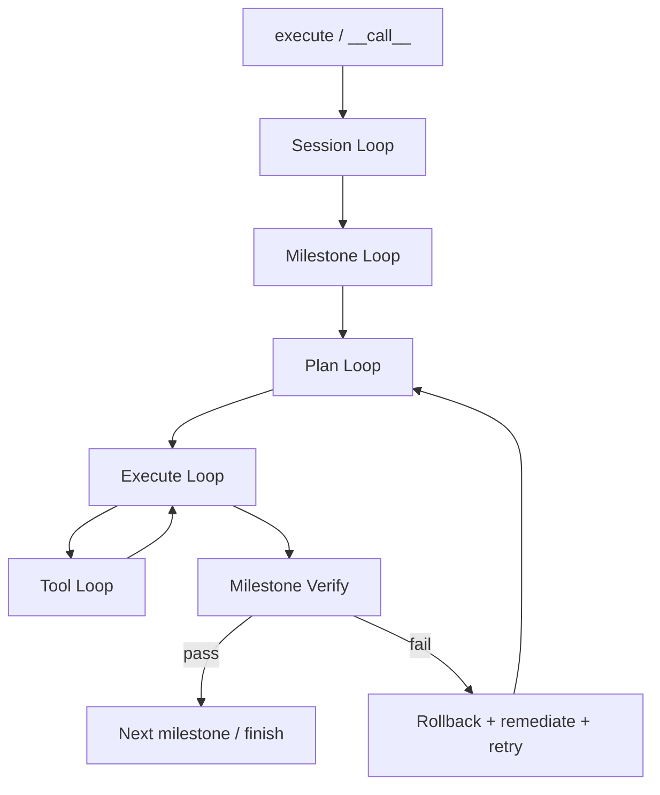

# DareAgent Detailed Design

> 类型：最新目标设计（Expected Shape）
> 作用：复杂任务五层编排（five-layer only）

## 1. 定位

`DareAgent` 是复杂任务编排器，负责可验证、可审计、可恢复的多层执行闭环：

- Session 级任务生命周期管理
- Milestone 级重试与验证
- Plan/Execute/Tool 闭环执行

职责边界：

- 仅承载 five-layer 编排
- 不承担 simple/react 自动降级（由 builder 选择具体 agent）

## 2. 依赖与边界

必选依赖：

- `IModelAdapter`
- `IContext`
- `IToolGateway`

可选依赖：

- `IPlanner` / `IValidator` / `IRemediator`
- `IEventLog` / `IHook` / `ITelemetryProvider`
- `IExecutionControl` / `ToolApprovalManager`
- `AgentChannel`

构造约束：

- `context` 与 `tool_gateway` 必须 builder 注入
- 不支持构造器内兜底创建 context 或 tool_gateway

## 3. 统一契约

输入：

- `str | Task`
- `Task.task_id` 缺失时在执行入口补齐

输出：

- `RunResult`
- `output_text` 必须统一填充

执行入口：

- `execute(task, transport)` 是编排主入口
- `__call__` 未传 transport 时注入 no-op channel 后调用 `execute`

## 4. 五层流程

## 5. 关键状态

`SessionState` 必须维护：

- `task_id`, `run_id`
- `current_milestone_idx`
- `milestone_states`

`MilestoneState` 必须维护：

- `attempts`
- `attempted_plans`
- `reflections`
- `evidence_collected`

## 6. 观测与审计

Hook：

- run/session/milestone/plan/execute/model/tool/verify 前后阶段事件

Event：

- 至少落地 `session.*`, `milestone.*`, `plan.*`, `tool.*`, `model.response`

约束：

- 主执行路径禁止调试 `print`
- 审批与控制流必须 fail-closed

## 7. 当前已知设计待补齐点（详见 TODO）

1. step-driven 执行基线已落地，需继续补齐复杂场景（多步依赖/失败补救组合）的覆盖与验证。
2. 文件体量偏大，需按 loop 职责拆分 orchestrator。
3. output 形状跨 agent 仍需进一步收敛。
