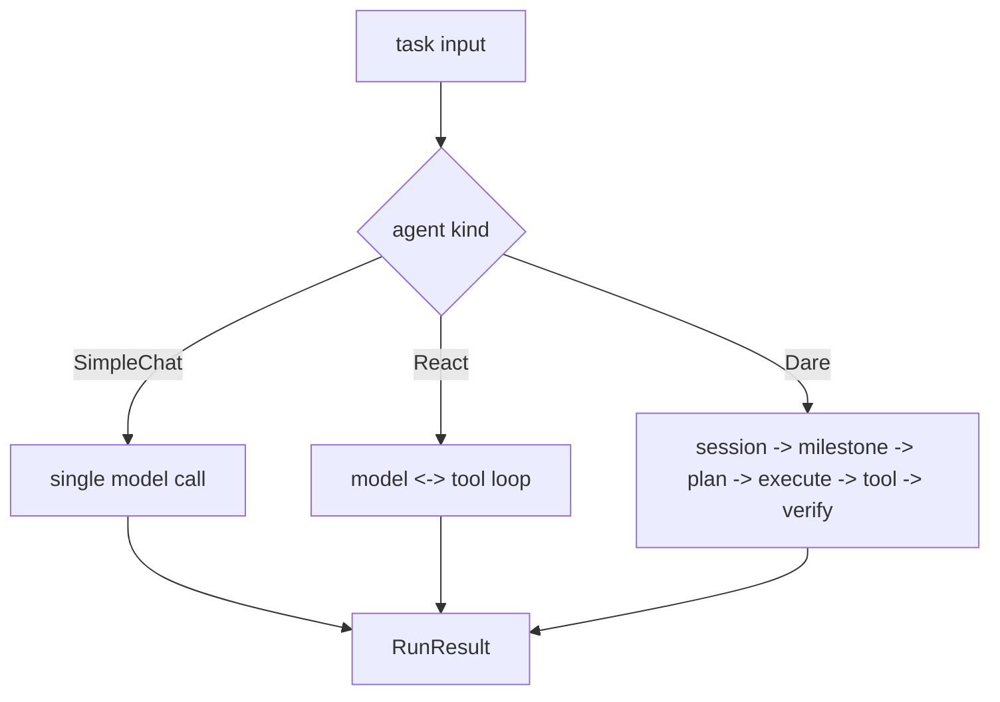

# Module: agent

> 状态：收敛为“最新设计文档 + 单一 TODO”（2026-02-11）

## 1. 模块定位

- 提供统一运行入口：`IAgent.__call__(...)`
- 统一编排接口：`IAgentOrchestration.execute(...)`
- 内置三种编排实现：`SimpleChatAgent` / `ReactAgent` / `DareAgent`

## 2. 文档清单（仅保留以下 4 份）

- `docs/design/modules/agent/SimpleChatAgent_Detailed.md`
- `docs/design/modules/agent/ReactAgent_Detailed.md`
- `docs/design/modules/agent/DareAgent_Detailed.md`
- `docs/design/modules/agent/TODO.md`

约束：

- 设计文档只描述“期望形态”（Expected Shape）。
- 补齐事项统一写入 `TODO.md`，不再拆分 review/fix 子目录。

## 3. 相关 Example（语义必须一致）

- `examples/04-dare-coding-agent/README.md`
- `examples/05-dare-coding-agent-enhanced/README.md`
- `examples/06-dare-coding-agent-mcp/README.md`

说明：DareAgent 当前语义为 five-layer only，不承担 simple/react 自动降级。

## 4. 对外接口（Public Contract）

- 统一入口：`IAgent.__call__(task, transport=None)`
- 编排入口：`IAgentOrchestration.execute(task, transport)`
- 结果契约：统一输出 `RunResult`（含 `output_text`）

详细签名与约束见：
- `SimpleChatAgent_Detailed.md`（最小调用链）
- `ReactAgent_Detailed.md`（ReAct 工具循环）
- `DareAgent_Detailed.md`（five-layer 编排）

## 5. 核心字段（Core Fields）

- 统一任务输入：`Task`（`description/task_id/milestones/metadata`）
- 统一运行输出：`RunResult`（`success/output/output_text/errors/metadata`）
- Five-layer 状态（DareAgent）：
  - `SessionState`: `task_id/run_id/current_milestone_idx/milestone_states`
  - `MilestoneState`: `attempts/attempted_plans/reflections/evidence_collected`

## 6. 关键流程（Runtime Flow）

