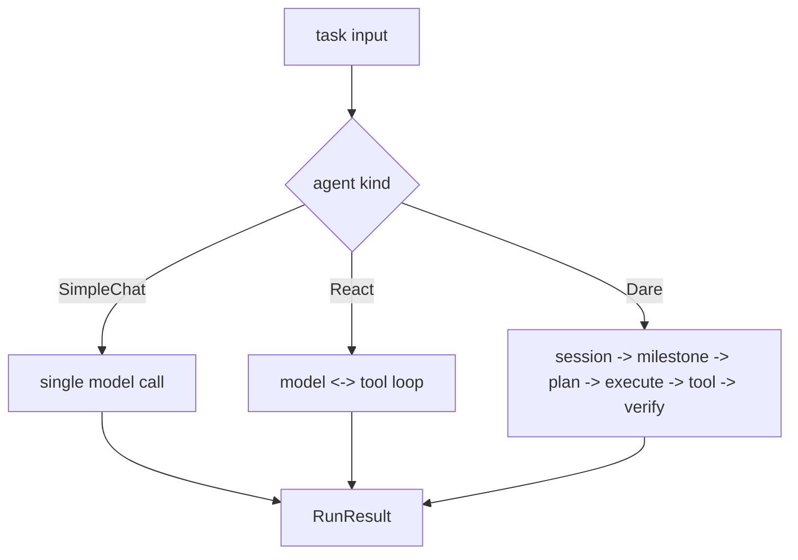

# Module: agent

> 状态：full review 对齐“最新设计文档 + 单一 TODO”（2026-02-27）

## 1. 模块定位

- 提供统一运行入口：`IAgent.__call__(...)`
- 统一编排接口：`IAgentOrchestration.execute(...)`
- 内置三种编排实现：`SimpleChatAgent` / `ReactAgent` / `DareAgent`

## 2. 文档清单（仅保留以下 4 份）

- `docs/design/modules/agent/SimpleChatAgent_Detailed.md`
- `docs/design/modules/agent/ReactAgent_Detailed.md`
- `docs/design/modules/agent/DareAgent_Detailed.md`
- `docs/design/modules/agent/TODO.md`

约束：

- 设计文档只描述“期望形态”（Expected Shape）。
- 补齐事项统一写入 `TODO.md`，不再拆分 review/fix 子目录。

## 3. 相关 Example（语义必须一致）

- `examples/04-dare-coding-agent/README.md`
- `examples/05-dare-coding-agent-enhanced/README.md`
- `examples/06-dare-coding-agent-mcp/README.md`

说明：DareAgent 当前语义为 five-layer only，不承担 simple/react 自动降级。

## 4. 对外接口（Public Contract）

- 统一入口：`IAgent.__call__(task, transport=None)`
- 编排入口：`IAgentOrchestration.execute(task, transport)`
- 结果契约：统一输出 `RunResult`（含 `output_text`）

详细签名与约束见：
- `SimpleChatAgent_Detailed.md`（最小调用链）
- `ReactAgent_Detailed.md`（ReAct 工具循环）
- `DareAgent_Detailed.md`（five-layer 编排）

## 5. 核心字段（Core Fields）

- 统一任务输入：`Task`（`description/task_id/milestones/metadata`）
- 统一运行输出：`RunResult`（`success/output/output_text/errors/metadata`）
- Five-layer 状态（DareAgent）：
  - `SessionState`: `task_id/run_id/current_milestone_idx/milestone_states`
  - `MilestoneState`: `attempts/attempted_plans/reflections/evidence_collected`

## 6. 关键流程（Runtime Flow）

## 能力状态（landed / partial / planned）

- `landed`: 见文档头部 Status 所述的当前已落地基线能力。
- `partial`: 当前实现可用但仍有 TODO/限制（见“约束与限制”与“TODO / 未决问题”）。
- `planned`: 当前文档中的未来增强项，以 TODO 条目为准，未纳入当前实现承诺。

## 最小标准补充（2026-02-27）

### 总体架构
- 模块实现主路径：`dare_framework/agent/`。
- 分层契约遵循 `types.py` / `kernel.py` / `interfaces.py` / `_internal/` 约定；对外语义以本 README 的“对外接口/关键字段/关键流程”章节为准。
- 与全局架构关系：作为 `docs/design/Architecture.md` 中对应 domain 的实现落点，通过 builder 与运行时编排接入。

### 异常与错误处理
- 参数或配置非法时，MUST 显式返回错误（抛出异常或返回失败结果），禁止静默吞错。
- 外部依赖失败（模型/存储/网络/工具）时，优先执行可观测降级策略：记录结构化错误上下文，并在调用边界返回可判定失败。
- 涉及副作用或策略判定的失败路径，MUST 保留审计线索（事件日志或 Hook/Telemetry 记录），以支持回放和排障。

### 测试锚点（Test Anchor）

- `tests/unit/test_five_layer_agent.py`（five-layer 主循环基线）
- `tests/unit/test_dare_agent_step_driven_mode.py`（step-driven 执行路径）
