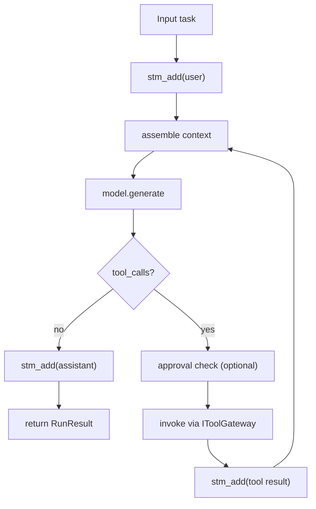

# ReactAgent Detailed Design

> 类型：最新目标设计（Expected Shape）
> 作用：模型驱动工具循环（ReAct）

## 1. 定位

`ReactAgent` 负责执行态编排，不负责计划分解：

- 由模型动态决定工具调用顺序
- 适用于“需要工具能力但不需要 milestone 验证”的任务

## 2. 依赖与边界

必选依赖：

- `IModelAdapter`
- `IContext`
- `IToolGateway`

可选依赖：

- `ToolApprovalManager`
- `IHook` / `IEventLog`
- `AgentChannel`

边界约束：

- `IToolGateway` 必须构造注入并由 agent 持有
- 执行循环中不允许反查 context 私有字段获取 gateway

## 3. 统一契约

输入：

- `str | Task`

输出：

- 统一 `RunResult`
- `output_text` 由 BaseAgent 统一填充

执行入口：

- `execute(task, transport)`（direct-call 与 transport-loop 复用）

## 4. 执行流程

## 5. 约束

1. 每轮都必须执行预算检查。
2. 每个 tool_call 必须有可追踪关联 id。
3. 工具失败必须回写上下文，确保模型可自恢复。
4. 超过最大轮次时返回结构化失败结果。
