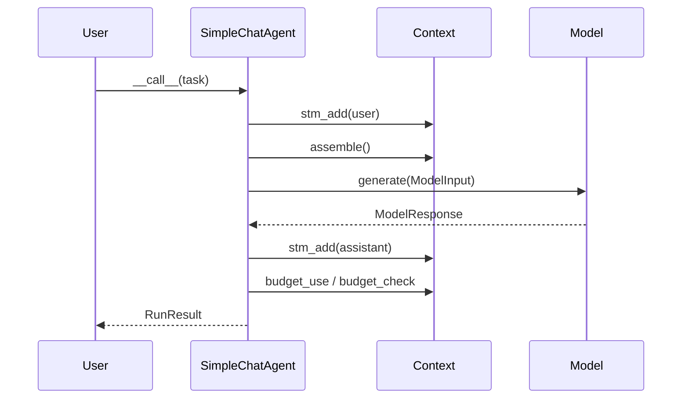

# SimpleChatAgent Detailed Design

> 类型：最新目标设计（Expected Shape）
> 作用：最小对话编排模板

## 1. 定位

`SimpleChatAgent` 用于单轮、低开销、可预测的模型调用场景：

- 简单问答
- 联通性验证
- 无工具执行、无规划、无里程碑验证场景

## 2. 依赖与边界

必选依赖：

- `IModelAdapter`
- `IContext`
- `IToolGateway`（仅用于 Context 组装工具定义，不执行工具）

可选依赖：

- `AgentChannel`（仅 transport 模式）

边界约束：

- 不依赖 `IPlanner/IValidator/IRemediator`
- 不依赖 `ToolApprovalManager`
- 不允许读取 context 私有字段

## 3. 统一契约

输入：

- `str | Task`
- `str` 在入口处转换为 `Task.description`

输出：

- 统一由 BaseAgent 包装为 `RunResult`
- `RunResult.output_text` 必须由 normalizer 填充

执行入口：

- `__call__` 与 transport poll 均走 `execute(task, transport)`

## 4. 执行流程

## 5. 约束

1. 禁止工具执行循环（tool_calls 不进入 invoke 流程）。
2. 禁止规划/验证补救逻辑混入。
3. 模型返回空内容时必须有稳定归一策略（空字符串）。
4. 不允许调试 `print` 进入主执行路径。
