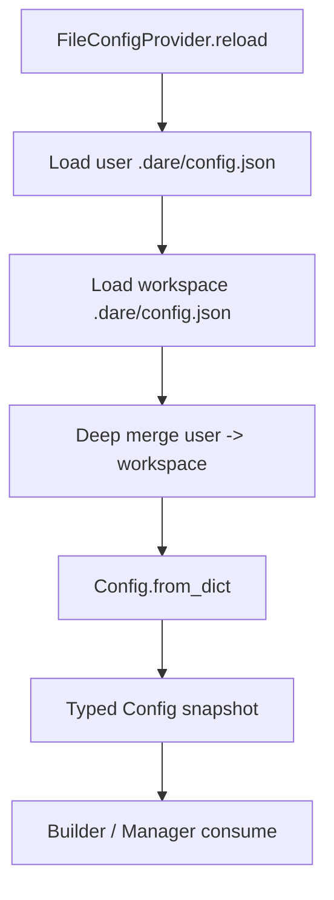

# Module: config

> Status: detailed design aligned to `dare_framework/config` (2026-02-25).

## 1. 定位与职责

- 提供全局配置读取、分层合并与类型化访问。
- 为 Builder / Manager 提供统一的组件启停、实例参数与目录路径。
- 承担 observability / hooks / model / tool / mcp / skill 的统一入口配置。

## 2. 依赖与边界

- 核心依赖：`dare_framework/config/types.py`（配置模型）、`dare_framework/config/kernel.py`（稳定接口）。
- 默认实现：`FileConfigProvider`（JSON 文件，workspace 覆盖 user）。
- 边界约束：
  - config 只负责“配置值解析与快照”，不负责运行时热更新通知。
  - `allow_tools` / `allow_mcps` 当前只落在配置模型，尚未在 Tool/MCP 执行链强制。

## 3. 对外接口（Public Contract）

- `IConfigProvider.current() -> Config`
  - 返回当前配置快照。
- `IConfigProvider.reload() -> Config`
  - 重新加载并返回新快照。
- `build_config_provider(workspace_dir, user_dir) -> IConfigProvider`
  - 创建默认 `FileConfigProvider`。
- `Config` 实例方法（跨模块常用）
  - `component_settings(component_type) -> ComponentConfig`
  - `is_component_enabled(component) -> bool`
  - `component_config(component) -> Any | None`
  - `filter_enabled(components) -> list[IComponent]`

## 4. 关键字段（Core Fields）

### 4.1 顶层 `Config`

- `llm: LLMConfig`
- `mcp: dict[str, dict[str, Any]]`
- `mcp_paths: list[str]`
- `skill_paths: list[str]`
- `tools: dict[str, dict[str, Any]]`
- `allow_tools: list[str]`
- `allow_mcps: list[str]`
- `components: dict[str, ComponentConfig]`
- `hooks: HooksConfig`
- `knowledge: dict[str, Any]`
- `long_term_memory: dict[str, Any]`
- `workspace_dir: str`
- `user_dir: str`
- `prompt_store_path_pattern: str`
- `default_prompt_id: str | None`
- `observability: ObservabilityConfig`

### 4.2 子结构

- `LLMConfig`
  - `adapter`, `endpoint`, `api_key`, `model`, `proxy`, `extra`
- `ProxyConfig`
  - `http`, `https`, `no_proxy`, `use_system_proxy`, `disabled`
- `ComponentConfig`
  - `disabled`, `entries`
- `HooksConfig`
  - `version`, `defaults`, `entries`, `priority_for(...)`
- `ObservabilityConfig`
  - `enabled`, `traces_enabled`, `metrics_enabled`, `exporter`, `sampling_ratio`, `redaction`, ...

## 5. 关键流程（Runtime Flow）

## 6. 与其他模块的交互

- **Model**：读取 `Config.llm` 初始化 adapter 与 endpoint。
- **Tool**：读取 `tools/components/allow_tools` 决定工具装配与筛选。
- **MCP**：读取 `mcp` / `mcp_paths` 构建 client。
- **Skill**：读取 `skill_paths` 驱动 skill 加载。
- **Hook/Observability**：读取 `hooks` 与 `observability`。

## 7. 约束与限制

- 当前只支持 JSON 配置文件。
- `reload()` 是显式触发，不带订阅/广播语义。
- 组件配置值仍有 `Any`，需要逐步收敛类型。

## 8. TODO / 未决问题

- TODO: 支持 YAML/TOML 或环境变量分层。
- TODO: 打通 `allow_tools` / `allow_mcps` 的强制执行。
- TODO: 增加配置热更新与变更事件语义。

## 能力状态（landed / partial / planned）

- `landed`: 见文档头部 Status 所述的当前已落地基线能力。
- `partial`: 当前实现可用但仍有 TODO/限制（见“约束与限制”与“TODO / 未决问题”）。
- `planned`: 当前文档中的未来增强项，以 TODO 条目为准，未纳入当前实现承诺。

## 最小标准补充（2026-02-27）

### 总体架构
- 模块实现主路径：`dare_framework/config/`。
- 分层契约遵循 `types.py` / `kernel.py` / `interfaces.py` / `_internal/` 约定；对外语义以本 README 的“对外接口/关键字段/关键流程”章节为准。
- 与全局架构关系：作为 `docs/design/Architecture.md` 中对应 domain 的实现落点，通过 builder 与运行时编排接入。

### 异常与错误处理
- 参数或配置非法时，MUST 显式返回错误（抛出异常或返回失败结果），禁止静默吞错。
- 外部依赖失败（模型/存储/网络/工具）时，优先执行可观测降级策略：记录结构化错误上下文，并在调用边界返回可判定失败。
- 涉及副作用或策略判定的失败路径，MUST 保留审计线索（事件日志或 Hook/Telemetry 记录），以支持回放和排障。

### 测试锚点（Test Anchor）

- `tests/unit/test_config_model.py`（配置模型与约束）
- `tests/unit/test_config_provider.py`（配置加载与合并流程）
