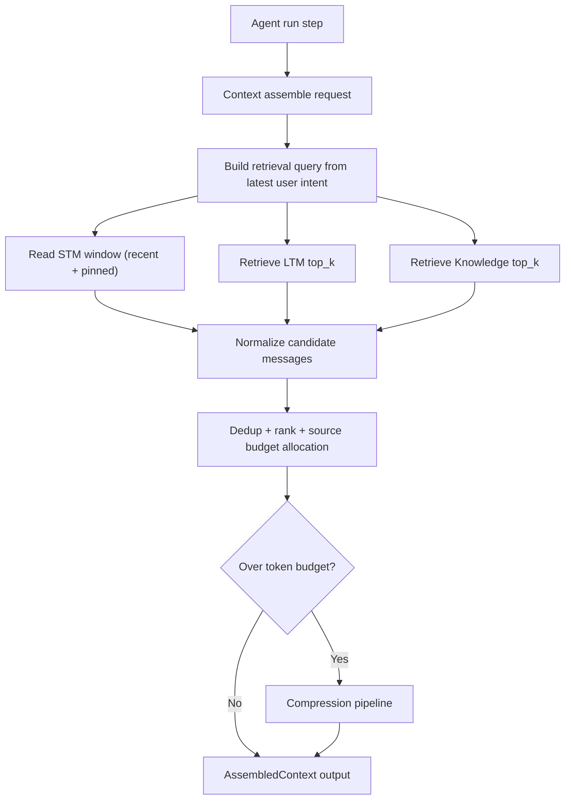
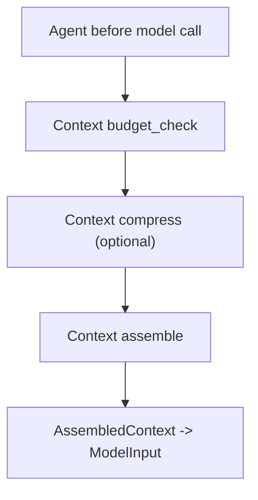

# Module: context

> Status: baseline fusion behavior landed in canonical runtime (2026-02-27).
> 本文分两层：先说明当前实现（as-is），再给出目标态详细设计（to-be）。

## 1. 定位与职责

- Context-centric：`Context` 是会话态中心，负责把多来源信息组装成一次模型调用可消费的输入。
- 统一持有引用：`short_term_memory`、`long_term_memory`、`knowledge`、`budget`、`tool provider`、`sys_prompt`。
- 输出 `AssembledContext(messages, sys_prompt, tools, metadata)`，作为 Agent 进入 Model 的唯一上下文入口。

## 2. 当前实现基线（as-is）

### 2.1 已实现能力

- `stm_add/stm_get/stm_clear`：读写短期记忆（默认 `InMemorySTM`）。
- `listing_tools()`：从 tool provider/manager 拉取并缓存 tool defs。
- `assemble()`：
  - 读取 STM 全量消息；
  - 基于最新 user 意图构造 query，默认检索 LTM/Knowledge（可配置 top_k）；
  - 在预算受限时按 token 估算执行降级（跳过/裁剪检索结果）；
  - 读取 tools；
  - 注入可选 skill 到 `sys_prompt`；
  - 返回 `AssembledContext`（metadata 包含 `context_id` 与 `retrieval` 摘要信息）。
- `compress()`：仅委托 `short_term_memory.compress(**options)`。

### 2.2 现状限制

- 预算控制依赖轻量 token 估算（字符启发式），与模型真实 tokenizer 仍可能存在偏差。
- 当前默认策略未实现高级检索重排与分级压缩（摘要折叠、去重重排等）。
- `retrieval` metadata 已提供基础字段，但跨模块 taxonomy 仍需统一。

## 3. 关键对象与分层语义

- `STM (short_term_memory)`：
  - 会话工作集，保存最近 user/assistant/tool 交互。
  - 低延迟、可写、可压缩，优先承载“当前任务正在发生什么”。
- `LTM (long_term_memory)`：
  - 跨会话持久记忆，优先存“可复用且会影响未来决策”的事实和经验。
  - 通过 `get(query, top_k, ...)` 按需召回，不应全量塞回上下文。
- `Knowledge`：
  - 外部知识源（文档、索引、向量库），优先存“外部事实依据”。
  - 与 LTM 区分：LTM 偏“代理自身历史”，Knowledge 偏“外部知识语料”。

## 4. 详细设计：组装流水线（to-be）

### 4.1 组装目标

在固定 token 预算内，优先保证：
1. 当前轮任务可执行（最近指令、未完成约束、关键工具结果不丢）。
2. 与当前任务强相关的历史与知识被召回。
3. 可追溯（知道每条上下文来自 STM/LTM/Knowledge，以及如何被压缩）。

### 4.2 组装流程（建议）

### 4.3 统一候选消息模型（设计约定）

建议在 `assemble()` 内部把所有来源先归一化为 `Message + metadata`，metadata 至少包含：

- `source`: `stm|ltm|knowledge|summary`
- `score`: 相关性综合分（用于重排和裁剪）
- `token_estimate`: 估算 token
- `retrieval_query`: 本次召回 query（非 STM 可选）
- `compression_flags`: 是否经过摘要/裁剪/去重

这一步不改变 `Message` 主结构，只扩展 metadata，兼容现有接口。

### 4.4 预算分配（建议）

单次组装可采用“分桶预算”而不是全局抢占：

- `stm_budget_ratio`: 50%（最近对话与工具结果）
- `ltm_budget_ratio`: 20%（历史偏好/经验）
- `knowledge_budget_ratio`: 20%（外部事实）
- `reserve_ratio`: 10%（给模型输出与安全冗余）

可根据模式动态调整：
- 工具执行密集场景：提高 STM 桶；
- 问答/RAG 场景：提高 Knowledge 桶。

### 4.5 融合排序（建议）

融合后按综合分排序，示例公式：

`final_score = 0.45 * relevance + 0.25 * recency + 0.20 * source_priority + 0.10 * role_priority`

- `relevance`: 检索相似度或关键词匹配分。
- `recency`: 时间衰减分（STM 默认更高）。
- `source_priority`: 可配置（例如安全策略要求 Knowledge 证据优先）。
- `role_priority`: 系统指令、用户硬约束高于普通 assistant 叙述。

## 5. 详细设计：压缩策略（to-be）

### 5.1 触发点

建议至少在以下时机触发压缩检查：

1. `assemble()` 前：避免把超限上下文直接送给模型。
2. tool loop 每轮后：工具输出可能导致上下文骤增。
3. milestone 结束后：阶段性清理并抽取摘要，避免跨阶段污染。

### 5.2 分级压缩管线

压缩不建议一步到位，采用由轻到重的级联策略：

1. `normalize`: 去空白、去重复分隔符、裁剪超长 tool 原始输出尾部。
2. `dedup`: 消息级和语义级去重（同 query 重复检索结果折叠）。
3. `ranked_drop`: 在每个来源桶内按分数丢弃低价值消息。
4. `summary_fold`: 把旧消息折叠为摘要消息（增量摘要优先）。
5. `hard_truncate`: 兜底末尾截断（保证绝不超预算）。

### 5.3 摘要压缩约定

- `rolling summary`：维护一条“会话运行摘要”消息，定期合并历史片段。
- `segment summary`：对旧 tool 结果或旧对话片段生成局部摘要并替换原文。
- 摘要消息 metadata 建议包含：
  - `summary_of`: 被覆盖消息 id 列表或时间范围；
  - `summary_version`: 摘要迭代版本；
  - `loss_note`: 明确哪些细节被省略。

### 5.4 与现实现的关系

- 当前实现仅覆盖第 5 级（`hard_truncate` 的简化版，且只作用 STM）。
- 其余级别属于上下文工程增强项，可通过覆盖 `Context.compress()` 分阶段接入。

## 6. STM/LTM/Knowledge 使用策略（to-be）

### 6.1 STM 使用策略

- 写入：user、assistant、tool message 全量进入 STM。
- 常驻保留（pin）：
  - 当前任务目标与硬约束；
  - 最近一次失败原因和 remediation 建议；
  - 最新关键工具输出摘要（非原始大块日志）。

### 6.2 LTM 使用策略

- 写入候选（建议由 milestone 完成或 run 结束触发）：
  - 用户偏好（格式、语言、禁忌）；
  - 可复用决策（为何选择某方案）；
  - 稳定环境事实（路径、仓库约束）。
- 召回：
  - 用当前任务 + 最近用户输入构造 query；
  - `top_k` 小批量召回（通常 3~10），经重排后再进入上下文。

### 6.3 Knowledge 使用策略

- 写入：仅通过显式知识摄入路径（如 `knowledge_add` 工具），避免无约束污染。
- 召回：
  - 面向“事实查询/文档依据”；
  - 与 LTM 分开打分，避免个人历史记忆覆盖外部事实证据。

## 7. 审计与可观测性（to-be）

建议扩展 `AssembledContext.metadata` 最小字段：

- `context_id`
- `tool_snapshot_hash`
- `retrieval`:
  - `query`
  - `ltm_count`
  - `knowledge_count`
- `compression`:
  - `trigger`
  - `strategies_applied`
  - `before_token_estimate`
  - `after_token_estimate`
  - `dropped_count`

这些字段可直接支撑 EventLog 与 Hook 的上下文审计。

## 8. 与 Agent 循环的落点

- `SimpleChatAgent` / `ReactAgent` / `DareAgent` 当前都直接调用 `context.assemble()`。
- 推荐统一落点：在每次模型调用前执行：
  1. `budget_check`
  2. `context.compress(...)`（按阈值触发）
  3. `context.assemble(...)`

这样压缩策略可在 Context 域集中治理，不分散到各 Agent。

## 9. 关键接口与实现

- Kernel：`dare_framework/context/kernel.py`
  - `IRetrievalContext`
  - `IContext`
- Types：`dare_framework/context/types.py`
  - `Message`
  - `Budget`
  - `AssembledContext`
- Default Impl：`dare_framework/context/context.py`
  - `Context.assemble()`
  - `Context.compress()`

## 10. 扩展点

- 自定义 Context：
  - 覆盖 `assemble()` 实现多源检索融合；
  - 覆盖 `compress()` 实现分级压缩与摘要折叠。
- 自定义 Retrieval：
  - 任意实现 `IRetrievalContext.get()` 均可挂到 LTM/Knowledge。
- 自定义压缩策略：
  - 保持 `compress(**options)` 入口稳定，按 `strategy`/`budget` 扩展行为。

## 11. TODO / 未决问题

- TODO: 为 `assemble()` 定义标准化 options（`query/top_k/budget_alloc/compression_hint`）。
- TODO: 规范 `AssembledContext.metadata` 审计字段与哈希计算口径。
- TODO: 在默认 Agent 调用链接入“预算检查 -> 压缩 -> 组装”的统一顺序。
- TODO: 明确 LTM 与 Knowledge 的冲突消解与证据优先级规则。

## 12. Design Clarifications (2026-02-05)

- `Context.config` 语义是只读快照，不提供运行时增量更新接口。
- Skill 注入路径是 `assemble()` 时动态 enrich `sys_prompt`，不是单独消息注入。
- 目前 `IContext` 已暴露 `compress()`，但默认实现仍是 STM 截断，属于最小实现而非完整压缩框架。

## 13. Memory / Knowledge 集成实现细节（merged）

### 13.1 当前实现能力（as-is）

- STM：
  - 默认 `InMemorySTM`；
  - `get()` 返回全量消息（忽略 query）；
  - `compress(max_messages=...)` 仅按条数裁剪最近消息。
- LTM：
  - 通过 `create_long_term_memory(config, embedding_adapter)` 创建；
  - 支持 `rawdata` / `vector`；
  - 存储支持 `in_memory` / `sqlite` / `chromadb`（vector）。
- Knowledge：
  - 通过 `create_knowledge(config, embedding_adapter)` 创建；
  - 支持 `rawdata` / `vector`；
  - 存储支持 `in_memory` / `sqlite` / `chromadb`（vector）。

### 13.2 组装时的检索参数约定（to-be）

`Context.assemble()` 建议向 LTM/Knowledge 统一透传：

- `query`
- `top_k`
- `min_similarity`
- `filters`（可选，按后端支持）

目标是让 `IRetrievalContext.get(query="", **kwargs)` 在跨实现时保持可预测行为。

### 13.3 写入策略约定（to-be）

- STM：每轮 user/assistant/tool 在线写入。
- LTM：里程碑完成、run 结束或显式记忆操作时批量持久化。
- Knowledge：仅允许显式摄入（如 `knowledge_add`）避免隐式污染知识库。

### 13.4 Metadata 打标约定（to-be）

融合后建议在 `Message.metadata` 统一记录：

- `source`: `stm|ltm|knowledge|summary`
- `retrieval_score`
- `memory_class`: `working|episodic|factual`
- `session_id` / `timestamp`（可用时）

### 13.5 增补 TODO（memory/knowledge 视角）

- TODO: 统一 `get(**kwargs)` 参数协议（`top_k/min_similarity/filters`）。
- TODO: 给 LTM/Knowledge 定义统一去重 key 与冲突消解规则。
- TODO: 明确知识写入权限、审计与成本计量策略。
- TODO: 增加“召回质量 + 压缩损失”评估指标并接入观测。

## 14. 对外接口汇总（Public Contract Snapshot）

- `IRetrievalContext.get(query="", **kwargs) -> list[Message]`
- `IContext`
  - `stm_add(message)`, `stm_get()`, `stm_clear()`
  - `budget_use(resource, amount)`, `budget_check()`, `budget_remaining(resource)`
  - `list_tools() -> list[CapabilityDescriptor]`
  - `assemble() -> AssembledContext`
  - `compress(**options) -> None`
  - `set_tool_gateway(tool_gateway)`

## 15. 核心字段汇总（Core Fields Snapshot）

- `Message`: `role`, `content`, `name`, `metadata`
- `Budget`: `max_tokens/max_cost/max_time_seconds/max_tool_calls` + `used_*`
- `AssembledContext`: `messages`, `sys_prompt`, `tools`, `metadata`
- 推荐 metadata 最小审计字段：
  - `context_id`
  - `retrieval.query/ltm_count/knowledge_count`
  - `compression.trigger/strategies_applied/before_token_estimate/after_token_estimate`

## 16. 关键流程汇总（Flow Snapshot）

## 能力状态（landed / partial / planned）

- `landed`: 见文档头部 Status 所述的当前已落地基线能力。
- `partial`: 当前实现可用但仍有 TODO/限制（见“约束与限制”与“TODO / 未决问题”）。
- `planned`: 当前文档中的未来增强项，以 TODO 条目为准，未纳入当前实现承诺。

## 最小标准补充（2026-02-27）

### 总体架构
- 模块实现主路径：`dare_framework/context/`。
- 分层契约遵循 `types.py` / `kernel.py` / `interfaces.py` / `_internal/` 约定；对外语义以本 README 的“对外接口/关键字段/关键流程”章节为准。
- 与全局架构关系：作为 `docs/design/Architecture.md` 中对应 domain 的实现落点，通过 builder 与运行时编排接入。

### 异常与错误处理
- 参数或配置非法时，MUST 显式返回错误（抛出异常或返回失败结果），禁止静默吞错。
- 外部依赖失败（模型/存储/网络/工具）时，优先执行可观测降级策略：记录结构化错误上下文，并在调用边界返回可判定失败。
- 涉及副作用或策略判定的失败路径，MUST 保留审计线索（事件日志或 Hook/Telemetry 记录），以支持回放和排障。

### 测试锚点（Test Anchor）

- `tests/unit/test_context_implementation.py`（assemble/预算降级/LTM+Knowledge 融合基线）
