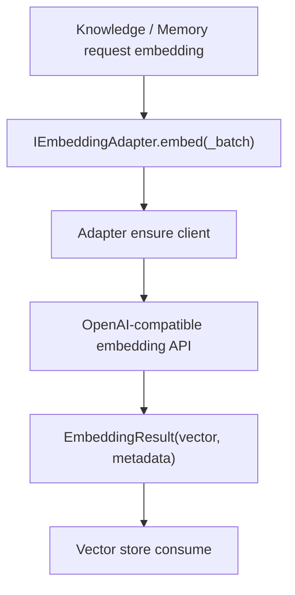

# Module: embedding

> Status: detailed design aligned to `dare_framework/embedding` (2026-02-25).

## 1. 定位与职责

- 提供统一向量化接口，支撑 knowledge / memory 的向量检索路径。
- 隔离第三方 embedding SDK，向上层暴露稳定 `IEmbeddingAdapter` 协议。

## 2. 依赖与边界

- 核心协议：`dare_framework/embedding/interfaces.py`
- 数据类型：`dare_framework/embedding/types.py`
- 默认实现：`OpenAIEmbeddingAdapter`（`langchain-openai`）
- 边界约束：
  - embedding 只负责“文本->向量”，不负责检索排序与召回融合。
  - 适配器层不管理知识库存储生命周期。

## 3. 对外接口（Public Contract）

- `IEmbeddingAdapter.embed(text, options=None) -> EmbeddingResult`
- `IEmbeddingAdapter.embed_batch(texts, options=None) -> list[EmbeddingResult]`

默认实现补充：
- `OpenAIEmbeddingAdapter(model, api_key, endpoint, http_client_options)`
- 支持 OpenAI 兼容 endpoint。

## 4. 关键字段（Core Fields）

- `EmbeddingOptions`
  - `model: str | None`
  - `metadata: dict[str, Any]`
- `EmbeddingResult`
  - `vector: list[float]`
  - `metadata: dict[str, Any]`（可含 model/usage）

## 5. 关键流程（Runtime Flow）

## 6. 与其他模块的交互

- **Knowledge**：vector knowledge 写入/检索依赖 embedding。
- **Memory**：vector LTM 构建依赖 embedding。
- **Config**：目前 embedding 独立于 config domain，后续需统一。

## 7. 约束与限制

- 依赖可选第三方包 `langchain-openai`。
- 当前未定义 adapter manager / provider 统一选择逻辑。

## 8. TODO / 未决问题

- TODO: 增加 embedding domain 的 kernel 层统一入口（与其他域一致）。
- TODO: 收敛 adapter client 构造中的 `Any`。
- TODO: 增加本地 embedding 模型支持与 fallback 策略。

## 能力状态（landed / partial / planned）

- `landed`: 见文档头部 Status 所述的当前已落地基线能力。
- `partial`: 当前实现可用但仍有 TODO/限制（见“约束与限制”与“TODO / 未决问题”）。
- `planned`: 当前文档中的未来增强项，以 TODO 条目为准，未纳入当前实现承诺。

## 最小标准补充（2026-02-27）

### 总体架构
- 模块实现主路径：`dare_framework/embedding/`。
- 分层契约遵循 `types.py` / `kernel.py` / `interfaces.py` / `_internal/` 约定；对外语义以本 README 的“对外接口/关键字段/关键流程”章节为准。
- 与全局架构关系：作为 `docs/design/Architecture.md` 中对应 domain 的实现落点，通过 builder 与运行时编排接入。

### 异常与错误处理
- 参数或配置非法时，MUST 显式返回错误（抛出异常或返回失败结果），禁止静默吞错。
- 外部依赖失败（模型/存储/网络/工具）时，优先执行可观测降级策略：记录结构化错误上下文，并在调用边界返回可判定失败。
- 涉及副作用或策略判定的失败路径，MUST 保留审计线索（事件日志或 Hook/Telemetry 记录），以支持回放和排障。

### 测试锚点（Test Anchor）

- `tests/unit/test_embedding_openai_adapter.py`（OpenAIEmbeddingAdapter 基线契约）
