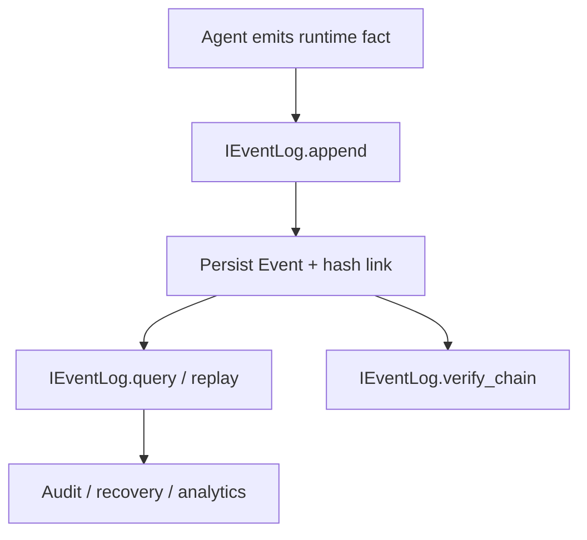

# Module: event

> Status: baseline default implementation landed in canonical runtime (2026-02-27).

## 1. 定位与职责

- 提供 WORM（append-only）事件日志契约，支撑审计、追溯与重放。
- 作为运行时事实来源，服务于 session 复验与外部合规系统。

## 2. 依赖与边界

- 核心协议：`dare_framework/event/kernel.py` (`IEventLog`)
- 核心类型：`dare_framework/event/types.py` (`Event`, `RuntimeSnapshot`)
- 边界约束：
  - event domain 只定义事件存储契约，不绑定具体存储后端。
  - 与 legacy `dare_framework/events/*` 事件总线语义需区分（总线 != WORM 日志）。

## 3. 对外接口（Public Contract）

- `IEventLog.append(event_type, payload) -> str`
- `IEventLog.query(filter=None, limit=100) -> Sequence[Event]`
- `IEventLog.replay(from_event_id) -> RuntimeSnapshot`
- `IEventLog.verify_chain() -> bool`

## 4. 关键字段（Core Fields）

- `Event`
  - `event_type: str`
  - `payload: dict[str, Any]`
  - `event_id: str`
  - `timestamp: datetime`
  - `prev_hash: str | None`
  - `event_hash: str | None`
- `RuntimeSnapshot`
  - `from_event_id: str`
  - `events: Sequence[Event]`

## 5. 关键流程（Runtime Flow）

## 6. 与其他模块的交互

- **Agent**：记录 `session.*`、`milestone.*`、`tool.*`、`model.*` 事件。
- **Observability**：`TraceAwareEventLog` 在 append 前注入 trace metadata。
- **Hook**：Hook payload 可镜像进入 event log，形成审计闭环。

## 7. 约束与限制

- 当前默认实现为单机 SQLite 基线实现（非分布式多写场景）。
- 事件 taxonomy 与 payload schema 仍需统一规范。

## 8. TODO / 未决问题

- TODO: 评估大规模场景下的存储后端升级路径（WORM/远端签名/分片归档）。
- TODO: 定义 legacy events -> event domain 的迁移策略。
- TODO: 固化跨模块事件命名与字段协议。

## 能力状态（landed / partial / planned）

- `landed`: 见文档头部 Status 所述的当前已落地基线能力。
- `partial`: 当前实现可用但仍有 TODO/限制（见“约束与限制”与“TODO / 未决问题”）。
- `planned`: 当前文档中的未来增强项，以 TODO 条目为准，未纳入当前实现承诺。

## 最小标准补充（2026-02-27）

### 总体架构
- 模块实现主路径：`dare_framework/event/`。
- 分层契约遵循 `types.py` / `kernel.py` / `interfaces.py` / `_internal/` 约定；对外语义以本 README 的“对外接口/关键字段/关键流程”章节为准。
- 与全局架构关系：作为 `docs/design/Architecture.md` 中对应 domain 的实现落点，通过 builder 与运行时编排接入。

### 异常与错误处理
- 参数或配置非法时，MUST 显式返回错误（抛出异常或返回失败结果），禁止静默吞错。
- 外部依赖失败（模型/存储/网络/工具）时，优先执行可观测降级策略：记录结构化错误上下文，并在调用边界返回可判定失败。
- 涉及副作用或策略判定的失败路径，MUST 保留审计线索（事件日志或 Hook/Telemetry 记录），以支持回放和排障。

### 测试锚点（Test Anchor）

- `tests/unit/test_event_sqlite_event_log.py`（SQLite event log append/query/replay/hash-chain）
