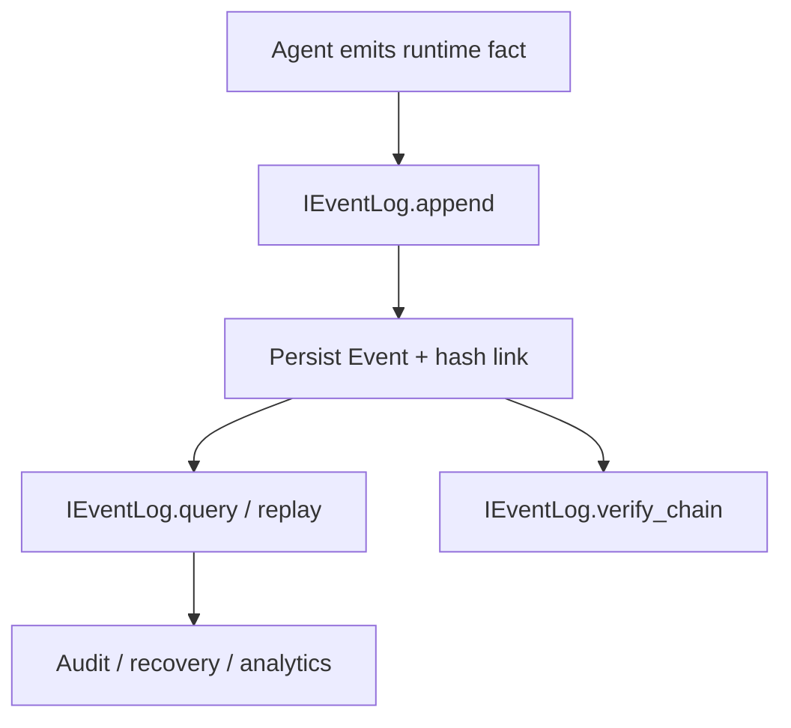

# Module: event

> Status: interface-first detailed design aligned to `dare_framework/event` (2026-02-25).

## 1. 定位与职责

- 提供 WORM（append-only）事件日志契约，支撑审计、追溯与重放。
- 作为运行时事实来源，服务于 session 复验与外部合规系统。

## 2. 依赖与边界

- 核心协议：`dare_framework/event/kernel.py` (`IEventLog`)
- 核心类型：`dare_framework/event/types.py` (`Event`, `RuntimeSnapshot`)
- 边界约束：
  - event domain 只定义事件存储契约，不绑定具体存储后端。
  - 与 legacy `dare_framework/events/*` 事件总线语义需区分（总线 != WORM 日志）。

## 3. 对外接口（Public Contract）

- `IEventLog.append(event_type, payload) -> str`
- `IEventLog.query(filter=None, limit=100) -> Sequence[Event]`
- `IEventLog.replay(from_event_id) -> RuntimeSnapshot`
- `IEventLog.verify_chain() -> bool`

## 4. 关键字段（Core Fields）

- `Event`
  - `event_type: str`
  - `payload: dict[str, Any]`
  - `event_id: str`
  - `timestamp: datetime`
  - `prev_hash: str | None`
  - `event_hash: str | None`
- `RuntimeSnapshot`
  - `from_event_id: str`
  - `events: Sequence[Event]`

## 5. 关键流程（Runtime Flow）

## 6. 与其他模块的交互

- **Agent**：记录 `session.*`、`milestone.*`、`tool.*`、`model.*` 事件。
- **Observability**：`TraceAwareEventLog` 在 append 前注入 trace metadata。
- **Hook**：Hook payload 可镜像进入 event log，形成审计闭环。

## 7. 约束与限制

- 当前仓库缺少默认持久化实现（接口优先）。
- 事件 taxonomy 与 payload schema 仍需统一规范。

## 8. TODO / 未决问题

- TODO: 提供默认实现（例如 sqlite + hash-chain）。
- TODO: 定义 legacy events -> event domain 的迁移策略。
- TODO: 固化跨模块事件命名与字段协议。
