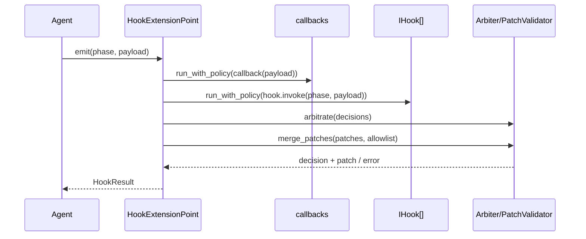
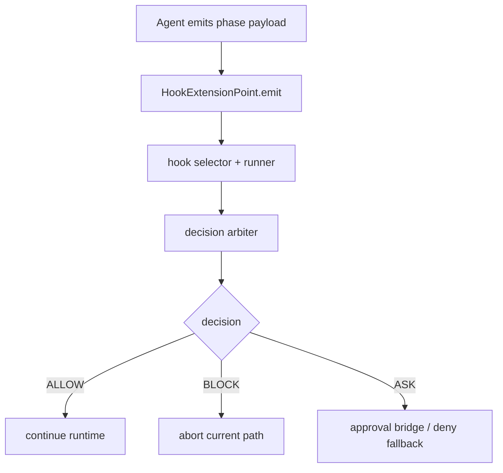

# Hook Detailed Design

> 类型：最新目标设计（Expected Shape）
> 作用：生命周期扩展 + 治理决策（governance v1）

## 1. 定位

`hook` 模块为运行时提供统一扩展点，用于承载横切能力：

- 观测：trace/metric/event 采集
- 治理：调用前的 `allow/block/ask` 决策
- 受控变更：仅允许白名单 patch 影响执行输入
- 兼容：旧 hook 逻辑平滑接入新治理面

职责边界：

- hook 负责“决策与扩展”，不直接承担业务编排
- 主执行流程由 agent 控制，hook 只通过 `HookResult` 影响 agent
- hook 失败默认不应拖垮主流程（best-effort）

## 2. 依赖与边界

核心依赖：

- `HookPhase` / `HookDecision` / `HookResult`
- `IHook` / `IExtensionPoint`
- `HookExtensionPoint`（治理分发器）

与上游边界：

- 由 `DareAgentBuilder.add_hooks(...)` 或 `with_managers(hook_manager=...)` 注入
- `Config.hooks` 参与排序优先级计算

与下游边界：

- `DareAgent` 在关键 `BEFORE_*` 阶段消费治理结果
- `ObservabilityHook`、`AgentEventTransportHook` 作为典型实现被挂载

当前实现边界：

- 治理执行目前主要集成在 `DareAgent`
- `SimpleChatAgent` / `ReactAgent` 当前不提供 `add_hooks(...)` 装配面

## 3. 统一契约

输入契约：

- `emit(phase, payload)`，其中 `phase` 为 `HookPhase` 枚举
- payload 为阶段相关字典，运行时会补充 `phase/context_id/task_id/run_id/session_id`

输出契约：

- `HookResult(decision, patch, message)`
- `decision in {allow, block, ask}`
- `patch` 为可选变更，仅在 allowlist 内生效

治理语义：

- 决策优先级：`block > ask > allow`
- hook 超时/异常：降级为 `allow`，并附带错误信息
- `enforce=False` 时进入 shadow 模式：记录非 allow 决策但不拦截

## 4. 模块构成

Kernel：

- `IHook` / `IExtensionPoint`：`dare_framework/hook/kernel.py`
- `HookPhase` / `HookDecision` / `HookResult` / `HookEnvelope`：`dare_framework/hook/types.py`

Manager：

- `IHookManager`：`dare_framework/hook/interfaces.py`

Runtime Internals：

- `HookExtensionPoint`：调度/执行策略/仲裁/patch 合并
- `hook_runner`：超时 + 重试策略执行器
- `decision_arbiter`：多 hook 决策仲裁
- `patch_validator`：allowlist 与冲突检测
- `hook_selector`：稳定排序工具
- `LegacyHookAdapter`：旧接口兼容
- `CompositeExtensionPoint`：多扩展点扇出

## 5. 生命周期模型

支持 phase：

- Run：`BEFORE_RUN` / `AFTER_RUN`
- Session：`BEFORE_SESSION` / `AFTER_SESSION`
- Milestone：`BEFORE_MILESTONE` / `AFTER_MILESTONE`
- Plan：`BEFORE_PLAN` / `AFTER_PLAN`
- Execute：`BEFORE_EXECUTE` / `AFTER_EXECUTE`
- Context：`BEFORE_CONTEXT_ASSEMBLE` / `AFTER_CONTEXT_ASSEMBLE`
- Model：`BEFORE_MODEL` / `AFTER_MODEL`
- Tool：`BEFORE_TOOL` / `AFTER_TOOL`
- Verify：`BEFORE_VERIFY` / `AFTER_VERIFY`

phase schema：

- `phase_schema.py` 维护每个 phase 的 required 字段
- 当前 schema 作为契约定义与测试基线；尚未在 `emit(...)` 路径强制校验

## 6. 执行流程（HookExtensionPoint）

关键机制：

1. callback 与 hook 均经 `run_with_policy` 执行（timeout/retry/idempotent）
2. 所有返回值归一为决策字典
3. 决策仲裁后再进行 patch 合并与校验
4. 非法 patch（越权字段/冲突）会触发合约错误

## 7. Patch 与治理消费点

patch allowlist（当前）：

- `BEFORE_MODEL`：仅允许 `model_input`
- `BEFORE_CONTEXT_ASSEMBLE`：仅允许 `context_patch`

`DareAgent` 当前消费治理的位置：

- `BEFORE_MODEL`：消费 `decision`，并允许 patch 修改 `ModelInput`
- `BEFORE_TOOL`：消费 `decision`，可阻断工具调用
- `BEFORE_VERIFY`：消费 `decision`，可阻断验证
- `BEFORE_CONTEXT_ASSEMBLE`：当前仅消费 patch，不消费 `block/ask` 决策

说明：

- 多数 `AFTER_*` 阶段用于观测与审计，不参与拦截
- `BEFORE_*` 是否拦截由 agent 明确实现，不由 hook 框架隐式决定

## 8. Builder 与配置集成

装配入口：

- 显式注入：`DareAgentBuilder.add_hooks(*hooks)`
- 管理器注入：`with_managers(hook_manager=...) -> manager.load_hooks(config)`

候选来源与排序：

1. `system`：如 `agent_event_transport` 自动注入
2. `config`：manager 发现的 hooks（受 `components.hook.disabled` 过滤）
3. `code`：`add_hooks(...)` 显式注入

排序键：

- `source_rank`（system < config < code）
- `config.hooks.priority_for(hook.name)`
- 注册顺序

去重规则：

- 按 `hook.name` 去重，首个生效

## 9. 内置实现

`ObservabilityHook`：

- 基于 HookPhase 建 span、打 metric、统计运行指标
- 输出 `hook.overhead_ratio` 等治理开销指标

`AgentEventTransportHook`：

- 将 hook 事件转为 transport envelope 发往 `AgentChannel`
- 用于 UI/远端消费生命周期事件

`LegacyHookAdapter`：

- 兼容仅执行副作用的旧 hook
- 适配后统一返回 `allow`

## 10. 失败语义与可靠性

best-effort 原则：

- 单个 hook 异常不终止主流程
- timeout/runtime error 默认降级为 allow 并可观测

shadow rollout：

- `HookExtensionPoint(enforce=False)` 时，非 allow 决策不执行拦截
- 用于上线前观测策略命中，不改变业务行为

重试策略：

- 仅 `idempotent=True` 时启用 retries
- 非幂等 hook 默认单次执行

## 11. 测试覆盖（当前）

核心测试主题：

- 决策仲裁优先级：`tests/unit/test_hook_decision_arbiter.py`
- 执行策略（超时/重试）：`tests/unit/test_hook_runner.py`
- patch 合约：`tests/unit/test_hook_patch_validator.py`
- extension point 治理行为：`tests/unit/test_hook_extension_point_governance.py`
- DareAgent 消费治理：`tests/unit/test_dare_agent_hook_governance.py`
- Builder 合并与排序：`tests/unit/test_builder_hook_ordering.py`
- 集成流（block/ask/legacy）：`tests/integration/test_hook_governance_flow.py`

## 12. 约束与已知缺口

1. 治理拦截点目前主要在 `DareAgent`，未统一覆盖所有 agent。
2. `phase_schema` 尚未在 `emit(...)` 进行运行时强校验。
3. `Config.hooks.defaults` 中的 timeout/retry/enforce 等策略参数尚未打通到 builder/agent 构造。
4. `ask` 决策的人机审批桥接仍有限（无桥接时按拒绝执行路径处理）。

## 13. 演进方向

短期：

- 将 `phase_schema` 变为可配置的运行时校验器（支持 strict/lenient）
- 打通 `Config.hooks.defaults -> HookExtensionPoint` 的策略参数注入

中期：

- 扩展 `ask` 到标准审批桥接（可等待/可恢复）
- 补齐非 DareAgent 的 hook 治理接入策略

长期：

- 形成分层 hook lane（control/observe）与正式策略包发布机制
- 为 patch 引入更细粒度字段级策略与审计标签

## 14. 对外接口汇总（Public Contract Snapshot）

- `IHook.invoke(phase, *args, **kwargs) -> HookResult | dict | None`
- `IExtensionPoint.register_hook(phase, hook)`
- `IExtensionPoint.emit(phase, payload) -> HookResult`
- `IHookManager.load_hooks(config=None) -> list[IHook]`

## 15. 核心字段汇总（Core Fields Snapshot）

- `HookPhase`: `BEFORE_*` / `AFTER_*` 生命周期枚举
- `HookDecision`: `ALLOW`, `BLOCK`, `ASK`
- `HookEnvelope`
  - `hook_version`, `phase`, `invocation_id`, `context_id`, `timestamp_ms`, `payload`
- `HookResult`
  - `decision`, `patch`, `message`

## 16. 关键流程汇总（Flow Snapshot）

