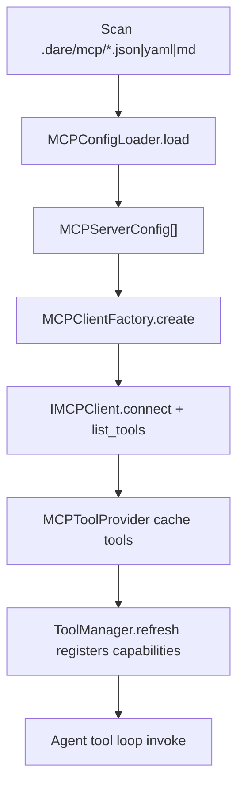

# Module: mcp

> Status: detailed design aligned to `dare_framework/mcp` (2026-02-25).

## 1. 定位与职责

- 负责 MCP server 配置加载、client 构建与连接生命周期。
- 把远端 MCP tools 转换为本地 `IToolProvider`，纳入统一 ToolManager 调度。

## 2. 依赖与边界

- 核心协议：`IMCPClient` (`dare_framework/mcp/kernel.py`)
- 核心配置：`MCPServerConfig`, `MCPConfigFile`, `TransportType` (`dare_framework/mcp/types.py`)
- 默认组件：
  - `MCPConfigLoader`（目录扫描 + JSON/YAML/Markdown 解析）
  - `MCPClientFactory`（按 transport 构建 client）
  - `MCPToolProvider`（`McpToolManager`）
- 边界约束：
  - MCP 仅负责“远端能力接入”，不负责工具安全策略最终判定。

## 3. 对外接口（Public Contract）

- `IMCPClient.connect() / disconnect()`
- `IMCPClient.list_tools() -> list[ITool]`
- `IMCPClient.call_tool(tool_name, arguments, context) -> ToolResult`
- `load_mcp_configs(paths, workspace_dir, user_dir) -> list[MCPServerConfig]`
- `create_mcp_clients(configs, connect=False, skip_errors=True) -> list[IMCPClient]`
- `MCPToolProvider.list_tools(mcp_name=None) -> list[ITool]`

## 4. 关键字段（Core Fields）

- `MCPServerConfig`
  - `name`, `transport`, `command`, `env`
  - `url`, `headers`
  - `endpoint`, `tls`
  - `timeout_seconds`, `enabled`, `cwd`
- `MCPConfigFile`
  - `source_path`
  - `servers`

## 5. 关键流程（Runtime Flow）

## 6. 与其他模块的交互

- **Tool**：作为 `IToolProvider` 被 ToolManager 接管。
- **Config**：读取 `config.mcp` / `config.mcp_paths`。
- **Agent/Builder**：在构建时注入 MCP provider 到 tool gateway。

## 7. 约束与限制

- grpc transport 在 factory 中仍标记为未实现。
- MCP tool 风险等级/审批字段依赖 server 提供，可信化仍需 policy 层二次校验。

## 8. TODO / 未决问题

- TODO: 接入 `ISecurityBoundary` 做 MCP 工具策略门控。
- TODO: 明确 transport 安全隔离与 sandbox 策略。
- TODO: 增加断线重连与健康检查策略。
