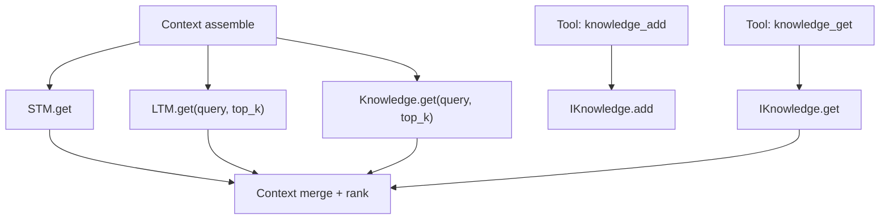

# Module: memory / knowledge

> Status: detailed design aligned to `dare_framework/memory` + `dare_framework/knowledge` (2026-02-25).

## 1. 定位与职责

- 提供 `Context` 的三类检索来源：STM / LTM / Knowledge。
- 统一 retrieval contract（`IRetrievalContext.get`），并支持知识写入与知识工具化。

## 2. 依赖与边界

- memory kernel：`IShortTermMemory`, `ILongTermMemory`
- knowledge kernel：`IKnowledge`
- composed interface：`IKnowledgeTool`
- factory：
  - `create_long_term_memory(config, embedding_adapter)`
  - `create_knowledge(config, embedding_adapter)`
- 边界约束：
  - memory/knowledge 负责“存取与检索”，不负责最终上下文融合排序。

## 3. 对外接口（Public Contract）

- `IShortTermMemory`
  - `add(message)`
  - `get(query="", **kwargs) -> list[Message]`
  - `clear()`
  - `compress(max_messages=None, **kwargs) -> int`
- `ILongTermMemory`
  - `get(query="", **kwargs) -> list[Message]`
  - `persist(messages) -> None`
- `IKnowledge`
  - `get(query, **kwargs) -> list[Message]`
  - `add(content, **kwargs) -> None`
- 工具化接口
  - `KnowledgeGetTool.execute(query, top_k=5)`
  - `KnowledgeAddTool.execute(content, metadata=None)`

## 4. 关键字段（Core Fields）

- `LongTermMemoryConfig`
  - `type: "vector" | "rawdata"`
  - `storage: "in_memory" | "sqlite" | "chromadb"`
  - `options: dict[str, Any]`
- `KnowledgeConfig`
  - `type: "vector" | "rawdata"`
  - `storage: "in_memory" | "sqlite" | "chromadb"`
  - `options: dict[str, Any]`

## 5. 关键流程（Runtime Flow）

## 6. 与其他模块的交互

- **Context**：持有 STM/LTM/Knowledge 引用并在 `assemble()` 调用。
- **Embedding**：vector 类型后端依赖 embedding adapter。
- **Tool**：Knowledge 可暴露为工具能力。

## 7. 约束与限制

- 默认 `Context.assemble()` 仍以 STM 为主，LTM/Knowledge 融合策略待统一。
- vector 路径对 embedding 适配器有强依赖。

## 8. TODO / 未决问题

- TODO: 统一 retrieval 参数协议（`top_k/min_similarity/filters`）。
- TODO: 明确 LTM/Knowledge 冲突消解和去重规则。
- TODO: 完善知识写入权限、审计与成本计量。
