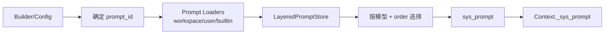

# DARE Framework 模型与 Prompt 管理设计（现状版）

> 状态：对齐当前实现（`dare_framework/model`）。
>
> 本文描述 Prompt 管理与解析流程，定义模型调用输入 `ModelInput`，并给出扩展点与约束。

---

## 1. 目标与边界

### 目标
- 提供统一、可扩展的 Prompt 管理与解析机制。
- 按模型身份（`IModelAdapter.name`）选择最优 Prompt。
- 支持 builder 与 config 覆盖，保持确定性与可审计性。

### 非目标（当前实现）
- 不引入 Prompt DSL/模板引擎。
- 不支持运行时热更新（需重建 PromptStore）。
- 不实现多阶段 prompt pack（plan/execute/verify）。

---

## 2. 术语与命名

- **Prompt**：存储层/配置层的提示词定义（`Prompt` dataclass）。
- **ModelInput**：模型调用的运行时结构（`messages + tools + metadata`）。
- **sys_prompt**：Context 中保存的结构化系统提示定义（`Prompt`）。

---

## 3. 领域归属（Model DDD）

```
dare_framework/model/
  types.py          # Prompt / ModelInput / ModelResponse
  kernel.py         # IModelAdapter
  interfaces.py     # IModelAdapterManager / IPromptLoader / IPromptStore
  builtin_prompt_loader.py   # Built-in prompt loader
  filesystem_prompt_loader.py # Filesystem prompt loader
  layered_prompt_store.py    # Layered prompt store
```

---

## 4. Prompt 定义（数据结构）

字段（`Prompt`）：
- `prompt_id` (string)
- `role` (string)
- `content` (string)
- `supported_models` (list[string])
- `order` (int, higher is preferred)
- `version` (string, optional)
- `name` (string, optional)
- `metadata` (dict, optional)

最小校验（FileSystemPromptLoader）：
- `prompt_id`、`role`、`content`、`supported_models` 必填
- 不合法项会被跳过

---

## 5. Prompt Manifest 与加载

### 5.1 文件结构（JSON）

```json
{
  "prompts": [
    {
      "prompt_id": "base.system",
      "role": "system",
      "content": "You are a helpful AI assistant...",
      "supported_models": ["*"],
      "order": 0
    }
  ]
}
```

### 5.2 加载路径与顺序

由 `Config.prompt_store_path_pattern` 指定（默认 `.dare/_prompts.json`）。

默认加载顺序（`create_default_prompt_store`）：
1) workspace 目录
2) user 目录
3) built-in

> Loader 顺序决定 tie-break 规则（workspace 优先）。

---

## 6. 解析与选择流程

### 6.1 Builder / Config 优先级

`DareAgentBuilder` / `SimpleChatAgentBuilder` 解析规则：
1) builder 显式 `with_prompt(prompt)`
2) builder 显式 `with_prompt_id(prompt_id)`
3) config `default_prompt_id`
4) fallback: `base.system`

### 6.2 Store 解析规则

`LayeredPromptStore.get(prompt_id, model, version)`：
- 过滤 prompt_id / version
- 过滤 model（支持 `*`）
- 选择 **最高 order**
- tie-break：loader 顺序（workspace → user → built-in） + manifest 顺序

若找不到匹配 Prompt，抛出 `KeyError`（builder 会转换为 `ValueError`）。

### 6.3 Prompt 模板解析流程图



### 6.4 CLI 运行时 system prompt 叠加策略（新增）

在 `client/` 运行时，除 PromptStore 解析外，还支持面向 CLI 的显式 system prompt 覆盖层：

- 配置入口：`Config.system_prompt`
- CLI 临时覆盖入口：`--system-prompt-mode`、`--system-prompt-text`、`--system-prompt-file`

语义：

1. `replace`：用用户提供内容完整替换解析出的 base system prompt 内容。
2. `append`：将用户提供内容追加到解析出的 base system prompt 内容后（使用 `\n\n---\n\n` 分隔）。
3. 若只提供内容未提供 mode，默认按 `replace` 处理。

优先级：

1. CLI flags（最高）
2. workspace `.dare/config.json`
3. user `.dare/config.json`
4. PromptStore 解析结果（最低）

约束：

- `system_prompt.content` 与 `system_prompt.path` 互斥，同时设置应报错并终止运行。
- `system_prompt.path` 支持相对路径，相对路径按 `workspace_dir` 解析。
- `append` 依赖可解析的 base system prompt；若 base prompt 不存在，运行时应返回错误。

---

## 7. 与 Context / Agent 的集成

- Builder 解析 sys_prompt 后写入 `Context._sys_prompt`。
- `Context.assemble()` 返回 `AssembledContext.sys_prompt`。
- DareAgent 在 `_assemble_messages()` 中将 sys_prompt 转为第一条 Message。

---

## 8. 确定性与错误处理

- Loader 顺序固定，保证 order 相同场景下的确定性。
- Manifest 解析失败或字段不合法的 Prompt 会被忽略。
- CLI system prompt 覆盖层在应用前做显式校验（互斥字段、文件可读性、mode 合法性），校验失败时直接报错，不降级为静默忽略。

---

## 9. 扩展点

- 新 Prompt source：实现 `IPromptLoader`。
- 自定义 PromptStore：实现 `IPromptStore`。
- Prompt 版本策略：通过 `Prompt.version` 做细粒度选择。

---

## 10. TODO / 未决问题

- TODO: PromptStore 热更新（reload / watcher）。
- TODO: 多阶段 prompt pack（plan/execute/verify）。
- TODO: 与上下文预算联动（压缩、摘要策略）。
