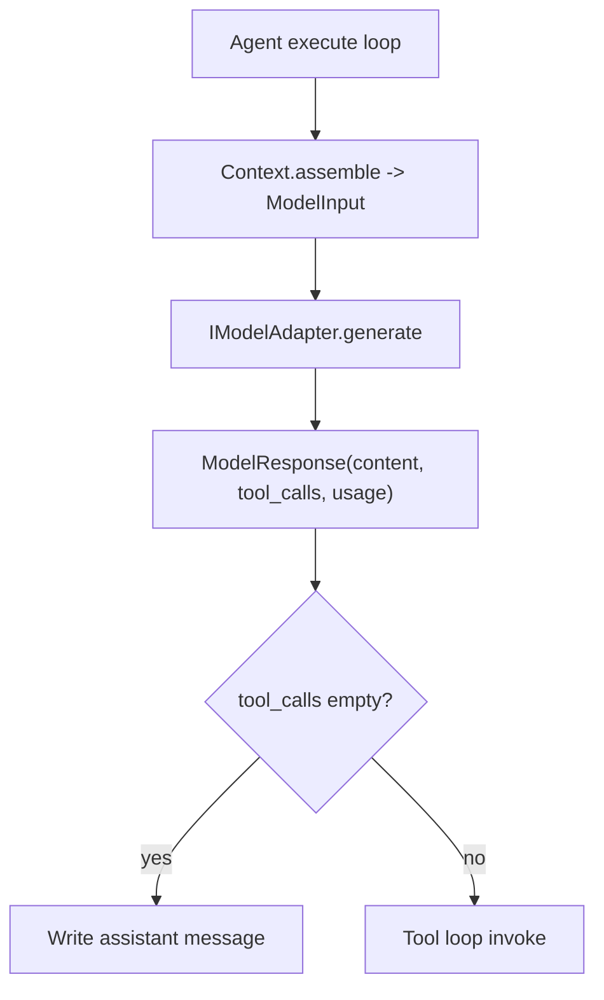

# Module: model

> Status: detailed design aligned to `dare_framework/model` (2026-02-25).

## 1. 定位与职责

- 提供统一模型调用抽象：`IModelAdapter.generate`。
- 定义模型输入/输出结构：`ModelInput`、`ModelResponse`。
- 提供 prompt 装载与分层解析能力（store + loader）。

## 2. 依赖与边界

- kernel：`IModelAdapter`
- manager/store 接口：`IModelAdapterManager`, `IPromptLoader`, `IPromptStore`
- 类型：`Prompt`, `ModelInput`, `ModelResponse`, `GenerateOptions`
- 边界约束：
  - model domain 负责“调用与格式适配”，不负责执行循环与工具决策。

## 3. 对外接口（Public Contract）

- `IModelAdapter.generate(model_input, options=None) -> ModelResponse`
- `IModelAdapterManager.load_model_adapter(config=None) -> IModelAdapter | None`
- `IPromptLoader.load() -> list[Prompt]`
- `IPromptStore.get(prompt_id, model=None, version=None) -> Prompt`

## 4. 关键字段（Core Fields）

- `Prompt`
  - `prompt_id`, `role`, `content`, `supported_models`, `order`, `version`, `metadata`
- `ModelInput`
  - `messages: list[Message]`
  - `tools: list[CapabilityDescriptor]`
  - `metadata: dict[str, Any]`
- `ModelResponse`
  - `content: str`
  - `tool_calls: list[dict[str, Any]]`
  - `usage: dict[str, Any] | None`
  - `metadata: dict[str, Any]`
- `GenerateOptions`
  - `temperature`, `max_tokens`, `top_p`, `stop`, `metadata`

## 5. 关键流程（Runtime Flow）

## 6. 与其他模块的交互

- **Context**：提供 messages/tools。
- **Tool**：通过 `tool_calls` 触发 `IToolGateway.invoke`。
- **Config**：`Config.llm` 决定 adapter 类型与连接参数。
- **Observability**：从 `usage` 提取 token 指标。

## 7. 约束与限制

- 当前流式输出和增量 tool-call 仍是待补齐项。
- tool defs 仍以 OpenAI function-call schema 为主。

## 8. TODO / 未决问题

- TODO: 增加 streaming 与多模型路由策略。
- TODO: 明确跨 adapter 的 tool schema 归一化规范。
- TODO: 收敛 adapter client typing，减少 `Any`。
