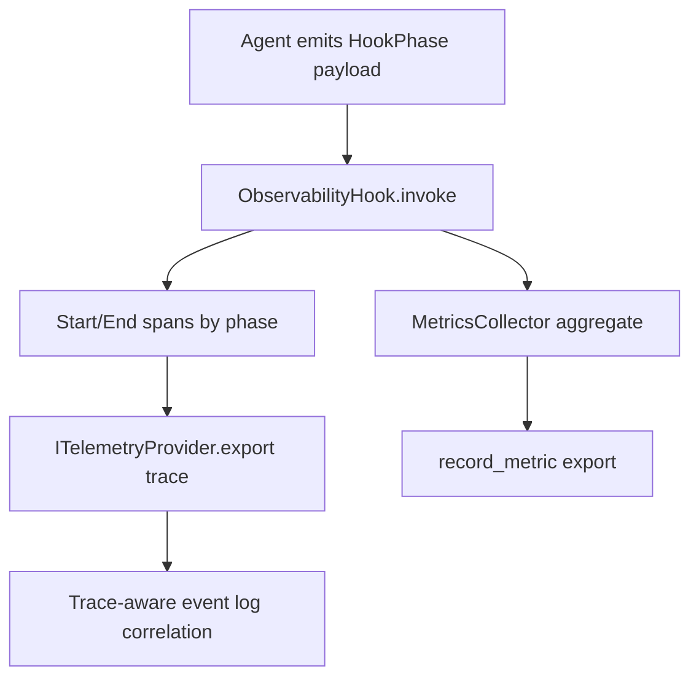

# Module: observability

> Status: detailed design aligned to `dare_framework/observability` (2026-02-25).

## 1. 定位与职责

- 提供 traces / metrics / events 的统一观测能力，默认对主流程最小侵入。
- 基于 HookPhase payload 采集 Agent 全链路运行信号。
- 输出可用于排障、容量分析和审计关联的结构化指标。

## 2. 依赖与边界

- kernel：`ITelemetryProvider`, `ISpan`
- types：`TelemetryConfig`, `RunMetrics`, `SpanKind`, `SpanStatus`
- 默认实现：
  - `OTelTelemetryProvider` / `NoOpTelemetryProvider`
  - `ObservabilityHook`
  - `MetricsCollector`
  - `TraceAwareEventLog`
- 边界约束：
  - observability 只做采集与导出，不改变业务决策。

## 3. 对外接口（Public Contract）

- `ITelemetryProvider.start_span(name, kind="internal", attributes=None)`
- `ITelemetryProvider.record_metric(name, value, attributes=None)`
- `ITelemetryProvider.record_event(name, attributes=None)`
- `ITelemetryProvider.shutdown()`
- `ISpan.set_attribute(...) / add_event(...) / set_status(...) / end()`

## 4. 关键字段（Core Fields）

### 4.1 `TelemetryConfig`

- `service_name`, `service_version`, `deployment_environment`
- `enabled`, `exporter_type`, `otlp_endpoint`, `otlp_headers`
- `sample_rate`, `capture_content`, `resource_attributes`

### 4.2 `RunMetrics`

- Token：`total_input_tokens`, `total_output_tokens`, `cached_tokens`
- Context：`max_context_length`, `max_messages_count`, `max_tools_count`
- Tool：`tool_calls_total`, `tool_calls_success`, `tool_calls_failed`, `tool_by_name`
- Loop：`model_invocations`, `execute_iterations`, `milestone_attempts`, `plan_attempts`
- Timing：`total_duration`, `model_duration`, `tool_duration`
- Budget/Error：`budget_*`, `errors_total`, `errors_by_type`

## 5. 关键流程（Runtime Flow）

## 6. Hook payload 契约（最小字段）

- `BEFORE_RUN`: `task_id`, `session_id`, `agent_name`, `execution_mode`
- `AFTER_RUN`: `success`, `token_usage`, `errors`
- `BEFORE_TOOL`: `tool_name`, `tool_call_id`, `capability_id`, `attempt`, `risk_level`, `requires_approval`
- `AFTER_TOOL`: `tool_call_id`, `tool_name`, `success`, `error`, `approved`, `evidence_collected`
- `AFTER_CONTEXT_ASSEMBLE`: `context_length`, `context_messages_count`, `context_tools_count`
- `AFTER_MODEL`: `model_usage`

## 7. 与其他模块的交互

- **Agent**：在 builder/runtime 装配 telemetry 与 observability hook。
- **Hook**：通过 phase 事件分发触发 span/metric。
- **Event**：通过 trace bridge 写入 trace 上下文。

## 8. 约束与限制

- OpenTelemetry 依赖缺失时自动降级为 no-op。
- payload schema 目前主要靠约定，缺少统一强校验层。

## 9. TODO / 未决问题

- TODO: 固化 Hook payload schema（跨模块 contract）。
- TODO: 增加工具内部细粒度 span 与开销归因。
- TODO: 完善敏感字段脱敏与内容采集策略。
