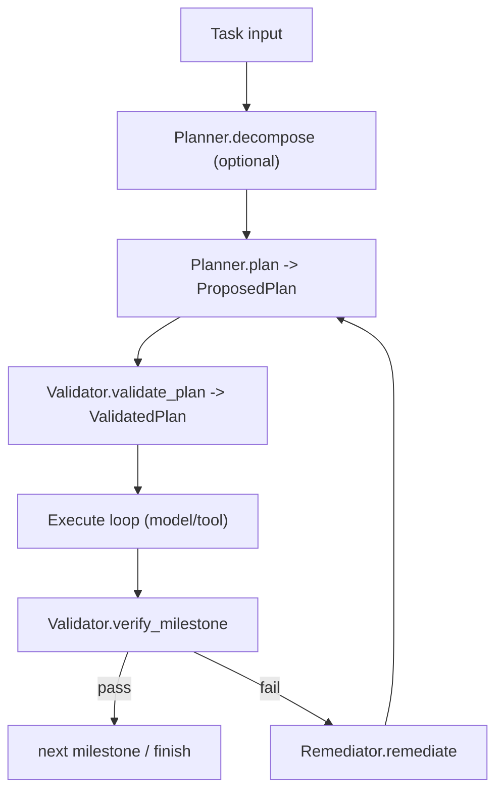

# Module: plan

> Status: full review aligned to `dare_framework/plan` + `dare_framework/agent` execution path (2026-02-27).

## 1. 定位与职责

- 定义任务分解、计划验证、里程碑验证与执行边界的数据契约。
- 把 planner 输出与 trusted validated plan 分离，降低模型不可信输入风险。

## 2. 依赖与边界

- 接口：`IPlanner`, `IValidator`, `IRemediator`, `IStepExecutor`, `IPlanAttemptSandbox`
- 类型：`Task`, `Milestone`, `ProposedPlan`, `ValidatedPlan`, `RunResult`, `Envelope`, ...
- 边界约束：
  - plan domain 定义“计划/验证/补救”的协议，不直接执行工具副作用。
  - 工具调用实际由 tool gateway 完成。

## 3. 对外接口（Public Contract）

- `IPlanner.plan(ctx) -> ProposedPlan`
- `IPlanner.decompose(task, ctx) -> DecompositionResult`
- `IValidator.validate_plan(plan, ctx) -> ValidatedPlan`
- `IValidator.verify_milestone(result, ctx, plan=None) -> VerifyResult`
- `IRemediator.remediate(verify_result, ctx) -> str`
- `IStepExecutor.execute_step(step, ctx, previous_results) -> StepResult`
- `IPlanAttemptSandbox.create_snapshot/rollback/commit`

## 4. 关键字段（Core Fields）

- `Task`
  - `description`, `task_id`, `milestones`, `metadata`, `previous_session_summary`
- `Milestone`
  - `milestone_id`, `description`, `user_input`, `success_criteria`
- `ProposedPlan`
  - `plan_description`, `steps`, `attempt`, `metadata`
- `ValidatedPlan`
  - `plan_description`, `steps`, `success`, `errors`, `metadata`
- `Envelope`
  - `allowed_capability_ids`, `budget`, `done_predicate`, `risk_level`
- `RunResult`
  - `success`, `output`, `output_text`, `errors`, `metadata`, `session_summary`

## 5. 关键流程（Runtime Flow）

## 6. 与其他模块的交互

- **Agent**：五层循环中的 plan / verify 阶段直接消费 plan domain。
- **Tool**：`Envelope` 驱动 tool loop 边界。
- **Security**：`risk_level` 与 policy gate 语义对齐。

## 7. 约束与限制

- 当前运行时已支持 `execution_mode="step_driven"`：`ValidatedPlan.steps` 由 `IStepExecutor` 顺序执行；默认仍为 `model_driven`。
- 当 `execution_mode="step_driven"` 且启用了 `planner` 时，MUST 同时配置 `validator`；运行时在构造阶段对该组合执行 fail-fast 校验。
- `plan/kernel.py` 为空壳，稳定 surface 主要位于 interfaces/types。
- 默认 `IPlanAttemptSandbox` 实现位于 `dare_framework/agent/_internal/sandbox.py`，尚未下沉为 plan domain 内建默认实现。

## 8. TODO / 未决问题

- TODO: 评估是否将 `DefaultPlanAttemptSandbox` 下沉到 `dare_framework/plan/_internal`，减少跨域默认实现分散。
- TODO: 统一 evidence 模型（planner/tool/verify），收敛证据字段 taxonomy。
- TODO: 为 step-driven 路径补齐更多端到端场景（多步依赖、回滚与补救组合）。

## 能力状态（landed / partial / planned）

- `landed`: 见文档头部 Status 所述的当前已落地基线能力。
- `partial`: 当前实现可用但仍有 TODO/限制（见“约束与限制”与“TODO / 未决问题”）。
- `planned`: 当前文档中的未来增强项，以 TODO 条目为准，未纳入当前实现承诺。

## 最小标准补充（2026-02-27）

### 总体架构
- 模块实现主路径：`dare_framework/plan/`。
- 分层契约遵循 `types.py` / `kernel.py` / `interfaces.py` / `_internal/` 约定；对外语义以本 README 的“对外接口/关键字段/关键流程”章节为准。
- 与全局架构关系：作为 `docs/design/Architecture.md` 中对应 domain 的实现落点，通过 builder 与运行时编排接入。

### 异常与错误处理
- 参数或配置非法时，MUST 显式返回错误（抛出异常或返回失败结果），禁止静默吞错。
- 外部依赖失败（模型/存储/网络/工具）时，优先执行可观测降级策略：记录结构化错误上下文，并在调用边界返回可判定失败。
- 涉及副作用或策略判定的失败路径，MUST 保留审计线索（事件日志或 Hook/Telemetry 记录），以支持回放和排障。

### 测试锚点（Test Anchor）

- `tests/unit/test_default_planner.py`（默认 planner 行为）
- `tests/unit/test_registry_plan_validator.py`（plan validator 与 registry 校验）
- `tests/unit/test_dare_agent_step_driven_mode.py`（step-driven 执行路径）
