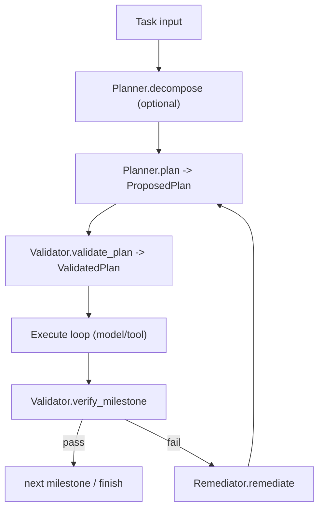

# Module: plan

> Status: detailed design aligned to `dare_framework/plan` (2026-02-25).

## 1. 定位与职责

- 定义任务分解、计划验证、里程碑验证与执行边界的数据契约。
- 把 planner 输出与 trusted validated plan 分离，降低模型不可信输入风险。

## 2. 依赖与边界

- 接口：`IPlanner`, `IValidator`, `IRemediator`, `IStepExecutor`, `IPlanAttemptSandbox`
- 类型：`Task`, `Milestone`, `ProposedPlan`, `ValidatedPlan`, `RunResult`, `Envelope`, ...
- 边界约束：
  - plan domain 定义“计划/验证/补救”的协议，不直接执行工具副作用。
  - 工具调用实际由 tool gateway 完成。

## 3. 对外接口（Public Contract）

- `IPlanner.plan(ctx) -> ProposedPlan`
- `IPlanner.decompose(task, ctx) -> DecompositionResult`
- `IValidator.validate_plan(plan, ctx) -> ValidatedPlan`
- `IValidator.verify_milestone(result, ctx, plan=None) -> VerifyResult`
- `IRemediator.remediate(verify_result, ctx) -> str`
- `IStepExecutor.execute_step(step, ctx, previous_results) -> StepResult`
- `IPlanAttemptSandbox.create_snapshot/rollback/commit`

## 4. 关键字段（Core Fields）

- `Task`
  - `description`, `task_id`, `milestones`, `metadata`, `previous_session_summary`
- `Milestone`
  - `milestone_id`, `description`, `user_input`, `success_criteria`
- `ProposedPlan`
  - `plan_description`, `steps`, `attempt`, `metadata`
- `ValidatedPlan`
  - `plan_description`, `steps`, `success`, `errors`, `metadata`
- `Envelope`
  - `allowed_capability_ids`, `budget`, `done_predicate`, `risk_level`
- `RunResult`
  - `success`, `output`, `output_text`, `errors`, `metadata`, `session_summary`

## 5. 关键流程（Runtime Flow）

## 6. 与其他模块的交互

- **Agent**：五层循环中的 plan / verify 阶段直接消费 plan domain。
- **Tool**：`Envelope` 驱动 tool loop 边界。
- **Security**：`risk_level` 与 policy gate 语义对齐。

## 7. 约束与限制

- 当前实现中 `ValidatedPlan.steps` 尚未完整驱动 step-driven 执行。
- `plan/kernel.py` 为空壳，稳定 surface 主要位于 interfaces/types。

## 8. TODO / 未决问题

- TODO: 打通 step-driven 执行引擎。
- TODO: 建立 plan attempt snapshot/rollback 的默认实现。
- TODO: 统一 evidence 模型（planner/tool/verify）。
