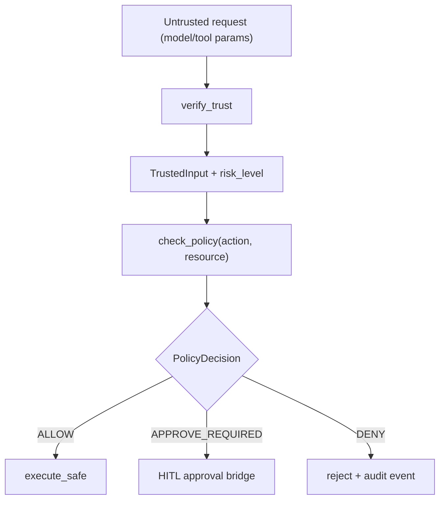

# Module: security

> Status: interface-first detailed design aligned to `dare_framework/security` (2026-02-25).

## 1. 定位与职责

- 提供 trust / policy / sandbox 的统一安全边界。
- 确保安全关键字段从 trusted registry 推导，而非直接信任模型输出。

## 2. 依赖与边界

- kernel：`ISecurityBoundary`
- types：`RiskLevel`, `PolicyDecision`, `TrustedInput`, `SandboxSpec`
- 边界约束：
  - security domain 定义协议，不绑定具体策略引擎或沙箱实现。
  - agent/tool 需要显式接入，才会形成执行期安全闭环。

## 3. 对外接口（Public Contract）

- `ISecurityBoundary.verify_trust(input, context) -> TrustedInput`
- `ISecurityBoundary.check_policy(action, resource, context) -> PolicyDecision`
- `ISecurityBoundary.execute_safe(action, fn, sandbox) -> Any`

## 4. 关键字段（Core Fields）

- `RiskLevel`
  - `READ_ONLY`
  - `IDEMPOTENT_WRITE`
  - `COMPENSATABLE`
  - `NON_IDEMPOTENT_EFFECT`
- `PolicyDecision`
  - `ALLOW`
  - `DENY`
  - `APPROVE_REQUIRED`
- `TrustedInput`
  - `params: dict[str, Any]`
  - `risk_level: RiskLevel`
  - `metadata: dict[str, Any]`
- `SandboxSpec`
  - `mode: str`
  - `details: dict[str, Any]`

## 5. 关键流程（Runtime Flow）

## 6. 与其他模块的交互

- **Plan**：验证阶段需要风险等级与可信参数。
- **Tool**：tool invoke 前应经过 policy gate。
- **Agent**：plan->execute / tool loop 入口应调用 security boundary。

## 7. 约束与限制

- 当前仓库仍以接口为主，缺少默认 policy/sandbox 实现。
- 与 HITL 的审批闭环尚未完成。

## 8. TODO / 未决问题

- TODO: 提供默认 no-op / stub 与 production policy 的标准实现。
- TODO: 在 DareAgent ToolLoop 中接入强制 policy gate。
- TODO: 明确审批超时、拒绝与回滚语义。
