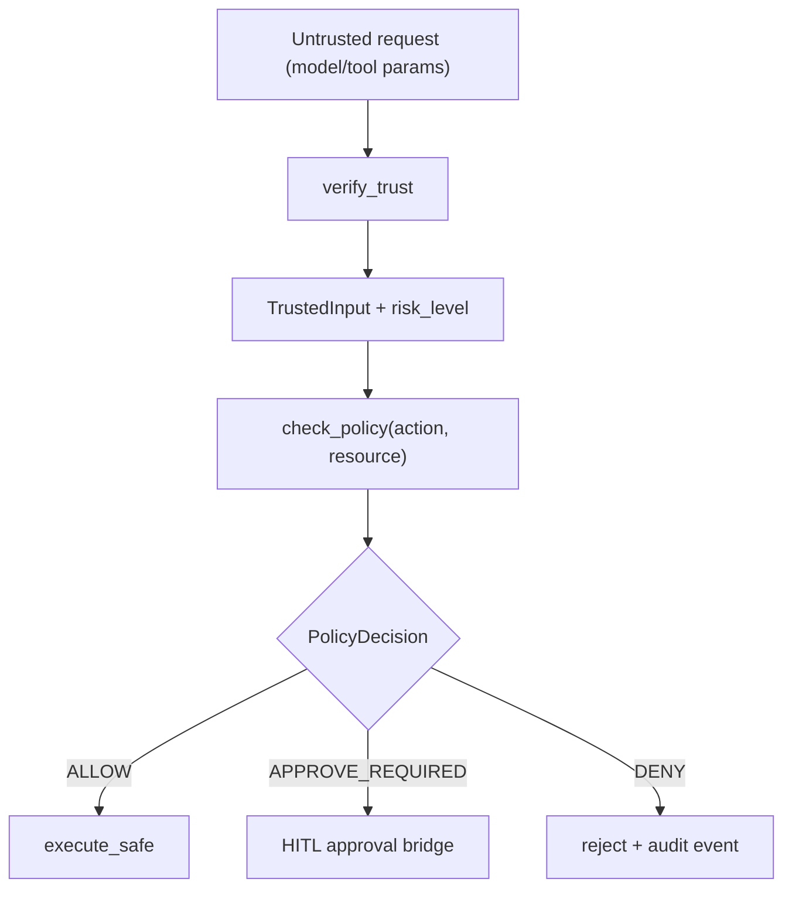

# Module: security

> Status: baseline runtime integration landed in canonical runtime (2026-02-27).

## 1. 定位与职责

- 提供 trust / policy / sandbox 的统一安全边界。
- 确保安全关键字段从 trusted registry 推导，而非直接信任模型输出。

## 2. 依赖与边界

- kernel：`ISecurityBoundary`
- types：`RiskLevel`, `PolicyDecision`, `TrustedInput`, `SandboxSpec`
- 边界约束：
  - security domain 定义协议，不绑定具体策略引擎或沙箱实现。
  - agent/tool 需要显式接入，才会形成执行期安全闭环。

## 3. 对外接口（Public Contract）

- `ISecurityBoundary.verify_trust(input, context) -> TrustedInput`
- `ISecurityBoundary.check_policy(action, resource, context) -> PolicyDecision`
- `ISecurityBoundary.execute_safe(action, fn, sandbox) -> Any`

## 4. 关键字段（Core Fields）

- `RiskLevel`
  - `READ_ONLY`
  - `IDEMPOTENT_WRITE`
  - `COMPENSATABLE`
  - `NON_IDEMPOTENT_EFFECT`
- `PolicyDecision`
  - `ALLOW`
  - `DENY`
  - `APPROVE_REQUIRED`
- `TrustedInput`
  - `params: dict[str, Any]`
  - `risk_level: RiskLevel`
  - `metadata: dict[str, Any]`
- `SandboxSpec`
  - `mode: str`
  - `details: dict[str, Any]`

## 5. 关键流程（Runtime Flow）

## 6. 与其他模块的交互

- **Plan**：milestone 阶段在进入 Execute Loop 前执行 `check_policy(action="execute_plan")`。
- **Tool**：tool invoke 前执行 `verify_trust` 与 `check_policy(action="invoke_tool")`，并通过 `execute_safe` 执行。
- **Agent**：`DareAgent` 支持注入 `security_boundary`，未注入时回退到 `DefaultSecurityBoundary`。
- **导入路径**：默认实现只通过 `from dare_framework.security import DefaultSecurityBoundary` 作为受支持导入面。

## 7. 约束与限制

- 当前默认实现为 canonical runtime 的 permissive baseline（默认 `ALLOW`），不等同于生产策略引擎。
- `APPROVE_REQUIRED` 目前仍是 fail-fast 语义，尚未接入 HITL 审批桥接。
- `execute_safe` 提供统一执行包装，但尚未绑定强隔离型 sandbox backend。

## 8. TODO / 未决问题

- TODO: 提供 production-grade policy 实现（策略配置、规则版本化、可审计决策原因）。
- TODO: 将 `APPROVE_REQUIRED` 与 `IExecutionControl` 打通，补齐审批超时、拒绝与恢复语义。
- TODO: 统一 security 事件 taxonomy，沉淀 deny/approve_required/allow 的审计字段标准。

## 能力状态（landed / partial / planned）

- `landed`: 见文档头部 Status 所述的当前已落地基线能力。
- `partial`: 当前实现可用但仍有 TODO/限制（见“约束与限制”与“TODO / 未决问题”）。
- `planned`: 当前文档中的未来增强项，以 TODO 条目为准，未纳入当前实现承诺。

## 最小标准补充（2026-02-27）

### 总体架构
- 模块实现主路径：`dare_framework/security/`。
- 分层契约遵循 `types.py` / `kernel.py` / `interfaces.py` / `_internal/` 约定；对外语义以本 README 的“对外接口/关键字段/关键流程”章节为准。
- 与全局架构关系：作为 `docs/design/Architecture.md` 中对应 domain 的实现落点，通过 builder 与运行时编排接入。

### 异常与错误处理
- 参数或配置非法时，MUST 显式返回错误（抛出异常或返回失败结果），禁止静默吞错。
- 外部依赖失败（模型/存储/网络/工具）时，优先执行可观测降级策略：记录结构化错误上下文，并在调用边界返回可判定失败。
- 涉及副作用或策略判定的失败路径，MUST 保留审计线索（事件日志或 Hook/Telemetry 记录），以支持回放和排障。

### 测试锚点（Test Anchor）

- `tests/unit/test_dare_agent_security_boundary.py`（plan/tool policy gate 行为）
- `tests/unit/test_registry_plan_validator.py`（风险元数据与 trusted 输入校验）
