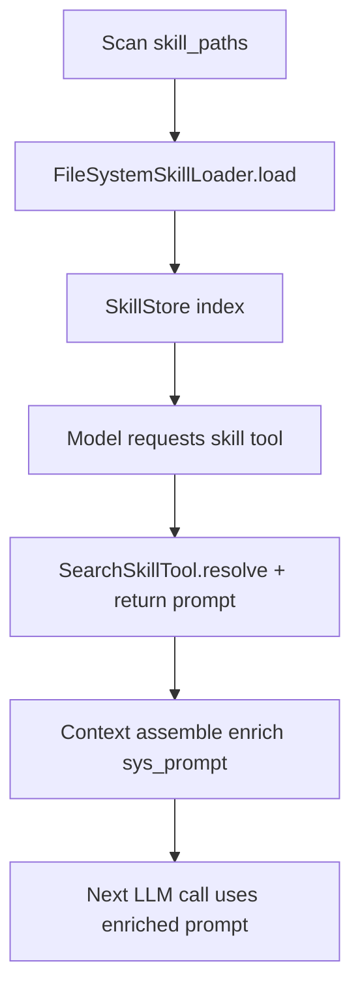

# Module: skill

> Status: detailed design aligned to `dare_framework/skill` (2026-02-25).

## 1. 定位与职责

- 定义 skill（`SKILL.md`）的加载、存储、检索与 prompt 注入策略。
- 通过技能检索工具把“可执行工作流约束”注入模型上下文。

## 2. 依赖与边界

- kernel：`ISkill`, `ISkillTool`
- interfaces：`ISkillLoader`, `ISkillStore`
- types：`Skill`
- 默认实现：
  - `FileSystemSkillLoader`
  - `SkillStore`
  - `SearchSkillTool`
  - `prompt_enricher`（技能注入）
- 边界约束：
  - skill domain 不直接执行脚本，只暴露脚本路径给上层工具链。

## 3. 对外接口（Public Contract）

- `ISkillLoader.load() -> list[Skill]`
- `ISkillStore.list_skills() -> list[Skill]`
- `ISkillStore.get_skill(skill_id) -> Skill | None`
- `ISkillStore.select_for_task(query, limit=5) -> list[Skill]`
- `SearchSkillTool.execute(skill, args="") -> ToolResult`
- prompt enrich API：
  - `enrich_prompt_with_skill(base_prompt, skill)`
  - `enrich_prompt_with_skills(base_prompt, skill_paths)`
  - `enrich_prompt_with_skill_summaries(base_prompt, skills)`

## 4. 关键字段（Core Fields）

- `Skill`
  - `id`, `name`, `description`, `content`
  - `skill_dir: Path | None`
  - `scripts: dict[str, Path]`
- `SearchSkillTool` 输出关键字段
  - `skill_id`, `name`, `description`, `content`
  - `skill_path`, `scripts`, `prompt`, `args`

## 5. 关键流程（Runtime Flow）

## 6. 与其他模块的交互

- **Tool**：`SearchSkillTool` 作为 capability 注册到 tool registry。
- **Context/Model**：skill prompt 在 assemble 时注入系统提示。
- **Config**：`skill_paths` 与 `skill_mode` 控制加载模式。

## 7. 约束与限制

- 当前只支持文件系统 skill source。
- 自动注入路径与审批边界仍需进一步标准化。

## 8. TODO / 未决问题

- TODO: 收敛 skill 注入策略（何时注入、注入范围、冲突优先级）。
- TODO: 增加 skill 检索权限控制与审计。
- TODO: 支持远程 skill 仓库与签名校验。
