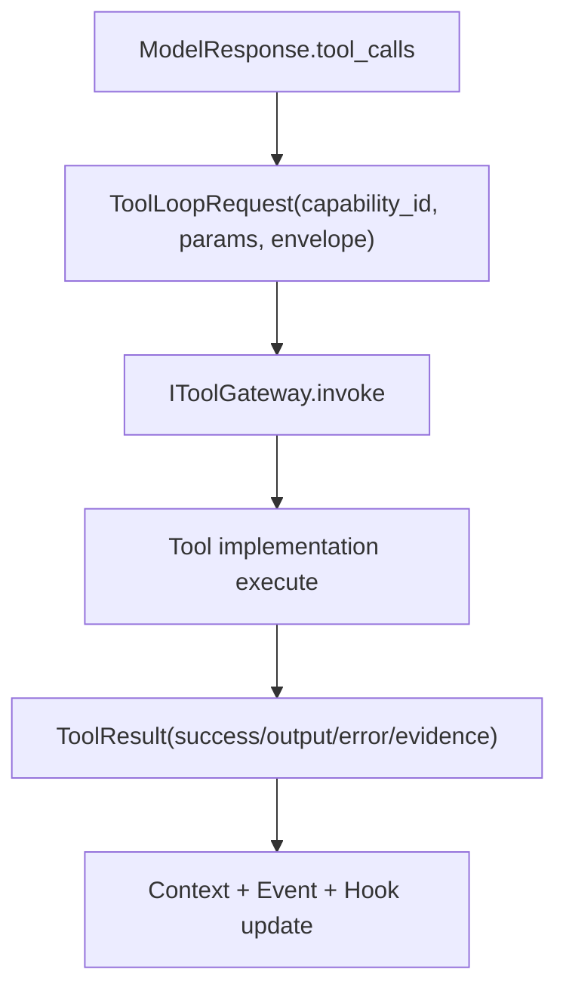

# Module: tool

> Status: aligned to `dare_framework/tool` (2026-01-31). TODO indicates gaps vs desired architecture.

## 1. 定位与职责

- 统一能力模型（tools/skills/remote tools），提供可信 registry 与调用边界。
- 负责能力发现、注册、禁用、导出 tool defs（供模型 function-calling）。
- 作为外部副作用的唯一出口（`IToolGateway.invoke(...)`）。

## 2. 关键概念与数据结构

- `CapabilityDescriptor`：能力描述（id/name/schema/metadata）。
- `CapabilityMetadata`：可信元数据（risk_level/requires_approval/timeout/is_work_unit/capability_kind）。
- `ToolResult` / `Evidence`：工具输出与证据记录。
- `RunContext`：工具执行上下文（deps/config/metadata）。
- `Envelope`：工具调用边界（allowlist/budget/done_predicate/risk_level）。

## 2.1 Tool 定义模板（ToolDefinition）

Tool 定义对外输出为 OpenAI function-call 兼容结构，由 `ToolManager.list_tool_defs()` 生成：

```json
{
  "type": "function",
  "function": {
    "name": "read_file",
    "description": "Read a file from the workspace",
    "parameters": {
      "type": "object",
      "properties": {
        "path": { "type": "string" }
      },
      "required": ["path"]
    }
  },
  "capability_id": "read_file"
}
```

## 3. 注册与加载策略（当前实现）

### 3.1 ToolManager 可信注册表

- `ToolManager.register_tool()`：注册本地 ITool（id=tool.name）。
- `ToolManager.register_provider()`：注册 IToolProvider（批量同步）。
- `refresh()`：从 provider 同步工具列表，自动增删。
- `list_capabilities()` / `list_tool_defs()`：输出 registry 视图与模型所需 defs。
- 支持通过 entrypoint 组 `dare_framework.tool_providers` 自动发现 provider。

### 3.2 Builder 侧加载策略

- `DareAgentBuilder` / `SimpleChatAgentBuilder` 通过以下优先级装配：
  1) 显式注入工具（`add_tools`）
  2) ToolManager `load_tools(config=...)`
- 若显式注入 tools，`tool_gateway` 必须实现 `IToolManager`。
- Context 的 tool listing 默认使用 ToolProvider（可由 ToolManager 充当）。

## 4. Agent 编排中的工具使用（当前实现）

- Execute Loop 中读取 `ModelResponse.tool_calls`。
- `ToolLoopRequest` 由 `capability_id` + `params` + `Envelope` 构成。
- `ToolGateway.invoke(...)` 实际执行工具并返回 `ToolResult`。
- `DonePredicate`：检查 `ToolResult.output` 中 required_keys；不满足则继续循环。

> 现状说明：ValidatedPlan.steps 不驱动工具调用；工具调用由模型响应决定（TODO）。

## 5. 异常、权限与可靠性

### 5.1 异常与错误

- 工具实现可抛出 `ToolError` 或返回 `ToolResult(success=False, error=...)`。
- DareAgent 捕获异常并记录 `tool.error` 事件（若 event_log 配置）。

### 5.2 权限与风险

- `Envelope.allowed_capability_ids` 提供 allow-list 控制。
- `risk_level/requires_approval` 来源于 ToolRegistry metadata。

> 现状说明：policy/hitl 未自动执行（`ISecurityBoundary` 未接入），需要上层集成（TODO）。

### 5.3 可靠性与资源限制

- File tools 受 workspace roots 限制（`resolve_workspace_roots`）。
- `read_file`/`search_code` 有 max_bytes / max_results guardrail。
- `run_command` 具备 timeout/approval 标记。

## 6. 内置工具与能力范围（摘要）

- **文件类**：`read_file`, `write_file`, `edit_line`, `search_code`。
- **命令类**：`run_command`（requires_approval）。
- **辅助类**：`echo_tool`, `noop_tool`。
- **Skill 检索**：`search_skill`（capability_kind=SKILL）。
- **MCP 适配**：`MCPToolProvider` 将 MCP tools 暴露为 `ITool`（defaults）。

> 具体参数与 guardrails 见各工具实现（`dare_framework/tool/_internal/tools/*`）。
> 内置工具属于 internal API，不通过 `dare_framework.tool` facade 暴露。

## 7. 关键接口与实现

- Kernel：`ITool`, `IToolProvider`, `IToolGateway`, `IToolManager`（`dare_framework/tool/kernel.py`）
- Interfaces：`IExecutionControl`（`dare_framework/tool/interfaces.py`）
- MCP：`IMCPClient`（`dare_framework/mcp/kernel.py`），`MCPToolProvider`（`dare_framework/mcp/defaults.py`）
- 默认 registry：`ToolManager`（`dare_framework/tool/default_tool_manager.py`，`dare_framework.tool` 也 re-export）

## 8. 扩展点

- 自定义 Tool：实现 `ITool`，注册到 ToolManager。
- 自定义 Provider：实现 `IToolProvider`，用于批量加载工具。
- 远端协议：实现 `IMCPClient` 并通过 `MCPToolProvider` 注入或 entrypoint 加载。
- 运行上下文：通过 Builder 注入 `RunContext`，提供 config/metadata。

## 9. TODO / 未决问题

- TODO: 将 policy/hitl gate 接入 ToolLoop（与 `ISecurityBoundary` 结合）。
- TODO: 工具调用审计快照（capability hash / tool defs snapshot）。
- TODO: 能力等级与审批策略统一（risk_level ↔ approval policy）。
- TODO: 统一 tool defs schema（跨模型 adapter 一致性）。

## 10. Design Clarifications (2026-02-03)

- Impl gap: `IToolGateway.invoke()` returns `Any` in kernel; should return `ToolResult`.
- Type cleanup: replace string annotations for `ITool`/`IToolProvider` in kernel with direct types.

## 11. 对外接口汇总（Public Contract Snapshot）

- `ITool.execute(run_context, **params) -> ToolResult`
- `IToolGateway.invoke(capability_id, envelope, context=None, **params) -> ToolResult`
- `IToolGateway.list_capabilities() -> list[CapabilityDescriptor]`
- `IToolManager`
  - `load_tools`, `register_tool`, `get_tool`, `unregister_tool`
  - `register_provider`, `refresh`, `list_capabilities`, `get_capability`

## 12. 核心字段汇总（Core Fields Snapshot）

- `CapabilityDescriptor`
  - `id`, `type`, `name`, `description`, `input_schema`, `output_schema`, `metadata`
- `CapabilityMetadata`
  - `risk_level`, `requires_approval`, `timeout_seconds`, `is_work_unit`, `capability_kind`
- `RunContext`
  - `deps`, `metadata`, `run_id`, `task_id`, `milestone_id`, `config`
- `ToolResult`
  - `success`, `output`, `error`, `evidence`

## 13. 关键流程汇总（Flow Snapshot）


