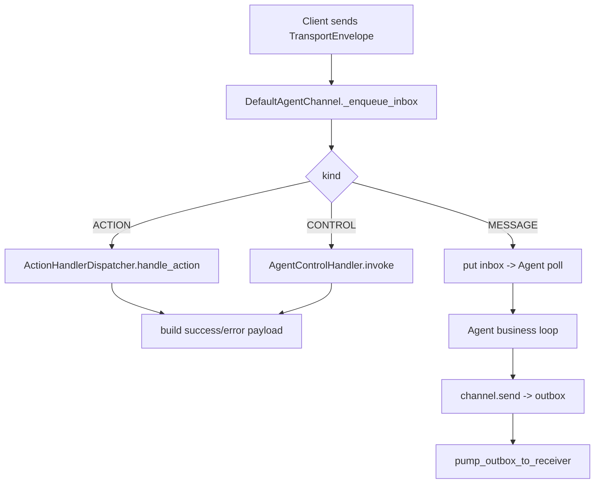

# Module: transport

> Status: detailed design aligned to `dare_framework/transport` (2026-02-25).

## 1. 定位与职责

- 提供 Agent 与外部客户端（CLI/Web/API）之间的统一信封通信层。
- 通过 `TransportEnvelope` + `AgentChannel` 屏蔽具体连接协议差异。
- 管理 action/control/message 三类交互路径与错误回执。

## 2. 依赖与边界

- kernel：`AgentChannel`, `ClientChannel`
- types：`EnvelopeKind`, `TransportEnvelope`
- 默认实现：`DefaultAgentChannel`
- interaction 子域：`ActionHandlerDispatcher`, `AgentControlHandler`, payload builders
- 边界约束：
  - transport 负责消息路由与回压，不负责任务业务语义。
  - action/control 的业务执行由 dispatcher/agent handler 提供。

## 3. 对外接口（Public Contract）

- `AgentChannel`
  - `start()`, `stop()`
  - `poll() -> TransportEnvelope | list[TransportEnvelope]`
  - `send(msg: TransportEnvelope)`
  - `add_action_handler_dispatcher(...)`
  - `add_agent_control_handler(...)`
  - `build(client_channel, max_inbox=100, max_outbox=100, action_timeout_seconds=30.0)`
- `ClientChannel`
  - `attach_agent_envelope_sender(sender)`
  - `agent_envelope_receiver() -> Receiver`

## 4. 关键字段（Core Fields）

- `EnvelopeKind`
  - `MESSAGE`, `ACTION`, `CONTROL`
- `TransportEnvelope`
  - `id`, `reply_to`, `kind`, `payload`, `meta`, `stream_id`, `seq`

统一返回 payload（interaction/payloads）：
- success: `{type:"result", kind, target, ok:true, resp}`
- error: `{type:"error", kind, target, ok:false, code, reason, resp}`

## 5. 关键流程（Runtime Flow）

## 6. 与其他模块的交互

- **Agent**：通过 `poll/send` 进入 transport loop 或 direct-call 通道。
- **Hook/Observability**：可通过 transport 发送事件 envelope 到外部 UI。
- **Tool/HITL**：审批状态可经 transport payload 回传客户端。

## 7. 约束与限制

- 默认 channel 为阻塞回压模型，未提供优先级队列。
- 未提供持久化队列与断线恢复机制。

## 8. TODO / 未决问题

- TODO: 支持 reconnect/resume 与 envelope replay。
- TODO: 定义 streaming chunk 的标准 envelope 协议。
- TODO: 增加 action/control schema 校验与版本化。

## 9. 相关文档

- `docs/design/modules/transport/transport_mvp.md`
- `docs/design/modules/transport/Transport_Domain_Design.md`
- `docs/design/modules/transport/InteractionStreaming.md`

## 能力状态（landed / partial / planned）

- `landed`: 见文档头部 Status 所述的当前已落地基线能力。
- `partial`: 当前实现可用但仍有 TODO/限制（见“约束与限制”与“TODO / 未决问题”）。
- `planned`: 当前文档中的未来增强项，以 TODO 条目为准，未纳入当前实现承诺。

## 最小标准补充（2026-02-27）

### 总体架构
- 模块实现主路径：`dare_framework/transport/` 与 `dare_framework/a2a/`。
- 分层契约遵循 `types.py` / `kernel.py` / `interfaces.py` / `_internal/` 约定；对外语义以本 README 的“对外接口/关键字段/关键流程”章节为准。
- 与全局架构关系：作为 `docs/design/Architecture.md` 中对应 domain 的实现落点，通过 builder 与运行时编排接入。

### 异常与错误处理
- 参数或配置非法时，MUST 显式返回错误（抛出异常或返回失败结果），禁止静默吞错。
- 外部依赖失败（模型/存储/网络/工具）时，优先执行可观测降级策略：记录结构化错误上下文，并在调用边界返回可判定失败。
- 涉及副作用或策略判定的失败路径，MUST 保留审计线索（事件日志或 Hook/Telemetry 记录），以支持回放和排障。

### 测试锚点（Test Anchor）

- `tests/unit/test_transport_channel.py`（transport envelope 收发链路）
- `tests/unit/test_interaction_dispatcher.py`（interaction action/control 分发）
