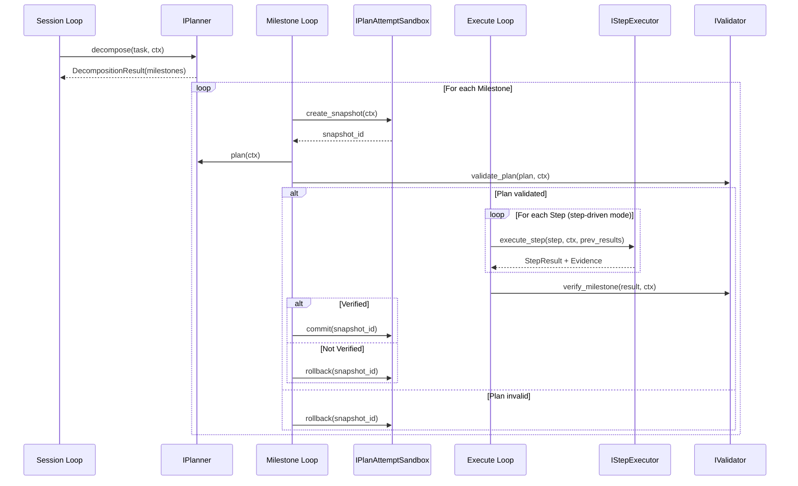

## Context

DARE Framework 采用五层循环架构，Milestone 是第二层（Session → **Milestone** → Plan → Execute → Tool）。当前设计目标明确：

- **外部可验证完成**：完成由验证器与证据判定，非模型声称
- **状态外化**：所有决策可追溯、可复验
- **LLM 不可信**：所有 LLM 产出需外部校验

但实现层面存在四个 gap，阻碍这些目标的达成。本设计文档阐述如何填补这些 gap。

## Goals / Non-Goals

### Goals
1. 让 LLM 能将复杂任务自动拆分为多个可验证的 Milestones
2. 确保失败的 Plan Attempt 不会污染外层状态（隔离语义）
3. 建立强制性证据闭环机制（evidence-required 验证）
4. 实现 Plan steps 驱动的确定性执行（step-by-step）

### Non-Goals
- 不改变现有 `Task.milestones` 预定义用法
- 不引入新的外部依赖
- 不修改 Tool Loop 或 Tool Gateway 语义

## Decisions

### Decision 1: IPlanner.decompose 作为可选方法

**决策**：`decompose` 作为 `IPlanner` 的可选方法，提供默认实现（返回单 milestone）。

**理由**：
- 保持向后兼容，现有 planner 无需修改
- 简单任务仍可使用单 milestone 模式
- 复杂任务可通过专用 decomposer 实现

**替代方案**：
- ❌ 独立 `IDecomposer` 接口：增加配置复杂度
- ❌ 强制所有 planner 实现：破坏兼容性

### Decision 2: STM Snapshot/Rollback 实现隔离

**决策**：通过 STM snapshot 在 plan attempt 开始时保存状态，失败时 rollback。

**理由**：
- 符合现有 Context 架构，stm 已是独立可操作结构
- 仅需在 MilestoneState 添加 snapshot ref
- 实现成本低，语义清晰

**替代方案**：
- ❌ 完全隔离的 sandbox context：实现复杂，需复制大量状态
- ❌ 仅记录不回滚：无法满足"失败计划不污染"要求

### Decision 3: Evidence 作为结构化类型

**决策**：新增 `Evidence` dataclass，包含 `evidence_id`、`type`、`source`、`data`、`timestamp`。

**理由**：
- 结构化便于审计和复验
- 可与 EventLog 集成
- 支持多种证据来源（tool result、external validator、file hash 等）

### Decision 4: Step-Driven Execution 模式

**决策**：提供 `IStepExecutor` 接口，Execute Loop 可选择"步骤驱动"或"模型驱动"模式。

**理由**：
- 步骤驱动更确定性，适合高合规场景
- 模型驱动更灵活，适合探索性任务
- 通过配置选择，保持灵活性

## Component Design

### 1. IPlanner.decompose

```python
class IPlanner(Protocol):
    async def plan(self, ctx: IContext) -> ProposedPlan: ...
    
    async def decompose(
        self, 
        task: Task, 
        ctx: IContext
    ) -> DecompositionResult:
        """Decompose task into milestones. Default: single milestone."""
        return DecompositionResult(
            milestones=[Milestone(
                milestone_id=f"{task.task_id}_m1",
                description=task.description,
            )],
            reasoning="Default: single milestone from task description",
        )
```

### 2. IPlanAttemptSandbox

```python
class IPlanAttemptSandbox(Protocol):
    def create_snapshot(self, ctx: IContext) -> str:
        """Create STM snapshot, return snapshot_id."""
        ...
    
    def rollback(self, ctx: IContext, snapshot_id: str) -> None:
        """Rollback STM to snapshot state."""
        ...
    
    def commit(self, snapshot_id: str) -> None:
        """Discard snapshot, keep current state."""
        ...
```

### 3. Evidence Model

```python
@dataclass(frozen=True)
class Evidence:
    evidence_id: str
    evidence_type: str  # "tool_result" | "file_hash" | "external_validation" | "assertion"
    source: str         # capability_id or validation source
    data: dict[str, Any]
    timestamp: datetime
    
@dataclass(frozen=True)  
class VerifyResult:
    success: bool
    errors: list[str] = field(default_factory=list)
    evidence_required: list[str] = field(default_factory=list)
    evidence_collected: list[Evidence] = field(default_factory=list)
    metadata: dict[str, Any] = field(default_factory=dict)
```

### 4. IStepExecutor

```python
class IStepExecutor(Protocol):
    async def execute_step(
        self,
        step: ValidatedStep,
        ctx: IContext,
        previous_results: list[StepResult],
    ) -> StepResult:
        """Execute single step with previous results as context."""
        ...

@dataclass
class StepResult:
    step_id: str
    success: bool
    output: Any
    evidence: list[Evidence]
    errors: list[str]
```

## Sequence Diagram



## Risks / Trade-offs

| Risk | Mitigation |
|------|------------|
| STM snapshot 内存占用 | 使用 copy-on-write 或增量快照 |
| decompose 增加 LLM 调用 | 提供缓存机制，简单任务跳过 |
| Step-driven 降低灵活性 | 支持混合模式，关键 step 驱动 + 自由 step |
| Evidence 类型过于开放 | 定义标准 evidence_type 枚举 |

## Migration Plan

1. **Phase 1**: 添加接口和类型（不破坏现有行为）
2. **Phase 2**: 实现默认 sandbox 和 step executor
3. **Phase 3**: 更新 DareAgent 使用新能力
4. **Phase 4**: 添加配置开关控制行为

无需数据迁移，完全向后兼容。

## Open Questions

1. **Step 执行失败时的策略**：跳过 vs 中止 vs 重试？建议：可配置，默认中止。
2. **Evidence 保留期限**：是否与 EventLog 对齐？建议：是，统一 7 年。
3. **decompose 结果校验**：是否需要独立 validator？建议：否，复用现有 milestone 验证。
